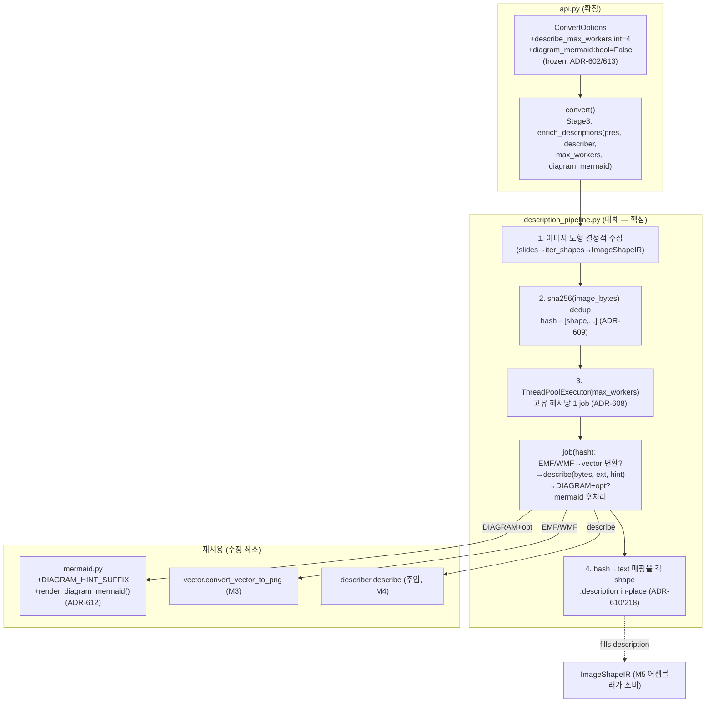
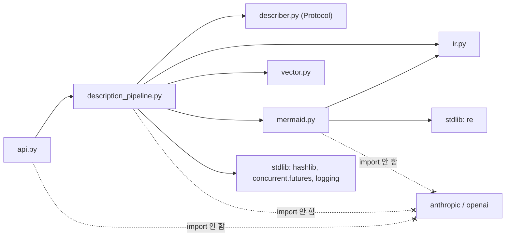
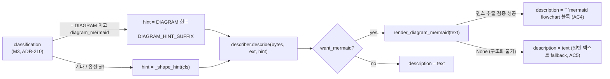

# ARCH-M12 — 이미지·다이어그램 VLM 파이프라인 통합 (해시 캐시 · 동시성 · Mermaid 산출)

> 범위: 이슈 #68 (FR-27) — 기존 `convert()` VLM 경로 위에 (1) 이미지 해시 캐싱, (2) describe 동시성 제한, (3) DIAGRAM Mermaid 산출 옵션을 통합한다.
> 전제: `docs/00-charter/project-profile.md`, `docs/10-requirements/REQ-core.md`, `docs/20-design/ARCH-M4.md`(VLM 연동), `docs/20-design/ARCH-M5.md`(어셈블러·결정성 ADR-218), `docs/20-design/ARCH-M6.md`(convert·ConvertOptions ADR-601/602/604)
> 스택 스킬: `.claude/skills/stack-python-packaging`
> 선행 ADR: M2 201~207, M3 208~211, M4 212~217, M5 218~222, M6 601~607 → **본 문서는 전역 최대 ADR-607 이후로 연속(ADR-608~613)**
> 입력 이슈: #68 (디스패치 본문 + 아래 §1 AC 요약). REQ-core 에 FR-27 는 미등재(v0.1.2/M12 신규 과업) — AC 는 이슈 #68 을 정본으로 하며, gh 부재로 본 문서는 디스패치 요약 + 합리적 추론으로 AC1~AC10 을 구조화한다(§9, RISK 참조).
> 작성: architect / 2026-07-04
> 상태: 설계 초안 (reviewer 리뷰 / 사람 승인 전 — 아키텍처 게이트 대상)

---

## 0. 개요 — 현행 파이프라인과 M12 갭

현행 `api.convert`(ARCH-M6)는 이미 `parse → enrich_images → enrich_descriptions → assemble (→ validate?)` 5단계를 조립한다. VLM 은 `ConvertOptions.describer` 로 주입되고, `enrich_descriptions`(ARCH-M4)가 도형 단위로 `describe` 를 호출해 `ImageShapeIR.description` 슬롯을 in-place 로 채운다(ADR-210/214/215/216). 어셈블러는 그 슬롯을 읽어 Markdown 본문/캡션으로 강등 렌더한다(ARCH-M5 §3.4).

M12 는 이 **동작하는 골격을 바꾸지 않고** `enrich_descriptions` 내부에 세 가지를 얹는다:

1. **이미지 해시 캐싱(AC6)** — 동일 바이트 이미지가 슬라이드 전반에 반복될 때(로고·워터마크·머리말 아이콘) `describe` 를 **고유 이미지당 1회**로 축소. 캐시 키 = `sha256(원본 image_bytes)`. **원본 이미지 바이트를 캐시에 저장하지 않고**(키는 digest, 값은 산출 텍스트) 로그에 PII·바이트 미출력(NFR-06).
2. **동시성 제한(AC7)** — `describe` 는 네트워크 I/O 바운드(외부 VLM HTTP). 동시 호출 상한 `N` 을 `ConvertOptions` 로 조정. **`concurrent.futures.ThreadPoolExecutor`**(stdlib) 채택 — 신규 동시성 라이브러리 도입 0(ADR-608). 동시성 도입 후에도 **최종 출력 결정성 보장**(해시 키 결과 매핑 + 개별 객체 in-place, ADR-610 / ADR-218 계승).
3. **다이어그램 Mermaid 산출 옵션(AC4/AC5)** — `ImageClass.DIAGRAM` + 옵션 활성 시 shape_hint 를 Mermaid flowchart 산출용으로 증강하고, VLM 응답에서 ```mermaid 펜스를 추출·검증해 `description` 에 flowchart 코드블록을 담는다. 구조화 불가 응답은 **일반 텍스트 fallback**(AC5). 옵션 off 가 기본(하위호환). 기존 `mermaid.py`(FR-13) 를 **확장**해 Mermaid 관심사를 단일 모듈에 유지(ADR-612).

### 0.1 설계 제약 (이슈 #68 명시 — 전부 준수)

| 제약 | 본 설계의 준수 방법 |
|------|---------------------|
| describer 주입은 기존 `ConvertOptions.describer` 재사용, 신규 진입 API 금지 | 진입점 불변. Mermaid 산출은 `ImageDescriber` Protocol 을 **변경하지 않고** shape_hint 증강 + 응답 후처리로만 달성(§3.4). 사용자 plug-in describer 계약 무손상 |
| 신규 옵션은 `ConvertOptions` 에 default 유지 추가(frozen dataclass, ADR-602, 하위호환) | `describe_max_workers: int = 4`, `diagram_mermaid: bool = False` — 둘 다 기본값이 현행 동작과 동등(§3.5, ADR-613) |
| `api.py`·`description_pipeline.py` 에 VLM SDK 직접 import 금지(NFR-08) | 캐싱/동시성/Mermaid 로직은 `hashlib`·`concurrent.futures`·`re` stdlib + `mermaid` 재사용만. SDK import 0 유지(§2.3) |
| 이미지별 실패 격리(ADR-214) 유지 | 동시성 작업 단위(고유 해시)마다 try/except. 한 이미지 실패가 전체 변환·타 이미지를 깨지 않음(§4.2, ADR-610) |
| COM 경로(`convert_via_com`) 미존재 — AC10 N/A 부채, COM 신설 설계 금지 | COM 설계 0. AC10 은 N/A 부채로 명시(§9.3, §10) |

---

## 1. 아키텍처에 영향을 주는 요구사항 추출 (AC1~AC10)

> 이슈 #68 AC 원문은 gh 부재로 직접 인용 불가. 아래는 디스패치 본문(3개 갭 + 제약)과 기존 설계 계승으로 구조화한 AC1~AC10 이며, **reviewer 는 이슈 #68 원문과 대조**한다(§9 추적표, RISK-1).

| AC | 요지 | 설계 영향 |
|----|------|-----------|
| AC1 | `convert()` 가 parse→enrich_images→enrich_descriptions→assemble 을 VLM 포함 end-to-end 연결 | **현행 존재**(ARCH-M6 api.py:103-113). M12 는 3단계 내부 강화만 — 조립 골격 불변 |
| AC2 | describer 는 `ConvertOptions.describer` 로만 주입(신규 진입 API 없음) | 진입점 불변. convert 가 opts 필드를 enrich_descriptions 에 전달(§3.5) |
| AC3 | describer=None → VLM 생략, core-only 정상 동작(NFR-08) | `enrich_descriptions` 조기 return 유지(현행). 캐시·풀 미생성 |
| AC4 | DIAGRAM + `diagram_mermaid` 활성 → ```mermaid flowchart 펜스 산출 | shape_hint 증강 + 응답 후처리 → description 에 flowchart 블록(§3.4, ADR-611/612) |
| AC5 | 구조화 불가 응답 → 일반 텍스트 fallback | `mermaid.render_diagram_mermaid` 가 None 반환 시 원본 응답 텍스트 유지(§3.4, ADR-611) |
| AC6 | 동일 바이트 이미지 중복 describe 0. 키=sha256, 원본 미저장, 로그 PII 0 | 해시 dedup 사전 그룹핑 → 고유 이미지당 describe 1회(§3.2, ADR-609) |
| AC7 | describe 동시 호출 상한 N, ConvertOptions 조정 | `ThreadPoolExecutor(max_workers=describe_max_workers)`(§3.3, ADR-608/613) |
| AC8 | 동시성 도입 후에도 최종 출력 결정성 | 해시 키 결과 매핑 + 개별 ImageShapeIR in-place(공유 가변 상태 0) → 순서 무관(§3.3, ADR-610/218) |
| AC9 | 이미지별 실패 격리 유지 | 해시 작업 단위 try/except → 실패 이미지 description=None, 나머지 계속(§4.2, ADR-214 계승) |
| AC10 | (COM 경로) | **N/A** — `convert_via_com` 미존재. COM 신설 금지 → 부채 처리(§9.3, §10) |

| NFR | 항목 | 설계 영향 |
|-----|------|-----------|
| NFR-01 | 20슬라이드 p95<5초 (**VLM 제외**) | M12 핵심 로직(캐시·풀·mermaid)은 describe 경로에만 발동. VLM 제외 측정에서는 describer=None → 조기 return, 오버헤드 0. 게이트 아님 |
| NFR-02 | 신규 라인 커버리지 ≥75% | FakeDescriber(호출 카운터·hint 기록·예외 주입) + 해시 dedup·풀·mermaid 추출·fallback 분기 결정적 테스트(§7) |
| NFR-03 | mypy strict exit 0 | `Future[str]`, `dict[str, str]`, `int`/`bool` 명시. SDK Any 는 provider 내부(M4)에 격리 유지(§5.1) |
| NFR-05 | API key 로그·소스 0 | M12 는 key 미취급(describer 주입). 캐시는 digest·텍스트만 |
| NFR-06 | 로그 원본 텍스트·PII 0 | 로그는 메타만: 고유 이미지 수, 캐시 히트 수, worker 수, 예외 타입, shape_id. **image_bytes·description·프롬프트·hash 원본바이트 미출력**(§4.4) |
| NFR-08 | core(SDK 미설치) import·동작 | api.py·description_pipeline.py·mermaid.py 최상단 SDK import 0. 신규 import 는 `hashlib`/`concurrent.futures`/`re`(stdlib)(§2.3, §4.5) |

---

## 2. 모듈 분해 & 변경 지도

### 2.1 파일별 변경 요지 (developer 가 그대로 구현 가능한 수준)

| 파일 | 변경 유형 | 변경 요지 |
|------|-----------|-----------|
| `src/pptx_md/api.py` | 확장(2필드+전달) | `ConvertOptions` 에 `describe_max_workers: int = 4`, `diagram_mermaid: bool = False` 추가(frozen, default, ADR-602/613). `convert()` Stage 3 호출을 `enrich_descriptions(pres, opts.describer, max_workers=opts.describe_max_workers, diagram_mermaid=opts.diagram_mermaid)` 로 변경. **SDK import 0 유지** |
| `src/pptx_md/description_pipeline.py` | 대체(핵심) | `enrich_descriptions` 시그니처에 keyword-only `max_workers: int = 4`, `diagram_mermaid: bool = False` 추가(하위호환). 내부를 (a) 이미지 도형 결정적 수집, (b) `sha256` 해시 dedup 그룹핑, (c) `ThreadPoolExecutor` 병렬 describe, (d) 해시 키 결과를 각 shape 에 in-place 기록, (e) DIAGRAM+옵션 시 mermaid 후처리 로 재구성. `import hashlib`, `from concurrent.futures import ThreadPoolExecutor, as_completed` 추가. `mermaid.render_diagram_mermaid`·`mermaid.DIAGRAM_HINT_SUFFIX` import. `_shape_hint` 결정적 매핑 유지 |
| `src/pptx_md/mermaid.py` | 확장(2심볼) | `DIAGRAM_HINT_SUFFIX: str` 상수(VLM 에 mermaid flowchart 산출을 요청하는 프롬프트 접미사) + `render_diagram_mermaid(vlm_text: str) -> str \| None`(응답에서 ```mermaid flowchart 펜스 추출·검증, 실패 시 None) 추가. 기존 table 함수·상수 미변경(FR-13/FR-25 회귀 0). **IR·SDK import 0 유지** |
| `tests/test_description_pipeline.py` | 확장 | 해시 dedup(describe 호출 카운트), 동시성(max_workers=1 vs N 동일 출력=결정성), 격리, mermaid 산출/ fallback 테스트 추가 |
| `tests/test_mermaid.py` | 확장 | `render_diagram_mermaid` 추출/검증/None fallback 단위 테스트 |
| `tests/test_api.py` | 확장 | ConvertOptions 신규 필드 default·전달 테스트(하위호환: 기존 호출 무손상) |

> **비침습 계승(ARCH-M4 §0.1 / ARCH-M5 §0)**: `ir.py`·`parser.py`·`image_pipeline.py`·`classifier.py`·`vector.py`·`describer.py`·`providers/*` **미수정**. IR 스키마 변경 0(description 슬롯 그대로 사용). M12 는 3개 파일(api·description_pipeline·mermaid)의 확장/대체로 닫힌다.

### 2.2 컴포넌트 / 데이터 흐름 다이어그램



### 2.3 의존 방향 (단방향 — NFR-08 격리 유지)



**핵심 규칙**: api·description_pipeline·mermaid 최상단 SDK import 0(NFR-08 불변식 계승). describer 는 여전히 **주입**받는다(DIP). mermaid 는 IR(`TableShapeIR`)만 알고 SDK·bytes 는 모름 — `render_diagram_mermaid` 는 `str→str|None` 순수 함수(IR 조차 불요).

---

## 3. 공개 인터페이스 & 처리 흐름

### 3.1 수집 순서 — 결정성의 기반 (ADR-610)

`enrich_descriptions` 는 먼저 모든 `ImageShapeIR` 를 **결정적 순서**로 수집한다: `presentation.slides`(인덱스 순) → 각 슬라이드 `iter_shapes()`(DFS, ADR-203) → `ImageShapeIR` 필터. 이 순서는 IR 리스트 순서에만 의존하므로 재현적이다(ADR-218 계승). 수집 결과는 `list[ImageShapeIR]` — 각 항목은 **서로 다른 객체**(그룹 중첩 포함).

### 3.2 해시 캐싱 — dedup 사전 그룹핑 (AC6, ADR-609)

```python
# 개념 코드 (developer 구현 지침)
import hashlib

def _group_by_hash(shapes: list[ImageShapeIR]) -> dict[str, list[ImageShapeIR]]:
    """sha256(원본 image_bytes) -> 해당 바이트를 공유하는 shape 리스트.

    key 는 digest hex(원본 바이트 미저장, NFR-06). dict 삽입 순서 = 첫 등장
    순서(결정적, Py3.7+ 보장). image_bytes 가 비어 있으면(b"") 그룹에서 제외.
    """
    groups: dict[str, list[ImageShapeIR]] = {}
    for shape in shapes:
        if not shape.image_bytes:
            continue
        key = hashlib.sha256(shape.image_bytes).hexdigest()
        groups.setdefault(key, []).append(shape)
    return groups
```

| 항목 | 설계 |
|------|------|
| 캐시 키 | `hashlib.sha256(shape.image_bytes).hexdigest()` — **원본** 바이트 기준(EMF/WMF 변환 전). 동일 원본 → 변환·describe 모두 1회 |
| 캐시 값 | describe 산출 `str \| None`(job 결과). **원본 이미지 바이트 미저장**(키는 digest, 값은 텍스트) — NFR-06 |
| 수명 | **단일 `convert()` 호출 범위**. dict 는 함수 지역 변수 → 반환 후 GC. 디스크·전역 persistence 0(v1 P-01 캐시는 별도 승인 영역) |
| 스레드 안전성 | dedup 을 **작업 제출 전** 완료(단일 스레드). 풀은 고유 해시당 1 job → 동일 키 동시 기록 없음. 결과 dict `hash→text` 는 job 완료 **후** 메인 스레드가 단일 조립(락 불요, ADR-610) |
| 중복 describe 0 (AC6) | 고유 해시당 정확히 1 job → `describe` 호출 수 = 고유 이미지 수. 반복 이미지(로고 등)는 1회만 |

> **키를 원본 바이트로 잡는 이유**: EMF/WMF 변환(vector, LibreOffice)도 비용이므로 원본 dedup 이 변환·describe 를 모두 절약한다. 변환 PNG 를 키로 잡으면 동일 원본이라도 변환을 매번 수행하게 되어 AC6 취지(중복 작업 0)에 미달.

### 3.3 동시성 — ThreadPoolExecutor (AC7/AC8, ADR-608/610)

```python
from concurrent.futures import ThreadPoolExecutor, as_completed

def enrich_descriptions(
    presentation: PresentationIR,
    describer: ImageDescriber | None,
    *,
    max_workers: int = 4,
    diagram_mermaid: bool = False,
) -> None:
    if describer is None:
        return                       # AC3 / NFR-08 — 조기 return, 풀 미생성
    shapes = _collect_image_shapes(presentation)   # §3.1 결정적 순서
    groups = _group_by_hash(shapes)                # §3.2 dedup
    if not groups:
        return
    workers = max(1, min(max_workers, len(groups)))  # 상한·하한 방어
    results: dict[str, str] = {}
    with ThreadPoolExecutor(max_workers=workers) as pool:
        future_to_key = {
            pool.submit(_describe_one, key, grp[0], describer, diagram_mermaid): key
            for key, grp in groups.items()
        }
        for fut in as_completed(future_to_key):
            key = future_to_key[fut]
            try:
                results[key] = fut.result()   # _describe_one 은 예외를 삼키고 텍스트/None 반환
            except Exception as exc:           # 방어: 예상외 예외도 격리 (AC9)
                _logger.warning(
                    "enrich_descriptions: job failed key=%s exc_type=%s",
                    key[:12], type(exc).__name__,
                )
    # Reduce (메인 스레드, 단일 조립 — 순서 무관하므로 결정적, ADR-610/218)
    for key, grp in groups.items():
        text = results.get(key)
        if text is not None:
            for shape in grp:
                shape.description = text        # 각 shape 는 별개 객체 (경쟁 0)
```

| 항목 | 설계 |
|------|------|
| 동시성 단위 | **고유 해시 1개 = 1 job**(중복 이미지는 이미 dedup). job 은 `_describe_one`(§3.4) |
| 상한 N (AC7) | `ConvertOptions.describe_max_workers`(기본 4). `max(1, min(N, 고유수))` 로 클램프 — N≤0 방어, 이미지보다 큰 풀 미생성 |
| `max_workers=1` | 사실상 순차 = 현행 동작과 동등(하위호환 안전판) |
| 결정성 (AC8) | describe 자체는 VLM 비결정적(외부)이나, **오케스트레이션·기록 순서는 결정적**: 결과를 `hash→text` dict 에 모으고 **완료 순서와 무관하게** `groups` 삽입 순서(=첫 등장 순서)로 각 shape 에 기록. 서로 다른 객체에만 기록하므로 데이터 경쟁·락 불요(ADR-610). 어셈블러(ADR-218)가 슬라이드 인덱스 순으로 병합 → 최종 문서 결정적 |
| 왜 스레드인가 | describe 는 외부 HTTP(네트워크 I/O 바운드). CPython 은 소켓 대기 중 GIL 해제 → 스레드로 실질 병렬성 확보. CPU 바운드 아님 → 프로세스 풀 불요(§5.2, ADR-608) |

### 3.4 단일 이미지 job + Mermaid 후처리 (AC4/AC5, ADR-611/612)

```python
def _describe_one(
    key: str,
    shape: ImageShapeIR,        # 그룹 대표(첫 shape) — 바이트/ext/classification 동일
    describer: ImageDescriber,
    diagram_mermaid: bool,
) -> str | None:
    """고유 이미지 1개를 describe. 실패/skip 시 None (격리는 상위, AC9)."""
    ext = shape.image_ext.lower()
    image_bytes, image_ext = shape.image_bytes, ext
    if ext in vector.VECTOR_EXTS:               # ADR-216 계승
        png = vector.convert_vector_to_png(shape.image_bytes, ext)
        if png is None:
            return None                          # LibreOffice 부재/변환 실패 → skip
        image_bytes, image_ext = png, "png"

    want_mermaid = diagram_mermaid and shape.classification is ImageClass.DIAGRAM
    hint = _shape_hint(shape.classification)     # 결정적 매핑 (M4 §3.3)
    if want_mermaid:
        base = hint or ""
        hint = (base + " " + mermaid.DIAGRAM_HINT_SUFFIX).strip()  # hint 증강

    try:
        text = describer.describe(image_bytes, image_ext, hint)
    except Exception as exc:                     # provider DescribeError 등 격리
        _logger.warning("describe failed key=%s exc_type=%s", key[:12], type(exc).__name__)
        return None

    if want_mermaid:
        fenced = mermaid.render_diagram_mermaid(text)   # ADR-611
        return fenced if fenced is not None else text    # AC5 fallback = 원본 텍스트
    return text
```

**Mermaid 데이터 흐름 (분류→hint→describe→렌더)**:



**`mermaid.render_diagram_mermaid` 계약** (mermaid.py 신규, ADR-612):

| 항목 | 내용 |
|------|------|
| 시그니처 | `render_diagram_mermaid(vlm_text: str) -> str \| None` — 순수·결정적·무예외(mermaid.py 규약 계승) |
| 성공 조건 | `vlm_text` 안에 ```mermaid … ``` 펜스가 있고, 펜스 첫 유효 라인이 flowchart 키워드(`flowchart`/`graph`)로 시작하며 본문이 비어있지 않음 → 펜스를 **정규화**(앞뒤 공백/중복 개행 정리)해 반환 |
| 실패(None) | 펜스 없음 / 키워드 불일치 / 본문 공백 → `None` → 호출부가 원본 텍스트 유지(AC5 fallback) |
| 왜 "추출·검증"인가 | VLM 은 자유 텍스트에서 그래프 엣지를 신뢰성 있게 파싱하기 어렵다. `DIAGRAM_HINT_SUFFIX` 로 **VLM 에게 mermaid flowchart 코드블록을 직접 산출하도록 요청**하고, 응답에서 그 블록을 추출·검증하는 편이 결정적·구현가능. 라이브러리가 엣지를 재구성하지 않음(과설계 회피) |
| `DIAGRAM_HINT_SUFFIX` | 예: `"If this is a flowchart or process diagram, additionally output the structure as a Mermaid 'flowchart TD' code block fenced with ```mermaid."`(모듈 상수, 튜닝 추적성) |

> **기존 `mermaid.py` 재사용 검토 결과(ADR-612)**: 기존 `table_to_mermaid` 는 표 전용(`%%` 주석 라인 구조, 실제 flowchart 아님)이라 다이어그램에 **직접 재사용 불가**. 그러나 "Mermaid 산출"이라는 관심사를 한 모듈에 응집하는 편이 유지보수·검증에 유리하므로 **신규 모듈을 만들지 않고 mermaid.py 에 함수 2개를 추가**한다. 기존 table 심볼은 손대지 않아 FR-13/FR-25 회귀 0.

### 3.5 ConvertOptions 신규 필드 (ADR-613)

| 필드 | 타입 | 기본값 | 의미 | 하위호환 |
|------|------|--------|------|----------|
| `describe_max_workers` | `int` | `4` | describe 동시 호출 상한(AC7). 내부에서 `max(1, min(N, 고유이미지수))` 클램프. `1`=순차 | 기본 4 는 신규 동작이나, describer=None(대다수 기본) 시 전혀 발동 안 함 → 기존 테스트 무손상 |
| `diagram_mermaid` | `bool` | `False` | DIAGRAM 이미지의 Mermaid flowchart 산출 opt-in(AC4/AC5) | 기본 False = 현행 일반 텍스트 description → 완전 하위호환 |

`convert()` Stage 3:
```python
enrich_descriptions(
    pres, opts.describer,
    max_workers=opts.describe_max_workers,
    diagram_mermaid=opts.diagram_mermaid,
)
```

**기본값 근거**:
- `describe_max_workers=4` — VLM API 는 계정별 rate limit 이 있어 무제한 병렬은 429 를 유발한다. 4 는 (a) 20슬라이드 규모에서 순차 대비 의미 있는 지연 단축, (b) 일반적 rate limit 하에서 보수적, (c) 사용자가 필요 시 상향/하향 가능. NFR-01 은 VLM 제외 측정이므로 이 값이 성능 게이트에 영향 없음.
- `diagram_mermaid=False` — 이슈 #68 명시("옵션 off 기본"). Mermaid 산출은 VLM 응답 형식에 의존적이라 opt-in 이 안전.

**캐시 옵션 부재 근거**: 해시 dedup 은 **비용 절감·중복 제거일 뿐 산출물 의미를 바꾸지 않으므로**(동일 바이트 → 동일 설명이 논리적으로 타당) 항상 활성. 토글 옵션을 두면 "중복 describe 를 일부러 켜는" 무의미한 경로가 생겨 API 표면만 넓힌다. 따라서 신규 옵션은 2개로 제한(ADR-602 최소 추가 원칙).

---

## 4. 횡단 관심사

### 4.1 mypy strict (NFR-03) — §5.1 참조

### 4.2 예외 처리 — 격리 계승 (AC9, ADR-214 → ADR-610)

| 레벨 | 정책 | 근거 |
|------|------|------|
| Provider `describe`(M4) | 실패를 `DescribeError` 로 전파(불변) | M4 ADR-214 계승 |
| `_describe_one`(job) | `describe`/변환 실패를 try/except 로 흡수 → `None` 반환 | 스레드 안에서 예외를 던지면 Future.result() 에서 재발생하므로 job 경계에서 흡수해 스레드 격리 명확화 |
| `enrich_descriptions`(수집·기록) | `fut.result()` 를 다시 try/except(방어) → 실패 키는 결과 dict 미기입 → 해당 shape description=None 유지 | "한 이미지 실패가 전체·타 이미지를 깨지 않는다"(ADR-204/214). 부분 성공 허용 |

> `InstallationError`(SDK 미설치)는 격리 대상 아님 — provider 생성 시점(M6 convert 이전, ADR-213)에 fail-fast. M12 는 이미 생성된 describer 만 받으므로 InstallationError 는 M12 경로에 도달하지 않는다.

### 4.3 트랜잭션 경계

DB·외부 상태 없음. 유일한 공유 자료구조는 `results: dict[str, str]` 인데 **메인 스레드가 `as_completed` 루프에서 단독 기입**하고(워커는 값만 반환), shape 기록도 메인 스레드가 수행 → 워커 스레드는 IR 을 건드리지 않는다 → **락 불필요**(ADR-610). 워커는 순수 함수 `_describe_one`(입력 캡처, 부작용 없음).

### 4.4 로깅·감사 (NFR-05/06)

| 관심사 | 설계 |
|--------|------|
| 로거 | `pptx_md.description_pipeline`, `pptx_md.mermaid`(기존 유지) |
| 미출력(금지) | `image_bytes`, `description` 본문, `vlm_text` 본문, 프롬프트/hint 본문, **sha256 해시의 원본 바이트**. digest hex 앞 12자(`key[:12]`)는 식별용으로만(원본 복원 불가) |
| 출력(메타) | 고유 이미지 수, 캐시 히트 수(=전체 이미지수−고유수), worker 수, 예외 타입, shape_id, mermaid 산출 성공/ fallback 여부(bool) |
| API key | M12 미취급(describer 주입). 신규 코드에 key 0 |

### 4.5 NFR-08 격리 검증 포인트

- reviewer grep: `^(import|from)\s+(anthropic|openai)` on `api.py`·`description_pipeline.py`·`mermaid.py` → **0 매치**.
- 신규 import 는 stdlib(`hashlib`, `concurrent.futures`, `re`)·내부 모듈(`mermaid`, `vector`, `ir`, `describer`)만.
- SDK 미설치 + describer=None: `convert()` 정상 동작(캐시·풀 미생성, AC3).

---

## 5. 기술 선택지 비교 (ADR 후보)

### 5.1 mypy strict — 자료형 좁히기

- `ThreadPoolExecutor.submit(...) -> Future[str | None]`, `results: dict[str, str]`, `groups: dict[str, list[ImageShapeIR]]` 명시.
- `render_diagram_mermaid(vlm_text: str) -> str | None`, `DIAGRAM_HINT_SUFFIX: str` 명시.
- `describe_max_workers: int`, `diagram_mermaid: bool` — frozen dataclass 필드 타입 명시(ADR-602 계승).
- SDK Any 는 provider 내부(M4)에 격리된 상태 그대로 — M12 는 str/bytes/enum 만 다룸.

### 5.2 동시성 모델: ThreadPoolExecutor vs asyncio vs 순차 유지 (ADR-608 확정 대상)

| 후보 | 장점 | 단점 |
|------|------|------|
| **A. `concurrent.futures.ThreadPoolExecutor`** | **stdlib**(신규 의존 0), describe 는 네트워크 I/O 바운드 → GIL 소켓 대기 중 해제로 실질 병렬, **동기 `ImageDescriber` Protocol·기존 provider·사용자 plug-in 무변경**, `max_workers` 로 상한 자연스러움, 결과 수집 순서 제어 용이 | CPU 바운드 작업엔 GIL 제약(해당 없음 — describe 는 I/O) |
| B. `asyncio` | 대규모 동시성에 이론적 효율 | **`describe` 를 async 로 강제** → Protocol 파괴·기존 동기 provider/plug-in 전면 재작성(제약 "신규 진입 API 금지" 위반), sync SDK 를 `run_in_executor` 로 감싸면 결국 스레드풀 = 복잡도만 증가, `convert()` 가 동기 API 인데 이벤트 루프 관리 유입 |
| C. 순차 유지(현행) | 최단순 | AC7(동시성 상한) 미충족 — 다이어그램/이미지 많은 문서에서 describe 지연 선형 누적 |

**권고: A(ThreadPoolExecutor)** — describe 는 외부 HTTP I/O 이므로 스레드로 충분한 병렬성을 얻으며, **동기 Protocol 계약을 보존**해 이슈 제약("describer 재사용, 신규 진입 API 금지")을 지킨다. asyncio 는 Protocol 을 async 로 오염시켜 사용자 plug-in·기존 provider 를 깨뜨리므로 기각. 순차는 AC7 미충족. → **ADR-608**. (신규 라이브러리 도입 0 → NEEDS_DECISION 불요.)

### 5.3 캐시 위치·수명: 호출 범위 인메모리 vs 전역/디스크 (ADR-609 확정 대상)

| 후보 | 장점 | 단점 |
|------|------|------|
| **A. 단일 `convert()` 호출 범위 인메모리 dict(dedup 사전 그룹핑)** | 구현 단순, persistence 부작용 0, 스레드 안전(단일 스레드 조립), AC6(중복 describe 0) 충족, 원본 바이트 미저장(NFR-06) | 호출 간 캐시 없음(동일 파일 재변환 시 재호출) |
| B. 전역/프로세스 캐시 | 호출 간 재사용 | 전역 가변 상태(테스트 격리 저해·락 필요), 수명/무효화 정책 필요, 메모리 누수 위험 |
| C. 디스크 캐시(P-01) | 세션 간 재사용·과금 절감 | REQ-core P-01 은 **별도 승인 영역**(백로그), 파일 I/O·직렬화·무효화 설계 필요 → M12 범위 초과 |

**권고: A(호출 범위 인메모리)** — 이슈 #68 AC6 은 "동일 바이트 이미지 **중복** describe 0"(=한 변환 내 중복 제거)을 요구하며 호출 간 persistence 를 요구하지 않는다. 전역/디스크는 상태·무효화·승인 부담을 추가하는 과설계(P-01 은 승인 후 별도). → **ADR-609**.

### 5.4 결정성 보장: 결과 사후 매핑 vs 순서 보존 map (ADR-610 확정 대상)

| 후보 | 장점 | 단점 |
|------|------|------|
| **A. `submit`+`as_completed` → `hash→text` dict → 삽입 순서로 사후 기록** | 완료 순서와 무관하게 결정적 기록, 실패 키 격리 용이, 워커는 IR 미접근(락 0) | 결과를 한 번 모았다가 기록(메모리 소폭) |
| B. `executor.map`(입력 순서 보존) | 순서 보존 내장 | 첫 예외가 이후 결과 소비를 중단시켜 **부분 실패 격리와 상충**(AC9), job 내부에서 예외를 삼켜야 해서 결국 A 와 유사 |

**권고: A** — `as_completed` + 사후 매핑은 (a) 완료 순서 무관 결정성(AC8), (b) 실패 키를 건너뛰는 격리(AC9)를 동시에 만족한다. 각 shape 는 별개 객체라 기록 경쟁이 없어 락이 불필요하다(어셈블러 결정성 ADR-218 계승). → **ADR-610**.

### 5.5 Mermaid 로직 위치: mermaid.py 확장 vs 신규 모듈 (ADR-612 확정 대상)

| 후보 | 장점 | 단점 |
|------|------|------|
| **A. `mermaid.py` 확장(함수 2개 추가)** | Mermaid 관심사 단일 모듈 응집, FR-13 모듈 재사용(이슈 지시), reviewer 검증 집중, IR·SDK import 0 규약 계승 | table 함수와 파일 공유(심볼 미충돌로 무해) |
| B. 신규 `diagram_mermaid.py` | 파일 경계 분리 | Mermaid 로직 2모듈 분산, 재사용 지시와 약불일치, 파일 수↑ |

**권고: A** — 이슈가 "기존 mermaid.py 재사용 우선 검토"를 명시했고, table 산출과 diagram 산출은 동일 관심사(Mermaid 직렬화)다. 기존 심볼 미변경으로 회귀 위험 0. → **ADR-612**.

---

## 6. 아키텍처 결정 기록 (ADR-608 ~ ADR-613)

### ADR-608 describe 동시성 모델 = `concurrent.futures.ThreadPoolExecutor`
**배경**: AC7 은 describe 동시 호출 상한 N 을 요구한다. describe 는 외부 VLM HTTP(네트워크 I/O 바운드)다. 프로파일 §1 은 표준 라이브러리 우선·프로파일 외 라이브러리 임의 추가 금지를 명시하며, 이슈 제약은 "describer 재사용, 신규 진입 API 금지"다.
**결정**: `ThreadPoolExecutor(max_workers=describe_max_workers)` 로 고유 이미지(해시 dedup 후)당 1 job 을 병렬 실행한다. 신규 동시성 라이브러리 도입 0.
**근거**: (a) describe 는 I/O 바운드 → CPython 이 소켓 대기 중 GIL 해제 → 스레드로 실질 병렬, (b) 동기 `ImageDescriber` Protocol·기존 provider·사용자 plug-in 을 **변경하지 않음**(제약 준수), (c) `concurrent.futures` 는 stdlib(프로파일 준수), (d) `max_workers` 로 상한이 자연스러움.
**대안과 기각 사유**: asyncio(describe 를 async 로 강제 → Protocol 파괴·plug-in 재작성·sync SDK 를 executor 로 감싸면 결국 스레드풀 = 복잡도만 증가), 순차 유지(AC7 미충족).
**영향**: `enrich_descriptions` 가 풀을 관리. `max_workers=1` 은 사실상 순차(하위호환 안전판). NEEDS_DECISION 불요(stdlib, 신규 의존 0).

### ADR-609 이미지 캐시 = sha256(원본 바이트) dedup, 단일 convert() 호출 범위 인메모리
**배경**: AC6 은 동일 바이트 이미지 중복 describe 0, 키=sha256(이미지 바이트), 원본 이미지 저장 금지, 로그 PII 금지를 요구한다.
**결정**: 작업 제출 **전** 모든 이미지 도형을 `sha256(image_bytes).hexdigest()` 로 그룹핑(`dict[str, list[ImageShapeIR]]`)하고, **고유 해시당 1 job** 만 실행한다. 캐시는 함수 지역 `dict`(수명=호출 범위), 값은 산출 텍스트, 원본 바이트 미저장, 키 원본 미로그(digest 앞 12자만).
**근거**: (a) 중복 describe 0(AC6) — 반복 로고/워터마크가 1회로 축소, (b) 원본 dedup 이 EMF/WMF 변환 비용도 절약, (c) 호출 범위 인메모리는 persistence 부작용·무효화·락 부담 0, (d) NFR-06 — 바이트·텍스트 미로그.
**대안과 기각 사유**: 전역/프로세스 캐시(전역 가변 상태·테스트 격리 저해·무효화 정책 필요), 디스크 캐시(REQ P-01 = 별도 승인 영역, 범위 초과), 변환 PNG 를 키로(동일 원본이라도 변환 반복 → AC6 취지 미달).
**영향**: describe 호출 수 = 고유 이미지 수. dedup dict 는 반환 후 GC.

### ADR-610 동시성하 결정성 = 해시 키 결과 사후 매핑 + 개별 객체 in-place(락 불요)
**배경**: AC8 은 동시성 도입 후에도 최종 출력 결정성을 요구한다(ADR-218 계승). describe 자체는 VLM 비결정적이나 오케스트레이션은 결정적이어야 한다.
**결정**: 워커는 순수 함수 `_describe_one`(값만 반환, IR 미접근). 메인 스레드가 `as_completed` 로 결과를 `dict[str, str]` 에 모은 뒤, `groups` **삽입 순서**(=첫 등장 순서, 결정적)로 각 `ImageShapeIR.description` 에 기록한다. 워커는 IR 을 변경하지 않으므로 락 불요.
**근거**: (a) 완료 순서와 무관하게 기록 순서·값이 결정적, (b) 서로 다른 객체에만 기록 → 데이터 경쟁 0, (c) 실패 키는 dict 미기입 → 격리(AC9)와 양립, (d) 어셈블러(ADR-218)가 슬라이드 인덱스 순 병합 → 최종 문서 결정적.
**대안과 기각 사유**: `executor.map` 순서 보존(첫 예외가 이후 소비 중단 → AC9 격리와 상충), 워커가 직접 IR 기록(락 필요·복잡도↑).
**영향**: `results` dict 는 메모리 소폭. reviewer 는 max_workers=1 과 N 의 출력 동일성으로 결정성 검증.

### ADR-611 다이어그램 Mermaid 산출 = hint 증강 + 응답 펜스 추출·검증, 실패 시 텍스트 fallback
**배경**: AC4 는 DIAGRAM+옵션 활성 시 ```mermaid flowchart 펜스 산출, AC5 는 구조화 불가 시 일반 텍스트 fallback 을 요구한다. `ImageDescriber` Protocol 은 변경 불가(제약).
**결정**: DIAGRAM + `diagram_mermaid` 일 때 shape_hint 에 `DIAGRAM_HINT_SUFFIX`(VLM 에게 mermaid flowchart 코드블록 산출 요청)를 붙여 describe 를 호출하고, 응답을 `mermaid.render_diagram_mermaid` 로 후처리한다. 유효한 ```mermaid flowchart 펜스가 있으면 정규화해 `description` 에, 없으면 **원본 응답 텍스트**를 그대로 `description` 에 담는다(fallback).
**근거**: (a) VLM 이 flowchart 코드블록을 직접 산출하도록 유도하는 편이 자유 텍스트에서 엣지를 재구성하는 것보다 결정적·구현가능, (b) Protocol·provider·plug-in 무변경(제약 준수), (c) 후처리는 순수·무예외 함수 → 결정적, (d) fallback 이 정보 손실 0(원본 텍스트 유지).
**대안과 기각 사유**: 라이브러리가 자유 텍스트를 파싱해 엣지 재구성(신뢰성 낮음·과설계), Protocol 에 `describe_diagram` 메서드 추가(진입 API 신설 = 제약 위반·plug-in 파괴).
**영향**: 옵션 off(기본) 시 경로 미발동(하위호환). 어셈블러는 description 을 그대로 렌더하므로 mermaid 펜스가 본문에 흐름(별도 렌더 분기 불요).

### ADR-612 Mermaid 다이어그램 로직 위치 = `mermaid.py` 확장(신규 모듈 미신설)
**배경**: 이슈는 기존 `mermaid.py`(FR-13) 재사용 우선 검토를 지시. 기존 `table_to_mermaid` 는 표 전용(`%%` 주석 구조)이라 flowchart 에 직접 재사용 불가.
**결정**: `mermaid.py` 에 `DIAGRAM_HINT_SUFFIX` 상수와 `render_diagram_mermaid(vlm_text) -> str | None` 순수 함수를 **추가**한다. 기존 table 심볼·상수는 미변경.
**근거**: (a) Mermaid 직렬화 관심사를 단일 모듈에 응집, (b) 이슈의 재사용 지시 부합(모듈 재사용), (c) 기존 심볼 미변경 → FR-13/FR-25 회귀 0, (d) IR·SDK import 0 규약 계승.
**대안과 기각 사유**: 신규 `diagram_mermaid.py`(Mermaid 로직 2모듈 분산·재사용 지시와 불일치·파일 수↑).
**영향**: `description_pipeline` 이 `mermaid` 를 import(단방향 유지). reviewer 는 table 함수 회귀 없음 + 신규 함수 단위 테스트 확인.

### ADR-613 ConvertOptions 신규 필드 2개(default) + enrich_descriptions keyword-only 확장
**배경**: AC7(동시성 상한)·AC4/AC5(mermaid 옵션)를 사용자 조정 가능하게 하되, 이슈 제약은 frozen dataclass·default 유지·하위호환(ADR-602)을 요구한다.
**결정**: `ConvertOptions` 에 `describe_max_workers: int = 4`, `diagram_mermaid: bool = False` 를 추가한다(frozen 유지). `enrich_descriptions` 에 keyword-only `max_workers: int = 4`, `diagram_mermaid: bool = False` 를 추가한다(기존 위치인자 호출 무손상). 캐시는 옵션 없이 항상 활성.
**근거**: (a) 두 필드 모두 기본값이 현행 동작과 동등(describer=None 이면 미발동, diagram_mermaid=False 이면 텍스트 경로) → 완전 하위호환, (b) frozen 유지로 불변·스레드 안전(ADR-602 계승), (c) 캐시 토글은 "중복 describe 를 켜는" 무의미 경로만 늘려 미도입(API 최소).
**대안과 기각 사유**: 신규 진입 함수 추가(제약 위반), 캐시 옵션 추가(무의미 경로·API 표면 확대), 필드 default 없이 추가(하위호환 파괴·기존 호출 깨짐).
**영향**: 기존 `ConvertOptions()`·`convert(src)` 호출 무손상. `api.py` 는 opts 필드를 enrich_descriptions 에 전달만.

---

## 7. 테스트 전략 (NFR-02 ≥75%)

| 영역 | 테스트 | 도구/방식 |
|------|--------|-----------|
| 해시 dedup (AC6) | 동일 바이트 이미지 3개 + 상이 1개 IR → `FakeDescriber.call_count == 2`(고유수). 반복 이미지 description 동일 채워짐 | FakeDescriber(호출 카운터), IR 합성 |
| 원본 미저장·로그 (AC6/NFR-06) | 캐시 자료구조에 image_bytes 부재, 로그 캡처에 바이트·description·해시원본 0 | caplog |
| 동시성 상한 (AC7) | `describe_max_workers` 전달 → 풀 생성 확인. N≤0/과대값 클램프(1..고유수) | monkeypatch/inspect |
| 결정성 (AC8) | 동일 IR 을 `max_workers=1` 과 `=8` 로 각각 변환 → **최종 description 매핑·문서 동일** | 결정적 FakeDescriber(hash→고정텍스트) |
| 격리 (AC9) | FakeDescriber 가 특정 이미지에서 예외 → 그 이미지 description=None, 나머지 채워짐, 예외 0 전파 | 예외 주입 Fake |
| Mermaid 산출 (AC4) | DIAGRAM + diagram_mermaid=True + Fake 가 ```mermaid flowchart 응답 → description 이 정규화 펜스 | Fake(고정 mermaid 응답) |
| Mermaid fallback (AC5) | 동일 조건 + Fake 가 비-mermaid 텍스트 → description=원본 텍스트, 예외 0 | Fake(평문 응답) |
| render_diagram_mermaid 단위 | 유효 펜스→정규화 str, 펜스 없음/키워드 불일치/빈 본문→None | mermaid.py 직접 |
| 옵션 off 하위호환 | diagram_mermaid=False → DIAGRAM 도 평문 description(mermaid 미발동) | 기존 경로 |
| AC3/NFR-08 | describer=None → 조기 return, 풀·캐시 미생성, SDK import 0 | 항상 실행 |
| ConvertOptions | 신규 필드 default·frozen·`convert(src)` 무손상 | test_api |

> VLM 실제 API 호출 금지(스킬 §5). 모든 describe 는 FakeDescriber(결정적)로. 스레드 결정성 테스트는 hash→고정텍스트 Fake 로 완료 순서 무관성 검증.

---

## 8. WBS — 구현 이슈 분해

각 단위 반나절~하루, developer 독립 수행 가능.

| ID | 작업 | 대응 AC | 참조 설계 절 | AC 초안 | 의존 |
|----|------|---------|-------------|---------|------|
| W1 | `mermaid.py` 확장: `DIAGRAM_HINT_SUFFIX` 상수 + `render_diagram_mermaid(str)->str\|None`(펜스 추출·검증·정규화, 무예외). table 심볼 미변경 | AC4/AC5 | §3.4, ADR-611/612 | (1) 유효 mermaid flowchart 펜스→정규화 str; (2) 펜스 없음/키워드 불일치/빈 본문→None; (3) 결정적·무예외; (4) 기존 table_to_mermaid/is_complex_table 회귀 0; (5) IR·SDK import 0; (6) mypy/ruff/black exit 0 | 없음 |
| W2 | `description_pipeline.py` 대체: 결정적 수집 + sha256 dedup 그룹핑 + `ThreadPoolExecutor` + hash→text 사후 매핑 + `_describe_one`(EMF/WMF 변환·hint·mermaid 후처리) + 격리. keyword-only `max_workers=4`,`diagram_mermaid=False` | AC6/AC7/AC8/AC9/AC4/AC5 | §3.1~3.4, ADR-608/609/610/611 | (1) 동일 바이트 이미지 describe 1회(dedup); (2) describer=None 조기 return(AC3); (3) max_workers 클램프(1..고유수); (4) max_workers=1 vs N 최종 매핑 동일(결정성); (5) 이미지 실패 격리(None, 예외 0); (6) DIAGRAM+opt→mermaid 펜스, 실패→평문 fallback; (7) SDK import 0, ir/parser/image_pipeline 미수정; (8) 원본바이트·description 미로그(NFR-06); (9) mypy exit 0 | W1 |
| W3 | `api.py` 확장: ConvertOptions `describe_max_workers:int=4`,`diagram_mermaid:bool=False`(frozen, default) + convert Stage3 전달 | AC1/AC2/AC7 | §3.5, ADR-613 | (1) 신규 필드 default·frozen; (2) `ConvertOptions()`·`convert(src)` 무손상(하위호환); (3) convert 가 두 필드를 enrich_descriptions 에 전달; (4) SDK import 0; (5) mypy exit 0 | W2 |
| W4 | 테스트 스위트: test_mermaid(render_diagram_mermaid), test_description_pipeline(dedup·동시성·결정성·격리·mermaid/fallback), test_api(신규 필드) | AC4~AC9 검증 | §7 | (1) §7 표 전 항목; (2) 신규 라인 커버리지≥75%; (3) 로그 PII 0; (4) pytest exit 0 | W1,W2,W3 |

> 권고: W1 선행(mermaid 계약) → W2(핵심, W1 의존) → W3(옵션 배선, W2 의존) → W4 병행/직후. PM 판단으로 이슈 #68 단일 PR 또는 W1+W2 / W3+W4 2 PR 분할.

---

## 9. 요구사항 추적표

### 9.1 AC → 설계 요소 (누락 0)

| AC | 충족 설계 요소 |
|----|---------------|
| AC1 convert end-to-end | 현행 api.convert(ARCH-M6), M12 는 Stage3 강화(§3.5, W3) |
| AC2 describer 주입 재사용 | ConvertOptions.describer 불변, 신규 진입 API 0(§0.1, §3.5, W3) |
| AC3 describer=None 생략 | enrich_descriptions 조기 return(§3.3, W2) |
| AC4 DIAGRAM mermaid 산출 | hint 증강 + render_diagram_mermaid(§3.4, ADR-611/612, W1/W2) |
| AC5 텍스트 fallback | render_diagram_mermaid None→원본 텍스트(§3.4, ADR-611, W1/W2) |
| AC6 해시 캐싱 | sha256 dedup 그룹핑, 원본 미저장, 로그 PII 0(§3.2, ADR-609, W2) |
| AC7 동시성 상한 | ThreadPoolExecutor(describe_max_workers)(§3.3, ADR-608/613, W2/W3) |
| AC8 결정성 | hash 키 사후 매핑 + 개별 객체 in-place(§3.3, ADR-610/218, W2) |
| AC9 실패 격리 | job/수집 2계층 try/except(§4.2, ADR-214 계승, W2) |
| AC10 COM 경로 | **N/A** — convert_via_com 미존재, COM 신설 금지 → 부채(§9.3, §10) |

### 9.2 NFR 충족 1줄 근거

| NFR | 충족 방법 |
|-----|-----------|
| NFR-01 | M12 로직은 describe 경로에만 발동. VLM 제외 측정(describer=None)에서 조기 return → 오버헤드 0. 게이트 아님 |
| NFR-02 | FakeDescriber + dedup/풀/mermaid/fallback/격리 결정적 테스트로 ≥75%(§7) |
| NFR-03 | Future/dict/int/bool 명시, SDK Any 는 provider 내부 격리 유지, mypy exit 0(§5.1) |
| NFR-05 | M12 key 미취급(describer 주입). 신규 코드 key 0 |
| NFR-06 | 로그 메타만(고유수·히트수·worker수·예외타입·shape_id). 바이트·description·해시원본 미출력(§4.4) |
| NFR-08 | api·description_pipeline·mermaid 최상단 SDK import 0. 신규 import stdlib+내부만(§2.3, §4.5) |

### 9.3 범위 밖 / N/A

- **AC10 (COM 경로)**: `convert_via_com` 은 코드베이스에 미존재. 이슈 제약이 COM 신설 금지를 명시하므로 **N/A 부채**로 처리(§10). reviewer 는 COM 부재를 확인만.
- REQ P-01 디스크 캐시: 별도 승인 영역(§5.3), M12 인메모리 dedup 과 구분.
- 프롬프트 템플릿 사용자 커스터마이즈: M4 §10 부채 계승(v1 미요구).

---

## 10. 기술 부채 / 제약

| 구분 | 내용 | 대응 |
|------|------|------|
| N/A 부채 | AC10 COM 경로(`convert_via_com`) 미존재 | COM 신설 금지(이슈). COM 지원 신설은 별도 요구·승인 시 착수 |
| 부채 | 해시 캐시가 호출 범위 인메모리(호출 간 재사용 없음) | REQ P-01 디스크 캐시 승인 시 확장(하위호환) |
| 제약 | Mermaid 산출은 VLM 이 mermaid 코드블록을 산출하는지에 의존 | 미산출 시 평문 fallback(AC5, 정보 손실 0). 프롬프트 튜닝은 DIAGRAM_HINT_SUFFIX 상수로 추적 |
| 제약 | describe 비결정성(외부 VLM) | 오케스트레이션·기록·mermaid 후처리만 결정적. FakeDescriber 로 결정성 테스트 |
| 리스크 | 과도한 max_workers → VLM rate limit(429) | 기본 4(보수적) + 사용자 조정. 재시도는 SDK 기본 위임(M4 계승) |
| 리스크 | 매우 큰 이미지 다수 병렬 시 메모리 | dedup 이 중복 바이트 축소. 워커는 변환 PNG 를 지역 변수로만 보유(job 종료 시 해제) |

> 프로파일에 없는 인프라/라이브러리 도입 0: 동시성=stdlib `concurrent.futures`, 해시=stdlib `hashlib`, mermaid 추출=stdlib `re`. VLM SDK 는 기존 `[vlm]` extras(M4). 환경 제약(PyPI 퍼블릭·SDK 미설치 동작·API key 환경변수)과 모순 0. **NEEDS_DECISION 사유 없음** — 모든 결정이 프로파일·헌장·이슈 #68 제약 내에서 닫힘.
