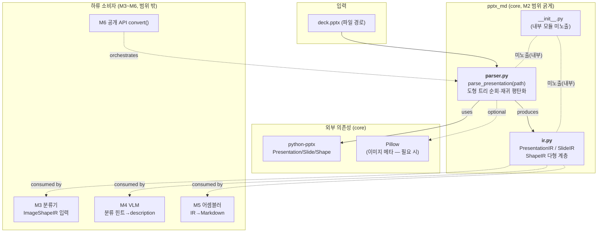
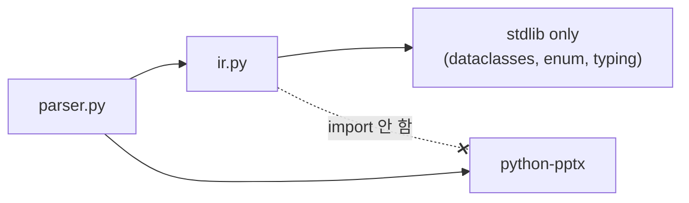
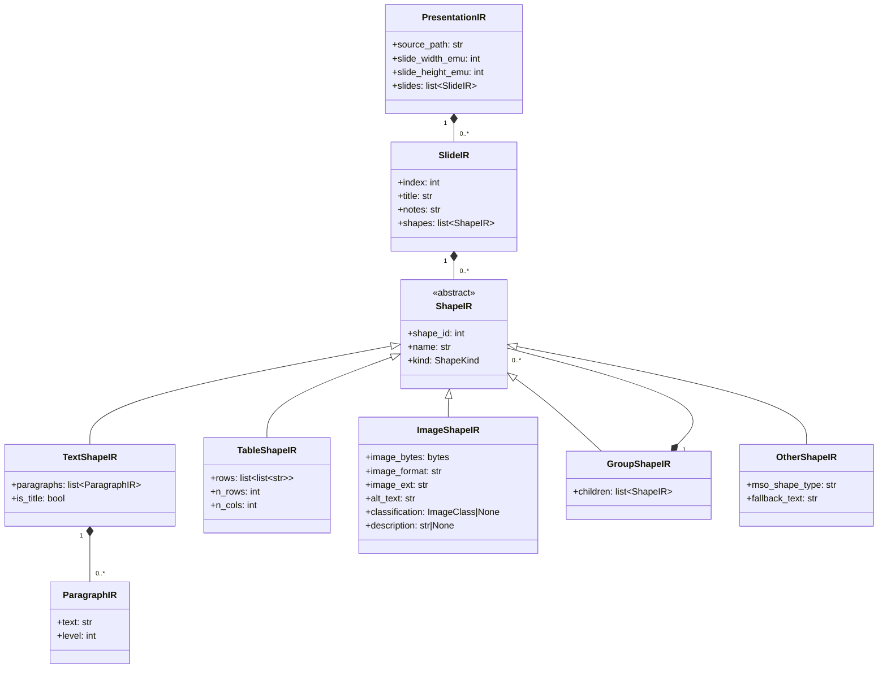

# ARCH-M2 — 코어 파서 & 중간 IR

> 범위: M2 (FR-03 슬라이드 파싱, FR-04 도형 파싱, FR-05 중간 IR 정의)
> 전제: `docs/00-charter/project-profile.md`, `docs/00-charter/charter.md`, `docs/10-requirements/REQ-core.md`, `docs/20-design/ARCH-M1.md`
> 스택 스킬: `.claude/skills/stack-python-packaging`
> 작성: architect / 2026-06-27
> 상태: 설계 초안 (reviewer 리뷰 / 사람 승인 전 — 아키텍처 게이트 대상)

---

## 0. M1 과의 연속성

M1 은 빌드·CI 인프라만 구성했고 런타임 코드는 `__init__.py` 골격뿐이었다. M2 는 **pptx-md 의 첫 런타임 변환 코드**가 등장하는 마일스톤이다. M1 ADR 중 본 설계의 직접 전제:

- **ADR-002 (의존성 격리)**: 파서/IR 은 `python-pptx`, `Pillow` 만 사용. VLM SDK 일절 import 금지(NFR-08). 본 문서 §5.2 에서 강제 규약화.
- **ADR-003 (mypy strict)**: `[tool.mypy] strict=true` + `ignore_missing_imports=true` 가 이미 적용됨 → IR/파서는 strict 통과해야 하며, python-pptx 의 미타이핑 반환값을 IR 경계에서 명시 타입으로 좁힌다(§5.1).
- **8.3 `__init__.py`**: 공개 API re-export 위치. IR·파서는 **내부 모듈**이므로 여기에 노출하지 않는다(FR-16/M6 게이트 대상).

---

## 1. 아키텍처에 영향을 주는 요구사항 추출

> FR-03/04/05 는 REQ §4 기준 "차기 정제 대상(스토리 골격)" 상태다. 본 설계는 스토리·헌장·디스패치 제약으로부터 설계 영향 AC 를 도출하며, 확정 AC 는 planner 가 WBS 이슈화 시점에 박제한다(§9 의 AC 초안 = planner 입력).

| 출처 | 항목 | 설계 영향 |
|------|------|-----------|
| FR-03 스토리 | PPTX → 슬라이드 목록 + 메타데이터 추출 | `parse_presentation(path) -> PresentationIR`, `PresentationIR.slides: list[SlideIR]`, 슬라이드 메타(인덱스, title, notes) |
| FR-04 스토리 | 텍스트·표·이미지·**그룹** 도형 추출 | `ShapeIR` 다형 계층(TextShapeIR/TableShapeIR/ImageShapeIR/GroupShapeIR/OtherShapeIR), 그룹 재귀 평탄화 |
| FR-05 스토리 | 파서 출력 ↔ 어셈블러 입력을 잇는 내부 구조 (dataclass) | `ir.py` 의 dataclass 계층, 직렬화·해시 가능, 어셈블러(M5)·분류기(M3)·VLM(M4) 의 공통 입력 |
| 디스패치 힌트 | 그룹 안 그룹 임의 깊이 | 재귀 처리(스택/재귀 함수) + 깊이 무제한 대응(§3.3, ADR-203) |
| 디스패치 힌트 | 미지원 도형(차트/SmartArt) → OTHER, 예외 전파 금지 | `OtherShapeIR` + per-shape try/except 격리(§5.3, ADR-204) |
| 디스패치 힌트 | 이미지 IR 에 M3/M4 확장 슬롯 Optional 예약(v1=None) | `ImageShapeIR.classification`, `.description` 등 Optional 필드, v1 항상 None(§3.4, ADR-205) |
| 디스패치 힌트 | 빈 title/notes 규약 단일화 | `""`(빈 문자열)로 통일, 부재 ≠ None (§5.4, ADR-202) |
| REQ FR-06 의존 | 이미지 도형(IR) 을 M3 분류기 입력으로 | `ImageShapeIR.image_bytes`, `.image_format`, `.image_ext` 노출 |
| REQ NFR-01 | 20슬라이드 p95 < 5초 (VLM 제외, ubuntu 2-core) | 파싱은 단일 패스 O(도형 수), 이미지 blob 은 메모리 적재만(디코딩·분류는 M3 지연), 불필요 복사 회피(§5.5) |
| REQ NFR-02 | 신규 코드 라인 커버리지 ≥ 75% | 인메모리 PPTX fixture 로 분기(도형 5종 + 그룹 + OTHER + 빈 슬라이드) 커버(§6.3, §9) |
| REQ NFR-03 | mypy strict exit 0 | dataclass 전 필드 타입 명시, python-pptx 경계 타입 좁히기, `Sequence`/`list` 명시 |
| REQ NFR-05/06 | API key·PII 비포함/비로깅 | 파서는 시크릿 미취급. PII 마스킹은 M5. M2 파서는 원본 텍스트를 **로깅하지 않음**(§5.6) |
| REQ NFR-08 | VLM/LibreOffice 없이 동작 | 파서는 core 의존성만 사용, VLM/LibreOffice import 0(ADR-002 계승) |

> 통합 지점: M2 도 외부 시스템 통합 없음(로컬 파일 입력 → 인메모리 IR). 영속 저장소·DB 없음 → ERD(관계형) 불필요. 대신 §3 에서 IR **데이터 모델(클래스 다이어그램)** 을 정의한다.

---

## 2. 컨텍스트 / 컴포넌트 구조

M2 는 변환 파이프라인의 **입력단(파서)** 과 **공통 자료구조(IR)** 를 만든다. IR 은 M3~M5 전 단계의 계약이다.



### 2.1 의존 방향 (단방향 — 순환 금지)



**핵심 규칙**: `ir.py` 는 `python-pptx` 를 **import 하지 않는다**. IR 은 순수 자료구조(stdlib 만)이며, python-pptx 객체와의 변환은 전적으로 `parser.py` 책임이다. 이로써 (a) IR 이 파서 구현/라이브러리 버전과 decouple 되고, (b) M5 어셈블러가 python-pptx 없이도 IR 만으로 테스트·동작 가능하며, (c) 의존 방향이 `parser → ir` 단방향으로 고정된다(ADR-206).

### 2.2 컴포넌트 책임

| 모듈 | 경로 | 책임 | M2 범위 상태 |
|------|------|------|--------------|
| IR 정의 | `src/pptx_md/ir.py` | PresentationIR/SlideIR/ShapeIR 다형 계층, 빈 값 규약, M3/M4 확장 슬롯(Optional) | 전체 확정 |
| 슬라이드/도형 파서 | `src/pptx_md/parser.py` | `parse_presentation()` 공개 함수, 도형 트리 재귀 순회, 미지원 도형 격리, IR 생성 | 전체 확정 |
| 패키지 진입점 | `src/pptx_md/__init__.py` | (변경 없음) IR/파서는 내부 모듈 — 미노출 | M1 골격 유지 |
| 테스트 픽스처 | `tests/conftest.py` | 인메모리 PPTX 생성 픽스처 추가 | M2 에서 확장 |

---

## 3. 데이터 모델 — IR 계층

영속 DB 가 없으므로 관계형 ERD 대신 **클래스 다이어그램**으로 IR 계층을 정의한다. (라이브러리는 stateless: 파일 입력 → 인메모리 IR → 문자열 출력.)

### 3.1 IR 클래스 다이어그램



### 3.2 필드 타입 상세 및 근거

#### PresentationIR
| 필드 | 타입 | 의미 | 근거/제약 |
|------|------|------|-----------|
| `source_path` | `str` | 원본 파일 경로(추적·로그용 식별자) | 어셈블러/오류 메시지에서 출처 표기. PII 아님(파일명). |
| `slide_width_emu` | `int` | 슬라이드 폭(EMU) | python-pptx `prs.slide_width`. M5 레이아웃 판단 여지(현 단계는 메타 보존). |
| `slide_height_emu` | `int` | 슬라이드 높이(EMU) | 동상. |
| `slides` | `list[SlideIR]` | 슬라이드 순서 보존 목록 | 원본 슬라이드 순서 == 출력 순서(FR-12 Reduce 안정성). |

#### SlideIR
| 필드 | 타입 | 의미 | 근거/제약 |
|------|------|------|-----------|
| `index` | `int` | 0-기반 슬라이드 인덱스 | 안정 정렬·오류 위치 표기. |
| `title` | `str` | 슬라이드 제목 (없으면 `""`) | 빈 값 규약 ADR-202. title placeholder 부재 시 `""`. |
| `notes` | `str` | 발표자 노트 (없으면 `""`) | 동상. notes_slide 부재 시 `""`. |
| `shapes` | `list[ShapeIR]` | 슬라이드의 도형(그룹은 GroupShapeIR 로 트리 보존) | 원본 z-order/문서 순서 보존. |

#### ShapeIR (추상 베이스)
| 필드 | 타입 | 의미 | 근거 |
|------|------|------|------|
| `shape_id` | `int` | python-pptx `shape.shape_id` | 도형 고유 식별(디버그·추적). |
| `name` | `str` | `shape.name` (없으면 `""`) | 진단용. |
| `kind` | `ShapeKind` (Enum) | 판별 태그(TEXT/TABLE/IMAGE/GROUP/OTHER) | 다형 분기 시 isinstance 대신 enum 매칭 가능(ADR-201). |

> `kind` 는 클래스 타입과 1:1 중복으로 보이나, (a) 직렬화/로그에서 타입명 없이 판별, (b) match-case 가독성, (c) IR JSON 덤프 시 태그 필드 역할을 한다. 클래스 계층(isinstance)이 1차 판별, `kind` 는 보조 태그.

#### TextShapeIR
| 필드 | 타입 | 의미 |
|------|------|------|
| `paragraphs` | `list[ParagraphIR]` | 문단 목록(빈 문단 보존 여부는 파서 규약 §5.4) |
| `is_title` | `bool` | title placeholder 유래 여부(어셈블러가 H1/H2 결정에 활용) |

#### ParagraphIR
| 필드 | 타입 | 의미 |
|------|------|------|
| `text` | `str` | 문단 평문(run 들을 concat) |
| `level` | `int` | 들여쓰기 수준(0-기반, python-pptx `paragraph.level`) → 어셈블러 불릿 깊이 |

#### TableShapeIR
| 필드 | 타입 | 의미 | 근거 |
|------|------|------|------|
| `rows` | `list[list[str]]` | 행×열 셀 텍스트 2차원 배열 | 어셈블러가 Markdown 표/Mermaid(FR-13)로 변환. |
| `n_rows` | `int` | 행 수 | 빠른 복잡도 판정(FR-13 fallback 입력). |
| `n_cols` | `int` | 열 수 | 동상. |

> 병합 셀(merge)은 v1 에서 셀 텍스트를 각 논리 셀에 그대로 반영(python-pptx 가 채우는 값). 병합 메타(span)는 M5 FR-13 정제 시 필요하면 확장(현 단계 부채로 §11 기록).

#### ImageShapeIR (확장 슬롯 보유)
| 필드 | 타입 | 의미 | 근거 |
|------|------|------|------|
| `image_bytes` | `bytes` | 이미지 원본 바이트(`picture.image.blob`) | M3 분류기·M4 VLM 입력. |
| `image_format` | `str` | python-pptx `image.content_type` 또는 `image.ext` 정규화(예 `"png"`) | 분류기 휴리스틱·VLM media_type. |
| `image_ext` | `str` | 확장자(예 `"png"`, `"emf"`) | EMF/WMF 판별 → M3 FR-07 LibreOffice 경로. |
| `alt_text` | `str` | PPTX alt text(없으면 `""`) | 어셈블러 fallback 캡션. |
| `classification` | `ImageClass \| None` | **M3 확장 슬롯**. v1=항상 `None` | ADR-205. 분류 전 단계 IR 은 None. |
| `description` | `str \| None` | **M4 확장 슬롯**. v1=항상 `None` | ADR-205. VLM 미적용 시 None. |

#### GroupShapeIR
| 필드 | 타입 | 의미 | 근거 |
|------|------|------|------|
| `children` | `list[ShapeIR]` | 그룹 직속 자식(GroupShapeIR 중첩 가능) | 임의 깊이 트리 보존(ADR-203). |

#### OtherShapeIR (미지원 도형 fallback)
| 필드 | 타입 | 의미 | 근거 |
|------|------|------|------|
| `mso_shape_type` | `str` | 원본 MSO 타입명(예 `"CHART"`, `"SMART_ART"`) 또는 `"UNKNOWN"` | 진단·로그. 예외 전파 대신 기록(ADR-204). |
| `fallback_text` | `str` | 도형에 text_frame 이 있으면 추출한 평문, 없으면 `""` | 차트/SmartArt 의 라벨 텍스트라도 보존 → 어셈블러가 활용 가능. |

### 3.3 그룹 재귀 — 트리 보존 vs 평탄화

GroupShape 는 python-pptx 상 **재귀 트리**(그룹 안 그룹 임의 깊이). 본 설계는 **트리 보존**(GroupShapeIR.children) 을 채택한다(ADR-203). 어셈블러/분류기가 평탄 목록이 필요하면 IR 헬퍼 `iter_shapes(slide)`(깊이우선 제너레이터)로 평탄화한다. 트리를 버리지 않음으로써 그룹 의미(시각적 군집)를 M5 가 활용할 여지를 남긴다.

### 3.4 M3/M4 확장 슬롯 규약

`ImageShapeIR.classification`, `.description` 은 **v1 파서가 항상 `None`** 으로 둔다. M3 분류기는 IR 을 **in-place 갱신 또는 신규 인스턴스 생성** 중 하나로 채우며, 그 정책은 M3 설계에서 확정(현재는 슬롯만 예약). dataclass 는 기본값 `None` 으로 선언해 M2 호출부가 신경 쓰지 않게 한다(§8.1 코드 초안).

---

## 4. 인터페이스 명세

### 4.1 공개 함수 (parser.py)

```python
def parse_presentation(path: str | Path) -> PresentationIR: ...
```

| 항목 | 내용 |
|------|------|
| 입력 | `path`: PPTX 파일 경로(`str` 또는 `pathlib.Path`). 존재·확장자는 함수 내 검증. |
| 출력 | `PresentationIR` (슬라이드·도형 IR 트리). |
| 부작용 | 없음(파일 읽기만, 쓰기 없음). 로깅은 진단 레벨(원본 텍스트 미출력, §5.6). |
| 스레드 | 순수 함수(전역 상태 없음) → M5 Map 단계(FR-12)에서 슬라이드 병렬 처리 안전. |

> 디스패치가 제안한 `parse_presentation(path: Path) -> PresentationIR` 와 동등. `str | Path` 로 입력 폭을 넓혀 M6 공개 API(`convert(str)`)와의 접합을 매끄럽게 한다.

### 4.2 보조 인터페이스 (ir.py)

| 시그니처 | 역할 |
|----------|------|
| `iter_shapes(container: SlideIR \| GroupShapeIR) -> Iterator[ShapeIR]` | 깊이우선 평탄화 제너레이터(그룹 펼침). 하류 소비자 편의. |
| `class ShapeKind(StrEnum)` | `TEXT/TABLE/IMAGE/GROUP/OTHER` 판별 태그. |
| `class ImageClass(StrEnum)` | `TEXT/DIAGRAM/PHOTO/LOGO` — **M3 가 채울** 분류 enum. M2 는 정의만(슬롯 타입), v1 미사용. |

> `ImageClass` 를 M2 에서 미리 정의할지(슬롯 타입 확정) vs M3 로 미룰지는 ADR-205 에서 결정 → **M2 에서 정의**(타입 안정성: Optional 필드 타입이 `ImageClass | None` 로 strict 하게 고정됨). enum 값 4종은 헌장 §2/FR-06 에 명시되어 변동 위험 낮음.

### 4.3 예외 정책

미지원 도형은 예외가 아니라 `OtherShapeIR` 로 흡수한다(전파 금지, ADR-204). 그러나 **입력 자체가 잘못된 경우**는 명시 예외를 던진다. M2 는 전용 예외 계층의 첫 도입점이다.

| 예외 | 발생 조건 | 비고 |
|------|-----------|------|
| `PptxMdError(Exception)` | 라이브러리 전역 베이스 | M4(VLM), M5(어셈블러)도 상속해 사용. `errors.py` 또는 `ir.py` 인접 모듈에 정의(WBS W1 에서 위치 확정). |
| `ParseError(PptxMdError)` | 파일 미존재, PPTX 아님, python-pptx 가 열기 실패 | 메시지에 `source_path` 포함(원본 텍스트 미포함). |

| 함수 | 정상 | 오류 경로 |
|------|------|-----------|
| `parse_presentation` | `PresentationIR` 반환 | 파일 없음 → `ParseError("file not found: ...")`; 비-PPTX/손상 → `ParseError`(python-pptx 의 `PackageNotFoundError` 등을 래핑) |
| (per-shape 처리) | ShapeIR 생성 | 개별 도형 변환 실패 → 예외 삼키고 `OtherShapeIR(mso_shape_type="UNKNOWN")` 기록 + WARNING 로그(원문 미포함) |

> **설계 원칙**: "한 도형의 실패가 전체 변환을 막지 않는다"(헌장 리스크 대응 / P-02 의 축소판). 단, 파일 레벨 실패는 빠르게 실패(fail-fast)한다. 이 비대칭이 의도다(§5.3).

---

## 5. 횡단 관심사

### 5.1 mypy strict 전략

- 모든 dataclass 필드에 타입 주석 명시. `list`/`bytes`/`int`/`str` 구체 타입 사용.
- python-pptx 는 `ignore_missing_imports=true`(M1 ADR-003)로 `Any` 유입 가능 → **IR 경계에서 명시 캐스팅/타입 좁히기**. 예: `shape.shape_id`(Any 가능) → `int(shape.shape_id)` 로 좁혀 IR 에 저장. python-pptx 의 `Any` 가 IR 내부로 전파되지 않게 파서가 방벽 역할.
- `match shape.shape_type:` 분기에서 각 분기가 구체 ShapeIR 를 반환하도록 작성 → 반환 타입 `ShapeIR` 로 안전 수렴.
- `StrEnum`(Python 3.11+, 프로파일 NFR-07 충족) 사용으로 enum 직렬화·비교 타입 안전.

### 5.2 VLM 미의존 보장 (NFR-08)

- `ir.py`·`parser.py` 어디에도 `anthropic`/`openai`/`import ...vlm...` 없음(ADR-002 계승).
- `ImageShapeIR.description`(M4 슬롯)은 `str | None` 일 뿐 VLM 타입 미참조.
- 검증: reviewer 가 `grep -rE "anthropic|openai" src/pptx_md/{ir,parser}.py` → 0 매치 확인(§9 W 들의 AC 에 포함).

### 5.3 예외 처리 전략 (격리 + 부분 실패 허용)

- **파일 레벨**: fail-fast → `ParseError`(§4.3).
- **도형 레벨**: per-shape try/except 로 격리. 실패 도형은 `OtherShapeIR` 로 강등, 변환 계속.
- **이미지 blob 접근 실패**(드물게 깨진 미디어): 해당 ImageShapeIR 를 `OtherShapeIR(mso_shape_type="PICTURE(blob unreadable)")` 로 강등.
- 격리 범위는 **도형 단위 최소화**(슬라이드 통째 버리지 않음).

### 5.4 빈 값 규약 (단일화)

- **선택: 빈 문자열 `""`** (None 아님). 적용: `SlideIR.title`, `SlideIR.notes`, `ShapeIR.name`, `ImageShapeIR.alt_text`, `OtherShapeIR.fallback_text`, `ParagraphIR.text`.
- 근거(ADR-202): (a) 어셈블러(M5)가 `if title:` 한 패턴으로 빈/비빈 분기 → `None`/`""` 이중 처리 불필요, (b) 문자열 필드 타입이 `str` 로 고정되어 mypy strict 가 `Optional` 분기를 요구하지 않음(코드 단순), (c) "값이 존재하나 비었음"과 "필드 부재"를 구분할 필요가 M2~M5 시나리오에 없음.
- **예외**: M3/M4 확장 슬롯(`classification`, `description`)은 `None` 사용 — 이는 "아직 채워지지 않음(미계산)"의 의미로, "빈 텍스트"와 의미가 다르다. 이 비대칭은 의도(ADR-205).
- 빈 문단(`ParagraphIR.text == ""`) 보존 여부: 파서는 **빈 문단을 버리지 않고 보존**(원본 줄바꿈 구조 유지). 어셈블러가 출력 시 정리. → 정보 손실 회피, 결정은 출력단으로 미룸.

### 5.5 성능 (NFR-01)

- 파싱은 슬라이드·도형을 **단일 패스** O(도형 총수)로 순회. 백트래킹 없음.
- 이미지: `picture.image.blob`(bytes) **참조 적재만**. 디코딩(Pillow)·분류는 M3 로 지연 → M2 파싱이 무거운 이미지 처리를 떠안지 않음. (Pillow 는 M2 에서 사실상 미사용 가능 — §11 부채 아님, 의도적 지연.)
- 동일 blob 중복 복사 회피: bytes 는 불변이므로 참조 전달.
- 측정: M2 단계는 NFR-01 강제 게이트 아님(M6/FR-17). 단 §6.3 fixture 에 20슬라이드 규모 케이스를 1개 둬 회귀 측정 가능성 확보.

### 5.6 로깅·감사 (NFR-05/06)

- 파서 로깅은 `logging.getLogger("pptx_md.parser")` 사용, 기본 핸들러 미부착(라이브러리 관례).
- **원본 텍스트·셀 내용·alt_text 를 로그에 출력 금지**(NFR-06 — 마스킹은 M5 지만 M2 파서도 원문 비로깅 원칙 준수). 로그는 도형 종류·인덱스·예외 타입 등 **메타만**.
- 시크릿 미취급(NFR-05) — 파서는 API key 와 무관.

---

## 6. 기술 선택지 비교 (ADR 후보)

### 6.1 IR 자료구조: dataclass vs TypedDict vs NamedTuple

| 후보 | 장점 | 단점 |
|------|------|------|
| A. `@dataclass` | 상속(다형 계층) 자연스러움, 기본값/`__post_init__` 검증, mypy strict 우수, 가독성 | 약간의 런타임 비용(무시 가능) |
| B. `TypedDict` | dict 호환·직렬화 쉬움 | **상속 다형성 빈약**(ShapeIR 계층 표현 난해), isinstance 불가, 필드 누락 런타임 미검출 |
| C. `NamedTuple` | 불변·경량 | 상속 계층 부적합, 가변 슬롯(M3 채움) 어려움 |

**권고: A (`@dataclass`)** — planner 결정(디스패치)과 일치. ShapeIR 다형 계층 + M3 가 채우는 가변 슬롯 + mypy strict 친화 → dataclass 가 명확한 우위. (→ ADR-201)

### 6.2 도형 다형성 전략: 클래스 계층 vs 단일 클래스+kind 태그

| 후보 | 장점 | 단점 |
|------|------|------|
| A. 추상 ShapeIR + 서브클래스 5종 | 타입별 필드가 타입에 귀속(예: rows 는 Table 만), mypy 가 잘못된 필드 접근 차단, match-case/isinstance 자연 | 클래스 수 증가 |
| B. 단일 ShapeIR + `kind` + 다수 Optional 필드 | 클래스 1개로 단순 | 무관 필드가 모든 인스턴스에 존재(rows·image_bytes 가 텍스트 도형에도), None 범벅, 타입 안전성 저하 |
| C. Union 타입 (서브클래스 + `ShapeIR = TextShapeIR | ...`) | A 의 장점 + 닫힌 합집합으로 match 망라성 검사 | 베이스 공통 필드(shape_id 등) 중복 선언 필요 |

**권고: A + C 절충** — 추상 베이스 ShapeIR(공통 필드 dataclass 상속) + 서브클래스 5종, 그리고 타입 별칭 `ShapeIRType` 없이 베이스 `ShapeIR` 로 다형 참조. match-case 는 `kind` enum 또는 isinstance 로 분기. (→ ADR-201) 베이스를 추상으로 두되 dataclass 상속 체인으로 공통 필드 중복 제거.

### 6.3 테스트 fixture: 실제 .pptx 파일 vs 인메모리 생성

| 후보 | 장점 | 단점 |
|------|------|------|
| A. `tests/fixtures/*.pptx` 바이너리 | 실제 PowerPoint 산출물과 동일, 엣지(SmartArt/차트) 재현 용이 | 바이너리가 repo 에, 생성 의도 불투명, 수정 어려움 |
| B. python-pptx API 로 인메모리 생성 | 의도 명시적(코드가 곧 문서), diff 가능, 도형 조합 정밀 제어 | SmartArt/차트 등 python-pptx 미지원 도형 생성 난해 |
| C. A+B 혼합 | 일반 케이스 B, OTHER(차트 등) 케이스만 A | fixture 두 종류 관리 |

**권고: C (혼합)** — 텍스트/표/이미지/그룹/빈슬라이드는 B(인메모리)로 명시 생성, OTHER 경로(차트·SmartArt)는 python-pptx 로 만들기 어려우므로 최소 A(작은 실제 .pptx) 1개를 `tests/fixtures/` 에 둔다. python-pptx 자체는 mock 금지(디스패치 제약) → 실제 API 호출. (→ ADR-207)

---

## 7. 아키텍처 결정 기록 (ADR)

### ADR-201 IR 자료구조 = dataclass + 추상 ShapeIR 계층
**배경**: 파서 출력 ↔ 어셈블러/분류기/VLM 입력을 잇는 내부 구조 필요(FR-05). 도형은 타입별로 보유 필드가 다르고(텍스트=문단, 표=행렬, 이미지=바이트), M3 가 일부 필드를 사후 채운다.
**결정**: `@dataclass` 기반. 추상 `ShapeIR`(공통 필드 shape_id/name/kind) + 서브클래스 `TextShapeIR`/`TableShapeIR`/`ImageShapeIR`/`GroupShapeIR`/`OtherShapeIR`. 판별은 isinstance 1차 + `kind: ShapeKind` 보조 태그.
**근거**: 상속 다형성·가변 슬롯·mypy strict 친화에서 TypedDict/NamedTuple 대비 우위(§6.1/§6.2). planner 결정과 일치.
**대안과 기각 사유**: TypedDict(다형성·isinstance 불가), NamedTuple(가변 슬롯 부적합), 단일클래스+태그(무관 Optional 범벅·타입안전성 저하).
**영향**: M3~M5 소비자가 isinstance/match 로 안전 분기. IR 은 `ir.py` 단일 모듈에 응집.

### ADR-202 빈 title/notes/텍스트 = `""` (None 아님)
**배경**: 디스패치 힌트 — 빈 값 규약 단일화 요구. title/notes/name/alt_text 가 부재할 수 있음.
**결정**: 텍스트성 부재 필드는 모두 빈 문자열 `""`. `None` 미사용.
**근거**: 어셈블러 `if title:` 단일 분기, mypy strict 가 Optional 분기 강요 안 함, "존재하나 빈 값"과 "부재" 구분 불필요(§5.4).
**대안과 기각 사유**: `None` 사용(이중 처리·Optional 범벅), 필드별 혼용(규약 불일치 → reviewer 적발 대상).
**영향**: 모든 텍스트 필드 타입이 `str`. **단, M3/M4 확장 슬롯은 `None`**(미계산 의미 — ADR-205 와 의도적 비대칭).

### ADR-203 그룹 도형 = 트리 보존(GroupShapeIR.children) + 평탄화 헬퍼
**배경**: 그룹 안 그룹 임의 깊이(디스패치 힌트). python-pptx 상 재귀 트리.
**결정**: GroupShapeIR.children 로 **트리 구조 보존**. 평탄 순회가 필요한 소비자는 `iter_shapes()`(깊이우선 제너레이터) 사용.
**근거**: 트리를 즉시 평탄화하면 그룹의 시각적 의미(군집)가 소실 → M5 가 활용 불가. 트리 보존 + 헬퍼 제공이 정보 손실 0 이면서 편의도 충족.
**대안과 기각 사유**: 즉시 평탄화(그룹 의미 소실), 깊이 제한(임의 깊이 요구 위반).
**영향**: 파서는 재귀 함수로 GroupShapeIR 생성. 재귀 깊이는 PPTX 구조상 현실적으로 얕음(스택 오버플로 위험 무시 가능, §11 에 부채로 기록만).

### ADR-204 미지원 도형 = OtherShapeIR 강등(예외 전파 금지)
**배경**: 차트/SmartArt 등 python-pptx 가 구조화 추출 못 하는 도형 존재(헌장 리스크). 디스패치: OTHER 로 기록, 예외 전파 금지.
**결정**: 미지원/실패 도형은 `OtherShapeIR(mso_shape_type=원본타입, fallback_text=가능시 텍스트)` 로 강등하고 변환 계속. per-shape try/except 격리.
**근거**: "한 도형 실패가 전체 변환 차단 금지"(헌장 리스크 대응). 차트 라벨 텍스트라도 fallback_text 로 보존 → 정보 손실 최소화.
**대안과 기각 사유**: 예외 전파(전체 변환 실패 — UX 파괴), 조용히 누락(진단 불가 — fallback 메타 없음).
**영향**: 변환은 항상 부분 성공 가능. 단 파일 레벨 실패는 fail-fast(ParseError) — 비대칭 의도(§5.3).

### ADR-205 ImageShapeIR 확장 슬롯 = Optional 필드 예약(v1 None) + ImageClass enum M2 정의
**배경**: 디스패치 — 이미지 IR 에 M3(분류)/M4(설명) 확장 슬롯을 Optional 로 예약, v1 None.
**결정**: `classification: ImageClass | None = None`, `description: str | None = None`. `ImageClass`(StrEnum: TEXT/DIAGRAM/PHOTO/LOGO)는 **M2 에서 정의**(타입만), M2 파서는 항상 None 으로 둠.
**근거**: 슬롯을 미리 두면 M3/M4 가 IR 스키마를 바꾸지 않고 채움(하위호환). enum 을 M2 에 정의하면 슬롯 타입이 `ImageClass | None` 로 strict 고정(타입 안전). 4종 값은 헌장 §2/FR-06 에 명시 → 변동 위험 낮음.
**대안과 기각 사유**: 슬롯 미예약(M3 가 IR 스키마 변경 — 파급), `Any` 슬롯(타입 안전성 상실), enum 을 M3 로 미룸(M2 슬롯 타입이 불확정).
**영향**: M3/M4 가 IR 인터페이스 안정성 위에서 작업. dataclass 기본값 None 으로 M2 호출부 무영향.

### ADR-206 ir.py 는 python-pptx 미import (순수 자료구조)
**배경**: IR 이 파서·라이브러리 버전과 결합되면 M5 어셈블러 테스트가 python-pptx 를 강제로 끌어옴.
**결정**: `ir.py` 는 stdlib(dataclasses/enum/typing)만 import. python-pptx ↔ IR 변환은 전적으로 `parser.py`. 의존 방향 `parser → ir` 단방향.
**근거**: (a) IR decoupling, (b) 어셈블러가 IR 만으로 테스트·동작, (c) 순환 의존 원천 차단, (d) python-pptx 의 `Any` 가 IR 내부로 누출 안 됨(파서가 방벽).
**대안과 기각 사유**: IR 이 python-pptx 객체 보유(결합·Any 누출·테스트 부담).
**영향**: 파서가 경계 변환 책임 전담(§5.1 타입 좁히기). IR 직렬화·해시 자유로워짐.

### ADR-207 테스트 fixture = 인메모리 생성(주) + 실제 .pptx(OTHER 한정)
**배경**: NFR-02 커버리지 75%, python-pptx mock 금지(디스패치).
**결정**: 텍스트/표/이미지/그룹/빈슬라이드는 python-pptx API 인메모리 생성(`conftest.py` 픽스처). OTHER(차트/SmartArt) 경로만 작은 실제 `.pptx` 1개를 `tests/fixtures/` 에.
**근거**: 인메모리가 의도 명시·diff 가능. OTHER 도형은 python-pptx 로 생성 난해 → 실제 파일 불가피. mock 금지 준수(실제 API).
**대안과 기각 사유**: 전부 실제 파일(의도 불투명·수정난), 전부 인메모리(OTHER 케이스 생성 불가), mock(디스패치 금지).
**영향**: 그룹 재귀·OTHER 강등·빈 값 규약을 fixture 분기로 커버(§9 W 들의 AC).

---

## 8. 산출물 상세 초안 (구현 가이드)

> 아래는 developer 구현 가이드용 초안이다. 시그니처·필드·분기 의도를 고정하되, 세부는 developer 가 mypy/테스트 통과 범위에서 조정 가능.

### 8.1 `src/pptx_md/ir.py` 초안

```python
"""Intermediate Representation (IR) for parsed PPTX content.

Internal module (skill §1, ARCH-M1 8.3): NOT re-exported from package root.
Pure data structures — MUST NOT import python-pptx (ADR-206).
"""

from __future__ import annotations

from collections.abc import Iterator
from dataclasses import dataclass, field
from enum import StrEnum


class ShapeKind(StrEnum):
    TEXT = "text"
    TABLE = "table"
    IMAGE = "image"
    GROUP = "group"
    OTHER = "other"


class ImageClass(StrEnum):
    """Rule-based image classes (filled by M3 / FR-06; v1 parser leaves None)."""

    TEXT = "text"
    DIAGRAM = "diagram"
    PHOTO = "photo"
    LOGO = "logo"


@dataclass
class ShapeIR:
    """Abstract base for all shape IR nodes."""

    shape_id: int
    name: str  # "" if absent (ADR-202)
    kind: ShapeKind


@dataclass
class ParagraphIR:
    text: str  # "" allowed; empty paragraphs preserved (§5.4)
    level: int  # 0-based indent level


@dataclass
class TextShapeIR(ShapeIR):
    paragraphs: list[ParagraphIR] = field(default_factory=list)
    is_title: bool = False


@dataclass
class TableShapeIR(ShapeIR):
    rows: list[list[str]] = field(default_factory=list)
    n_rows: int = 0
    n_cols: int = 0


@dataclass
class ImageShapeIR(ShapeIR):
    image_bytes: bytes = b""
    image_format: str = ""
    image_ext: str = ""
    alt_text: str = ""  # ADR-202
    # Extension slots — v1 parser always None (ADR-205)
    classification: ImageClass | None = None  # M3 / FR-06
    description: str | None = None  # M4 / FR-08+


@dataclass
class GroupShapeIR(ShapeIR):
    children: list[ShapeIR] = field(default_factory=list)


@dataclass
class OtherShapeIR(ShapeIR):
    mso_shape_type: str = "UNKNOWN"
    fallback_text: str = ""


@dataclass
class SlideIR:
    index: int
    title: str = ""  # ADR-202
    notes: str = ""  # ADR-202
    shapes: list[ShapeIR] = field(default_factory=list)


@dataclass
class PresentationIR:
    source_path: str
    slide_width_emu: int = 0
    slide_height_emu: int = 0
    slides: list[SlideIR] = field(default_factory=list)


def iter_shapes(container: SlideIR | GroupShapeIR) -> Iterator[ShapeIR]:
    """Depth-first flattening of the shape tree (groups expanded)."""
    shapes = container.shapes if isinstance(container, SlideIR) else container.children
    for shape in shapes:
        yield shape
        if isinstance(shape, GroupShapeIR):
            yield from iter_shapes(shape)
```

> 비고: 예외 계층(`PptxMdError`, `ParseError`)의 정의 위치는 `src/pptx_md/errors.py`(권장) 또는 `ir.py` 인접. WBS W1 에서 위치 확정. 아래 8.2 는 `errors.py` 가정.

### 8.2 `src/pptx_md/errors.py` 초안

```python
"""Library-wide exception hierarchy (introduced in M2; reused by M4/M5)."""


class PptxMdError(Exception):
    """Base class for all pptx-md errors."""


class ParseError(PptxMdError):
    """Raised when a PPTX file cannot be opened/parsed (file-level failure)."""
```

### 8.3 `src/pptx_md/parser.py` 초안 (분기 골격)

```python
"""PPTX parser: Presentation -> PresentationIR (FR-03, FR-04).

Uses only python-pptx (and Pillow if needed). MUST NOT import VLM SDKs
(NFR-08, ADR-002). Boundary module: narrows python-pptx ``Any`` into typed IR
(§5.1, ADR-206).
"""

from __future__ import annotations

import logging
from pathlib import Path

from pptx import Presentation
from pptx.enum.shapes import MSO_SHAPE_TYPE
from pptx.exc import PackageNotFoundError

from pptx_md.errors import ParseError
from pptx_md.ir import (
    GroupShapeIR,
    ImageShapeIR,
    OtherShapeIR,
    ParagraphIR,
    PresentationIR,
    ShapeIR,
    ShapeKind,
    SlideIR,
    TableShapeIR,
    TextShapeIR,
)

_log = logging.getLogger("pptx_md.parser")


def parse_presentation(path: str | Path) -> PresentationIR:
    p = Path(path)
    if not p.is_file():
        raise ParseError(f"file not found: {p}")
    try:
        prs = Presentation(str(p))
    except PackageNotFoundError as exc:
        raise ParseError(f"not a valid PPTX package: {p}") from exc

    pres = PresentationIR(
        source_path=str(p),
        slide_width_emu=int(prs.slide_width or 0),
        slide_height_emu=int(prs.slide_height or 0),
    )
    for idx, slide in enumerate(prs.slides):
        pres.slides.append(_parse_slide(idx, slide))
    return pres


def _parse_slide(idx: int, slide: object) -> SlideIR:
    title = _safe_title(slide)
    notes = _safe_notes(slide)
    sld = SlideIR(index=idx, title=title, notes=notes)
    for shape in slide.shapes:  # type: ignore[attr-defined]
        sld.shapes.append(_parse_shape(shape))
    return sld


def _parse_shape(shape: object) -> ShapeIR:
    sid = int(getattr(shape, "shape_id", 0) or 0)
    name = str(getattr(shape, "name", "") or "")
    try:
        st = shape.shape_type  # type: ignore[attr-defined]
        if st == MSO_SHAPE_TYPE.GROUP:
            return _parse_group(shape, sid, name)
        if st == MSO_SHAPE_TYPE.PICTURE:
            return _parse_picture(shape, sid, name)
        if getattr(shape, "has_table", False):
            return _parse_table(shape, sid, name)
        if getattr(shape, "has_text_frame", False):
            return _parse_text(shape, sid, name)
        return _other(shape, sid, name)
    except Exception as exc:  # ADR-204: never propagate per-shape failure
        _log.warning("shape %s parse failed: %s", sid, type(exc).__name__)
        return OtherShapeIR(
            shape_id=sid, name=name, kind=ShapeKind.OTHER, mso_shape_type="UNKNOWN"
        )
```

> 비고1: `_parse_group`/`_parse_picture`/`_parse_table`/`_parse_text`/`_other`/`_safe_title`/`_safe_notes` 의 본문은 developer 가 §3.2 필드 표·§5.4 규약대로 구현. `_parse_group` 은 자식에 `_parse_shape` 재귀(ADR-203).
> 비고2: `# type: ignore` 는 python-pptx 미타이핑 경계 최소 사용. 가능하면 `getattr`+캐스팅으로 strict 통과(§5.1).
> 비고3: 텍스트 추출 시 run 들을 paragraph 단위로 concat → `ParagraphIR(text, level)`. 빈 문단 보존(§5.4).

### 8.4 `tests/conftest.py` 확장 초안

```python
# 추가: 인메모리 PPTX 생성 픽스처 (ADR-207)
import pytest
from pptx import Presentation
from pptx.util import Inches


@pytest.fixture
def sample_pptx_bytes() -> bytes:
    """In-memory PPTX with text/table/image/group/empty-slide coverage."""
    import io

    prs = Presentation()
    # slide 1: title + body text
    # slide 2: table
    # slide 3: picture (small PNG bytes)
    # slide 4: group containing nested group + text
    # slide 5: empty
    # ... developer fills using python-pptx API (no mock — ADR-207)
    buf = io.BytesIO()
    prs.save(buf)
    return buf.getvalue()
```

> OTHER 경로(차트/SmartArt) 검증용 작은 `tests/fixtures/chart_smartart.pptx` 1개는 W3 에서 추가(ADR-207).

---

## 9. WBS — 구현 이슈 분해

각 단위는 developer 가 반나절~하루 내 독립 수행 가능한 크기. 의존상 **W1(IR) 선행** 후 W2(파서)·W3(테스트)로 진행(REQ §7: FR-05 ← FR-03/04, 단 IR 스키마는 파서보다 먼저 확정해야 파서가 채울 대상이 생김).

| ID | 작업 | 대응 FR | 참조 설계 절 | AC 초안 | 의존 |
|----|------|---------|-------------|---------|------|
| W1 | IR 계층 정의: `ir.py`(dataclass 9종 + ShapeKind/ImageClass enum + iter_shapes) + `errors.py`(PptxMdError/ParseError) | FR-05 | 3.1~3.4, 4.2, 4.3, 8.1, 8.2 | (1) `from pptx_md.ir import PresentationIR, SlideIR, TextShapeIR, TableShapeIR, ImageShapeIR, GroupShapeIR, OtherShapeIR, ShapeKind, ImageClass, iter_shapes` 성공; (2) `mypy src/` exit 0(strict); (3) `ir.py` 에 `anthropic/openai/pptx` import 0(grep, ADR-206/NFR-08); (4) ImageShapeIR 의 classification·description 기본값 None(ADR-205); (5) 텍스트성 필드 기본값 `""`(ADR-202); (6) `iter_shapes` 가 중첩 그룹을 깊이우선 평탄화 | 없음 |
| W2 | 슬라이드/도형 파서: `parser.py` `parse_presentation()` + 도형 5종 분기 + 그룹 재귀 + OTHER 강등 + ParseError | FR-03, FR-04 | 2.1, 4.1, 4.3, 5.1~5.6, 8.3 | (1) `parse_presentation(sample.pptx)` → PresentationIR, slides 수 일치(FR-03); (2) 텍스트/표/이미지/그룹 도형이 각 ShapeIR 서브타입으로 추출(FR-04); (3) 그룹 안 그룹이 GroupShapeIR.children 트리로 보존(ADR-203); (4) 차트/SmartArt → OtherShapeIR, 예외 전파 0(ADR-204); (5) 파일 없음/비PPTX → ParseError; (6) 빈 title/notes → `""`(ADR-202); (7) ImageShapeIR.image_bytes 비어있지 않음(이미지 슬라이드); (8) `mypy src/` exit 0, `parser.py` 에 VLM import 0; (9) 원본 텍스트 로그 미출력(§5.6) | W1 |
| W3 | 파서 테스트 스위트: `conftest.py` 인메모리 PPTX 픽스처 + `tests/fixtures/` OTHER용 .pptx + `tests/test_parser.py`(도형 5종·그룹 재귀·OTHER·빈값·ParseError·iter_shapes) | FR-03/04/05 검증 | 6.3, 8.4, ADR-207 | (1) 인메모리 PPTX 픽스처로 텍스트/표/이미지/그룹/빈슬라이드 각 1+ 테스트(python-pptx 실제 API, mock 0); (2) OTHER 경로 fixture .pptx 로 OtherShapeIR 검증; (3) `pytest` exit 0; (4) 신규 파서·IR 코드 라인 커버리지 ≥ 75%(NFR-02, 측정); (5) ParseError 경로 테스트(파일없음/비PPTX) | W1, W2 |

> 분할 권고: W1→W2 는 강한 선후(스키마 먼저). W3 는 W2 와 일부 병행 가능(픽스처는 W2 와 독립 작성). PM 판단으로 한 이슈(#M2)에 W1→W2→W3 순차 PR, 또는 FR 단위(#15=W2 일부+W3, #16=W2 일부, #17=W1)로 매핑. **IssueAC 는 planner 가 본 §9 초안을 베이스로 확정**(REQ §4 rolling-wave: M2 활성화 시점 AC 박제).

---

## 10. 요구사항 추적표

### 10.1 M2 활성 FR → 설계 요소

| FR | 스토리/AC 영향 | 충족 설계 요소 |
|----|----------------|---------------|
| FR-03 슬라이드 파싱 | PPTX → 슬라이드 목록 + 메타 | §2.2 parser.py, §4.1 `parse_presentation`, §3.2 PresentationIR/SlideIR(index/title/notes), W2 |
| FR-04 도형 파싱 (텍스트) | 텍스트 도형 추출 | §3.2 TextShapeIR/ParagraphIR, §8.3 `_parse_text`, W2 AC2 |
| FR-04 도형 파싱 (표) | 표 도형 추출 | §3.2 TableShapeIR(rows/n_rows/n_cols), §8.3 `_parse_table`, W2 AC2 |
| FR-04 도형 파싱 (이미지) | 이미지 도형 추출 | §3.2 ImageShapeIR(image_bytes/format/ext/alt_text), §8.3 `_parse_picture`, W2 AC7 |
| FR-04 도형 파싱 (그룹) | 그룹 도형 + 임의 깊이 | ADR-203, §3.3 GroupShapeIR.children, §3.1 iter_shapes, §8.3 `_parse_group`(재귀), W2 AC3 |
| FR-04 도형 파싱 (미지원) | 차트/SmartArt 등 | ADR-204, §3.2 OtherShapeIR, §5.3 격리, W2 AC4 |
| FR-05 중간 IR 정의 | 파서↔어셈블러 연결 구조 | ADR-201/202/205/206, §3 전체, §8.1 ir.py, W1 |

### 10.2 NFR 충족 1줄 근거 (M2 관점)

| NFR | 이 설계가 충족하는 방법 |
|-----|------------------------|
| NFR-01 변환 성능 | 파싱 단일 패스 O(도형수) + 이미지 디코딩 M3 지연(§5.5). M2 강제 게이트 아님(M6). |
| NFR-02 커버리지 75% | 인메모리 PPTX 픽스처로 도형 5종+그룹재귀+OTHER+빈값+ParseError 분기 커버(§6.3, W3 AC4). |
| NFR-03 타입 안전성 | dataclass 전 필드 타입 명시 + 파서 경계 타입 좁히기 + StrEnum, `mypy src/` exit 0(§5.1, W1/W2 AC). |
| NFR-04 코드 스타일 | M1 `[tool.ruff/black]` 그대로 적용, ir/parser 도 line-length 88 준수(CI 게이트). |
| NFR-05 비밀정보 | 파서는 API key 미취급(§5.6). VLM import 0(§5.2). |
| NFR-06 로깅(PII) | 파서가 원본 텍스트/셀/alt_text 를 로그에 미출력, 메타만 로깅(§5.6). |
| NFR-07 런타임 호환 | `StrEnum`·`X \| None`·`from __future__ import annotations` 등 3.11+ 문법 사용(프로파일 3.11+). |
| NFR-08 의존성 격리 | ir.py=stdlib only(ADR-206), parser.py=python-pptx/Pillow only, VLM/LibreOffice import 0(§5.2, W1/W2 AC). |

### 10.3 M2 범위 밖 FR

FR-06~FR-19 는 비활성(REQ §4 rolling-wave). M2 산출물이 후속을 막지 않음 보장:
- ImageShapeIR 확장 슬롯(classification/description)이 M3/M4 진입점(ADR-205).
- IR 이 python-pptx 미결합(ADR-206)이라 M5 어셈블러가 IR 만으로 동작.
- `PptxMdError` 계층이 M4/M5 예외의 베이스(§4.3).
- `iter_shapes`·TableShapeIR.n_rows/n_cols 가 M5 FR-13(Mermaid fallback 복잡도 판정) 입력 토대.

> M2 활성 FR(FR-03/04/05) 누락 0. NFR 8건 전부 매핑(M2 무관 항목은 적용 마일스톤 명시).

---

## 11. 리스크 / 부채

| 구분 | 내용 | 대응 |
|------|------|------|
| 부채 | 표 병합 셀(span) 메타 미보존 — v1 은 셀 텍스트만 | M5 FR-13 정제 시 필요하면 TableShapeIR 에 merge 메타 확장(슬롯 추가는 dataclass 라 하위호환) |
| 부채 | Pillow 가 M2 에서 사실상 미사용(이미지 디코딩 M3 지연) | 의도적(§5.5). core 의존성엔 이미 선언됨(M1). M3 에서 본격 사용 |
| 리스크 | 그룹 재귀 깊이 매우 큰 악성 PPTX → 스택 오버플로 | 현실 PPTX 깊이 얕음. 필요 시 반복(스택) 변환으로 전환(부채로 기록, 즉시 대응 불요) |
| 리스크 | python-pptx 미타이핑 → strict 충돌 | M1 `ignore_missing_imports=true` + 파서 경계 캐스팅(§5.1). 잔여 `# type: ignore` 최소화 |
| 리스크 | OTHER 경로 fixture(.pptx) 가 repo 바이너리로 들어감 | 작은 파일 1개로 한정(ADR-207). 생성 스크립트 주석을 fixture 옆에 둬 의도 추적 |
| 부채 | ImageClass enum 을 M2 에 정의하나 M3 전까지 미사용 | 슬롯 타입 안정성 위해 의도적 선반영(ADR-205). M3 가 값 채움 |

> 프로파일에 없는 인프라/라이브러리 도입 0(python-pptx·Pillow 는 M1 선언 범위). 환경 제약(PyPI 퍼블릭)과 모순 없음. **NEEDS_DECISION 사유 없음** — 모든 결정이 프로파일·헌장·디스패치 제약 내에서 닫힘.
