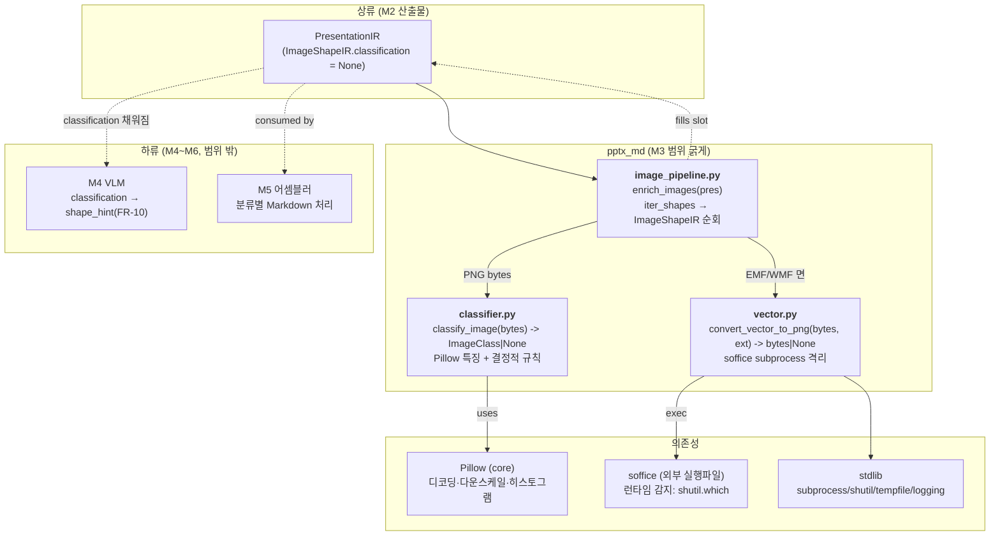
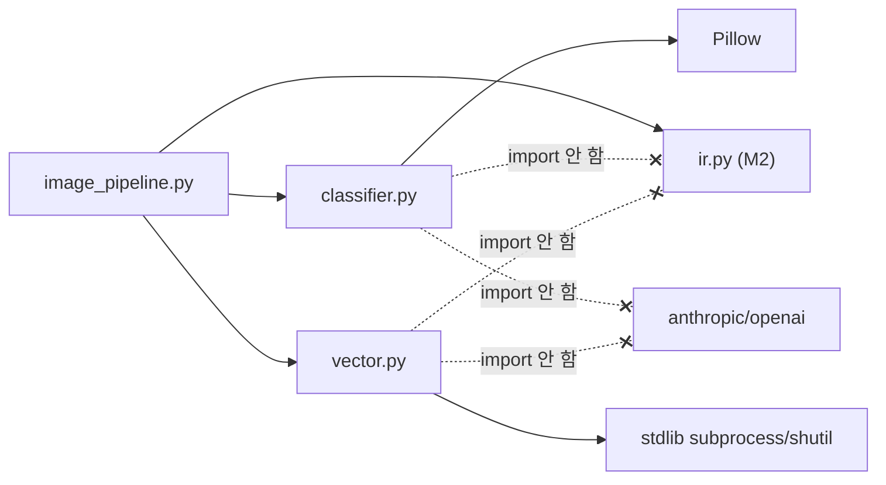
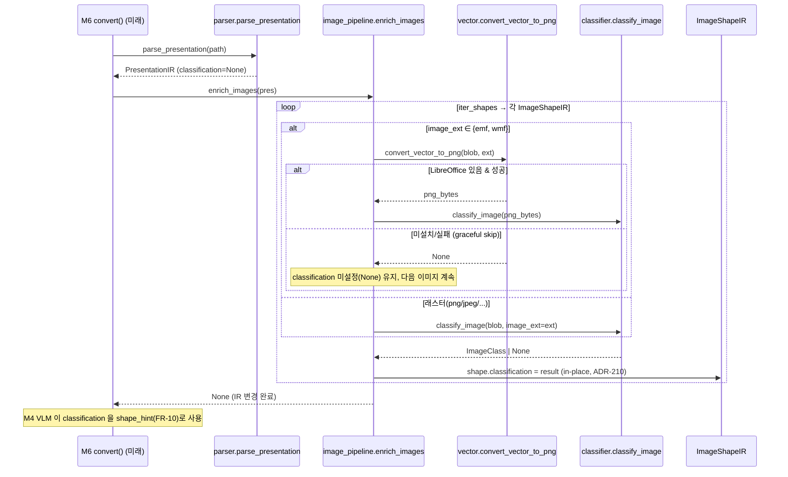

# ARCH-M3 — 이미지 분류기 & LibreOffice 벡터 변환

> 범위: M3 (FR-06 rule-based 이미지 분류, FR-07 LibreOffice EMF/WMF→PNG 변환 optional)
> 전제: `docs/00-charter/project-profile.md`, `docs/10-requirements/REQ-core.md`, `docs/20-design/ARCH-M2.md`
> 스택 스킬: `.claude/skills/stack-python-packaging`
> 선행 ADR: ARCH-M2 ADR-201~207 (본 문서는 ADR-208 부터 연속)
> 작성: architect / 2026-06-28
> 상태: 설계 초안 (reviewer 리뷰 / 사람 승인 전 — 아키텍처 게이트 대상)

---

## 0. 개요 — M3 목표와 M2 연결점

M2 는 PPTX 를 `PresentationIR` 트리로 파싱하고, `ImageShapeIR` 에 **확장 슬롯**(`classification: ImageClass | None`, `description: str | None`)을 v1=`None` 으로 예약해 두었다(ADR-205). M3 는 그 **첫 번째 소비자**다.

M3 의 두 책임:

1. **FR-06 이미지 분류 (Must)** — `ImageShapeIR.image_bytes` 를 Pillow 휴리스틱으로 분석해 `ImageClass`(TEXT/DIAGRAM/PHOTO/LOGO) 4종 중 하나로 분류하고, `classification` 슬롯을 채운다. 분류 불가 시 `None`(예외 전파 금지 — ADR-204 계승).
2. **FR-07 LibreOffice 변환 (Should)** — EMF/WMF 처럼 Pillow 가 못 다루는 벡터 이미지 blob 을 LibreOffice subprocess 로 PNG 로 변환한다. LibreOffice 부재 시 graceful skip(런타임 감지 — `shutil.which`).

### 0.1 M2 와의 직접 연결점

| M2 산출물 | M3 사용 방식 |
|-----------|--------------|
| `ImageShapeIR.image_bytes` (bytes) | 분류기·변환기의 **유일한 입력**. 디코딩이 M2 에서 지연되었으므로(ARCH-M2 §5.5) M3 가 Pillow 디코딩을 처음 수행한다. |
| `ImageShapeIR.image_ext` / `.image_format` | EMF/WMF 판별 → FR-07 변환 경로 분기. |
| `ImageShapeIR.classification` 슬롯 (ADR-205) | FR-06 결과 저장 대상. **IR 스키마 변경 없음** — 슬롯이 이미 존재. |
| `ImageClass` StrEnum (M2 정의) | 분류 결과 타입. M3 는 enum 정의를 변경하지 않고 **값을 산출**만 한다. |
| `iter_shapes()` (ADR-203) | 그룹 트리를 평탄화해 `ImageShapeIR` 만 골라 분류·변환 일괄 적용. |
| `PptxMdError` (errors.py) | M3 전용 예외가 필요하면 이 베이스를 상속(§4.3). |
| `ADR-002` / `NFR-08` | 분류기·변환기 모듈에 VLM SDK import 0. LibreOffice 는 subprocess(런타임)만, import 아님. |

> **결정적 비-침습 원칙**: M3 는 M2 의 `ir.py`·`parser.py` 를 수정하지 않는다. M3 는 신규 모듈로만 구성되며 IR 슬롯을 채우는 **후처리(post-processing) 패스**다. 이로써 M2 회귀 위험 0, M3 단위 테스트가 IR 합성만으로 가능(python-pptx 불요).

---

## 1. 아키텍처에 영향을 주는 요구사항 추출

> FR-06/07 은 REQ §4 기준 "차기 정제 대상" 이었으나, 디스패치(#21/#22)가 핵심 AC 를 확정했다. 본 설계는 그 AC + 프로파일 + ARCH-M2 제약에서 설계 영향을 도출한다.

| 출처 | 항목 | 설계 영향 |
|------|------|-----------|
| FR-06 #21 | Pillow 휴리스틱 TEXT/DIAGRAM/PHOTO/LOGO 4종 | `classifier.py`: `classify_image(image_bytes) -> ImageClass \| None` 순수 함수 + 특징 추출(`_features`)·규칙(`_rules`) 분리 |
| FR-06 #21 | 분류 불가 = `None`, 예외 전파 금지 | 모든 분류 실패(디코딩 오류·미지원 포맷·규칙 미해당)는 `None` 반환. try/except 로 감싸 raise 0(ADR-204 계승 → ADR-208 명문화) |
| FR-06 #21 | `ImageShapeIR.classification` 슬롯에 저장, **IR 스키마 변경 없음** | M3 는 ir.py 미수정. 채움 정책(in-place vs 신규)은 ADR-210 에서 확정 |
| FR-06 #21 | **결정적**(동일 입력 → 동일 출력) | 난수·시각·외부 상태·딕트 순서 의존 금지. 임계값은 모듈 상수로 고정(§3.4, ADR-208) |
| FR-06 #21 | mypy strict 통과 | Pillow 경계에서 타입 좁히기, 특징은 명시 dataclass(`_ImageFeatures`)로 고정(§5.1) |
| FR-07 #22 | EMF/WMF blob → PNG (LibreOffice subprocess) | `vector.py`: `convert_vector_to_png(image_bytes, ext) -> bytes \| None`, subprocess 격리 |
| FR-07 #22 | 런타임 감지 `shutil.which("soffice")`, **조건부 import 금지** | LibreOffice 는 import 대상이 아니라 외부 실행 파일. `vector.py` 는 항상 import 가능, 부재는 함수가 `None` 반환(ADR-209) |
| FR-07 #22 | LibreOffice 부재 시 graceful skip, 나머지 변환 계속 | 변환기는 도형 단위로 시도, 실패/부재 시 원본 유지 + WARNING 메타 로그. 일괄 처리는 도형 단위 격리(§3.3) |
| FR-07 #22 | 변환 모듈에 VLM SDK import 0 | `classifier.py`·`vector.py` 모두 anthropic/openai import 금지(NFR-08, ADR-002 계승) |
| NFR-08 | core 설치(VLM·LibreOffice 미설치)에서 import·동작 | 두 모듈 모두 core 의존성(Pillow)+stdlib(subprocess/shutil/tempfile)만. import-time 부작용 0 |
| NFR-01 | 20슬라이드 p95 < 5초 (VLM 제외, ubuntu 2-core) | 분류는 다운스케일 후 분석(§3.4), LibreOffice 는 무거우므로 **EMF/WMF 한정** + 도형당 1회. M3 강제 게이트 아님(M6)이나 다운스케일·thumbnail 로 비용 통제 |
| NFR-02 | 신규 코드 라인 커버리지 ≥ 75% | 합성 PNG 픽스처(Pillow 로 결정적 생성)로 4종 분기 커버. LibreOffice 의존 테스트는 skipif 로 커버리지 산정 안정화(§6) |
| NFR-03 | mypy strict exit 0 | §5.1 |
| NFR-04 | ruff + black exit 0 | M1 설정 그대로. line-length 88 준수 |
| NFR-06 | 마스킹 활성 시 로그에 원본 텍스트 0건 | M3 는 이미지 바이트만 다룸. 로그에 blob·base64·파일 내용 미출력, 메타(크기·포맷·분류결과)만(§5.6) |

> 통합 지점: M3 은 **외부 프로세스**(LibreOffice `soffice`)와 통합한다 — M2 에 없던 신규 통합. 이는 프로파일이 명시적으로 허용한 optional 경로(헌장 §M3 "LibreOffice optional", NFR-08)다. DB·메시징·SaaS 통합 없음 → ERD 불필요. §3 에서 모듈/흐름 다이어그램으로 대체.

---

## 2. 모듈 분해 & 컴포넌트 구조

### 2.1 신규 파일 목록 (`src/pptx_md/` 하위)

| 모듈 | 경로 | 책임 | FR | M3 범위 상태 |
|------|------|------|----|--------------|
| 이미지 분류기 | `src/pptx_md/classifier.py` | `classify_image(bytes) -> ImageClass \| None`, Pillow 특징 추출 + 결정적 규칙 | FR-06 | 신규 |
| 벡터 변환기 | `src/pptx_md/vector.py` | `convert_vector_to_png(bytes, ext) -> bytes \| None`, LibreOffice subprocess 격리, 런타임 감지 | FR-07 | 신규 |
| 이미지 후처리 오케스트레이터 | `src/pptx_md/image_pipeline.py` | `enrich_images(PresentationIR) -> None`(또는 신규 반환 — ADR-210), `iter_shapes` 로 ImageShapeIR 순회 → (변환?)→ 분류 → 슬롯 채움 | FR-06+07 결합 | 신규 |
| 패키지 진입점 | `src/pptx_md/__init__.py` | (변경 없음) M3 모듈은 내부 모듈 — 미노출(M6/FR-16 게이트) | — | 유지 |
| 테스트 | `tests/test_classifier.py` / `tests/test_vector.py` / `tests/test_image_pipeline.py` | §6 전략 | — | 신규 |
| 테스트 픽스처 | `tests/conftest.py` | 합성 PNG 생성 픽스처 추가(§6.1) | — | 확장 |

> **모듈 3분할 근거**: 분류(순수·CPU)·변환(외부 프로세스·I/O)·오케스트레이션(IR 순회·정책)을 분리하면 (a) 분류기는 LibreOffice 없이 단위 테스트 가능, (b) 변환기는 skipif 테스트로 격리, (c) 오케스트레이터만 IR 을 알고 두 하위 모듈은 IR 비의존(bytes 입출력) → 결합 최소화. 단일 파일(`images.py`)로 합치면 LibreOffice subprocess 테스트가 분류 테스트 커버리지를 오염시킨다.

### 2.2 컨텍스트 / 컴포넌트 다이어그램



### 2.3 의존 방향 (단방향 — 순환 금지)



**핵심 규칙**:
- `classifier.py` / `vector.py` 는 **`ir.py` 를 import 하지 않는다**. 입출력은 `bytes`(+`ImageClass` enum은 classifier 만 import). IR 결합은 오케스트레이터 단독 책임 → 두 하위 모듈을 IR 없이 테스트 가능(ARCH-M2 ADR-206 의 decoupling 철학 계승).
- 의존 방향 `image_pipeline → {classifier, vector, ir}` 단방향. `classifier`·`vector` 간 상호 의존 0.
- `classifier.py` 는 `ImageClass` 를 `ir.py` 에서 import 한다(반환 타입). 이는 enum 정의 참조이며 IR 자료구조 결합이 아니다 — 허용.

### 2.4 컴포넌트 책임 표

| 모듈 | import 허용 | import 금지 | 부작용 |
|------|------------|------------|--------|
| `classifier.py` | Pillow, `pptx_md.ir.ImageClass`, stdlib(io/logging) | python-pptx, anthropic, openai, subprocess | 없음(순수 함수) |
| `vector.py` | stdlib(subprocess/shutil/tempfile/logging) | Pillow 불필요·python-pptx·VLM·ir | subprocess 실행, 임시파일 생성·삭제 |
| `image_pipeline.py` | `pptx_md.ir`, `pptx_md.classifier`, `pptx_md.vector`, logging | anthropic, openai, python-pptx(불필요) | IR 슬롯 변경(ADR-210) |

---

## 3. 공개 인터페이스 & 처리 흐름

### 3.1 `classifier.py` — 공개 인터페이스

```python
def classify_image(image_bytes: bytes, *, image_ext: str = "") -> ImageClass | None:
    """Classify raster image bytes into one of 4 ImageClass values (FR-06).

    Deterministic: same bytes -> same result (ADR-208). Never raises;
    any failure (decode error, unsupported format, no rule match) -> None.
    """
```

| 항목 | 내용 |
|------|------|
| 입력 | `image_bytes`: 래스터 이미지 바이트(PNG/JPEG/GIF/BMP 등 Pillow 디코딩 가능). `image_ext`: 힌트(선택, 진단·빠른 거부용) |
| 출력 | `ImageClass`(TEXT/DIAGRAM/PHOTO/LOGO) 또는 `None`(분류 불가) |
| 예외 | **없음**(ADR-208 — 모든 실패는 None). EMF/WMF 등 Pillow 미디코딩 → None |
| 결정성 | 난수·시각 미사용. 임계값은 모듈 상수(§3.4). 동일 바이트 → 동일 결과 |
| 부작용 | 없음(순수 함수, 스레드 안전 → M5 Map 병렬 안전) |

내부 보조(비공개, 시그니처 고정 권고):

```python
@dataclass(frozen=True)
class _ImageFeatures:
    width: int
    height: int
    aspect_ratio: float        # width / height
    n_unique_colors: int       # 다운스케일 후 고유색 수
    color_fraction: float      # 비-무채색 픽셀 비율 (0..1)
    edge_density: float        # 에지(고대비 경계) 픽셀 비율 (0..1)
    bg_fraction: float         # 최빈 배경색이 차지하는 비율 (0..1)
    has_alpha: bool            # 투명 채널 존재

def _extract_features(image_bytes: bytes) -> _ImageFeatures | None: ...
def _classify_features(f: _ImageFeatures) -> ImageClass | None: ...
```

### 3.2 `vector.py` — 공개 인터페이스

```python
VECTOR_EXTS: frozenset[str] = frozenset({"emf", "wmf"})

def libreoffice_available() -> bool:
    """True iff a LibreOffice 'soffice' executable is on PATH (FR-07).

    Uses shutil.which only — no import of LibreOffice, no subprocess spawn.
    """

def convert_vector_to_png(image_bytes: bytes, image_ext: str) -> bytes | None:
    """Convert EMF/WMF bytes to PNG bytes via LibreOffice (FR-07).

    Returns PNG bytes on success, or None if:
      - ext not in VECTOR_EXTS, or
      - LibreOffice not installed (graceful skip), or
      - subprocess fails / times out.
    Never raises (ADR-209).
    """
```

| 항목 | 내용 |
|------|------|
| 입력 | `image_bytes`: EMF/WMF blob. `image_ext`: `"emf"`/`"wmf"`(소문자, 점 없음 — M2 정규화 산출) |
| 출력 | PNG `bytes` 또는 `None`(미설치/미지원/실패 모두 None) |
| 예외 | **없음**(ADR-209). subprocess 타임아웃·비정상 종료 → None + WARNING |
| 감지 | `shutil.which("soffice")` (또는 `"soffice.bin"`/`"libreoffice"` 후보). import-time 호출 금지 — 함수 호출 시점 |
| 부작용 | `tempfile.TemporaryDirectory` 에 입력 blob 기록 → soffice headless 변환 → PNG 읽기 → 임시 디렉터리 자동 정리 |

> **조건부 import 금지 준수**: 모듈 최상단에 `import subprocess`, `import shutil` 만 둔다. LibreOffice 는 Python 패키지가 아니므로 import 대상이 아니다. 따라서 `vector.py` 는 LibreOffice 부재 환경에서도 **항상 import 성공**한다(NFR-08, FR-07 AC).

### 3.3 `image_pipeline.py` — 공개 인터페이스

```python
def enrich_images(presentation: PresentationIR) -> None:
    """Fill ImageShapeIR.classification for every image in the IR (FR-06+07).

    Mutates the IR in place (ADR-210). For each ImageShapeIR found via
    iter_shapes:
      1. If image_ext is EMF/WMF -> try vector.convert_vector_to_png;
         on success classify the PNG, on skip/failure leave classification None.
      2. Otherwise classify image_bytes directly.
    Per-image isolation: one image's failure never affects others (ADR-204).
    """
```

| 항목 | 내용 |
|------|------|
| 입력 | `PresentationIR`(M2 파서 산출) |
| 출력 | `None` — in-place 변경(ADR-210) |
| 동작 | 모든 슬라이드 → `iter_shapes()` → `ImageShapeIR` 필터 → 변환(필요시)→ 분류 → `classification` 슬롯 채움 |
| 격리 | 도형 단위 try/except. 한 이미지 실패 시 해당 `classification` 만 `None` 유지, 나머지 계속(ADR-204) |
| 결정성 | `iter_shapes` 의 결정적 순회 + `classify_image` 결정성 → 전체 결정적 |

> **EMF/WMF 변환 후 처리 정책**: FR-07 변환 산출 PNG bytes 는 분류 입력으로만 사용한다(분류를 위해). v1 에서 **변환 PNG 를 IR 에 영구 반영할지**는 M4/M5 가 VLM·어셈블러 입력으로 원본 EMF 를 쓸 수 없다는 점에서 의미가 있으나, IR 스키마 변경(`image_bytes` 교체 또는 `converted_png` 슬롯 추가)을 동반한다. M3 v1 은 **분류에만 사용하고 IR 의 image_bytes 는 원본 유지**한다(§7 부채). 변환 PNG 의 IR 영구 반영은 M4 설계에서 슬롯 추가로 확정(하위호환 — dataclass 필드 추가).

### 3.4 분류 휴리스틱 — 결정적 규칙 (FR-06 핵심)

> 임계값은 모듈 상수로 고정 → 결정성 보장(ADR-208). 값은 v1 초기값이며 M3 개발 중 합성·실제 픽스처로 보정 가능(규칙 구조는 고정, 상수만 튜닝).

**특징 추출 파이프라인** (`_extract_features`):
1. `Image.open(io.BytesIO(bytes))` → 디코딩 실패 시 `None`(→ classify 가 None 반환).
2. RGB(A) 변환 후 **고정 한 변 ≤ 256px 다운스케일**(`thumbnail`, `LANCZOS`) — NFR-01 비용 통제 + 큰 이미지/작은 이미지 간 특징 정규화(결정적).
3. 특징 계산: 종횡비, 다운스케일 후 고유색 수, 무채색 외 색상 비율, 에지 밀도(인접 픽셀 밝기 차 임계 초과 비율), 최빈 배경색 점유율, 알파 존재.

**분류 규칙** (`_classify_features`, 우선순위 순 — 첫 매치 채택, 결정적):

| 순위 | 클래스 | 규칙(초기 임계값) | 직관 |
|------|--------|-------------------|------|
| 1 | TEXT | `edge_density 高(≥ TEXT_EDGE_MIN)` AND `n_unique_colors 低(≤ TEXT_COLORS_MAX)` AND `bg_fraction 高(≥ TEXT_BG_MIN)` | 흰 배경 + 검은 글자 = 고에지·저색수·고배경 점유(텍스트 스크린샷) |
| 2 | DIAGRAM | `n_unique_colors 中低` AND `bg_fraction 高` AND `edge_density 中` AND `color_fraction 中` | 단색 면 + 선/도형(플랫 다이어그램·차트 이미지) |
| 3 | LOGO | `(width·height 小 OR aspect_ratio 극단)` AND `n_unique_colors 低` AND (`has_alpha` OR `bg_fraction 高`) | 작고 단순한 그래픽, 투명 배경 빈번 |
| 4 | PHOTO | `n_unique_colors 高(≥ PHOTO_COLORS_MIN)` AND `color_fraction 高` AND `edge_density 中저` | 연속 톤·풍부한 색·부드러운 그라데이션 |
| — | None | 위 어디에도 명확히 안 맞음 | 분류 불가(ADR-208) → VLM/M4 가 판단 여지 |

> 4종 규칙은 **상호배타·우선순위 결정**이며 동일 입력에 항상 동일 분기. 임계값 상수(`TEXT_EDGE_MIN` 등)는 `classifier.py` 모듈 상단에 명명 상수로 고정 → 매직넘버 회피 + 결정성 + 튜닝 추적성.

### 3.5 처리 흐름 — 기존 파이프라인 연결



> M3 는 `parse_presentation` 직후, M4 VLM 호출 직전의 **후처리 패스**다. M6 `convert()`(미래)가 두 단계를 조립한다. M3 는 자신의 진입점(`enrich_images`)만 제공하고 조립은 M6 책임 — M2 의 "내부 모듈 미노출" 규약 계승(`__init__.py` 변경 없음).

---

## 4. 횡단 관심사

### 4.1 mypy strict 전략 (NFR-03) — §5.1 로 통합

(아래 §5.1 참조)

### 4.2 예외 처리 전략 (격리 + 부분 실패 허용)

ARCH-M2 ADR-204 의 "한 도형 실패가 전체 변환을 막지 않는다" 를 이미지 단위로 계승·강화한다.

| 레벨 | 정책 |
|------|------|
| 분류 (`classify_image`) | 절대 raise 안 함. 디코딩·규칙 실패 모두 `None`(ADR-208) |
| 변환 (`convert_vector_to_png`) | 절대 raise 안 함. 미설치·subprocess 실패·타임아웃 모두 `None`(ADR-209) |
| 오케스트레이션 (`enrich_images`) | 도형 단위 try/except. 예상외 예외도 삼키고 해당 `classification=None` 유지, WARNING 로그, 다음 이미지 계속 |

> M3 는 **신규 예외 클래스를 도입하지 않는다**. 분류/변환 실패는 "오류"가 아니라 "결과 없음(None)"으로 모델링하는 것이 FR-06/07 의 graceful 의미와 일치하기 때문이다. `PptxMdError` 계층(M2)은 file-level fail-fast 전용으로 유지.

### 4.3 LibreOffice subprocess 안전성 (FR-07)

| 관심사 | 설계 |
|--------|------|
| 감지 | `shutil.which` 로 `soffice`/`soffice.bin`/`libreoffice` 후보 탐색. 함수 호출 시점에만(import-time 0) |
| 실행 | `subprocess.run([...], capture_output=True, timeout=VECTOR_TIMEOUT_S, check=False)` — `--headless --convert-to png --outdir <tmp> <input>` |
| 타임아웃 | 고정 상수(예 30s). 초과 시 `TimeoutExpired` 포착 → None |
| 격리 | `tempfile.TemporaryDirectory` (with 블록 자동 정리). 입력 blob 을 `<tmp>/in.<ext>` 로 쓰고 산출 `<tmp>/in.png` 읽음 |
| 보안 | shell=False(리스트 인자), 사용자 입력은 임시 파일 경로만(주입 표면 없음). 환경변수 미주입 |
| 멱등/결정 | soffice 변환은 입력 동일 시 산출 동일(렌더러 결정적). 임시 경로는 결과에 미반영 |

### 4.4 로깅·감사 (NFR-06)

- 로거: `logging.getLogger("pptx_md.classifier")`, `"pptx_md.vector")`, `"pptx_md.image_pipeline")`.
- **이미지 바이트·base64·blob·파일 내용·alt_text 를 로그에 출력 금지**. 로그는 메타만: 이미지 크기, 포맷/ext, 분류 결과 enum, subprocess exit code, 예외 타입.
- LibreOffice subprocess 의 stderr 는 로그에 직접 흘리지 않음(경로·내용 누출 방지) — exit code·타입만 요약.
- 시크릿 미취급(NFR-05) — M3 는 API key 와 무관.

### 4.5 NFR-08 의존성 격리 검증 포인트

- `classifier.py`/`vector.py`/`image_pipeline.py` 에 `import anthropic`/`import openai` 0건 — reviewer `grep -rE "anthropic|openai" src/pptx_md/{classifier,vector,image_pipeline}.py` → 0 매치(W 들의 AC).
- `vector.py` 는 LibreOffice 미설치 환경에서 `import pptx_md.vector` 성공 + `libreoffice_available()` → `False` + `convert_vector_to_png(...)` → `None`(테스트 게이트).
- Pillow 는 core 의존성(이미 pyproject 선언) — 분류기 사용은 NFR-08 위반 아님.

---

## 5. 기술 선택지 비교 (ADR 후보)

### 5.1 mypy strict — Pillow 경계 타입 좁히기

Pillow(`PIL`)는 부분 타입 스텁만 제공하며 M1 `ignore_missing_imports=true` 로 `Any` 가 유입될 수 있다(ARCH-M2 §5.1 동일 문제). 전략:
- `Image.open` 반환을 즉시 `Image.Image` 로 다루되, 픽셀 추출은 `list(img.getdata())` 후 명시 타입(`list[tuple[int, ...]]`)으로 좁힘.
- 특징은 `frozen=True` dataclass `_ImageFeatures`(전 필드 타입 명시)로 고정 → 규칙 함수가 `Any` 를 만지지 않음. Pillow 의 `Any` 는 `_extract_features` 경계 안에 가둔다(파서가 python-pptx 방벽이었던 것과 동형).
- `classify_image` 반환은 `ImageClass | None` 로 strict 고정. 4종 enum 은 M2 정의 그대로.

### 5.2 분류 알고리즘: 순수 휴리스틱 vs 경량 ML vs 외부 lib

| 후보 | 장점 | 단점 |
|------|------|------|
| A. Pillow 픽셀 통계 휴리스틱(룰) | 의존성 0 추가(Pillow 는 core), 결정적, 설명가능, mypy 친화, NFR-08 자명 | 정확도 한계(경계 케이스 None 다수 가능) |
| B. 경량 ML(scikit-image/onnx) | 정확도 향상 여지 | **프로파일에 없는 의존성 추가**(NEEDS_DECISION 대상), 모델 파일 동봉·결정성·크기 부담 |
| C. VLM 으로 분류 위임 | 정확도 최고 | FR-06 은 "rule-based" 명시, NFR-08(VLM 없이 동작) 위반, M4 책임과 중복 |

**권고: A(Pillow 휴리스틱)** — FR-06 이 "Pillow 휴리스틱" 을 명시하고, B 는 프로파일 제약(외부 라이브러리 임의 추가 금지) 위반, C 는 NFR-08·FR-06 정의 위반. 분류 불가는 `None` 으로 두어 M4 VLM 이 보강(FR-10 shape_hint 가 정확히 이 협업 구조). → ADR-208

### 5.3 LibreOffice 변환 방식: subprocess vs UNO API vs Python 바인딩

| 후보 | 장점 | 단점 |
|------|------|------|
| A. `soffice --headless --convert-to png` subprocess | 설치만 하면 동작, Python 의존성 0, 런타임 감지(shutil.which) 단순, 부재 시 graceful | 프로세스 기동 오버헤드, 임시파일 I/O |
| B. UNO(PyUNO) API | 인프로세스, 세밀 제어 | PyUNO import 필요 → 미설치 시 import 실패(NFR-08 위반·조건부 import 금지 위반) |
| C. `unoconv`/`libreoffice-python` 래퍼 패키지 | 편의 | **프로파일에 없는 의존성 추가**(NEEDS_DECISION), 여전히 LibreOffice 필요 |

**권고: A(subprocess)** — FR-07 AC 가 `shutil.which("soffice")` + "조건부 import 금지" 를 명시 → B/C 는 정의상 배제(import 가 필요해짐). subprocess 는 LibreOffice 가 Python 패키지가 아니어도 항상 import 가능한 유일한 경로. → ADR-209

### 5.4 IR 슬롯 채움: in-place vs 신규 인스턴스 (확정 대상)

| 후보 | 장점 | 단점 |
|------|------|------|
| A. **in-place 변경** (`enrich_images(pres) -> None`, `shape.classification = ...`) | dataclass 는 가변(frozen 아님) → 자연스러움, 트리 깊은 복사 불필요(성능·NFR-01), 호출부 단순, ADR-205 슬롯이 정확히 이 용도로 예약됨 | 입력 IR 이 변경됨(불변 기대 시 의외) |
| B. 신규 인스턴스(불변 복사 후 채운 새 트리 반환) | 입력 불변(함수형), 재현·테스트 격리 | ShapeIR 다형 트리 깊은 복사 보일러플레이트, 그룹 재귀 복사 비용, dataclass 가 frozen 아니라 이점 희석 |
| C. 슬롯 채운 ImageShapeIR 만 교체(부분 신규) | 일부 불변성 | SlideIR.shapes 리스트 내 위치 추적·치환 복잡, 그룹 중첩 시 부모 children 갱신 번거로움 |

**권고: A(in-place)** — ARCH-M2 ADR-205 가 `classification`/`description` 을 **"M3 가 채울 가변 슬롯"** 으로 명시 예약했고, dataclass 를 frozen 으로 두지 않은 것이 바로 in-place 채움 의도였다(ARCH-M2 §3.4: "in-place 갱신 또는 신규 인스턴스 생성 중 하나로 채우며, 그 정책은 M3 설계에서 확정"). 트리 깊은 복사를 피해 NFR-01 에 유리. → **ADR-210 으로 in-place 확정**.

---

## 6. 아키텍처 결정 기록 (ADR-208 ~ ADR-211)

### ADR-208 이미지 분류 = Pillow 픽셀 휴리스틱(결정적 규칙), 분류 불가 = None
**배경**: FR-06 은 TEXT/DIAGRAM/PHOTO/LOGO 4종을 "Pillow 휴리스틱" 으로 분류하라 요구. 결정적·예외 비전파·mypy strict 가 AC. ML/VLM 은 프로파일 제약(외부 의존성 금지)·NFR-08·FR-06 정의와 충돌.
**결정**: Pillow 로 디코딩→256px 다운스케일→픽셀 통계 특징(`_ImageFeatures`) 추출→우선순위 결정 규칙(§3.4)으로 4종 분류. 임계값은 모듈 명명 상수로 고정(결정성). 디코딩 실패·규칙 미해당·미지원 포맷은 모두 `None`. 함수는 raise 하지 않음.
**근거**: 의존성 0 추가(Pillow=core), 동일 입력→동일 출력(상수·무난수), 설명가능·튜닝 추적성, NFR-08 자명 충족. 분류 불가를 None 으로 두면 M4 VLM 이 보강(FR-10 협업).
**대안과 기각 사유**: 경량 ML(프로파일에 없는 의존성→NEEDS_DECISION 회피), VLM 위임(NFR-08·FR-06 "rule-based" 위반).
**영향**: `classifier.py` 는 IR·VLM 비의존(bytes→enum). 특징 추출이 Pillow Any 방벽(§5.1). M4 가 None 케이스를 VLM 으로 처리(FR-10).

### ADR-209 LibreOffice 변환 = soffice subprocess + 런타임 감지(shutil.which), 부재 시 graceful None
**배경**: FR-07 은 EMF/WMF→PNG 변환을 LibreOffice 로, **`shutil.which("soffice")` 런타임 감지** + **조건부 import 금지** + 부재 시 graceful skip 으로 요구. LibreOffice 는 Python 패키지가 아님.
**결정**: `vector.py` 는 stdlib(subprocess/shutil/tempfile)만 최상단 import → **항상 import 가능**. `libreoffice_available()` 가 호출 시점에 `shutil.which` 로 감지. `convert_vector_to_png` 은 미지원 ext·미설치·subprocess 실패·타임아웃을 모두 `None` 으로 반환(raise 0). 변환은 `--headless --convert-to png`, 입력은 `tempfile.TemporaryDirectory` 격리, shell=False, 타임아웃 상수.
**근거**: subprocess 만이 LibreOffice 미설치에서도 모듈 import 를 보장(UNO/래퍼는 import 필요→NFR-08·"조건부 import 금지" 위반). graceful None 으로 나머지 이미지 변환 계속(부분 실패 허용, ADR-204 계승).
**대안과 기각 사유**: PyUNO(import 필요·미설치 시 ImportError), unoconv 등 래퍼(프로파일에 없는 의존성·여전히 LibreOffice 필요), 조건부 import(AC 명시 금지).
**영향**: `vector.py` 가 유일한 외부 프로세스 통합 지점. EMF/WMF 한정으로 subprocess 비용을 NFR-01 영향 최소화. LibreOffice 의존 테스트는 skipif(§6).

### ADR-210 IR 슬롯 채움 = in-place 변경 (enrich_images(pres) -> None)
**배경**: ARCH-M2 ADR-205 가 `classification`/`description` 을 "M3 가 채울 가변 슬롯" 으로 예약하고 정책 확정을 M3 로 위임. dataclass 는 frozen 아님(가변).
**결정**: M3 오케스트레이터는 `enrich_images(presentation: PresentationIR) -> None` 로 IR 을 **in-place 변경**한다. `iter_shapes` 로 ImageShapeIR 을 찾아 `shape.classification` 슬롯에 직접 대입. 신규 트리 생성·깊은 복사 없음.
**근거**: (a) ADR-205 슬롯이 정확히 이 용도(가변)로 설계됨, (b) ShapeIR 다형 트리·그룹 재귀의 깊은 복사 보일러플레이트·비용 회피(NFR-01), (c) frozen 아닌 dataclass 에서 신규 인스턴스 반환은 이점 희석, (d) 호출부(M6 convert)가 단순.
**대안과 기각 사유**: 신규 인스턴스 반환(트리 깊은 복사 비용·보일러플레이트, frozen 아니라 불변성 이점 약함), 부분 교체(SlideIR.shapes/그룹 children 위치 추적 복잡).
**영향**: `enrich_images` 는 부작용 함수(반환 None) — docstring 에 "mutates in place" 명시. 입력 IR 의 불변 기대가 필요한 소비자는 호출 전 복사 책임(현 v1 시나리오엔 없음). M2 ir.py 미수정(스키마 변경 0).

### ADR-211 분류·변환 모듈은 IR 비의존(bytes 입출력), 오케스트레이터만 IR 결합
**배경**: ARCH-M2 ADR-206(ir.py 는 python-pptx 미import)의 decoupling 철학. M3 하위 모듈이 IR 에 결합되면 단위 테스트가 IR 트리 구성을 강제해 비용↑.
**결정**: `classifier.py`·`vector.py` 는 `bytes`(+classifier 는 `ImageClass` enum) 만 입출력하고 **IR 자료구조(`PresentationIR`/`ImageShapeIR`)를 import 하지 않는다**. IR 순회·슬롯 채움은 `image_pipeline.py` 단독. classifier 의 `ImageClass` import 는 enum 정의 참조(결과 타입)일 뿐 자료구조 결합 아님.
**근거**: (a) 분류기·변환기를 IR 없이 bytes 만으로 단위 테스트(픽스처 단순), (b) 향후 재사용성(다른 입력원도 bytes 만 주면 됨), (c) 의존 방향 단방향 고정(pipeline→{classifier,vector}), (d) M2 ADR-206 일관성.
**대안과 기각 사유**: 분류기가 ImageShapeIR 을 직접 받아 채움(IR 결합·테스트 부담·재사용성 저하).
**영향**: 세 모듈 책임 분리 명확(§2.4). pipeline 이 변환·분류·슬롯의 접착(glue) 책임 전담.

---

## 7. 테스트 전략

### 7.1 결정적 합성 픽스처 (FR-06)

- **Pillow 로 합성 이미지를 코드로 생성**(ADR-207 인메모리 철학 계승) → diff 가능·의도 명시·바이너리 repo 오염 최소.
- `conftest.py` 에 픽스처 추가:
  - `text_like_png`: 흰 배경 + 검은 가로선/글자블록(고에지·저색·고배경) → TEXT 기대.
  - `diagram_like_png`: 단색 면 + 사각형/선 도형(중색·고배경·중에지) → DIAGRAM 기대.
  - `photo_like_png`: 결정적 그라데이션/노이즈(seed 고정 난수 또는 수식 기반 — **seed 고정으로 결정성**) 풍부한 색 → PHOTO 기대.
  - `logo_like_png`: 작은 크기 + 투명 알파 + 단색(소수 색) → LOGO 기대.
  - `undecidable_png` 또는 `corrupt_bytes`: 디코딩 불가/모호 → `None` 기대.
- 각 픽스처는 **고정 입력 → 고정 출력**(결정성 회귀 테스트: 동일 바이트를 2회 분류해 동일 결과 assert).
- 커버리지: 4종 분기 + None 경로 + `_extract_features` 디코딩 실패 경로 → NFR-02 75% 라인 커버 목표.

> 합성 이미지가 실제 PPTX 이미지와 100% 같지 않을 수 있으나, v1 의 검증 목표는 **규칙 분기의 결정성·정확한 매핑**이지 실사 정확도가 아니다(실사 정확도는 M4 VLM 보강·M6 통합 테스트 영역, §8 부채).

### 7.2 LibreOffice 의존 테스트 skipif 전략 (FR-07)

```python
import shutil
import pytest

requires_libreoffice = pytest.mark.skipif(
    shutil.which("soffice") is None
    and shutil.which("libreoffice") is None,
    reason="LibreOffice (soffice) not installed",
)
```

| 테스트 종류 | 조건 | 비고 |
|-------------|------|------|
| `libreoffice_available()` 반환 일관성 | 항상 실행(skip 무관) | 설치 유무와 무관하게 bool 반환·예외 0 검증 |
| 미설치 graceful skip | 항상 실행 | `convert_vector_to_png(b"...", "emf")` 가 미설치 시 `None`(예외 0). 설치 시엔 이 케이스를 `monkeypatch` 로 `shutil.which`→None 강제해 graceful 경로 결정적 검증 |
| 실제 EMF→PNG 변환 | `@requires_libreoffice` | 설치된 CI/로컬에서만. 산출 bytes 가 PNG 시그니처(`\x89PNG`) 시작 검증 |
| 미지원 ext 거부 | 항상 실행 | `convert_vector_to_png(b"x", "png")` → `None`(VECTOR_EXTS 외) |
| import 가능성 | 항상 실행 | `import pptx_md.vector` 가 LibreOffice 부재에서도 성공(NFR-08) |

> CI(ubuntu-latest)는 LibreOffice 미설치가 기본 → `@requires_libreoffice` 테스트는 skip 되고 커버리지 산정에서 빠지지 않도록 graceful·미지원·import 경로를 **항상 실행 테스트**로 덮어 NFR-02 안정화. 실 변환 경로는 LibreOffice 설치 CI job(선택, M6에서 검토) 또는 로컬에서만 검증.

### 7.3 오케스트레이터 테스트 (image_pipeline)

- IR 합성(`PresentationIR` 직접 구성, python-pptx 불요 — ADR-211 의 이점)으로:
  - 래스터 이미지 → `classification` 채워짐.
  - EMF/WMF 이미지 + LibreOffice 미설치(monkeypatch) → `classification` None 유지, 예외 0.
  - 그룹 중첩 내 ImageShapeIR → `iter_shapes` 로 도달·채움 검증(ADR-203 재귀).
  - **in-place 검증**: 동일 IR 객체가 변경됨(ADR-210) — 반환 None, 입력 객체 슬롯 변화 assert.
  - 한 이미지 디코딩 실패가 다른 이미지 분류를 막지 않음(격리, ADR-204).

### 7.4 결정성·타입·스타일 게이트

- 결정성: 핵심 분류 테스트에 "2회 호출 동일 결과" assert 포함(FR-06 AC).
- mypy: `mypy src/` exit 0(신규 3모듈 strict 통과 — W 들의 AC).
- ruff/black: line-length 88, exit 0.
- VLM import 0: grep 게이트(§4.5).

---

## 8. WBS — 구현 이슈 분해

각 단위는 developer 가 반나절~하루 내 독립 수행 가능. 의존: W1(vector)·W2(classifier)는 IR 비의존이라 병행 가능, W3(pipeline)은 W1·W2 선행, W4(테스트)는 각 구현과 병행/직후.

| ID | 작업 | 대응 FR | 참조 설계 절 | AC 초안 | 의존 |
|----|------|---------|-------------|---------|------|
| W1 | `vector.py`: `libreoffice_available()` + `convert_vector_to_png()` + `VECTOR_EXTS` + subprocess 격리/타임아웃 | FR-07 | 3.2, 4.3, ADR-209 | (1) `import pptx_md.vector` 가 LibreOffice 부재에서도 성공(NFR-08); (2) `libreoffice_available()` 가 `shutil.which` 기반 bool, 예외 0; (3) 미설치/미지원 ext/subprocess 실패 → `None`(raise 0); (4) 설치 환경(skipif) EMF→PNG 산출이 PNG 시그니처; (5) 조건부 import 0(최상단 stdlib만), VLM import 0(grep); (6) `mypy src/` exit 0 | 없음 |
| W2 | `classifier.py`: `classify_image()` + `_ImageFeatures`/`_extract_features`/`_classify_features` + 임계 상수 | FR-06 | 3.1, 3.4, 5.1, ADR-208/211 | (1) `classify_image(bytes)` → `ImageClass \| None`, raise 0; (2) 4종 합성 픽스처가 기대 클래스로 분류; (3) 디코딩 불가/모호 → `None`; (4) 동일 입력 2회 → 동일 출력(결정성); (5) `ir.py` 외 IR 자료구조 import 0, VLM import 0(grep, ADR-211); (6) `mypy src/` exit 0(strict) | 없음 |
| W3 | `image_pipeline.py`: `enrich_images(pres)` in-place 채움 + iter_shapes 순회 + EMF/WMF→변환→분류 분기 + 도형 격리 | FR-06+07 | 3.3, 3.5, 4.2, ADR-210/211 | (1) `enrich_images(pres)` → None, 래스터 이미지 `classification` 채워짐; (2) in-place(동일 객체 변경, ADR-210); (3) EMF/WMF + LibreOffice 미설치(monkeypatch) → 해당 classification None 유지·예외 0; (4) 그룹 중첩 ImageShapeIR 도달(iter_shapes); (5) 한 이미지 실패가 타 이미지 분류 비차단(격리); (6) VLM import 0; (7) `mypy src/` exit 0 | W1, W2 |
| W4 | 테스트 스위트: `conftest.py` 합성 PNG 픽스처 + `test_classifier.py`/`test_vector.py`/`test_image_pipeline.py` + skipif 마커 | FR-06/07 검증 | 7.1~7.4, ADR-207 계승 | (1) 합성 픽스처 4종 + None 케이스로 분류 분기 커버; (2) vector graceful/미지원/import 경로 항상 실행 테스트 + 실변환 skipif; (3) pipeline in-place·격리·그룹 도달 테스트; (4) `pytest` exit 0; (5) 신규 3모듈 라인 커버리지 ≥ 75%(NFR-02, 측정); (6) 결정성 회귀 assert 포함 | W1, W2, W3 |

> 분할 권고: W1·W2 병행 가능(상호 비의존). W3 가 접착. PM 판단으로 FR 단위(#21=W2+W4 일부, #22=W1+W4 일부, 결합/오케스트레이션 별도 이슈)로 매핑하거나 W1~W4 순차 PR. **이슈 AC 는 planner 가 본 §8 초안 + 디스패치 #21/#22 AC 를 베이스로 확정**.

---

## 9. 요구사항 추적표

### 9.1 M3 활성 FR → 설계 요소

| FR | AC 영향 | 충족 설계 요소 |
|----|---------|---------------|
| FR-06 분류 (4종) | TEXT/DIAGRAM/PHOTO/LOGO Pillow 휴리스틱 | §3.1 `classify_image`, §3.4 특징·규칙, ADR-208, W2 |
| FR-06 (분류 불가 None) | 예외 전파 금지, None | §3.1, §4.2, ADR-208, W2 AC1/AC3 |
| FR-06 (슬롯 저장, 스키마 불변) | `ImageShapeIR.classification` 채움 | §3.3 `enrich_images`, ADR-210(in-place), ir.py 미수정, W3 |
| FR-06 (결정성) | 동일 입력→동일 출력 | §3.4 상수 고정, §7.4, ADR-208, W2 AC4 |
| FR-06 (mypy strict) | 타입 안전 | §5.1, ADR-208, W2 AC6 |
| FR-07 변환 | EMF/WMF→PNG (LibreOffice subprocess) | §3.2 `convert_vector_to_png`, §4.3, ADR-209, W1 |
| FR-07 (런타임 감지) | `shutil.which`, 조건부 import 금지 | §3.2 `libreoffice_available`, ADR-209, W1 AC1/AC2/AC5 |
| FR-07 (graceful skip) | 부재 시 skip·계속 | §3.3, §4.2, ADR-209, W1 AC3 / W3 AC3 |
| FR-07 (VLM import 0) | 변환 모듈 VLM 0건 | §4.5, ADR-211, W1 AC5 |

### 9.2 NFR 충족 1줄 근거 (M3 관점)

| NFR | 이 설계가 충족하는 방법 |
|-----|------------------------|
| NFR-01 변환 성능 | 분류는 256px 다운스케일 후 통계(§3.4), LibreOffice 는 EMF/WMF 한정·도형당 1회(§3.5). M3 강제 게이트 아님(M6) |
| NFR-02 커버리지 75% | 합성 PNG 4종+None 픽스처로 분류 분기, vector graceful/미지원/import 항상 실행 테스트, pipeline 격리·in-place 테스트(§7) |
| NFR-03 타입 안전성 | `_ImageFeatures` frozen dataclass + Pillow Any 방벽 + `ImageClass \| None`, `mypy src/` exit 0(§5.1, W1~W3 AC) |
| NFR-04 코드 스타일 | M1 ruff/black 설정 그대로, line-length 88(CI 게이트) |
| NFR-05 비밀정보 | M3 는 API key 미취급(VLM 비의존, §4.5) |
| NFR-06 로깅(PII) | 이미지 바이트·blob·alt_text 로그 미출력, 메타만(크기·포맷·결과·exit code)(§4.4) |
| NFR-07 런타임 호환 | `StrEnum`(M2)·`X \| None`·`frozenset`·`from __future__ import annotations` 등 3.11+ 문법 |
| NFR-08 의존성 격리 | classifier=Pillow+ir.ImageClass+stdlib, vector=stdlib only(LibreOffice 는 subprocess), VLM import 0, 부재 환경 import·동작(§4.5, ADR-209/211, W AC) |

### 9.3 M3 범위 밖 FR

FR-08~FR-19 는 비활성. M3 산출물이 후속을 막지 않음 보장:
- `classification` 슬롯이 채워져 M4 VLM 의 `shape_hint`(FR-10) 입력 준비 완료.
- 분류 불가 `None` 케이스를 M4 VLM 이 보강(FR-06↔FR-10 협업 구조).
- `classifier`/`vector` 가 IR·VLM 비의존(ADR-211)이라 M4/M5 재사용·테스트 용이.
- 변환 PNG 의 IR 영구 반영은 M4 가 슬롯 추가로 확장 가능(하위호환, §10 부채).

> M3 활성 FR(FR-06/07) 누락 0. NFR 8건 전부 매핑(M3 무관 항목은 적용 마일스톤 명시).

---

## 10. 기술 부채 / 제약 (v1 한계 & 향후 개선)

| 구분 | 내용 | 대응 |
|------|------|------|
| 부채 | 변환 PNG 를 IR 에 영구 반영 안 함(분류 입력으로만 사용, image_bytes 는 원본 EMF 유지) | M4 가 VLM 입력에 변환 PNG 필요 → `ImageShapeIR` 에 `converted_png` 슬롯 추가(dataclass 필드 추가=하위호환). M4 설계에서 확정 |
| 제약 | 휴리스틱 정확도 한계 — 경계 케이스가 `None` 다수 또는 오분류 가능 | v1 목표는 결정성·규칙 매핑(정확도는 M4 VLM 보강 + M6 통합 테스트로 측정·튜닝). 임계 상수는 픽스처 보정 가능 |
| 제약 | 임계값(TEXT_EDGE_MIN 등)은 합성 픽스처 기반 초기값 — 실사 분포와 차이 가능 | 규칙 구조 고정, 상수만 M3/M6 실험으로 튜닝(결정성 유지). M5 fallback·M4 hint 가 오분류 영향 완충 |
| 제약 | LibreOffice subprocess 기동 오버헤드(도형당 프로세스) | EMF/WMF 한정으로 발동 빈도 낮음. 다수 벡터 시 배치 변환(한 번에 여러 파일)은 v2 최적화(§NFR-01 게이트는 M6) |
| 리스크 | LibreOffice 버전/포맷에 따라 변환 산출 차이 | 변환 산출은 분류 입력으로만 → 분류 None 시 graceful. 실변환 테스트는 skipif 로 환경 의존 격리 |
| 리스크 | Pillow 가 일부 포맷(EMF/WMF) 미디코딩 | 의도된 분기 — 벡터는 FR-07 변환 경로, 변환 실패 시 None(graceful) |
| 부채 | 분류 신뢰도(confidence) 미노출 — enum 또는 None 만 | M4 가 hint 강도 조절 필요 시 슬롯 확장 여지(하위호환). v1 미요구 |

> 프로파일에 없는 인프라/라이브러리 도입 0 (Pillow=core 선언, LibreOffice=optional 외부 실행파일·프로파일/헌장 §M3 명시 허용, subprocess/shutil/tempfile=stdlib). 환경 제약(PyPI 퍼블릭·VLM·LibreOffice 미설치 동작)과 모순 0. **NEEDS_DECISION 사유 없음** — 모든 결정이 프로파일·헌장·디스패치(#21/#22) AC 내에서 닫힘.
