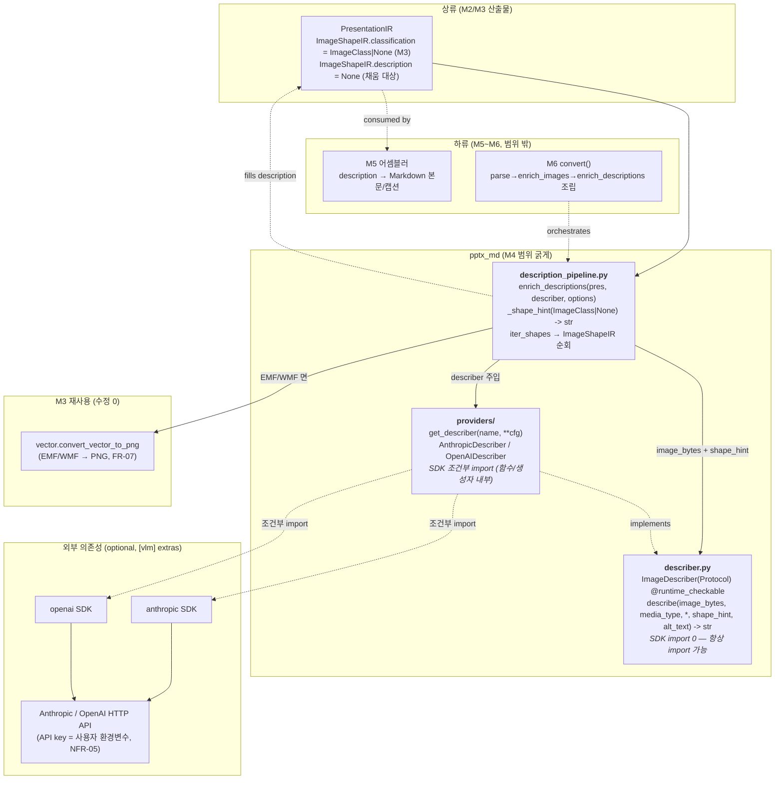
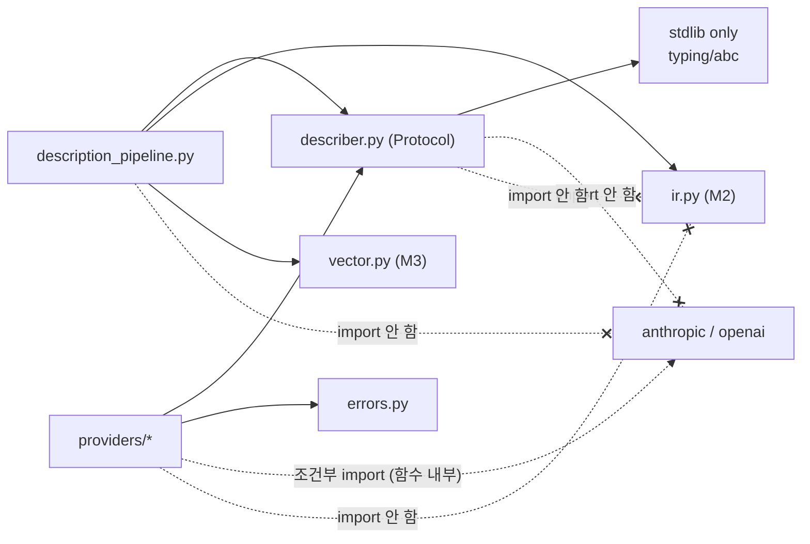
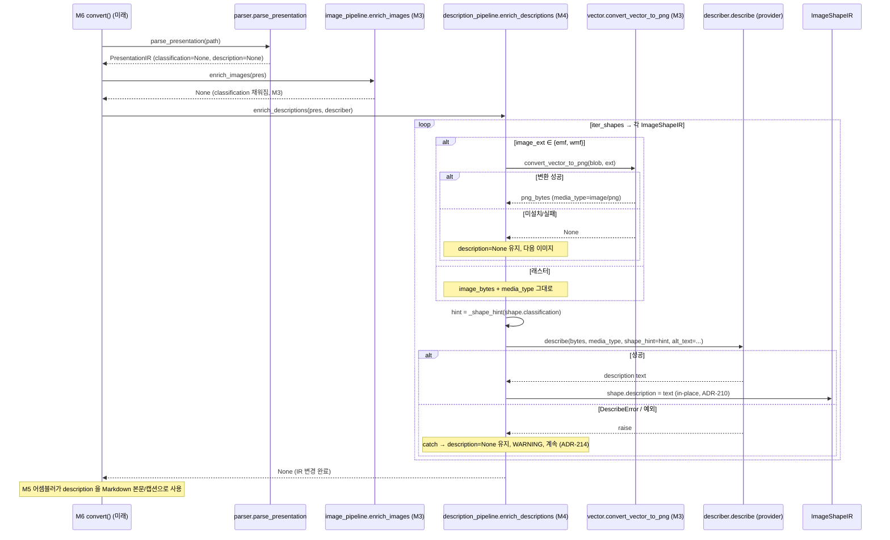

# ARCH-M4 — VLM 연동 (ImageDescriber 프로토콜 · 제공자 · shape_hint)

> 범위: M4 (FR-08 ImageDescriber 프로토콜, FR-09 VLM 제공자 구현, FR-10 shape_hint + 설명 오케스트레이터)
> 전제: `docs/00-charter/project-profile.md`, `docs/10-requirements/REQ-core.md`, `docs/20-design/ARCH-M2.md`, `docs/20-design/ARCH-M3.md`
> 스택 스킬: `.claude/skills/stack-python-packaging` (특히 §4 VLM extras 규약)
> 선행 ADR: ARCH-M2 ADR-201~207, ARCH-M3 ADR-208~211 (본 문서는 ADR-212 부터 연속)
> 입력 이슈: FR-08 #26, FR-09 #27, FR-10 #28 (디스패치 본문 + REQ-core §4 FR-08/09/10)
> 작성: architect / 2026-06-28
> 상태: 설계 초안 (reviewer 리뷰 / 사람 승인 전 — 아키텍처 게이트 대상)

---

## 0. 개요 — M4 목표와 M2/M3 연결점

M2 는 `ImageShapeIR` 에 **확장 슬롯** `description: str | None`(v1=`None`, ADR-205)을 예약했고, M3 는 `classification: ImageClass | None` 슬롯을 채웠다(ADR-210, in-place). M4 는 그 **두 슬롯을 동시에 소비**한다: `classification` 을 **읽어** VLM 프롬프트 힌트로 쓰고(FR-10), VLM 산출 텍스트를 `description` 슬롯에 **채운다**.

M4 의 세 책임:

1. **FR-08 ImageDescriber 프로토콜 (Must)** — `typing.Protocol` + `@runtime_checkable` 로 VLM 제공자 교체 가능 추상 인터페이스를 정의한다. 라이브러리는 이 Protocol 만을 계약으로 삼고, 사용자가 외부 provider(예: Gemini)를 plug-in 으로 주입할 수 있다(RFI-1 Q1).
2. **FR-09 VLM 제공자 구현 (Must)** — `AnthropicDescriber`, `OpenAIDescriber` 참조 구현을 제공한다. SDK(anthropic/openai)는 `[vlm]` extras(ADR-002, pyproject 선언)로만 설치되며, **조건부 import**(스킬 §4 패턴)로 미설치 시 `InstallationError`(`pip install pptx-md[vlm]`)를 발생시킨다.
3. **FR-10 shape_hint 지원 (Must)** — `ImageClass` → 프롬프트 힌트 문자열 변환과, IR 을 순회하며 각 이미지를 describer 로 설명해 `description` 슬롯을 채우는 오케스트레이터(`enrich_descriptions`)를 제공한다.

### 0.1 M2/M3 와의 직접 연결점

| 상류 산출물 | M4 사용 방식 |
|-------------|--------------|
| `ImageShapeIR.image_bytes` (M2) | describer 의 입력(이미지 바이트). VLM API 의 media payload 로 전달. |
| `ImageShapeIR.image_format` / `.image_ext` (M2) | VLM media_type(예 `image/png`) 결정 + EMF/WMF 비-래스터 판별. |
| `ImageShapeIR.classification` (M3, ADR-210) | **읽기 전용 입력**. `ImageClass` → `shape_hint` 변환(FR-10). `None` 이면 힌트 없이 일반 프롬프트. |
| `ImageShapeIR.description` 슬롯 (M2 ADR-205) | **FR-10 오케스트레이터의 채움 대상**. v1=`None` → VLM 산출 텍스트로 in-place 갱신(ADR-210 계승). |
| `ImageClass` StrEnum (M2 정의) | shape_hint 매핑 키. M4 는 enum 정의를 변경하지 않고 **읽기만** 한다. |
| `iter_shapes()` (M2 ADR-203) | 그룹 트리를 평탄화해 `ImageShapeIR` 만 골라 설명 일괄 적용 — `enrich_images` 와 동형. |
| `PptxMdError` (errors.py, M2) | M4 의 `InstallationError`/`DescribeError` 가 이 베이스를 상속(§4.3). |
| `vector.convert_vector_to_png` (M3, FR-07) | EMF/WMF 는 VLM 이 직접 못 다룸 → 변환 PNG 를 VLM 입력으로(§3.5, M3 §10 부채 해소 연계). |
| ADR-002 / NFR-08 | `describer.py`(프로토콜)·오케스트레이터는 SDK import 0. SDK 는 **provider 구현 내부의 조건부 import** 로만 등장. |

> **비침습 원칙 계승(ARCH-M3 §0.1)**: M4 는 M2 의 `ir.py`·`parser.py`, M3 의 `classifier.py`·`vector.py`·`image_pipeline.py` 를 **수정하지 않는다**. M4 는 신규 모듈로만 구성되며 `description` 슬롯을 채우는 후처리 패스다. → M2/M3 회귀 위험 0.

> **NFR-08 핵심 불변식**: `import pptx_md.describer` 와 `import pptx_md.providers` 는 **VLM SDK 미설치 환경에서도 항상 성공**한다. SDK 는 **조건부 실행**(provider 인스턴스화/호출 시점)일 뿐 **조건부 import 가 아니다**(=모듈 최상단 import 금지). 이 불변식이 ADR-212/213 의 설계 동인이다.

---

## 1. 아키텍처에 영향을 주는 요구사항 추출

> FR-08/09/10 은 REQ-core §4 기준 "차기 정제 대상" 이었으나 디스패치(#26/#27/#28)가 핵심 AC 를 확정했다. 본 설계는 그 AC + 프로파일 + ARCH-M2/M3 제약 + RFI-1 Q1(plug-in)에서 설계 영향을 도출한다.

| 출처 | 항목 | 설계 영향 |
|------|------|-----------|
| FR-08 #26 | `typing.Protocol` + `@runtime_checkable` 추상 인터페이스 | `describer.py`: `class ImageDescriber(Protocol)` — `describe(...)` 시그니처만. SDK import 0 → 항상 import 가능(NFR-08) |
| FR-08 #26 | provider 교체 가능 / 사용자 plug-in(RFI-1 Q1) | Protocol 은 명목 상속 불요(구조적 부합). 사용자 클래스가 `describe` 만 구현하면 `isinstance(obj, ImageDescriber)` True(`@runtime_checkable`) |
| FR-09 #27 | AnthropicDescriber / OpenAIDescriber 참조 구현 | `providers.py`(또는 `providers/` 패키지 — ADR-212): 각 provider 가 Protocol 구조적 부합. SDK 는 조건부 import |
| FR-09 #27 | 조건부 import (SDK 미설치 시 안내) | `try: import anthropic except ImportError: raise InstallationError(...)`. import 위치는 ADR-213 |
| FR-09 #27 | `[vlm]` extras (스킬 §4) | pyproject `[project.optional-dependencies].vlm` 이미 선언(anthropic>=0.20, openai>=1.0). 변경 0 |
| FR-09 #27 | describe 실패 = 예외 전파 (provider 계층) | provider 의 `describe` 는 API 오류/네트워크 실패를 `DescribeError` 로 래핑·전파(격리는 상위 오케스트레이터, ADR-214) |
| FR-10 #28 | `ImageClass` → shape_hint 변환 | `description_pipeline.py`: `_shape_hint(ImageClass | None) -> str` 결정적 매핑(4종 + None) |
| FR-10 #28 | `enrich_descriptions` 오케스트레이터 | `description_pipeline.py`: `enrich_descriptions(pres, describer, *, options)` — iter_shapes 순회 → describe → `description` in-place 채움 |
| FR-10 #28 | 분류 결과를 프롬프트 힌트로 | classification 슬롯(M3 산출)을 **읽어** describer 에 `shape_hint=` 로 전달. describer 는 hint 를 프롬프트에 합성 |
| FR-10 #28 | describe 실패 격리 (오케스트레이터 계층) | 오케스트레이터가 도형 단위 try/except → `DescribeError`(및 예상외 예외) catch, `description=None` 유지, 다음 이미지 계속(ADR-214, ADR-204 계승) |
| NFR-08 | core 설치(SDK 미설치)에서 import·비-VLM 변환 동작 | `describer.py`/`description_pipeline.py` 는 SDK import 0 → 항상 import. `providers.py` 도 최상단 SDK import 0(조건부 import 는 함수/생성자 내부, ADR-213) |
| NFR-05 | API key 는 패키지/소스/로그에 0, 사용자 환경변수 제공 | provider 는 key 를 인자/환경변수로 받음, 기본값 하드코딩 0, 로그에 key 0(§4.4) |
| NFR-06 | (마스킹 시) 로그에 원본 텍스트 0 | VLM 산출 description·이미지 바이트·프롬프트 본문 로그 미출력, 메타만(§4.4) |
| NFR-03 | mypy strict exit 0 | Protocol + `@runtime_checkable`, SDK 경계 `Any` 방벽(provider 내부에 가둠), `str`/`bytes`/`X | None` 명시(§5.1) |
| NFR-02 | 신규 코드 라인 커버리지 ≥ 75% | SDK 는 **mock/stub**(스킬 §5: 실제 API 호출 금지)으로 describe 경로 커버. shape_hint 매핑·오케스트레이터 격리·조건부 import 경로 항상 실행(§6) |
| NFR-01 | 20슬라이드 p95 < 5초 (**VLM 제외**) | M4 는 NFR-01 측정에서 **명시적 제외**(REQ NFR-01 "VLM 호출 제외"). M4 게이트 아님. 병렬 Map(M5 FR-12)·캐시(P-01)는 v1 범위 밖 |

> 통합 지점: M4 는 **외부 SaaS**(Anthropic/OpenAI HTTP API)와 통합한다 — M2/M3 에 없던 신규 통합. 이는 프로파일이 명시적으로 허용한 optional 경로(헌장 §M4, `[vlm]` extras, NFR-08)다. DB·메시징 통합 없음 → ERD 불필요. §3 에서 모듈/흐름 다이어그램으로 대체. API key 는 사용자 환경변수(NFR-05) — 라이브러리는 키를 저장·로깅하지 않는다.

---

## 2. 모듈 분해 & 컴포넌트 구조

### 2.1 신규 파일 목록 (`src/pptx_md/` 하위)

| 모듈 | 경로 | 책임 | FR | M4 범위 상태 |
|------|------|------|----|--------------|
| Describer 프로토콜 | `src/pptx_md/describer.py` | `ImageDescriber(Protocol)` + `@runtime_checkable`, `DescribeRequest`/공통 타입, `InstallationError`/`DescribeError` 정의 위치 후보(§4.3) | FR-08 | 신규 |
| VLM 제공자 패키지 | `src/pptx_md/providers/` | `__init__.py`(레지스트리·`get_describer`), `anthropic.py`(`AnthropicDescriber`), `openai.py`(`OpenAIDescriber`). SDK 조건부 import(ADR-212/213) | FR-09 | 신규 |
| 설명 오케스트레이터 | `src/pptx_md/description_pipeline.py` | `enrich_descriptions(pres, describer, *, options)` in-place 채움 + `_shape_hint(ImageClass | None) -> str` + EMF/WMF→변환→describe 분기 + 도형 격리(ADR-214/215) | FR-10 | 신규 |
| 패키지 진입점 | `src/pptx_md/__init__.py` | (변경 없음) M4 모듈은 내부 모듈 — 미노출(M6/FR-16 게이트) | — | 유지 |
| 예외 | `src/pptx_md/errors.py` | `InstallationError`/`DescribeError` 추가(`PptxMdError` 상속). M2 파일 **확장만**(기존 클래스 미변경) | FR-09 | 확장 |
| 테스트 | `tests/test_describer.py` / `tests/test_providers.py` / `tests/test_description_pipeline.py` | §6 전략 | — | 신규 |
| 테스트 픽스처 | `tests/conftest.py` | FakeDescriber(Protocol 구조적 부합) + SDK mock 픽스처 추가(§6.1) | — | 확장 |

> **3분할 근거**: (a) `describer.py` 는 **SDK 비의존 순수 프로토콜** → NFR-08 import 보장의 핵심, 항상 import 가능해야 하므로 SDK 의존 코드와 물리적으로 분리. (b) `providers/` 는 SDK 조건부 import 가 격리되는 유일한 곳. (c) `description_pipeline.py` 는 IR 을 아는 유일한 glue → describer/providers 는 IR 비의존(bytes+enum 만, ADR-211 계승). 단일 파일로 합치면 SDK import 경로가 프로토콜 모듈을 오염시켜 NFR-08 검증이 모호해진다.

### 2.2 컨텍스트 / 컴포넌트 다이어그램



### 2.3 의존 방향 (단방향 — 순환 금지)



**핵심 규칙**:
- `describer.py` 는 **SDK 도, ir.py 도 import 하지 않는다**. stdlib(`typing`/`abc`)만. → 항상 import 가능(NFR-08), IR 비의존(ADR-211 계승).
- `providers/*` 는 **모듈 최상단에 SDK import 0**. SDK 는 `get_describer`/생성자 내부의 조건부 import(ADR-213). → `import pptx_md.providers` 는 SDK 부재에서도 성공(NFR-08).
- `description_pipeline.py` 만 IR 을 import 한다(glue). describer/providers 는 `bytes`+`str`+`ImageClass` enum 만 다룸.
- 의존 방향 `description_pipeline → {describer, ir, vector}`, `providers → {describer, errors}` 단방향. providers ↔ description_pipeline 직접 의존 0(오케스트레이터가 describer 를 **주입받음** — DIP).

### 2.4 컴포넌트 책임 표

| 모듈 | import 허용 | import 금지(최상단) | 부작용 |
|------|------------|--------------------|--------|
| `describer.py` | stdlib(`typing`/`abc`/`dataclasses`) | anthropic, openai, python-pptx, ir, Pillow | 없음(순수 인터페이스) |
| `providers/__init__.py` | `pptx_md.describer`, `pptx_md.errors`, stdlib | anthropic, openai(최상단) — **함수 내부 조건부 import 만** | 없음(레지스트리·팩토리) |
| `providers/anthropic.py` | `pptx_md.describer`, `pptx_md.errors`, stdlib | anthropic(최상단) — **생성자/메서드 내부 조건부 import** | HTTP API 호출(describe 시) |
| `providers/openai.py` | (anthropic.py 와 동형, openai SDK 대상) | openai(최상단) | HTTP API 호출(describe 시) |
| `description_pipeline.py` | `pptx_md.ir`, `pptx_md.describer`, `pptx_md.vector`, logging | anthropic, openai(최상단), providers(직접 의존 불요 — describer 주입) | IR `description` 슬롯 변경(ADR-210 계승) |

---

## 3. 공개 인터페이스 & 처리 흐름

### 3.1 `describer.py` — 프로토콜 (FR-08)

```python
from typing import Protocol, runtime_checkable

@runtime_checkable
class ImageDescriber(Protocol):
    """Structural interface for VLM image-description providers (FR-08).

    Any object implementing describe(...) with this signature satisfies the
    protocol (structural typing) — no nominal inheritance required, so users
    can plug in external providers (RFI-1 Q1).  SDK-agnostic: this module
    imports NO VLM SDK, so ``import pptx_md.describer`` always succeeds (NFR-08).
    """

    def describe(
        self,
        image_bytes: bytes,
        media_type: str,
        *,
        shape_hint: str = "",
        alt_text: str = "",
    ) -> str:
        """Return a natural-language description of the image.

        Args:
            image_bytes: Raster image bytes (PNG/JPEG/...); EMF/WMF is converted
                upstream by the orchestrator before reaching a describer.
            media_type: MIME type for the API payload, e.g. "image/png".
            shape_hint: Optional classification-derived hint (FR-10); "" = none.
            alt_text: Optional PPTX alt text to enrich the prompt; "" = none.

        Raises:
            DescribeError: on provider/API failure (propagated; the orchestrator
                isolates it — ADR-214).  The provider MUST NOT swallow failures.
        """
        ...
```

| 항목 | 내용 |
|------|------|
| 입력 | `image_bytes`(래스터), `media_type`(MIME), `shape_hint`/`alt_text`(선택) |
| 출력 | `str` — 이미지 설명 텍스트(빈 문자열 가능하나 정상 산출은 비빔) |
| 예외 | `describe` 는 실패 시 `DescribeError` **전파**(provider 책임, ADR-214). 인터페이스 자체는 raise 안 함 |
| 결합 | **SDK·IR 비의존**(stdlib only). enum(`ImageClass`) 도 직접 참조 안 함 — hint 는 이미 `str` 로 변환되어 들어옴(매핑은 orchestrator §3.3) |

> `@runtime_checkable` 로 `isinstance(provider, ImageDescriber)` 가 `describe` 속성 존재만 검사(메서드 시그니처는 정적 검사 mypy 담당). 사용자 plug-in 검증·오케스트레이터 방어에 사용.

### 3.2 `providers/` — VLM 제공자 (FR-09)

```python
# providers/__init__.py
def get_describer(name: str, **config: object) -> ImageDescriber:
    """Factory: return a reference describer by name ("anthropic" | "openai").

    Lazily imports the concrete provider module (which in turn conditionally
    imports its SDK).  Raises InstallationError if the SDK is missing,
    ValueError for an unknown name.  This factory itself imports NO SDK at
    module top level (NFR-08).
    """
```

```python
# providers/anthropic.py
class AnthropicDescriber:  # structurally satisfies ImageDescriber (FR-08)
    def __init__(self, *, model: str = "...", api_key: str | None = None) -> None:
        # NO SDK import at module top. Conditional import here (ADR-213):
        try:
            import anthropic
        except ImportError as exc:
            raise InstallationError(
                "Anthropic provider requires: pip install pptx-md[vlm]"
            ) from exc
        # api_key=None -> SDK reads ANTHROPIC_API_KEY env var (NFR-05)
        self._client = anthropic.Anthropic(api_key=api_key)
        self._model = model

    def describe(self, image_bytes, media_type, *, shape_hint="", alt_text="") -> str:
        prompt = _build_prompt(shape_hint, alt_text)  # hint 합성
        try:
            resp = self._client.messages.create(...)  # SDK call
        except Exception as exc:  # network/API/quota -> wrap & propagate
            raise DescribeError(f"anthropic describe failed: {type(exc).__name__}") from exc
        return _extract_text(resp)
```

| 항목 | 내용 |
|------|------|
| 입력 | 생성자: `model`/`api_key`(None=환경변수, NFR-05). `describe`: §3.1 시그니처 |
| 출력 | `describe` → `str` |
| 예외 | 생성자: SDK 미설치 → `InstallationError`(ADR-213). `describe`: API 실패 → `DescribeError` 전파(ADR-214) |
| import | **최상단 SDK import 0**. 조건부 import 는 **생성자**(ADR-213) → `import pptx_md.providers.anthropic` 는 SDK 부재에서도 성공, 인스턴스화 시점에만 실패 |

> OpenAIDescriber 는 동형(openai SDK, `OPENAI_API_KEY`). 두 provider 모두 `ImageDescriber` Protocol 에 **구조적 부합**(명목 상속 없음) → reviewer 가 `isinstance(AnthropicDescriber(...), ImageDescriber)` 또는 정적 검사로 확인.

### 3.3 `description_pipeline.py` — 오케스트레이터 (FR-10)

```python
def enrich_descriptions(
    presentation: PresentationIR,
    describer: ImageDescriber,
    *,
    skip_classes: frozenset[ImageClass] = frozenset(),
) -> None:
    """Fill ImageShapeIR.description for every image using *describer* (FR-10).

    Mutates the IR in place (ADR-210, ADR-215).  For each ImageShapeIR found
    via iter_shapes:
      1. EMF/WMF -> vector.convert_vector_to_png; on skip/failure leave None.
      2. Build shape_hint from shape.classification (FR-10).
      3. describer.describe(bytes, media_type, shape_hint=..., alt_text=...).
      4. On DescribeError / any exception: log, leave description None, continue.
    Per-image isolation (ADR-214 / ADR-204 계승).
    """


def _shape_hint(classification: ImageClass | None) -> str:
    """Map an ImageClass to a prompt hint string (FR-10). Deterministic.

    None / unknown -> "" (no hint, generic prompt).
    """
```

| 항목 | 내용 |
|------|------|
| 입력 | `PresentationIR`(M2/M3 산출, classification 채워짐), `describer`(주입 — DIP), `skip_classes`(선택: 특정 클래스 설명 생략, 예 비용 절감) |
| 출력 | `None` — in-place 변경(ADR-210/215) |
| 동작 | 모든 슬라이드 → `iter_shapes()` → `ImageShapeIR` 필터 → (EMF/WMF 변환?)→ hint 생성 → describe → `description` 슬롯 채움 |
| 격리 | 도형 단위 try/except. `DescribeError`·예상외 예외 시 해당 `description=None` 유지, WARNING, 다음 이미지 계속(ADR-214) |
| 결정성 | `_shape_hint` 는 결정적. `describe` 자체는 VLM 비결정적(외부) — 오케스트레이션 구조는 결정적 |

**shape_hint 매핑 (FR-10, 결정적)**:

| `classification` | `shape_hint` 문자열(초기값) | 직관 |
|------------------|------------------------------|------|
| `ImageClass.TEXT` | "This image appears to contain primarily text; transcribe the text content accurately." | 텍스트 스크린샷 → 정확 전사 유도 |
| `ImageClass.DIAGRAM` | "This image appears to be a diagram or chart; describe its structure, components, and relationships." | 구조 설명 유도 |
| `ImageClass.PHOTO` | "This image appears to be a photograph; describe the scene and visible objects." | 장면 묘사 유도 |
| `ImageClass.LOGO` | "This image appears to be a logo or icon; identify it concisely." | 간결 식별 유도 |
| `None` | `""` (힌트 없음 → provider 의 일반 프롬프트) | 분류 불가(M3 None) → VLM 이 자율 판단(FR-06↔FR-10 협업) |

> hint 문자열은 `description_pipeline.py` 모듈 상수(`_HINTS: dict[ImageClass, str]`)로 고정 → 결정성·튜닝 추적성. provider 가 `_build_prompt(shape_hint, alt_text)` 로 본문에 합성. hint↔provider 의 결합은 **문자열 인자 1개**로 최소화(provider 는 ImageClass enum 을 모름 → ADR-211 결합 최소 계승).

### 3.4 EMF/WMF 처리 — M3 변환기 재사용 (FR-07 연계)

VLM 은 EMF/WMF 를 직접 못 다룬다(media_type 미지원). 오케스트레이터는 M3 `vector.convert_vector_to_png` 를 재사용해 PNG 로 변환 후 describe 한다. 변환 실패/LibreOffice 부재 시 graceful skip(`description=None` 유지). 이는 ARCH-M3 §10 의 "변환 PNG 를 분류에만 사용" 부채를 **M4 에서 describe 입력으로 확장**하는 것이며, **IR 스키마 변경 없이**(변환 PNG 를 로컬 변수로만 사용) 달성한다 — ADR-216 참조.

### 3.5 처리 흐름 — 전체 파이프라인 연결



> M4 는 `enrich_images`(M3) 직후, M5 어셈블러 직전의 **후처리 패스**다. provider 인스턴스(describer) 생성·주입은 M6 `convert()`(미래) 책임 — M4 는 `describer` 를 **주입받을 뿐 생성하지 않는다**(DIP, 테스트 시 FakeDescriber 주입 용이). `__init__.py` 변경 없음(내부 모듈 미노출 — M2/M3 규약 계승).

---

## 4. 횡단 관심사

### 4.1 mypy strict 전략 (NFR-03) — §5.1 로 통합

(아래 §5.1 참조)

### 4.2 예외 처리 전략 — 2계층 책임 분리 (FR-09 ↔ FR-10, ADR-214)

| 레벨 | 정책 | 근거 |
|------|------|------|
| Provider (`describe`) — FR-09 | API/네트워크/쿼터 실패를 `DescribeError` 로 **래핑·전파**. SDK 미설치는 **생성자**에서 `InstallationError`. **삼키지 않음** | provider 는 단일 이미지 책임 — 실패를 숨기면 상위가 부분 실패를 알 수 없음. 명시적 예외로 진단성 확보 |
| Orchestrator (`enrich_descriptions`) — FR-10 | 도형 단위 try/except 로 `DescribeError`·예상외 예외를 **격리 catch** → 해당 `description=None` 유지, WARNING, 다음 이미지 계속 | "한 이미지 실패가 전체 설명을 막지 않는다"(ADR-204 계승). 부분 성공 허용 |

> **2계층 책임 분리가 ADR-214 의 핵심**: provider 는 "정직하게 실패"(전파), 오케스트레이터는 "회복탄력성"(격리) 담당. 이 비대칭은 ARCH-M2 ADR-204(도형 격리) + per-shape 철학의 M4 적용이다. `InstallationError` 는 **격리 대상이 아님** — 설치 문제는 전체 변환이 의미 없으므로 생성자에서 즉시 실패(fail-fast), 오케스트레이터까지 도달 전에 사용자가 인지(M6 convert 가 describer 생성 시점).

### 4.3 예외 클래스 위치 (errors.py 확장)

M2 `errors.py`(PptxMdError/ParseError)를 **확장만** 한다(기존 클래스 미변경 — 비침습).

```python
class InstallationError(PptxMdError):
    """Raised when an optional VLM SDK is required but not installed (FR-09).
    Message guides the user to: pip install pptx-md[vlm] (스킬 §4)."""

class DescribeError(PptxMdError):
    """Raised when a VLM provider fails to describe an image (FR-09).
    Wraps the underlying SDK/HTTP error; the orchestrator isolates it (ADR-214)."""
```

> `errors.py` 는 SDK 비의존(stdlib only) → import 안전. `InstallationError`/`DescribeError` 정의를 `describer.py` 가 아닌 `errors.py` 에 두는 이유: (a) M2 가 이미 `errors.py` 를 라이브러리 전역 예외 계층의 정본으로 확립(ADR 계승), (b) `describer.py` 는 순수 Protocol 유지(예외 정의 혼입 회피), (c) providers 와 orchestrator 가 공통 참조(순환 의존 회피).

### 4.4 보안·로깅·감사 (NFR-05/06)

| 관심사 | 설계 |
|--------|------|
| API key (NFR-05) | provider 생성자 `api_key: str | None = None`, **None=SDK 가 환경변수 읽음**(`ANTHROPIC_API_KEY`/`OPENAI_API_KEY`). 라이브러리는 key 를 **저장·기본값 하드코딩·로그 출력 0**. `repr` 에 key 미노출 |
| 로깅 (NFR-06) | 로거 `pptx_md.providers`/`pptx_md.description_pipeline`. **이미지 바이트·프롬프트 본문·VLM 산출 description·alt_text 로그 미출력**. 메타만: 이미지 크기, media_type, shape_hint **클래스명**(텍스트 본문 아님), 예외 타입, provider 이름 |
| 산출 description 의 PII | VLM 산출물이 PII 포함 가능 → FR-15 마스킹(M5)이 description 도 마스킹 대상에 포함(M5 설계 연계). M4 는 description 을 로그에 미출력해 NFR-06 준수 |
| 네트워크 | provider 만 HTTP. 오케스트레이터·프로토콜은 네트워크 0. 타임아웃·재시도는 SDK 기본 또는 생성자 config 로 위임(v1 단순) |

### 4.5 NFR-08 의존성 격리 검증 포인트

- `describer.py`/`description_pipeline.py` 최상단에 `import anthropic`/`import openai` **0건** — reviewer `grep -nE "^\s*(import|from)\s+(anthropic|openai)" src/pptx_md/describer.py src/pptx_md/description_pipeline.py` → 0 매치.
- `providers/*.py` 도 **최상단** SDK import 0 (조건부 import 는 함수/생성자 **내부** — 들여쓰기된 라인). reviewer 가 모듈 레벨 import 만 검사하도록 grep 패턴을 `^\s*import` 가 아닌 `^(import|from)`(들여쓰기 0)으로 제한 확인.
- SDK 미설치 환경: `import pptx_md.describer`, `import pptx_md.providers`, `import pptx_md.providers.anthropic`, `import pptx_md.description_pipeline` **모두 성공**(테스트 게이트). `get_describer("anthropic")` 또는 `AnthropicDescriber()` 인스턴스화 시점에만 `InstallationError`.
- `description_pipeline` 은 SDK 없이도 동작 가능해야 하므로 **describer 를 주입받음**(FakeDescriber 로 NFR-08 테스트).

---

## 5. 기술 선택지 비교 (ADR 후보)

### 5.1 mypy strict — Protocol + SDK 경계 `Any` 방벽

- `@runtime_checkable Protocol` 은 mypy 가 구조적 부합을 정적 검사 → AnthropicDescriber/OpenAIDescriber 가 `ImageDescriber` 시그니처와 불일치하면 컴파일 타임 적발.
- SDK(anthropic/openai)는 `ignore_missing_imports=true`(M1 ADR-003)로 `Any` 유입 → **provider 내부에 `Any` 를 가둠**. `describe` 반환은 `str` 로 명시 좁힘(`_extract_text(resp) -> str`), API 응답 객체의 `Any` 가 IR/오케스트레이터로 전파 안 됨(파서가 python-pptx 방벽이었던 것과 동형, ADR-206 계승).
- `_shape_hint` 반환 `str`, `_HINTS: dict[ImageClass, str]` 명시. orchestrator 시그니처 전부 명시(`describer: ImageDescriber`).
- `runtime_checkable` 의 isinstance 는 속성 존재만 검사하므로 **정적 시그니처 검사(mypy)와 병행** — 둘 다 게이트(NFR-03).

### 5.2 추상화 방식: `typing.Protocol` vs ABC vs 함수 콜백

| 후보 | 장점 | 단점 |
|------|------|------|
| A. `Protocol` + `@runtime_checkable` | **명목 상속 불요**(구조적) → 사용자 plug-in 자유(RFI-1 Q1), mypy 정적 검사, isinstance 방어 | runtime_checkable 은 시그니처 미검사(속성만) |
| B. ABC(`abc.ABC` + `abstractmethod`) | 명시적 계약, 인스턴스화 강제 검사 | **명목 상속 강제** → 사용자가 라이브러리 ABC 를 import·상속해야 함(plug-in 결합↑, RFI-1 Q1 의도와 약불일치) |
| C. 함수 콜백(`Callable[..., str]`) | 최경량 | 설정(model/key) 상태 보유 어려움, 타입 가독성↓, 다중 메서드 확장 불가 |

**권고: A(Protocol + runtime_checkable)** — FR-08 AC 가 `typing.Protocol` + `@runtime_checkable` 을 **명시**하고, RFI-1 Q1 의 "사용자 plug-in" 은 구조적 타이핑(상속 불요)이 가장 자연스럽다. ABC 는 사용자에게 상속을 강제해 plug-in 마찰↑. → ADR-217.

### 5.3 providers 모듈 구조: 단일 파일 vs 패키지 분리 (ADR-212 확정 대상)

| 후보 | 장점 | 단점 |
|------|------|------|
| A. `providers.py` (단일 파일) | 파일 1개로 단순, 작은 코드 | 두 provider 의 조건부 import 가 한 파일에 혼재 → `import pptx_md.providers` 시 두 SDK import 경로가 한 네임스페이스에, provider별 독립 테스트·확장 어려움, NFR-08 검증 시 grep 대상 모호 |
| B. `providers/` (패키지) | provider별 1파일(anthropic.py/openai.py) → 조건부 import 격리 명확, `get_describer` 가 lazy 모듈 import 로 미설치 SDK 를 회피, 신규 provider 추가가 파일 추가, reviewer grep 이 provider별 명확 | 파일 수↑(미미) |

**권고: B(`providers/` 패키지)** — (a) 각 provider 의 SDK 조건부 import 를 **물리적으로 격리**해 NFR-08 검증이 파일 단위로 명확, (b) `get_describer` 가 요청된 provider 모듈만 lazy import → openai 미설치여도 anthropic 사용 가능(부분 가용성), (c) 사용자 plug-in/신규 provider 확장이 파일 추가로 닫힘. 단일 파일은 "anthropic 만 설치" 환경에서 openai import 경로가 같은 파일에 있어 격리 추론이 흐려진다. → **ADR-212 로 패키지 분리 확정**.

### 5.4 조건부 import 위치: 생성자 vs describe() 호출 시점 (ADR-213 확정 대상)

| 후보 | 장점 | 단점 |
|------|------|------|
| A. **생성자**(`__init__`)에서 import | 인스턴스 생성 = "이 provider 를 쓰겠다" 선언 → 그 시점에 미설치를 **즉시 fail-fast**(InstallationError). describe 마다 import 비용 0(한 번만). M6 convert 가 describer 생성 시점에 사용자에게 설치 문제 통지 | 생성은 했으나 호출 안 하는 드문 경우에도 SDK 필요 |
| B. `describe()` 호출 시점 import | provider 객체 생성은 SDK 없이 가능 | describe 마다 import 검사(캐시되나 코드 복잡), 미설치 발견이 **늦음**(첫 호출 = 오케스트레이션 한복판) → 부분 실패로 격리되어 설치 문제가 "describe 실패"로 오인됨, fail-fast 약화 |

**권고: A(생성자)** — InstallationError 는 **설정 오류**(전체 변환 무의미)이므로 가능한 한 일찍 드러나야 한다. 생성자 import 는 (a) describer 인스턴스화 시점에 fail-fast → 사용자가 오케스트레이션 시작 전에 인지, (b) describe 마다 import 검사 불요(성능·단순), (c) ADR-214 의 "InstallationError 는 격리 대상 아님"과 정합(생성자에서 던지면 오케스트레이터 try/except 에 도달 안 함). describe 시점 import 는 미설치가 DescribeError 격리에 섞여 진단이 흐려진다. → **ADR-213 로 생성자 import 확정**.

### 5.5 enrich_descriptions 위치: image_pipeline 확장 vs 신규 모듈 (ADR-215 확정 대상)

| 후보 | 장점 | 단점 |
|------|------|------|
| A. `image_pipeline.py` 확장(M3 파일에 enrich_descriptions 추가) | 파일 1개에 이미지 후처리 응집 | **M3 파일 수정 = 비침습 원칙 위반**(M3 회귀 위험), image_pipeline 이 describer/providers/SDK 세계를 알게 됨 → NFR-08 검증 표면 확대, M3(분류)와 M4(설명)의 마일스톤 경계 흐려짐 |
| B. 신규 `description_pipeline.py` | M3 파일 **수정 0**(비침습), M4 모듈 경계 명확, describer 주입 책임이 M4 모듈에 응집, NFR-08 grep 대상이 M4 파일로 한정 | 유사 오케스트레이터 2개(enrich_images/enrich_descriptions) 공존 |

**권고: B(신규 `description_pipeline.py`)** — (a) ARCH-M3 §0.1 비침습 원칙(M2 미수정)을 M4 가 계승 → M3 파일 미수정으로 M3 회귀 위험 0, (b) M3(이미지 분류)와 M4(VLM 설명)의 마일스톤/책임 경계가 파일로 명확, (c) NFR-08 검증(SDK import 0)이 M4 파일에 한정되어 reviewer grep 명료, (d) 두 오케스트레이터의 공통 순회 패턴(iter_shapes+격리)은 중복이나 작고, 결합을 만드는 것보다 명확성이 우선. → **ADR-215 로 신규 모듈 확정**.

---

## 6. 아키텍처 결정 기록 (ADR-212 ~ ADR-217)

### ADR-212 providers 는 패키지(`providers/`)로 분리 — provider별 1파일
**배경**: FR-09 는 anthropic·openai 두 참조 provider 를 요구하며 각각 SDK 를 조건부 import 한다. 단일 파일(`providers.py`)이면 두 SDK 의 조건부 import 경로가 한 모듈에 혼재해 NFR-08 격리 검증·부분 가용성(한쪽만 설치)·확장이 모호해진다.
**결정**: `src/pptx_md/providers/` 패키지로 구성한다. `__init__.py`(레지스트리 + `get_describer(name, **cfg)` lazy 팩토리), `anthropic.py`(AnthropicDescriber), `openai.py`(OpenAIDescriber). `get_describer` 는 요청된 provider 모듈만 lazy import 한다.
**근거**: (a) provider별 SDK 조건부 import 를 파일 단위로 격리 → NFR-08 검증 명확, (b) lazy 팩토리로 미설치 SDK 회피(openai 미설치여도 anthropic 사용 가능 = 부분 가용성), (c) 신규 provider/사용자 plug-in 확장이 파일 추가로 닫힘.
**대안과 기각 사유**: 단일 `providers.py`(두 SDK import 경로 혼재·격리 추론 흐림·부분 가용성 약화).
**영향**: `providers/__init__.py` 가 SDK import 0(최상단) — `import pptx_md.providers` 항상 성공(NFR-08). 신규 provider 는 파일 추가 + 레지스트리 등록.

### ADR-213 SDK 조건부 import 위치 = provider 생성자(`__init__`) — fail-fast
**배경**: FR-09 는 SDK 미설치 시 안내(Installation 유도)를 요구한다. NFR-08 은 `import pptx_md.providers` 가 SDK 부재에서도 성공할 것을 요구한다. 조건부 import 시점이 생성자냐 describe 호출이냐가 fail-fast 시점과 NFR-08 모두에 영향.
**결정**: SDK import 는 각 provider **생성자(`__init__`) 내부**에서 `try: import anthropic except ImportError: raise InstallationError("pip install pptx-md[vlm]")`. 모듈 최상단 import 0. describe 호출 시점에는 SDK 를 재import하지 않는다.
**근거**: (a) `import pptx_md.providers.anthropic` 는 SDK 부재에서도 성공(NFR-08), (b) describer **인스턴스화 시점에 fail-fast** → 사용자가 오케스트레이션 시작 전 설치 문제 인지, (c) describe 마다 import 검사 불요(성능·단순), (d) ADR-214 의 "InstallationError 는 격리 대상 아님"과 정합(생성자에서 던지면 오케스트레이터 try/except 미도달).
**대안과 기각 사유**: describe() 시점 import(미설치 발견이 늦고 DescribeError 격리에 섞여 진단 흐려짐), 모듈 최상단 import(NFR-08 위반 — import 자체가 실패).
**영향**: provider 생성은 SDK 필요(설정 시점), describe 는 SDK 재검사 없음. M6 convert 가 describer 를 미리 생성해 설치 문제를 조기 노출.

### ADR-214 describe 실패 정책 = provider 전파(DescribeError) + 오케스트레이터 격리 catch (2계층 분리)
**배경**: FR-09(provider)는 "실패 시 예외 전파", FR-10(오케스트레이터)는 "부분 실패 허용·격리"를 요구. 두 계층의 책임을 명문화하지 않으면 실패가 어디서 삼켜지는지 모호.
**결정**: **Provider 계층** — `describe` 는 API/네트워크/쿼터 실패를 `DescribeError` 로 래핑·**전파**(삼키지 않음). SDK 미설치는 생성자에서 `InstallationError`(ADR-213). **오케스트레이터 계층** — `enrich_descriptions` 가 도형 단위 try/except 로 `DescribeError`·예상외 예외를 격리 catch → 해당 `description=None` 유지, WARNING, 다음 이미지 계속. `InstallationError` 는 격리 대상 아님(생성자에서 이미 fail-fast).
**근거**: provider 는 단일 이미지 책임이라 실패를 정직하게 드러내야 진단 가능. 오케스트레이터는 "한 이미지 실패가 전체를 막지 않는다"(ARCH-M2 ADR-204 계승)는 회복탄력성 담당. 책임 분리로 "실패 위치"가 명확.
**대안과 기각 사유**: provider 가 None 반환(실패 진단 불가·예외 정보 소실), 오케스트레이터가 전파(부분 실패에 전체 중단 — UX 파괴), 단일 계층 처리(책임 혼재).
**영향**: provider 단위 테스트는 `DescribeError` 발생을 검증, 오케스트레이터 테스트는 describer 가 던져도 다른 이미지가 계속 채워짐을 검증(격리). `errors.py` 에 `DescribeError`/`InstallationError` 추가(§4.3).

### ADR-215 `enrich_descriptions` 위치 = 신규 `description_pipeline.py` (M3 파일 미수정)
**배경**: FR-10 오케스트레이터를 M3 `image_pipeline.py` 에 추가할지(파일 응집) 신규 모듈로 둘지(경계 명확). ARCH-M3 §0.1 은 비침습 원칙(상류 파일 미수정)을 확립했다.
**결정**: `src/pptx_md/description_pipeline.py` 신규 모듈에 `enrich_descriptions` + `_shape_hint` + `_HINTS` 상수를 둔다. M3 `image_pipeline.py` 는 **수정하지 않는다**.
**근거**: (a) 비침습 계승 → M3 회귀 위험 0, (b) M3(분류)·M4(설명) 마일스톤/책임 경계가 파일로 명확, (c) NFR-08 검증(SDK import 0)이 M4 파일에 한정되어 reviewer grep 명료, (d) describer 주입(DIP) 책임이 M4 모듈에 응집.
**대안과 기각 사유**: image_pipeline 확장(M3 수정 = 비침습 위반·회귀 위험, image_pipeline 이 SDK 세계를 알게 됨·NFR-08 표면 확대·마일스톤 경계 흐려짐).
**영향**: enrich_images(M3)/enrich_descriptions(M4) 2개 오케스트레이터 공존(유사 순회 패턴은 작은 중복이나 명확성 우선). M6 convert 가 두 패스를 순차 조립.

### ADR-216 EMF/WMF describe = M3 vector 변환기 재사용 + 변환 PNG 는 로컬 변수(IR 스키마 불변)
**배경**: VLM 은 EMF/WMF media_type 미지원. ARCH-M3 §10 은 "변환 PNG 를 분류에만 사용, image_bytes 는 원본 유지" 를 부채로 남기고 IR 슬롯 추가를 M4 로 미뤘다.
**결정**: `enrich_descriptions` 가 EMF/WMF 도형에 대해 `vector.convert_vector_to_png`(M3, FR-07)를 **재사용**해 PNG 로 변환하고, 그 PNG bytes 를 **로컬 변수로만** describe 입력(media_type=image/png)에 쓴다. **IR 스키마는 변경하지 않는다**(`converted_png` 슬롯 추가 보류). 변환 실패/LibreOffice 부재 시 graceful skip(description=None 유지).
**근거**: (a) vector 변환기 재사용으로 EMF/WMF 도 VLM 설명 가능(M3 부채 일부 해소), (b) IR 스키마 미변경 → M2/M3 비침습 + 하위호환(변환 PNG 영구 보존 요구가 v1 에 없음 — M3·M4 모두 변환 PNG 를 휘발 입력으로만 사용), (c) graceful skip 으로 부분 성공.
**대안과 기각 사유**: ImageShapeIR 에 `converted_png` 슬롯 추가(스키마 변경·M2 ir.py 수정 = 비침습 위반, v1 영구 보존 요구 없어 과설계), EMF/WMF describe 미지원(정보 손실).
**영향**: `description_pipeline` 이 `vector` 를 import(M3 재사용, 의존 방향 단방향 유지). 변환 비용은 EMF/WMF 한정·도형당 1회(NFR-01 영향 최소, 단 M4 는 NFR-01 측정 제외).

### ADR-217 추상화 = `typing.Protocol` + `@runtime_checkable` (구조적 타이핑)
**배경**: FR-08 은 `typing.Protocol` + `@runtime_checkable` 을 명시. RFI-1 Q1 은 사용자가 외부 provider 를 plug-in 으로 주입(라이브러리는 Protocol 만 계약)할 것을 요구.
**결정**: `ImageDescriber` 를 `@runtime_checkable Protocol` 로 정의. provider 는 **명목 상속 없이** `describe` 시그니처 구현만으로 부합(구조적). 사용자 plug-in 도 동일.
**근거**: (a) FR-08 AC 명시 충족, (b) 구조적 타이핑 → 사용자가 라이브러리 베이스를 import·상속할 필요 없음(plug-in 마찰 0, RFI-1 Q1), (c) mypy 정적 시그니처 검사 + runtime isinstance 방어 병행, (d) describer.py 가 SDK·IR 비의존 stdlib only → 항상 import 가능(NFR-08).
**대안과 기각 사유**: ABC(명목 상속 강제 → plug-in 결합↑·RFI-1 Q1 의도와 약불일치), 함수 콜백(상태 보유 어려움·타입 가독성↓·확장 불가).
**영향**: AnthropicDescriber/OpenAIDescriber 가 Protocol 에 구조적 부합(상속선 없음). reviewer 가 mypy + isinstance 로 부합 검증. 사용자 plug-in 은 `describe` 만 구현하면 됨.

---

## 7. 테스트 전략

### 7.1 SDK mock/stub — 실제 API 호출 금지 (스킬 §5, NFR-02)

- **VLM 실제 API 호출 금지**(스킬 §5) → provider 테스트는 SDK 를 **mock**(예: `monkeypatch` 로 `anthropic.Anthropic`/`openai.OpenAI` 를 stub 클라이언트로 치환)하거나, SDK 미설치 환경을 `monkeypatch` 로 시뮬레이트.
- `FakeDescriber`(conftest): `ImageDescriber` Protocol 에 **구조적 부합**하는 테스트 더블 — `describe` 가 결정적 더미 텍스트 반환(또는 주입된 예외 raise). 오케스트레이터 테스트의 주 입력(SDK 불요 → NFR-08 정합).
- 커버리지: shape_hint 5분기(4 enum + None)·오케스트레이터 격리·EMF/WMF 변환 분기·조건부 import 경로(미설치 시뮬레이트)로 NFR-02 75%+ 목표.

### 7.2 NFR-08 / 조건부 import 테스트 (FR-09)

| 테스트 | 조건 | 비고 |
|--------|------|------|
| import 가능성 | 항상 실행 | `import pptx_md.describer` / `pptx_md.providers` / `pptx_md.providers.anthropic` / `pptx_md.description_pipeline` 가 **SDK 미설치에서도 성공**(NFR-08 핵심) |
| 미설치 → InstallationError | 항상 실행 | `monkeypatch` 로 SDK import 차단(또는 `sys.modules` 조작) → `AnthropicDescriber()`/`get_describer("anthropic")` 가 `InstallationError`(메시지에 `pip install pptx-md[vlm]`) |
| 설치 시 인스턴스화 | SDK 설치 시(skipif) | mock 클라이언트로 생성 성공 + `isinstance(obj, ImageDescriber)` True(runtime_checkable) |
| SDK import 0 (grep) | 항상 실행 | `describer.py`/`description_pipeline.py` 최상단 SDK import 0; `providers/*` 최상단(들여쓰기 0) SDK import 0 |
| 알 수 없는 provider | 항상 실행 | `get_describer("unknown")` → `ValueError` |

### 7.3 Protocol 부합 테스트 (FR-08)

- `isinstance(FakeDescriber(), ImageDescriber)` → True(`@runtime_checkable`, describe 속성 존재).
- mypy 정적 검사로 AnthropicDescriber/OpenAIDescriber 가 시그니처 부합(불일치 시 mypy 에러 = 게이트).
- describe 누락 객체 → `isinstance(...)` False (runtime_checkable 음성 케이스).

### 7.4 provider 테스트 (FR-09, mock)

- mock SDK 클라이언트가 정상 응답 → `describe` 가 텍스트 반환, hint/alt_text 가 프롬프트에 합성됨(프롬프트 조립 검증).
- mock SDK 가 예외 발생 → `describe` 가 `DescribeError` **전파**(ADR-214 provider 계층).
- API key: `api_key=None` 시 SDK 가 환경변수 사용(키 하드코딩·로그 0 검증 — NFR-05).

### 7.5 오케스트레이터 테스트 (FR-10, description_pipeline)

- IR 합성(`PresentationIR` 직접 구성, python-pptx·SDK 불요)으로:
  - FakeDescriber 주입 → 래스터 이미지 `description` 채워짐, **in-place**(반환 None, ADR-210).
  - `_shape_hint`: 4 enum → 각 hint 문자열, `None` → `""`(결정적, 5케이스 전부).
  - shape_hint 가 describer 에 전달됨(FakeDescriber 가 수신 hint 기록 → assert, FR-10).
  - **격리(ADR-214)**: describer 가 한 이미지에서 `DescribeError` 던져도 다른 이미지 `description` 채워짐, 실패 이미지는 `None` 유지, 예외 0(전파 안 함).
  - EMF/WMF + LibreOffice 미설치(monkeypatch `vector`) → 변환 skip → `description=None` 유지, describe 미호출.
  - 그룹 중첩 ImageShapeIR 도달(iter_shapes, ADR-203).
  - `skip_classes` 지정 시 해당 클래스 이미지 describe 미호출(설명 생략).

### 7.6 타입·스타일·보안 게이트

- mypy: `mypy src/` exit 0(신규 모듈 strict 통과, Protocol 시그니처 부합 포함).
- ruff/black: line-length 88, exit 0.
- SDK import 0: grep 게이트(§4.5).
- NFR-05: key·프롬프트·description 로그 미출력(로그 라인 검사).

---

## 8. WBS — 구현 이슈 분해

각 단위는 developer 가 반나절~하루 내 독립 수행 가능. 의존: W1(describer/errors)은 선행(프로토콜·예외 정의가 W2/W3 의 계약). W2(providers)·W3(orchestrator)는 W1 후 병행 가능(W3 는 describer Protocol 만 의존, providers 구현 불요 — FakeDescriber 로 테스트). W4(테스트)는 각 구현과 병행/직후.

| ID | 작업 | 대응 FR | 참조 설계 절 | AC 초안 | 의존 |
|----|------|---------|-------------|---------|------|
| W1 | `describer.py`: `ImageDescriber(Protocol)`+`@runtime_checkable`+`describe` 시그니처. `errors.py` 확장: `InstallationError`/`DescribeError`(PptxMdError 상속) | FR-08 | 3.1, 4.3, 5.2, ADR-217 | (1) `import pptx_md.describer` 가 SDK 미설치에서도 성공(NFR-08); (2) `isinstance(obj_with_describe, ImageDescriber)` True, describe 없으면 False(runtime_checkable); (3) `describer.py`·`errors.py` 최상단 SDK import 0(grep); (4) `InstallationError`/`DescribeError` 가 `PptxMdError` 상속, 기존 errors 클래스 미변경; (5) `mypy src/` exit 0(strict) | 없음 |
| W2 | `providers/` 패키지: `__init__.py`(`get_describer` lazy 팩토리)+`anthropic.py`(AnthropicDescriber)+`openai.py`(OpenAIDescriber). SDK 조건부 import(생성자), 프롬프트 조립, DescribeError 래핑 | FR-09 | 3.2, 4.2, 4.4, 5.3, 5.4, ADR-212/213/214 | (1) `import pptx_md.providers`·`providers.anthropic`·`providers.openai` 가 SDK 미설치에서도 성공(NFR-08); (2) SDK 미설치(monkeypatch) 시 생성자/`get_describer` → `InstallationError`(메시지에 `pip install pptx-md[vlm]`); (3) mock SDK 정상 → describe 가 str 반환, hint/alt_text 프롬프트 합성; (4) mock SDK 예외 → `describe` 가 `DescribeError` 전파(삼키지 않음, ADR-214); (5) AnthropicDescriber/OpenAIDescriber 가 `ImageDescriber` 구조적 부합(isinstance True); (6) 최상단 SDK import 0(들여쓰기 0 grep), api_key 하드코딩·로그 0(NFR-05); (7) `get_describer("unknown")`→ValueError; (8) `mypy src/` exit 0 | W1 |
| W3 | `description_pipeline.py`: `enrich_descriptions(pres, describer, *, skip_classes)` in-place 채움 + `_shape_hint(ImageClass|None)->str`+`_HINTS` 상수 + iter_shapes 순회 + EMF/WMF→vector 변환→describe 분기 + 도형 격리 | FR-10 | 3.3, 3.4, 3.5, 4.2, ADR-210/214/215/216 | (1) `enrich_descriptions(pres, FakeDescriber())`→None, 래스터 이미지 `description` 채워짐; (2) in-place(동일 객체 변경, ADR-210); (3) `_shape_hint` 4 enum→각 hint, None→""(결정적, 5케이스); (4) shape_hint 가 describer 에 전달(FR-10); (5) describer 가 DescribeError 던져도 타 이미지 채워짐·실패 이미지 None·예외 0(격리, ADR-214); (6) EMF/WMF+LibreOffice 미설치(monkeypatch)→변환 skip→description None; (7) 그룹 중첩 도달(iter_shapes); (8) `description_pipeline.py` 최상단 SDK import 0, M3 `image_pipeline.py` 미수정; (9) `mypy src/` exit 0 | W1 (W2 와 병행 가능 — FakeDescriber 로 테스트) |
| W4 | 테스트 스위트: `conftest.py` FakeDescriber + SDK mock 픽스처 + `test_describer.py`/`test_providers.py`/`test_description_pipeline.py` + SDK skipif 마커 | FR-08/09/10 검증 | 7.1~7.6, ADR-207 계승 | (1) Protocol 부합/음성 테스트(isinstance); (2) provider 조건부 import(미설치 InstallationError, mock 정상/예외) — 미설치 경로 항상 실행; (3) orchestrator in-place·격리·shape_hint·EMF/WMF skip·그룹 도달; (4) import 가능성(4모듈 SDK 부재 성공) 항상 실행; (5) `pytest` exit 0; (6) 신규 모듈 라인 커버리지 ≥ 75%(NFR-02, 측정); (7) key·description·프롬프트 로그 미출력(NFR-05/06) | W1, W2, W3 |

> 분할 권고: W1 선행(계약 확정). W2·W3 병행(W3 는 FakeDescriber 로 테스트되므로 W2 완료 불요). W4 가 각 구현 직후. PM 판단으로 FR 단위(#26=W1+W4 일부, #27=W2+W4 일부, #28=W3+W4 일부)로 매핑하거나 순차 PR. **이슈 AC 는 planner 가 본 §8 초안 + 디스패치 #26/#27/#28 AC 를 베이스로 확정**.

---

## 9. 요구사항 추적표

### 9.1 M4 활성 FR → 설계 요소

| FR | AC 영향 | 충족 설계 요소 |
|----|---------|---------------|
| FR-08 프로토콜 | `typing.Protocol`+`@runtime_checkable` | §3.1 `ImageDescriber`, §5.2, ADR-217, W1 |
| FR-08 (plug-in / 교체 가능) | 구조적 타이핑, 명목 상속 불요(RFI-1 Q1) | §3.1, ADR-217, W1 AC2 |
| FR-08 (SDK 비의존 import) | `describer.py` SDK import 0 | §2.3, §4.5, ADR-217, W1 AC1/AC3 |
| FR-09 provider 구현 | AnthropicDescriber/OpenAIDescriber | §3.2, ADR-212, W2 |
| FR-09 (조건부 import) | 생성자 import, 미설치 InstallationError | §3.2, §5.4, ADR-213, W2 AC2 |
| FR-09 ([vlm] extras) | pyproject `[vlm]`(anthropic/openai), 변경 0 | §1, pyproject §27-32 그대로, W2 |
| FR-09 (실패 전파) | provider 가 DescribeError 전파 | §4.2, ADR-214, W2 AC4 |
| FR-09 (NFR-08 import) | providers 최상단 SDK import 0 | §2.3, §4.5, ADR-212/213, W2 AC1/AC6 |
| FR-10 shape_hint | `_shape_hint(ImageClass|None)->str` 매핑 | §3.3, ADR-216 무관, W3 AC3 |
| FR-10 오케스트레이터 | `enrich_descriptions` in-place 채움 | §3.3, ADR-210/215, W3 AC1/AC2 |
| FR-10 (분류→프롬프트 힌트) | classification 읽어 hint 전달 | §3.3, §3.5, W3 AC4 |
| FR-10 (실패 격리) | 오케스트레이터 도형 단위 catch | §4.2, ADR-214, W3 AC5 |

### 9.2 NFR 충족 1줄 근거 (M4 관점)

| NFR | 이 설계가 충족하는 방법 |
|-----|------------------------|
| NFR-01 변환 성능 | M4 는 NFR-01 측정에서 **명시적 제외**("VLM 호출 제외", REQ-core §5). EMF/WMF 변환은 한정·도형당 1회. M4 게이트 아님 |
| NFR-02 커버리지 75% | FakeDescriber + SDK mock(실제 API 0)으로 describe 경로, shape_hint 5분기, 오케스트레이터 격리, 조건부 import 경로 항상 실행 테스트(§7) |
| NFR-03 타입 안전성 | `@runtime_checkable Protocol` 정적 시그니처 검사 + SDK `Any` 를 provider 내부에 가둠 + `str`/`X|None` 명시, `mypy src/` exit 0(§5.1, W AC) |
| NFR-04 코드 스타일 | M1 ruff/black 설정 그대로, line-length 88(CI 게이트) |
| NFR-05 비밀정보 | api_key=None→SDK 환경변수, 하드코딩·기본값·로그·repr 에 key 0(§4.4, W2 AC6) |
| NFR-06 로깅(PII) | 이미지 바이트·프롬프트 본문·VLM description·alt_text 로그 미출력, 메타만(크기·media_type·클래스명·예외타입)(§4.4) |
| NFR-07 런타임 호환 | `typing.Protocol`/`@runtime_checkable`/`X|None`/`frozenset`/`from __future__ import annotations` 등 3.11+ 문법 |
| NFR-08 의존성 격리 | describer/description_pipeline=SDK import 0(항상 import), providers 최상단 SDK import 0(조건부 import 는 생성자, ADR-213), describer 주입으로 SDK 없이 오케스트레이터 동작(§4.5, ADR-212/213, W AC) |

### 9.3 M4 범위 밖 FR

FR-11~FR-19 는 비활성. M4 산출물이 후속을 막지 않음 보장:
- `description` 슬롯이 채워져 M5 어셈블러(FR-11)의 Markdown 본문/캡션 입력 준비 완료.
- describer 가 IR·SDK 비의존(ADR-211/212)이라 M5/M6 재사용·테스트 용이.
- `ImageDescriber` Protocol 이 사용자 plug-in 진입점(RFI-1 Q1) — v1 확장 가능성 보장.
- M6 `convert()`(FR-16)가 parse→enrich_images→enrich_descriptions 3패스를 조립(각 패스는 독립 진입점).
- describe 비결정성·비용은 M5 FR-12 병렬 Map·P-01 캐시(승인 후) 영역 — M4 는 구조만 제공.

> M4 활성 FR(FR-08/09/10) 누락 0. NFR 8건 전부 매핑(M4 무관 항목은 적용 마일스톤 명시).

---

## 10. 기술 부채 / 제약 (v1 한계 & 향후 개선)

| 구분 | 내용 | 대응 |
|------|------|------|
| 부채 | 변환 PNG(EMF/WMF)를 describe 입력 로컬 변수로만 사용, IR 영구 미반영(ADR-216) | v1 영구 보존 요구 없음. M5 가 변환 PNG 를 Markdown 에 임베드할 필요가 생기면 `converted_png` 슬롯 추가(하위호환) — M5 설계에서 판단 |
| 부채 | describe 프롬프트 템플릿이 모듈 상수(`_HINTS` + `_build_prompt`) — 사용자 커스터마이즈 미노출 | v1 미요구. 프롬프트 커스터마이즈는 M6 ConvertOptions(FR-16) 확장 여지(하위호환) |
| 제약 | describe 비결정성(VLM 외부 호출) — 결정성 테스트 불가 | 오케스트레이션 구조만 결정적(_shape_hint·순회). describe 자체는 FakeDescriber 로 결정적 테스트, 실 VLM 은 mock(스킬 §5) |
| 제약 | provider 타임아웃·재시도가 SDK 기본값 위임 | v1 단순. 세밀 제어 필요 시 생성자 config 확장(하위호환). 배치·동시성은 M5 FR-12 Map |
| 제약 | describe 비용·과금(VLM API) | NFR-01 측정 제외. `skip_classes` 로 일부 생략 가능. P-01 캐시(승인 후) |
| 리스크 | SDK 버전 API 변경(messages.create 등) | provider 내부에 SDK Any 격리(§5.1), `[vlm]` extras 하한 핀(anthropic>=0.20/openai>=1.0). 변경 시 provider 파일만 수정(ADR-212 격리) |
| 리스크 | 산출 description 의 PII | NFR-06 로그 미출력. FR-15 마스킹(M5)이 description 포함(M5 연계) |
| 부채 | get_describer 레지스트리가 2 provider 하드코딩 — 사용자 plug-in 은 직접 인스턴스 주입 | RFI-1 Q1 의도(plug-in 은 직접 주입)와 정합. 레지스트리 등록 API 노출은 v1 미요구 |

> 프로파일에 없는 인프라/라이브러리 도입 0: anthropic/openai 는 `[vlm]` extras(pyproject 기선언, ADR-002·스킬 §4 허용), describer/orchestrator 는 stdlib only, vector 재사용(M3). 환경 제약(PyPI 퍼블릭·SDK 미설치 동작·API key 환경변수)과 모순 0. **NEEDS_DECISION 사유 없음** — 모든 결정이 프로파일·헌장·REQ-core·RFI-1·디스패치(#26/#27/#28) 제약 내에서 닫힘.
