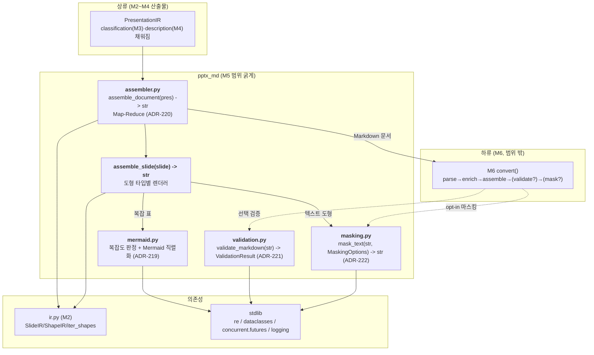
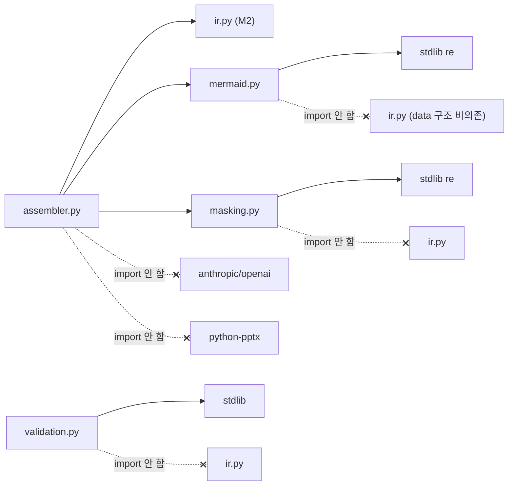
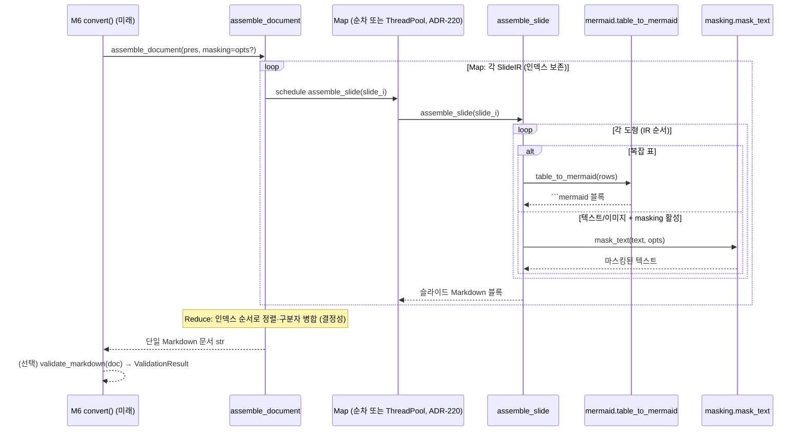

# ARCH-M5 — Markdown 어셈블러 (Map-Reduce + Mermaid fallback + 검증 + PII 마스킹)

> 범위: M5 (FR-11 어셈블러, FR-12 Map-Reduce, FR-13 Mermaid fallback, FR-14 validate_markdown, FR-15 개인정보 마스킹)
> 전제: `docs/00-charter/project-profile.md`, `docs/10-requirements/REQ-core.md`, `docs/20-design/ARCH-M2.md`, `docs/20-design/ARCH-M3.md`, M4 산출(describer/providers/description_pipeline, ADR-212~217)
> 스택 스킬: `.claude/skills/stack-python-packaging`
> 선행 ADR: ARCH-M2 ADR-201~207, ARCH-M3 ADR-208~211, M4 ADR-212~217 (본 문서는 **ADR-218 부터 연속**)
> 작성: architect / 2026-06-28
> 상태: 설계 초안 (reviewer 리뷰 / 사람 승인 전 — 아키텍처 게이트 대상)

---

## 0. 개요 — M5 목표와 M2~M4 연결점

M2 는 PPTX 를 `PresentationIR` 트리로 파싱했고(ADR-201~206), M3 는 `ImageShapeIR.classification` 슬롯을 채웠으며(ADR-208~211), M4 는 `ImageShapeIR.description` 슬롯을 VLM 으로 채웠다(ADR-214~216, in-place). **M5 는 이 채워진 IR 트리를 소비해 최종 산출물(단일 Markdown 문서 문자열)을 만드는 마지막 변환 단계**다. M5 이후에는 IR 을 더 소비하는 단계가 없다(M6 은 공개 API 조립·테스트·배포).

M5 의 5개 책임:

1. **FR-11 어셈블러 (#33, Must)** — `assemble_slide(SlideIR) -> str`. 한 슬라이드 IR 을 결정적 Markdown 블록으로 직렬화. 도형 타입별(텍스트/표/이미지/그룹/기타) Markdown 표현 규칙을 적용. M3/M4 가 채운 `classification`/`description` 을 이미지 표현에 반영.
2. **FR-12 Map-Reduce (#34, Must)** — `assemble_document(PresentationIR) -> str`. 슬라이드별 `assemble_slide`(Map)을 적용 후 단일 문서로 병합(Reduce). NFR-01(20슬라이드 p95 < 5초, VLM 제외) 대상 경로.
3. **FR-13 Mermaid fallback (#35, Should)** — 복잡한 표를 일반 Markdown 표 대신 ```mermaid 코드블록으로 표현. 복잡도 임계값은 M5 에서 확정(RFI-2, ADR-219).
4. **FR-14 validate_markdown (#36, Should)** — `validate_markdown(str) -> ValidationResult(valid, warnings)`. 생성된 Markdown 의 구조적 유효성 검사. 치명 결함 vs 경고 분리(ADR-221).
5. **FR-15 개인정보 마스킹 (#37, Should)** — `MaskingOptions` + `mask_text(str, MaskingOptions) -> str`. opt-in 정규식 마스킹 엔진. 이메일·전화 built-in defaults + 사용자 커스텀 패턴(RFI-4). 어셈블러가 마스킹 옵션을 적용(NFR-06).

### 0.1 M2~M4 와의 직접 연결점

| 상류 산출물 | M5 사용 방식 |
|-------------|--------------|
| `PresentationIR` / `SlideIR` (ADR-201) | 어셈블러의 **유일한 입력**. python-pptx 비의존(ADR-206 계승) → M5 단위 테스트는 IR 합성만으로 가능. |
| `TextShapeIR.paragraphs`(`ParagraphIR.text`, `.level`) | Markdown 문단·들여쓰기·리스트로 직렬화. 빈 문단 보존 규약(ADR-202) 처리 정책은 ADR-218 범위. |
| `TextShapeIR.is_title` / `SlideIR.title` | 슬라이드 제목 → Markdown 헤딩(`##`). |
| `TableShapeIR.rows`/`n_rows`/`n_cols` | Markdown 표 또는 Mermaid fallback(FR-13) 입력. 복잡도 판정(ADR-219). |
| `ImageShapeIR.alt_text` / `.classification`(M3) / `.description`(M4) | 이미지 Markdown 표현. description 있으면 본문화, 없으면 alt_text/placeholder. classification 으로 캡션 라벨. |
| `GroupShapeIR.children` / `iter_shapes`(ADR-203) | 그룹 평탄화 후 자식 도형 순차 직렬화. |
| `OtherShapeIR.fallback_text`(ADR-204) | best-effort 텍스트만 출력, 미지원 도형으로 인해 변환 중단 금지. |
| `SlideIR.notes` | 슬라이드 노트 → Markdown(선택 블록). |
| `errors.PptxMdError` 계층 | M5 는 신규 예외 도입 최소화. 어셈블러는 부분 실패 격리(ADR-204 계승, ADR-220). |

> **비-침습 원칙(ADR-206/211 계승)**: M5 는 `ir.py`·`parser.py`·M3/M4 모듈을 수정하지 않는다. M5 는 IR 을 **읽기 전용으로 소비**(어셈블러는 IR 을 변경하지 않음 — M3/M4 의 in-place enrich 와 달리 어셈블러는 순수 변환)하는 신규 모듈로만 구성된다. → 상류 회귀 위험 0, M5 단위 테스트가 IR 합성만으로 가능.

---

## 1. 아키텍처에 영향을 주는 요구사항 추출

> FR-11~15 는 REQ §4 기준 "차기 정제 대상"이었으나 디스패치(#33~#37)가 시그니처·핵심 AC 를 확정했다. 본 설계는 그 AC + 프로파일 + 선행 ADR 제약에서 설계 영향을 도출한다. 확정 AC 는 §8 WBS 초안 + 이슈 본문 AC 를 planner 가 박제한다.

| 출처 | 항목 | 설계 영향 |
|------|------|-----------|
| FR-11 #33 | `assemble_slide(SlideIR) -> str` 슬라이드 단위 직렬화 | `assembler.py`: `assemble_slide(slide: SlideIR) -> str` 공개 함수 + 도형 타입별 디스패치(`_render_text`/`_render_table`/`_render_image`/`_render_group`/`_render_other`) |
| FR-11 #33 | 도형 5종 + 그룹 재귀 Markdown 표현 | `ShapeKind` 디스패치(`isinstance` 또는 `kind` 태그). 그룹은 `children` 순차 직렬화(ADR-203 트리 보존). |
| FR-11 #33 | M3/M4 슬롯(classification/description) 반영 | 이미지 렌더링이 `description`(본문) → `alt_text` → placeholder 우선순위, `classification` 으로 캡션 라벨(§3.4) |
| FR-11 #33 | **결정적**(동일 IR → 동일 Markdown) | 난수·시각·딕트 순서·set 순회 의존 금지. 도형 순서는 IR 리스트 순서 그대로(ADR-218) |
| FR-12 #34 | `assemble_document(PresentationIR) -> str` Map-Reduce | `assembler.py`: 슬라이드별 `assemble_slide`(Map) → 구분자 병합(Reduce). 병렬화 여부는 ADR-220 |
| FR-12 #34 | NFR-01 20슬라이드 p95 < 5초 (VLM 제외) | 순차 vs ThreadPool 판단(ADR-220). 어셈블러는 CPU·문자열 작업뿐(VLM 제외 시 경량) |
| FR-13 #35 | 복잡 표 → Mermaid 코드블록 (임계값 M5 확정) | `mermaid.py`: 복잡도 판정 + Mermaid 직렬화. 임계값 상수 고정(결정성). 표현 형식 ADR-219 |
| FR-13 #35 | Should — 발동 안 하면 일반 Markdown 표 | 임계값 미만 표는 표준 Markdown 파이프 표. fallback 은 임계값 초과 시만 |
| FR-14 #36 | `validate_markdown(str) -> ValidationResult(valid, warnings)` | `validation.py`: `@dataclass ValidationResult(valid: bool, warnings: list[str])` + 검사 규칙. valid 판정 기준 ADR-221 |
| FR-14 #36 | Should — 구조적 유효성 (치명 vs 경고 분리) | 치명(valid=False) vs 경고(valid=True+warnings) 명문화(ADR-221) |
| FR-15 #37 | `MaskingOptions` + `mask_text(str, opts) -> str` opt-in | `masking.py`: `@dataclass MaskingOptions` + `mask_text`. opt-in(기본 비활성) |
| FR-15 #37 | 이메일·전화 built-in defaults + 커스텀 패턴(RFI-4) | 정규식 엔진. built-in 패턴 상수 + `MaskingOptions.custom_patterns` 확장(§3.6) |
| FR-15 #37 | 마스크 토큰 형식 (`[REDACTED]` vs `*` 반복) | ADR-222 |
| NFR-01 | 20슬라이드 p95 < 5초 (VLM 제외, ubuntu 2-core) | 어셈블러는 순수 문자열 작업. 병렬화는 ADR-220 에서 판단(VLM 제외 경로는 순차로도 여유). M6 강제 게이트 |
| NFR-02 | 신규 코드 라인 커버리지 ≥ 75% | IR 합성 픽스처로 도형 5종·그룹·빈 슬라이드·표 fallback·검증·마스킹 분기 커버(§7) |
| NFR-03 | mypy strict exit 0 | `ValidationResult`/`MaskingOptions` frozen dataclass 전 필드 타입 명시, 반환 타입 고정(§5.1) |
| NFR-04 | ruff + black exit 0 | M1 설정 그대로. line-length 88 |
| NFR-05 | API key 비포함 | M5 는 VLM·API key 미취급(어셈블러는 이미 description 이 채워진 IR 만 소비) |
| NFR-06 | 마스킹 활성 시 로그에 원본 텍스트 0건 | 마스킹·어셈블러 로그는 메타만(길이·매치 수·도형 id). **원본/마스킹 전 텍스트·매치 내용 로그 금지**(§4.4, ADR-222) |
| NFR-07 | Python 3.11+ | `X \| None`, `StrEnum`(M2), `from __future__ import annotations`, frozen dataclass |
| NFR-08 | core 설치(VLM·LibreOffice 미설치) 동작 | M5 4모듈 모두 stdlib(`re`, `dataclasses`, `concurrent.futures`, `logging`)만 + IR import. VLM SDK·Pillow·python-pptx import 0 |

> 통합 지점: M5 는 **외부 통합이 없다**. DB·메시징·SaaS·외부 프로세스 0 (M3 의 LibreOffice 통합도 M5 는 직접 호출 안 함 — 변환된 description 이 이미 IR 에 있음). → ERD 불필요. §3 에서 모듈/흐름/데이터 형태 다이어그램으로 대체.

---

## 2. 모듈 분해 & 컴포넌트 구조

### 2.1 신규 파일 목록 (`src/pptx_md/` 하위)

| 모듈 | 경로 | 책임 | FR | 상태 |
|------|------|------|----|------|
| Markdown 어셈블러 | `src/pptx_md/assembler.py` | `assemble_slide(SlideIR) -> str`, `assemble_document(PresentationIR) -> str`, 도형 타입별 렌더러, Map-Reduce | FR-11, FR-12 | 신규 |
| Mermaid fallback | `src/pptx_md/mermaid.py` | 표 복잡도 판정 + Mermaid 코드블록 직렬화 | FR-13 | 신규 |
| Markdown 검증기 | `src/pptx_md/validation.py` | `ValidationResult`, `validate_markdown(str) -> ValidationResult` | FR-14 | 신규 |
| PII 마스킹 | `src/pptx_md/masking.py` | `MaskingOptions`, `mask_text(str, MaskingOptions) -> str`, built-in 패턴 | FR-15 | 신규 |
| 패키지 진입점 | `src/pptx_md/__init__.py` | (변경 없음) M5 모듈은 내부 모듈 — 미노출(M6/FR-16 게이트) | — | 유지 |
| 테스트 | `tests/test_assembler.py` / `test_mermaid.py` / `test_validation.py` / `test_masking.py` | §7 전략 | — | 신규 |
| 테스트 픽스처 | `tests/conftest.py` | IR 합성 픽스처 추가(§7.1) | — | 확장 |

> **모듈 4분할 근거(ADR-218)**: 어셈블러(IR→Markdown, IR 의존)·Mermaid(표→다이어그램, IR 비의존 가능)·검증(Markdown→결과, IR 비의존)·마스킹(텍스트→텍스트, IR 비의존)을 분리하면 (a) 검증·마스킹은 IR 없이 문자열만으로 단위 테스트 가능(ADR-211 decoupling 철학 계승), (b) 단일 거대 `markdown.py` 회피 → 책임·테스트 격리, (c) M6 공개 API 가 필요한 함수만 선택 노출. 단, FR-11/12 는 같은 직렬화 컨텍스트(도형 렌더러 ↔ Map-Reduce)이므로 `assembler.py` 한 파일로 묶는다(ADR-218 — over-split 회피).

### 2.2 컨텍스트 / 컴포넌트 다이어그램



### 2.3 의존 방향 (단방향 — 순환 금지)



**핵심 규칙**:
- `mermaid.py`·`validation.py`·`masking.py` 는 **`ir.py` 를 import 하지 않는다**. 입출력은 순수 자료형(`list[list[str]]`/`str`)뿐 → IR 없이 단위 테스트 가능(ADR-211 계승). IR 결합은 `assembler.py` 단독 책임.
- 의존 방향 `assembler → {mermaid, masking, ir}` 단방향. `validation` 은 누구에게도 의존받지 않는 독립 검사기(M6 가 어셈블 결과에 적용). `mermaid`·`masking`·`validation` 상호 의존 0.
- 4모듈 모두 VLM SDK·python-pptx·Pillow import 0 (NFR-08).

### 2.4 컴포넌트 책임 표

| 모듈 | import 허용 | import 금지 | 부작용 |
|------|------------|------------|--------|
| `assembler.py` | `pptx_md.ir`, `pptx_md.mermaid`, `pptx_md.masking`, stdlib(logging, concurrent.futures) | anthropic, openai, python-pptx, Pillow | 없음(IR read-only, 새 문자열 생성) |
| `mermaid.py` | stdlib only | ir, VLM, python-pptx, Pillow | 없음(순수 함수) |
| `validation.py` | stdlib(re, dataclasses) | ir, VLM, python-pptx | 없음(순수 함수) |
| `masking.py` | stdlib(re, dataclasses) | ir, VLM, python-pptx | 없음(순수 함수) |

> **어셈블러는 IR 을 변경하지 않는다**: M3/M4 의 `enrich_*`는 in-place(ADR-210/215)였으나, M5 어셈블러는 IR 을 **읽어 새 문자열을 반환**하는 순수 변환이다. 입력 IR 불변 → 동일 IR 재어셈블 시 동일 결과(결정성·재현성). 이것이 어셈블러를 thread-safe 하게 만들어 ADR-220(병렬 Map) 안전성의 근거가 된다.

---

## 3. 공개 인터페이스 & 처리 흐름

### 3.1 `assembler.py` — 공개 인터페이스 (FR-11, FR-12)

```python
def assemble_slide(slide: SlideIR, *, masking: MaskingOptions | None = None) -> str:
    """Render one SlideIR into a deterministic Markdown block (FR-11).

    Read-only: does not mutate the IR. Same IR -> same Markdown (ADR-218).
    masking=None means no masking (opt-in, FR-15).
    """

def assemble_document(
    presentation: PresentationIR,
    *,
    masking: MaskingOptions | None = None,
) -> str:
    """Map-Reduce assembly of the whole presentation into one document (FR-12).

    Map: assemble_slide per slide. Reduce: join with a slide separator.
    Deterministic and order-preserving regardless of parallelism (ADR-220).
    """
```

| 항목 | 내용 |
|------|------|
| 입력 | `SlideIR`/`PresentationIR`(M2~M4 채워진 IR), 선택 `MaskingOptions` |
| 출력 | Markdown `str`(단일 슬라이드 블록 / 전체 문서) |
| 예외 | 도형 단위 격리(ADR-220 계승 ADR-204). 한 도형 렌더 실패가 슬라이드/문서 어셈블을 중단하지 않음 — best-effort 블록 또는 skip + WARNING |
| 결정성 | IR 리스트 순서 그대로, 난수·시각·set 순회 의존 0. 병렬 Map 이어도 인덱스 순서 보존(§3.5) |
| 부작용 | 없음(IR read-only) |

내부 디스패치(비공개):

```python
def _render_slide(slide: SlideIR, masking: MaskingOptions | None) -> str: ...
def _render_shape(shape: ShapeIR, masking: MaskingOptions | None) -> str: ...
def _render_text(shape: TextShapeIR, masking: MaskingOptions | None) -> str: ...
def _render_table(shape: TableShapeIR) -> str: ...        # FR-13 분기 진입
def _render_image(shape: ImageShapeIR, masking: MaskingOptions | None) -> str: ...
def _render_group(shape: GroupShapeIR, masking: MaskingOptions | None) -> str: ...
def _render_other(shape: OtherShapeIR, masking: MaskingOptions | None) -> str: ...
```

### 3.2 슬라이드/도형 Markdown 직렬화 규칙 (FR-11)

> 결정적 규칙 — 동일 IR 입력 → 동일 Markdown(ADR-218). 헤딩 레벨·구분자·라벨은 모듈 상수로 고정.

| 도형/요소 | Markdown 표현 (v1) |
|-----------|---------------------|
| `SlideIR.title` / title placeholder | `## {title}` (슬라이드 헤딩, 빈 제목이면 `## Slide {index+1}` 또는 헤딩 생략 — ADR-218 에서 빈값 정책 확정) |
| `TextShapeIR` (비-title) | 문단별 줄. `level>0` 은 들여쓴 리스트 항목(`  - ` * level) 또는 단순 문단(ADR-218 정책). 빈 문단(ADR-202)은 단락 구분으로 보존/축약 |
| `TableShapeIR` (단순) | 표준 Markdown 파이프 표(`\| a \| b \|` + 헤더 구분 `\|---\|`) |
| `TableShapeIR` (복잡) | FR-13 Mermaid fallback → ```mermaid 코드블록 (ADR-219, §3.3) |
| `ImageShapeIR` | description(M4) 있으면 본문 단락 + classification 라벨 캡션; 없으면 `` 또는 `_[image: {classification}]_` placeholder (§3.4) |
| `GroupShapeIR` | `children` 순차 직렬화(평탄화), 그룹 경계 마커 없음 또는 주석(ADR-218) |
| `OtherShapeIR` | `fallback_text` 있으면 단락, 없으면 skip 또는 `_[unsupported shape]_` 주석 (ADR-204 격리) |
| `SlideIR.notes` | (선택) `> notes:` 인용 블록 또는 별도 섹션 |

### 3.3 `mermaid.py` — Mermaid fallback (FR-13)

```python
def is_complex_table(rows: list[list[str]], n_rows: int, n_cols: int) -> bool:
    """Decide whether a table exceeds the Markdown-table complexity threshold.

    Threshold confirmed in M5 (RFI-2): see ADR-219 for the criteria/constants.
    Deterministic.
    """

def table_to_mermaid(rows: list[list[str]], n_rows: int, n_cols: int) -> str:
    """Serialise a complex table into a fenced ```mermaid block (FR-13, ADR-219)."""
```

| 항목 | 내용 |
|------|------|
| 입력 | 표 데이터(`rows: list[list[str]]`, `n_rows`, `n_cols`) — IR 비의존(ADR-211) |
| 출력 | 복잡 판정 `bool` / Mermaid 코드블록 `str` |
| 임계값 | 모듈 명명 상수(예: `MERMAID_MIN_CELLS`, `MERMAID_MIN_COLS`) — 결정성, M5 실험 보정(ADR-219) |
| 결정성 | 동일 표 → 동일 판정·출력 |

### 3.4 이미지 직렬화 — M3/M4 슬롯 반영 (FR-11)

우선순위 결정 규칙(`_render_image`, 첫 매치):

| 순위 | 조건 | Markdown 출력 |
|------|------|---------------|
| 1 | `description`(M4) 존재 | description 본문 단락 + `_[{classification} image]_` 캡션(classification 있을 때). 마스킹 옵션 활성 시 description 에 `mask_text` 적용 |
| 2 | `description` 없고 `alt_text` 존재 | `` (alt_text 도 마스킹 대상) |
| 3 | 둘 다 없고 `classification`(M3) 존재 | `_[image: {classification}]_` placeholder |
| 4 | 전부 없음 | `_[image]_` placeholder 또는 skip(ADR-218 확정) |

> M5 는 M3/M4 가 채운 슬롯을 **소비만** 한다. description 이 None 이면(M4 미실행·VLM 미설정·실패) graceful 하게 alt_text/classification/placeholder 로 강등 — NFR-08(VLM 없이 동작) 시 어셈블러가 빈 문서가 아니라 텍스트 중심 문서를 산출.

### 3.5 `assemble_document` 처리 흐름 (FR-12, Map-Reduce)



> **Reduce 결정성**: 병렬 Map(ADR-220 채택 시) 이라도 결과는 **슬라이드 인덱스 순서로 재정렬**해 병합한다(`executor.map` 은 입력 순서 보존 / 또는 인덱스 키 정렬). 동일 IR → 동일 문서 보장.

### 3.6 `masking.py` — PII 마스킹 (FR-15)

```python
@dataclass(frozen=True)
class MaskingOptions:
    """Opt-in PII masking configuration (FR-15, RFI-4)."""
    enabled: bool = False
    mask_email: bool = True       # built-in default pattern
    mask_phone: bool = True       # built-in default pattern
    custom_patterns: tuple[str, ...] = ()  # user regex patterns (RFI-4 확장)
    token: str = "[REDACTED]"     # mask token (ADR-222)

def mask_text(text: str, options: MaskingOptions) -> str:
    """Mask PII in *text* per *options*. opt-in: enabled=False -> text 그대로.

    Built-in email/phone defaults + custom regex patterns (RFI-4).
    Deterministic. Logs metadata only, never original/matched text (NFR-06).
    """
```

| 항목 | 내용 |
|------|------|
| 입력 | `text: str`, `MaskingOptions` |
| 출력 | 마스킹된 `str`(enabled=False 면 원본 그대로) |
| built-in | 이메일·전화 정규식 상수(RFI-4). 사용자가 `custom_patterns` 로 확장(주민번호·카드번호 등은 사용자 책임 — Out of Scope) |
| 토큰 | ADR-222 (`[REDACTED]` 고정) |
| 결정성 | 동일 입력·옵션 → 동일 출력. 패턴 적용 순서 고정 |
| NFR-06 | 로그에 원본/매치 텍스트 0건 — 매치 수·길이만 |

### 3.7 `validation.py` — Markdown 검증 (FR-14)

```python
@dataclass(frozen=True)
class ValidationResult:
    """Structural validation outcome for an assembled Markdown document (FR-14)."""
    valid: bool
    warnings: list[str]

def validate_markdown(markdown: str) -> ValidationResult:
    """Check the structural validity of *markdown* (FR-14).

    valid=False only for fatal structural defects (ADR-221); recoverable
    issues are warnings with valid=True. Deterministic. Never raises.
    """
```

| 검사 항목 | 분류(ADR-221) |
|-----------|---------------|
| 코드펜스(``` ```mermaid 포함) 짝 불일치 (열고 안 닫음) | **치명(valid=False)** — 다운스트림 파서 깨짐 |
| Markdown 표 행 열 수 불일치 / 헤더 구분선 누락 | 경고(valid=True) — 렌더러가 관용 처리 가능 |
| 빈 문서(공백만) | 경고 또는 치명 — ADR-221 에서 확정 |
| 헤딩 레벨 점프(## 없이 ####) | 경고 |
| 비정상 제어 문자 포함 | 경고 |

---

## 4. 횡단 관심사

### 4.1 mypy strict 전략 (NFR-03) — §5.1 참조

### 4.2 예외 처리 전략 (부분 실패 격리 — ADR-204/220 계승)

| 레벨 | 정책 |
|------|------|
| 도형 렌더 (`_render_*`) | 예상외 예외 격리. 한 도형 실패 시 해당 도형만 best-effort/skip + WARNING, 슬라이드 계속(ADR-220) |
| 슬라이드 (`assemble_slide`) | 슬라이드 내 도형 격리. 슬라이드는 항상 문자열 반환(빈 슬라이드면 헤딩만/빈 블록) |
| 문서 (`assemble_document`) | 슬라이드 단위 격리. 한 슬라이드 실패가 문서 어셈블 중단 금지(부분 문서 + WARNING) |
| 마스킹 (`mask_text`) | 잘못된 커스텀 정규식 → 해당 패턴 skip + WARNING(컴파일 실패 격리), 나머지 적용. raise 0 |
| 검증 (`validate_markdown`) | raise 0 — 검사 자체 실패는 warning 으로 환원. 항상 `ValidationResult` 반환 |

> M5 는 **신규 예외 클래스를 도입하지 않는다**. 어셈블 실패는 "오류"가 아니라 "best-effort 산출"로 모델링(M3/M4 의 graceful None 철학 계승). `PptxMdError` 계층(M2)은 file-level fail-fast 전용 유지.

### 4.3 트랜잭션 경계

M5 는 DB·외부 상태가 없으므로 트랜잭션 경계가 **존재하지 않는다**. 어셈블러는 순수 함수(IR read-only → str)이며, 동시성 단위는 슬라이드(ADR-220 병렬 Map 시)뿐. 공유 가변 상태 0 → 락 불필요.

### 4.4 로깅·감사 (NFR-06)

- 로거: `logging.getLogger("pptx_md.assembler" / ".mermaid" / ".validation" / ".masking")`.
- **원본 텍스트·문단 내용·셀 내용·마스킹 전후 텍스트·매치 문자열을 로그에 출력 금지**. 로그는 메타만: 슬라이드 인덱스, 도형 id, 도형 kind, 문단 수, 셀 수, 마스킹 매치 **수**(내용 아님), 검증 warning **수**.
- 마스킹 옵션 활성 시 특히 매치된 PII 원문을 절대 로그·예외 메시지에 넣지 않음(NFR-06 핵심).

### 4.5 NFR-08 의존성 격리 검증 포인트

- 4모듈에 `import anthropic`/`import openai`/`import pptx`/`from PIL` 0건 — reviewer `grep -rE "anthropic|openai|^import pptx|from PIL" src/pptx_md/{assembler,mermaid,validation,masking}.py` → 0 매치.
- core 설치(VLM·LibreOffice·Pillow 미설치 가정은 불가하나 VLM 미설치) 환경에서 `import pptx_md.assembler` 등 4모듈 import 성공 + description=None IR 도 graceful 어셈블(텍스트 중심 문서).

---

## 5. 기술 선택지 비교 (ADR 후보)

### 5.1 mypy strict — 자료형 좁히기

- `ValidationResult`/`MaskingOptions` 는 `frozen=True` dataclass 전 필드 타입 명시 → strict 통과.
- 어셈블러 도형 디스패치는 `isinstance` 좁히기(`TextShapeIR`/`TableShapeIR`/…)로 `ShapeIR` 베이스에서 구체 타입 확보. M2 IR 이 이미 타입 명시이므로 Any 유입 0.
- `concurrent.futures.ThreadPoolExecutor.map` 반환은 `Iterator[str]` 로 명시 좁힘.
- 정규식: `re.Pattern[str]`/`re.compile` 결과 타입 명시.

### 5.2 어셈블러 모듈 구성: 단일 파일 vs 도형 타입별 분리 (ADR-218 대상)

| 후보 | 장점 | 단점 |
|------|------|------|
| A. `assembler.py` 단일 파일(도형 렌더러는 모듈 내 private 함수) | FR-11/12 가 같은 직렬화 컨텍스트, 도형 렌더러 ↔ Map-Reduce 응집, import 단순, over-split 회피 | 파일이 다소 큼(완화: private 함수 분리) |
| B. 도형 타입별 모듈(`render_text.py`/`render_table.py`/…) | 도형별 격리 | 5개 모듈 + dispatch 모듈 → 과분할, 도형 간 공통 유틸 중복·순환 위험, IR 디스패치가 분산 |
| C. 클래스 기반 visitor (`MarkdownAssembler` 클래스 + visit_*) | OOP 확장 | v1 단순 변환에 상태 클래스는 과설계, 함수형으로 충분, 테스트 시 인스턴스화 부담 |

**권고: A(단일 파일 + private 렌더러)** — FR-11/12 가 동일 직렬화 책임이고, Mermaid·마스킹은 이미 별 모듈로 분리(§2.1)되어 어셈블러는 IR→Markdown 디스패치에 집중. → **ADR-218**.

### 5.3 Mermaid 직렬화 형식 (ADR-219 대상)

| 후보 | 장점 | 단점 |
|------|------|------|
| A. ```mermaid 블록 안에 표 데이터를 그대로 텍스트 보존(예: `graph`/주석 없이 리스트화하지 않고, 표 구조를 텍스트로 직렬) | 단순·결정적, 데이터 손실 0 | "다이어그램"이라기보다 텍스트. Mermaid 의미 약함 |
| B. Mermaid `flowchart`/`graph LR` 로 행→노드, 인접 셀→엣지 표현 | 시각적 다이어그램 | 표(2D 격자)를 그래프로 사상하는 의미가 불명확·임의적, 셀 텍스트 이스케이프 복잡, 결정성 위해 노드 id 규칙 고정 필요 |
| C. ```mermaid 안에 표를 텍스트 리스트/계층으로 직렬화 (헤더를 키로, 행을 항목으로) | LLM 친화적·구조 보존·결정적 | Mermaid 정식 다이어그램 문법은 아님(코드펜스 라벨만 mermaid) |

**권고: C(또는 A) — ```mermaid 코드펜스 안에 표를 결정적 텍스트 구조로 직렬화** — FR-13 의 의도는 "복잡 표를 LLM 이 소비하기 쉬운 대체 표현으로". 정식 Mermaid graph(B)는 2D 표→그래프 사상이 임의적이고 셀 이스케이프·노드 id 결정성 부담이 큼. **표를 ```mermaid 펜스 안에 헤더-행 계층 텍스트로 직렬화**(C)하거나 단순 보존(A)이 결정적·손실 0·구현 단순. 정식 graph 다이어그램은 v2 후보(§9 부채). → **ADR-219(C 권고)**. 단, "Mermaid 다이어그램 타입을 정식 graph 로 강제할지"는 산출물 소비자(LLM) 효용 관점의 판단이 갈리므로 **NEEDS_DECISION 후보**(아래 §9).

### 5.4 Map-Reduce 병렬화 (ADR-220 대상)

| 후보 | 장점 | 단점 |
|------|------|------|
| A. **순차 Map** (`for slide in slides: assemble_slide(...)`) | 단순·결정적·디버깅 용이, GIL 영향 없음, NFR-01 은 VLM 제외 순수 문자열 작업이라 20슬라이드 < 5초 여유 | 다중코어 미활용 |
| B. `ThreadPoolExecutor` 병렬 Map | 다중코어(I/O 시) | **어셈블러는 CPU 바운드 문자열 작업** → GIL 로 스레드 병렬 이득 미미, 순서 보존 코드 추가, 결정성 검증 부담, 디버깅 복잡 |
| C. `ProcessPoolExecutor` | 진짜 병렬 | IR 직렬화(pickle) 비용·복잡, 20슬라이드 규모엔 오버헤드 > 이득, 프로파일 단순성 위배 |

**권고: A(순차 Map)** — NFR-01 의 5초 예산은 **VLM 호출 제외** 기준이며 M5 어셈블러는 순수 문자열·정규식 작업이라 20슬라이드 직렬화가 수십 ms 규모(VLM I/O 가 실제 병목, 그건 M4 description_pipeline 이 이미 IR 에 반영 완료). 스레드(B)는 CPU 바운드라 GIL 로 이득 미미하면서 결정성·복잡도만 증가. 단, 함수 시그니처는 `assemble_document(pres) -> str` 로 고정해 **내부 구현을 순차로 두되, 향후 병렬화 가능하도록 슬라이드 단위 순수 함수(thread-safe)로 설계**(§2.4). → **ADR-220(순차 확정)**. NFR-01 측정은 M6 게이트에서 실측·필요 시 B 로 전환(시그니처 불변).

### 5.5 마스크 토큰 형식 (ADR-222 대상)

| 후보 | 장점 | 단점 |
|------|------|------|
| A. `[REDACTED]` 고정 토큰 | 명확·가독·LLM 이 "마스킹됨"을 인지, 길이 정보 비노출(보안↑), 결정적 | 원문 길이 정보 손실(의도된 보안) |
| B. 매치 길이 보존 `*` 반복(`****@****.***`) | 시각적 형태 보존 | 길이로 원문 추정 가능(약한 정보 누출), 구두점 보존 여부 등 규칙 복잡, NFR-06 취지(원문 정보 비노출)와 상충 |
| C. 카테고리 토큰(`[EMAIL]`/`[PHONE]`) | 의미 보존 | 커스텀 패턴은 카테고리 미상 → `[REDACTED]` 혼용 필요(일관성↓), v1 단순성 위배 |

**권고: A(`[REDACTED]` 고정)** — 보안 목적(NFR-06: 원본 비노출)에 길이 보존(B)은 정보 누출 표면. `MaskingOptions.token` 으로 사용자 커스터마이즈 여지는 남기되 **기본 `[REDACTED]` 고정**. 카테고리 토큰(C)은 커스텀 패턴과 일관성 깨짐. → **ADR-222(A 확정, token 커스터마이즈 허용)**.

### 5.6 validate_markdown valid 판정 기준 (ADR-221 대상)

| 후보 | 내용 |
|------|------|
| A. 엄격: 모든 결함 valid=False | 사소한 표 정렬 차이로도 invalid → Should 기능이 과민·실용성↓ |
| B. **이원화: 치명만 valid=False, 나머지 warning(valid=True)** | 다운스트림 파싱을 깨는 결함(미닫힌 코드펜스 등)만 치명, 관용 처리 가능한 것은 경고 → FR-14 "구조적 유효성" 의도 부합 |
| C. 항상 valid=True + warnings | valid 신호가 무의미 |

**권고: B(이원화)** — FR-14 의 `ValidationResult(valid, warnings)` 구조 자체가 이원화를 전제. **치명 = 코드펜스 짝 불일치(어셈블러가 ```mermaid 를 생성하므로 자기검증 가치 큼)·문서 파싱 불능**, 그 외(표 열 수 불일치·헤딩 점프·제어문자)는 warning. → **ADR-221(B 확정, §3.7 표가 분류)**.

---

## 6. 아키텍처 결정 기록 (ADR-218 ~ ADR-222)

### ADR-218 어셈블러는 단일 `assembler.py` + 도형 타입별 private 렌더러 (어셈블 결정성 규약 포함)
**배경**: FR-11(`assemble_slide`)·FR-12(`assemble_document`)는 동일한 IR→Markdown 직렬화 책임. Mermaid·마스킹·검증은 이미 별 모듈(§2.1). 도형 타입별 모듈 분할 vs 단일 파일이 갈림. 또한 어셈블 결과는 결정적이어야 함(FR-11 AC).
**결정**: `assembler.py` 단일 파일에 공개 `assemble_slide`/`assemble_document` + private `_render_text/_render_table/_render_image/_render_group/_render_other` 디스패치를 둔다. 도형 순서는 IR 리스트 순서 그대로(난수·set·dict 순회 의존 0). 헤딩 레벨·구분자·placeholder 라벨은 모듈 명명 상수로 고정. 빈 title/문단(ADR-202)·없는 description 의 강등 정책(§3.2/3.4)은 상수·우선순위 규칙으로 명시.
**근거**: FR-11/12 의 높은 응집(렌더러 ↔ Map-Reduce), import 단순, over-split(도형별 모듈) 시 공통 유틸 중복·순환 위험·디스패치 분산 회피. 클래스 visitor 는 v1 무상태 변환에 과설계. 상수 고정·IR 순서 보존이 결정성을 보장(동일 IR→동일 Markdown).
**대안과 기각 사유**: 도형 타입별 모듈(과분할·중복·순환), visitor 클래스(상태 불요·테스트 인스턴스화 부담).
**영향**: 어셈블러는 `ir.py`·`mermaid`·`masking` 만 의존(단방향). IR read-only(불변) → thread-safe(ADR-220 병렬 안전 근거). 단위 테스트는 IR 합성으로 도형 5종·그룹·빈 슬라이드 커버.

### ADR-219 Mermaid fallback 은 ```mermaid 코드펜스 안 결정적 텍스트 구조 직렬화(정식 graph 다이어그램 아님)
**배경**: FR-13(Should)은 복잡 표를 Mermaid 코드블록으로 대체. 표(2D 격자)를 정식 Mermaid `graph`/`flowchart` 로 사상하면 행/셀↔노드/엣지 매핑이 임의적이고 셀 텍스트 이스케이프·노드 id 결정성 부담이 큼. 임계값은 M5 에서 확정(RFI-2).
**결정**: `mermaid.py` 의 `table_to_mermaid` 는 표를 ```mermaid 펜스 안에 **헤더-행 계층의 결정적 텍스트 구조**로 직렬화(데이터 손실 0, 셀 이스케이프 단순). 복잡도 판정 `is_complex_table` 은 모듈 명명 상수(예: `MERMAID_MIN_CELLS`, `MERMAID_MIN_COLS`, 병합·과다 행수 등)로 고정 → 결정성. 임계값 초기값은 M5 합성 픽스처로 보정(규칙 구조 고정, 상수만 튜닝). 임계값 미만 표는 표준 Markdown 파이프 표.
**근거**: FR-13 의도는 "LLM 이 소비하기 쉬운 대체 표현". 정식 graph(2D→그래프)는 의미 임의적·결정성·이스케이프 부담. 텍스트 구조 직렬화는 손실 0·결정적·구현 단순. 임계값 상수 고정으로 결정성·튜닝 추적성 확보.
**대안과 기각 사유**: 정식 `flowchart`/`graph LR`(2D 표→그래프 사상 임의·이스케이프/노드 id 복잡 — v2 후보), 단순 보존(A, 구조 라벨 없음 — C 가 LLM 효용 우위).
**영향**: `mermaid.py` 는 IR 비의존(rows/n_rows/n_cols 입력 — ADR-211 계승). 어셈블러 `_render_table` 이 `is_complex_table` 분기. 정식 다이어그램 형식 채택 여부는 소비자 효용 판단이 갈려 **NEEDS_DECISION 후보**(§9).

### ADR-220 Map-Reduce 는 순차 Map (슬라이드 단위 순수 함수 thread-safe 설계로 향후 병렬화 여지 유지)
**배경**: FR-12 는 슬라이드별 변환(Map)+병합(Reduce). NFR-01(20슬라이드 p95 < 5초)은 **VLM 호출 제외** 기준. 어셈블러는 CPU 바운드 문자열·정규식 작업.
**결정**: `assemble_document` 은 **순차 Map**(`for slide in slides`)+ Reduce(인덱스 순서 구분자 병합). 슬라이드 어셈블은 IR read-only 순수 함수(공유 가변 상태 0 → thread-safe)로 설계해 시그니처 불변으로 향후 병렬화 가능. Reduce 는 인덱스 순서 재정렬·병합으로 결정성 보장.
**근거**: NFR-01 5초 예산은 VLM 제외이고(VLM I/O 는 M4 가 이미 IR 에 반영 완료) 순수 문자열 직렬화는 20슬라이드 수십 ms 규모. ThreadPool 은 CPU 바운드라 GIL 로 이득 미미하면서 순서 보존·결정성·디버깅 비용↑. ProcessPool 은 IR pickle 오버헤드 > 이득. 순차가 단순·결정적·충분.
**대안과 기각 사유**: ThreadPoolExecutor(GIL·결정성·복잡도 — 이득 미미), ProcessPoolExecutor(pickle 오버헤드·복잡·프로파일 단순성 위배).
**영향**: NFR-01 실측·게이트는 M6. 어셈블 함수가 순수·thread-safe 라 측정 후 필요 시 병렬 전환이 시그니처 불변으로 가능(부채 아닌 설계 여지). 결정성 회귀 테스트(동일 IR 2회→동일 문서) 포함(§7).

### ADR-221 validate_markdown 은 치명/경고 이원 판정 (치명만 valid=False)
**배경**: FR-14(Should)는 `ValidationResult(valid, warnings)` — 구조 자체가 이원화 전제. 모든 결함을 invalid 로 보면 과민(Should 실용성↓), 모두 warning 이면 valid 무의미.
**결정**: **다운스트림 Markdown 파싱을 깨는 구조 결함만 valid=False(치명)**, 관용 처리 가능한 것은 valid=True + warning. 치명: 코드펜스(```/```mermaid) 짝 불일치·미닫힘(어셈블러가 ```mermaid 를 생성하므로 자기검증 가치 큼), 문서 파싱 불능. 경고: 표 행 열 수 불일치·헤더 구분선 누락·헤딩 레벨 점프·비정상 제어문자. 빈 문서 판정은 §3.7 표대로(M5 확정). `validate_markdown` 은 raise 0 — 검사 실패도 warning 으로 환원, 항상 `ValidationResult` 반환.
**근거**: FR-14 의 `valid`/`warnings` 분리 의도에 부합. 코드펜스 짝은 LLM 파이프 입력을 실제로 깨므로 치명. 표 정렬류는 대부분 렌더러가 관용 처리 → 경고로 충분(실용성).
**대안과 기각 사유**: 엄격(모든 결함 invalid — 과민·Should 무용), 항상 valid(valid 신호 무의미).
**영향**: `validation.py` 는 IR·VLM 비의존(str→ValidationResult). M6 가 어셈블 결과에 선택 적용. 어셈블러가 생성하는 코드펜스를 self-validate 가능(회귀 안전망).

### ADR-222 마스크 토큰은 `[REDACTED]` 고정(커스터마이즈 허용), 길이 비보존
**배경**: FR-15(Should, opt-in)는 정규식 마스킹 엔진(이메일·전화 built-in + 커스텀 패턴, RFI-4). 토큰 형식이 `[REDACTED]` 고정 vs 매치 길이 보존 `*` 반복으로 갈림. NFR-06 은 원본 텍스트 비노출.
**결정**: 마스크 토큰 기본 `[REDACTED]` **고정 문자열**(길이 비보존). `MaskingOptions.token` 으로 사용자 커스터마이즈 허용. `mask_text` 는 opt-in(`enabled=False` 면 원본 그대로), built-in 이메일·전화 정규식 + `custom_patterns` 적용(컴파일 실패 패턴은 skip+WARNING 격리). 로그·예외에 원본/매치 텍스트 0건(NFR-06), 매치 수·길이만.
**근거**: 보안 목적상 길이 보존(`*` 반복)은 원문 길이 추정이라는 약한 정보 누출 표면 → NFR-06 취지와 상충. `[REDACTED]` 는 명확·LLM 이 마스킹 인지·결정적. 카테고리 토큰은 커스텀 패턴과 일관성 깨짐. token 커스터마이즈로 유연성 유지.
**대안과 기각 사유**: 길이 보존 `*`(정보 누출·구두점 규칙 복잡), 카테고리 토큰(커스텀 패턴 카테고리 미상→일관성↓·v1 과설계).
**영향**: `masking.py` 는 IR 비의존(str→str). 어셈블러가 텍스트·이미지 description/alt_text 에 `mask_text` 적용(opt-in). 커스텀 패턴 컴파일 격리로 잘못된 정규식이 변환 전체를 깨지 않음.

---

## 7. 테스트 전략

### 7.1 결정적 IR 합성 픽스처 (FR-11/12)

- **IR 을 코드로 합성**(python-pptx 불요 — ADR-206/211 계승) → diff 가능·의도 명시.
- `conftest.py` 픽스처 추가:
  - `slide_text_only`: title + 다중 문단(level 0/1) TextShapeIR → 헤딩·문단·들여쓰기 검증.
  - `slide_simple_table`: 작은 TableShapeIR → 표준 Markdown 파이프 표.
  - `slide_complex_table`: 임계 초과 TableShapeIR → Mermaid fallback(FR-13).
  - `slide_image_described`: description(M4)·classification(M3) 채워진 ImageShapeIR → description 본문 + 캡션.
  - `slide_image_bare`: description=None, alt_text/classification 만 → 강등 경로(§3.4).
  - `slide_group_nested`: GroupShapeIR(자식 텍스트/이미지) → 평탄화·재귀 직렬화.
  - `slide_other`: OtherShapeIR(fallback_text 유/무) → best-effort/skip.
  - `presentation_20_slides`: NFR-01 성능 스모크용(M6 게이트, M5 는 결정성·정확성 위주).
- 각 픽스처: **고정 IR → 고정 Markdown**(결정성 회귀: 동일 IR 2회 어셈블 → 동일 문자열 assert, FR-11/12 AC).

### 7.2 Mermaid fallback 테스트 (FR-13)

- 임계값 미만 표 → 표준 Markdown 표(fallback 미발동).
- 임계값 초과 표 → ```mermaid 펜스(시작/끝 짝, 데이터 손실 0) 검증.
- 임계값 근방(경계) 픽스처로 분기 결정성 검증(TR-21 SKIP 교훈: 경계 픽스처 확보).
- `is_complex_table`/`table_to_mermaid` 는 IR 없이 `rows` 만으로 단위 테스트(ADR-211/219).

### 7.3 검증·마스킹 테스트 (FR-14/15)

- validate_markdown: 정상 문서→valid=True/warnings=[], 미닫힌 코드펜스→valid=False(치명, ADR-221), 표 열 수 불일치→valid=True+warning, raise 0.
- mask_text: enabled=False→원본 그대로(opt-in), 이메일/전화 built-in 매치→`[REDACTED]`, 커스텀 패턴 적용, 잘못된 커스텀 정규식→skip+계속(격리), 동일 입력 2회→동일 출력(결정성).
- **NFR-06 게이트**: caplog 로 마스킹 로그에 원본/매치 텍스트 0건 assert.

### 7.4 결정성·타입·스타일·격리 게이트

- 결정성: 핵심 어셈블·마스킹·Mermaid 테스트에 "2회 호출 동일 결과" assert(FR-11/12/13/15 AC).
- 부분 실패 격리: 한 도형 렌더 실패가 슬라이드/문서 어셈블 비중단(monkeypatch 로 강제 예외).
- mypy: `mypy src/` exit 0(신규 4모듈 strict).
- ruff/black: line-length 88, exit 0.
- VLM/python-pptx/Pillow import 0: grep 게이트(§4.5).
- 커버리지: 도형 5종+그룹+빈+fallback+검증+마스킹 분기 → NFR-02 75% 라인 커버.

---

## 8. WBS — 구현 이슈 분해

각 단위 developer 반나절~하루 독립 수행 가능. 의존: W2(mermaid)·W4(validation)·W5(masking)는 IR 비의존이라 W1(assembler 골격)과 병행 가능. W1 의 표/이미지/마스킹 통합은 W2/W5 선행. W6(테스트)는 각 구현과 병행/직후.

| ID | 작업 | 대응 FR | 참조 설계 절 | AC 초안 | 의존 |
|----|------|---------|-------------|---------|------|
| W1 | `assembler.py`: `assemble_slide` + 도형 5종 private 렌더러 + 그룹 재귀 + 결정성·격리 + 헤딩/문단/들여쓰기 상수 | FR-11 | 3.1, 3.2, 3.4, 4.2, ADR-218 | (1) `assemble_slide(SlideIR)->str`, IR read-only(불변); (2) 도형 5종+그룹 재귀 Markdown 직렬화; (3) description(M4)/classification(M3) 반영·강등(§3.4); (4) 동일 IR 2회→동일 문자열(결정성); (5) 한 도형 실패가 슬라이드 비중단(격리); (6) VLM/pptx/PIL import 0(grep); (7) `mypy src/` exit 0 | W5(이미지 마스킹 통합 시) |
| W2 | `mermaid.py`: `is_complex_table` + `table_to_mermaid` + 임계 상수 | FR-13 | 3.3, 5.3, ADR-219 | (1) `is_complex_table(rows,n_rows,n_cols)->bool` 임계 상수 기반·결정적; (2) `table_to_mermaid(...)` ```mermaid 펜스 짝·데이터 손실 0; (3) IR 비의존(rows 입력); (4) 임계 미만/초과/경계 분기; (5) VLM/pptx/PIL import 0; (6) `mypy src/` exit 0 | 없음 |
| W3 | `assembler.py`: `assemble_document` Map-Reduce(순차) + 표 fallback 분기 통합 + 인덱스 순서 Reduce | FR-12, FR-13 통합 | 3.5, 5.4, ADR-220 | (1) `assemble_document(PresentationIR)->str`; (2) 순차 Map+인덱스 순서 Reduce(결정성); (3) 복잡 표→`mermaid.table_to_mermaid` 분기; (4) 슬라이드 단위 격리(한 슬라이드 실패 비중단); (5) 동일 IR 2회→동일 문서; (6) `mypy src/` exit 0 | W1, W2 |
| W4 | `validation.py`: `ValidationResult` + `validate_markdown` 치명/경고 이원 판정 | FR-14 | 3.7, 5.6, ADR-221 | (1) `validate_markdown(str)->ValidationResult(valid,warnings)`; (2) 코드펜스 미닫힘→valid=False(치명); (3) 표/헤딩류→warning(valid=True); (4) raise 0(항상 결과 반환); (5) IR 비의존; (6) `mypy src/` exit 0 | 없음 |
| W5 | `masking.py`: `MaskingOptions` + `mask_text` + built-in 이메일/전화 + 커스텀 패턴 격리 | FR-15 | 3.6, 5.5, 4.4, ADR-222 | (1) `mask_text(str,MaskingOptions)->str` opt-in(enabled=False→원본); (2) built-in 이메일/전화→`[REDACTED]`; (3) 커스텀 패턴 적용·잘못된 정규식 skip+격리; (4) 동일 입력 2회→동일 출력; (5) 로그에 원본/매치 텍스트 0건(NFR-06, caplog); (6) IR 비의존; (7) `mypy src/` exit 0 | 없음 |
| W6 | 테스트: `conftest.py` IR 합성 픽스처 + `test_assembler.py`/`test_mermaid.py`/`test_validation.py`/`test_masking.py` | FR-11~15 검증 | 7.1~7.4 | (1) 도형 5종+그룹+빈+fallback 픽스처 분기 커버; (2) 검증 치명/경고, 마스킹 opt-in/built-in/커스텀/격리; (3) 결정성 2회 assert; (4) 격리(도형/슬라이드) 테스트; (5) NFR-06 caplog 게이트; (6) `pytest` exit 0, 신규 4모듈 라인 커버리지 ≥ 75% | W1~W5 |

> 분할 권고: W2/W4/W5 병행(상호·IR 비의존). W1→W3 순. PM 판단으로 이슈 #33=W1+W3 일부, #34=W3, #35=W2, #36=W4, #37=W5 매핑 가능. **이슈 AC 는 planner 가 본 §8 초안 + 디스패치 #33~#37 AC 로 확정**.

---

## 9. 요구사항 추적표

### 9.1 M5 활성 FR → 설계 요소

| FR | AC 영향 | 충족 설계 요소 |
|----|---------|---------------|
| FR-11 어셈블러 | `assemble_slide(SlideIR)->str` 도형 5종+그룹 | §3.1/3.2 `assemble_slide`+렌더러, ADR-218, W1 |
| FR-11 (M3/M4 슬롯 반영) | classification/description 이미지 표현 | §3.4 이미지 우선순위 규칙, ADR-218, W1 AC3 |
| FR-11 (결정성) | 동일 IR→동일 Markdown | §3.2 IR 순서·상수, §7.4, ADR-218, W1 AC4 |
| FR-12 Map-Reduce | `assemble_document(PresentationIR)->str` | §3.5 순차 Map+Reduce, ADR-220, W3 |
| FR-12 (NFR-01 성능) | 20슬라이드 p95<5초(VLM 제외) | §5.4 순차 충분 근거, ADR-220, M6 실측 게이트 |
| FR-13 Mermaid fallback | 복잡 표→```mermaid (임계 M5 확정) | §3.3 `mermaid.py`, §5.3, ADR-219, W2 |
| FR-13 (임계값) | RFI-2 M5 실험 확정 | §3.3 임계 상수, ADR-219, W2 AC1 |
| FR-14 validate_markdown | `ValidationResult(valid,warnings)` | §3.7 `validation.py`, §5.6, ADR-221, W4 |
| FR-14 (치명/경고 분리) | valid 판정 기준 명문화 | §3.7 표, ADR-221, W4 AC2/AC3 |
| FR-15 마스킹 | `MaskingOptions`+`mask_text` opt-in | §3.6 `masking.py`, §5.5, ADR-222, W5 |
| FR-15 (built-in+커스텀, RFI-4) | 이메일/전화 default + 커스텀 패턴 | §3.6, ADR-222, W5 AC2/AC3 |
| FR-15 (토큰 형식) | `[REDACTED]` 고정 | §5.5, ADR-222, W5 AC2 |

### 9.2 NFR 충족 1줄 근거 (M5 관점)

| NFR | 이 설계가 충족하는 방법 |
|-----|------------------------|
| NFR-01 변환 성능 | 어셈블러는 순수 문자열·정규식(VLM 제외 경로). 순차 Map 으로 20슬라이드 수십 ms 규모(§5.4, ADR-220), 슬라이드 순수 함수로 향후 병렬 여지. M6 실측 게이트 |
| NFR-02 커버리지 75% | IR 합성 픽스처로 도형 5종+그룹+빈+fallback+검증 치명/경고+마스킹 opt-in/커스텀/격리 분기 커버(§7) |
| NFR-03 타입 안전성 | `ValidationResult`/`MaskingOptions` frozen dataclass 타입 명시 + isinstance 좁히기 + re.Pattern[str] 명시, `mypy src/` exit 0(§5.1, W AC) |
| NFR-04 코드 스타일 | M1 ruff/black 설정 그대로, line-length 88(CI 게이트) |
| NFR-05 비밀정보 | M5 는 API key·VLM 미취급(채워진 IR 만 소비)(§1) |
| NFR-06 로깅(PII) | 원본/매치/마스킹 전후 텍스트·셀·문단 로그 0건, 메타(인덱스·id·수)만. caplog 게이트(§4.4, ADR-222, W5 AC5) |
| NFR-07 런타임 호환 | `X\|None`·StrEnum(M2)·frozen dataclass·`from __future__ import annotations` 등 3.11+ 문법 |
| NFR-08 의존성 격리 | 4모듈 stdlib(re/dataclasses/concurrent.futures/logging)+ir(assembler만) only. VLM/pptx/PIL import 0. description=None IR 도 graceful 텍스트 문서(§3.4, §4.5, W AC) |

### 9.3 M5 범위 밖 FR

FR-01~10(완료), FR-16~19(M6) 는 M5 비활성. M5 산출물이 후속을 막지 않음 보장:
- `assemble_document` 가 M6 `convert()`(FR-16)의 핵심 파이프 마지막 단계로 조립 준비 완료(parse→enrich_images→enrich_descriptions→assemble→validate?→mask?).
- 어셈블러·검증·마스킹이 IR 또는 str 만 입력(ADR-211/218/221/222 decoupling)이라 M6 공개 API 가 필요 함수만 선택 노출(FR-16).
- M5 4모듈 모두 내부 모듈 — `__init__.py` 미변경(M6/FR-16 게이트 계승).

> M5 활성 FR(FR-11~15) 누락 0. NFR 8건 전부 매핑.

---

## 10. 기술 부채 / 제약 (v1 한계 & 향후 개선)

| 구분 | 내용 | 대응 |
|------|------|------|
| 제약 | Mermaid fallback 이 정식 graph 다이어그램이 아닌 ```mermaid 펜스 안 텍스트 구조(ADR-219) | 정식 `flowchart`/`graph` 사상은 v2 후보. v1 은 손실 0·결정성·LLM 효용 우선. 형식 확정은 §11 NEEDS_DECISION |
| 제약 | 어셈블러 순차 Map(ADR-220) — 다중코어 미활용 | NFR-01 은 VLM 제외 경로라 순차 충분. M6 실측 후 필요 시 ThreadPool 전환(시그니처 불변, 슬라이드 순수 함수 설계) |
| 제약 | 마스킹은 정규식 엔진만(주민번호·카드번호 카테고리 미보장, RFI-4/Out of Scope) | 사용자 `custom_patterns` 로 대응. 라이브러리는 이메일·전화 default 만 |
| 부채 | Mermaid 복잡도 임계값(ADR-219)은 합성 픽스처 기반 초기값 | 규칙 구조 고정, 상수만 M5/M6 실험 튜닝(결정성 유지) |
| 제약 | validate_markdown 은 구조 검사만(의미·링크 유효성 미검) | FR-14 Should 범위. 링크·이미지 경로 유효성은 v2 후보 |
| 부채 | 표 병합 셀은 M2 가 셀 텍스트 반복으로 평탄화(ARCH-M2 §11) | 어셈블러는 평탄화된 rows 를 그대로 표현. 병합 셀 복원은 IR 스키마 변경 동반(M2 부채 계승) |

> 프로파일에 없는 인프라/라이브러리 도입 0 (re/dataclasses/concurrent.futures/logging=stdlib, ir=M2 산출). 환경 제약(PyPI 퍼블릭·VLM 미설치 동작)과 모순 0.

---

## 11. NEEDS_DECISION (사람 게이트 후보)

> 본 설계는 ADR-218~222 로 5개 결정을 권고안과 함께 닫았다. 단 아래 1건은 산출물 소비자(LLM) 효용 관점의 트레이드오프가 갈려 사람 확정을 권고한다.

- **ND-1 (ADR-219 연계) Mermaid fallback 형식**: "복잡 표를 ```mermaid 펜스 안 결정적 텍스트 구조(권고안 C)"로 둘지, "정식 Mermaid `flowchart`/`graph` 다이어그램(B)"으로 사상할지.
  - 트레이드오프: C는 손실 0·결정성·구현 단순하나 시각 다이어그램 의미가 약함. B는 시각적이나 2D 표→그래프 사상이 임의적·셀 이스케이프/노드 id 결정성 부담·구현 복잡.
  - 권고: **C**(v1), B는 v2. FR-13 이 "Should"이고 임계값도 M5 실험 확정이므로 v1 은 안전한 C 로 진행하되, 소비 LLM 효용 검증 후 사람이 B 전환 여부 판단.
  - 영향 범위: `mermaid.py` `table_to_mermaid` 구현만(시그니처 불변). 결정 지연이 W1/W3 를 막지 않음(W2 만 영향).
