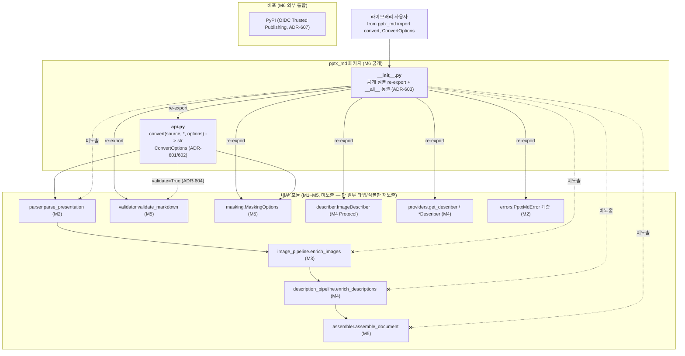
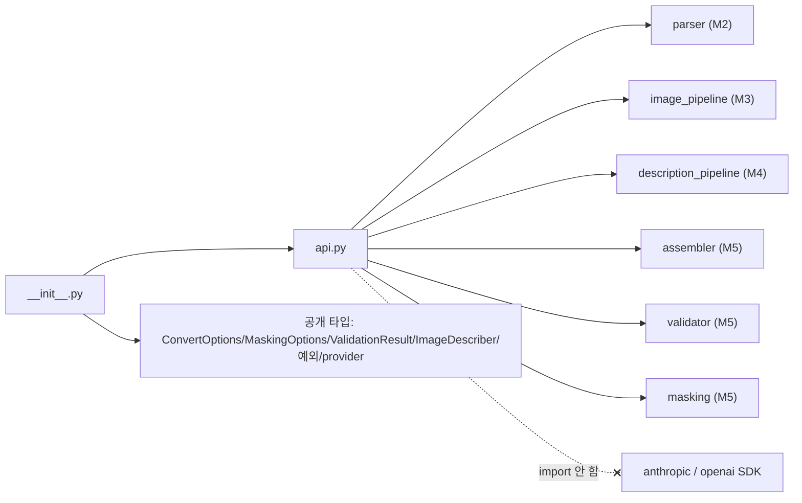
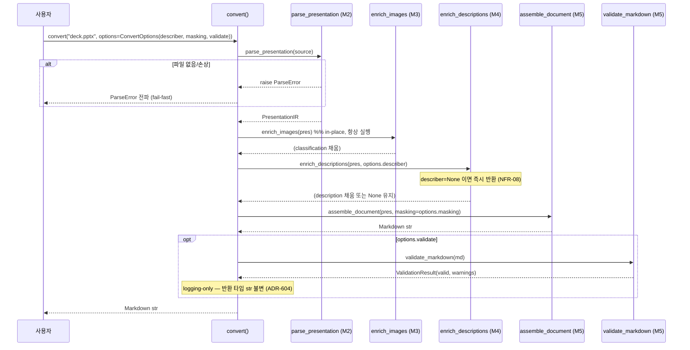

# ARCH-M6 — 공개 API + 테스트 게이트 + 문서화 + PyPI 배포

> 범위: M6 (FR-16 공개 API, FR-17 테스트 스위트/커버리지 게이트, FR-18 README+사용 예시, FR-19 PyPI 배포)
> 전제: `docs/00-charter/project-profile.md`, `docs/10-requirements/REQ-core.md` §4 FR-16~19 / §5 NFR, `docs/20-design/ARCH-M1.md`~`ARCH-M5.md`
> 스택 스킬: `.claude/skills/stack-python-packaging`
> 선행 ADR: M1 ADR-001~004, M2 ADR-201~207, M3 ADR-208~211, M4 ADR-212~217, M5 ADR-218~222 → 본 문서는 **ADR-601 부터 (M6 시리즈)**
> 작성: architect / 2026-06-28
> 상태: 설계 초안 (reviewer 리뷰 / 사람 승인 전 — 아키텍처 게이트 대상)

---

## 0. 개요 — M6 목표와 M1~M5 연결점

M1~M5 는 변환 파이프라인의 **모든 단계 모듈을 내부 모듈로** 구현했다(`__init__.py` 는 의도적으로 빈 `__all__` 유지 — 스킬 §1, M5 §9.3). **M6 은 신규 변환 로직을 추가하지 않는다.** M6 의 일은 다음 4가지다:

1. **FR-16 공개 API**: 흩어진 5단계(parse → enrich_images → enrich_descriptions → assemble → validate?)를 단일 `convert()` 오케스트레이터로 묶고, 패키지 루트(`pptx_md`)에서 사용자가 import 할 **공개 심볼 집합을 확정·동결**한다.
2. **FR-17 테스트 게이트**: M1 에서 측정만(`--cov`) 하던 커버리지를 **강제 게이트(`--cov-fail-under=75`)** 로 승격한다(NFR-02). 통합 테스트(`convert()` end-to-end)를 추가한다.
3. **FR-18 문서**: README(설치·기본 사용·VLM·마스킹 예시) + `docs/` API 레퍼런스. 추가 문서 도구 도입 여부 결정.
4. **FR-19 PyPI 배포**: 버전 확정 + 배포 워크플로(인증 방식 확정). `hatch publish` 실제 실행은 헌장 제약상 사람이 수행(REQ §4 FR-19 비고).

### 0.1 M1~M5 가 이미 확정한 파이프라인 단계 (M6 의 조립 재료)

| 단계 | 호출 시그니처 (현재 코드 기준) | 모듈 | 산출 | M6 가 묶는 방식 |
|------|------------------------------|------|------|-----------------|
| 1. 파싱 | `parse_presentation(path: str \| Path) -> PresentationIR` | `parser.py` (M2) | IR 트리 | `convert()` 1단계. `ParseError` file-level fail-fast |
| 2. 분류 | `enrich_images(presentation) -> None` (in-place) | `image_pipeline.py` (M3) | `classification` 슬롯 채움 | `convert()` 2단계. 항상 실행(VLM 무관) |
| 3. 설명 | `enrich_descriptions(presentation, describer: ImageDescriber \| None) -> None` (in-place) | `description_pipeline.py` (M4) | `description` 슬롯 채움 | `convert()` 3단계. `describer=None` 이면 즉시 반환(NFR-08) |
| 4. 어셈블 | `assemble_document(presentation, *, masking: MaskingOptions \| None = None) -> str` | `assembler.py` (M5) | Markdown `str` | `convert()` 4단계. 마스킹 opt-in |
| 5. 검증(선택) | `validate_markdown(md: str) -> ValidationResult` | `validator.py` (M5) | `ValidationResult(valid, warnings)` | `convert()` 후처리(ADR-604) 또는 독립 공개 함수 |

> **비-침습 원칙 (M2 ADR-206 / M5 §0.2 계승)**: M6 은 `parser.py`·`ir.py`·M3/M4/M5 모듈의 **로직을 수정하지 않는다**. M6 신규 코드는 (a) 오케스트레이터 1개 + 옵션 dataclass, (b) `__init__.py` re-export, (c) `py.typed` 마커, (d) 테스트·문서·CI/배포 설정뿐이다. → 상류 회귀 위험 0, `convert()` 단위 테스트는 각 단계를 monkeypatch 로 격리 검증 가능.

> **명칭 주의 (디스패치 정정)**: 디스패치 ADR-604 는 `validation_markdown`/`validation.py` 로 표기했으나, M5 가 실제 출하한 모듈은 **`validator.py`**, 함수는 **`validate_markdown`**, dataclass 는 **`ValidationResult`** 다(코드 확인 완료). 본 설계는 출하 코드 명칭을 따른다. 마스킹도 출하 코드는 `MaskingOptions(enabled: bool, patterns: list[re.Pattern[str]])` + 상수 `MASK_TOKEN` 이다(디스패치의 `custom_patterns: tuple[...]` 초안과 다름 — 출하 코드 기준).

---

## 1. 아키텍처에 영향을 주는 요구사항 추출

> FR-16~19 는 REQ §4 기준 "차기 정제 대상"이었고, 디스패치(ARCH-M6 요청)가 ADR 항목으로 설계 영향을 확정했다. 확정 AC 는 §8 WBS 초안 + 이슈 본문을 planner 가 박제한다.

| 출처 | 항목 | 설계 영향 |
|------|------|-----------|
| FR-16 | `convert()` 단일 진입점 — 5단계 오케스트레이션 | `api.py`: `convert(source, *, options) -> str` (ADR-601 모듈 위치, ADR-602 옵션 구조) |
| FR-16 | `ConvertOptions` 로 모듈 파라미터 집약 | `ConvertOptions(describer, masking, validate, ...)` frozen dataclass (ADR-602) |
| FR-16 | 공개 심볼 확정·내부 모듈 비노출 | `__init__.py` `__all__` 동결(ADR-603) |
| FR-16 AC9 | validate 연동 방식 | `validate=True` → logging-only(반환 타입 str 유지) + `validate_markdown` 독립 공개(ADR-604) |
| FR-16 | 타입 사용자에게 PEP 561 보장 | `src/pptx_md/py.typed` 마커 + wheel 포함(ADR-602, NFR-03 사용자 측 mypy) |
| FR-17 | 커버리지 75% 강제 게이트 | `pyproject.toml` `addopts` 에 `--cov-fail-under=75`(ADR-605) |
| FR-17 | end-to-end 통합 테스트 | `tests/test_api.py` `convert()` 단계 격리/통합(§7) |
| FR-18 | README + 사용 예시 | `README.md`(설치/기본/VLM/마스킹/검증) + `docs/` (ADR-606) |
| FR-18 | 문서 도구 (프로파일 §6 미정) | 단순 Markdown 권고(추가 도구 도입 0, ADR-606) |
| FR-19 | `hatch build && hatch publish` PyPI 배포 | 버전 확정 + 릴리스 워크플로 (ADR-607 인증) |
| FR-19 | 배포 인증 방식 | PyPI Trusted Publishing(OIDC)(ADR-607) |
| NFR-01 | 20슬라이드 p95<5초 (VLM 제외) | `convert(describer=None)` 경로 성능 게이트 — CI 스모크(§4.5, ADR-605 연계) |
| NFR-02 | 신규 라인 커버리지 ≥ 75% | `--cov-fail-under=75` 강제(ADR-605) |
| NFR-03 | mypy strict exit 0 | `api.py`/`ConvertOptions` 타입 명시 + `py.typed` 로 사용자 측에도 타입 제공 |
| NFR-04 | ruff + black exit 0 | M1 설정 그대로 |
| NFR-05 | API key 비포함 | `convert()` 는 key 미취급 — 사용자가 생성한 `describer` 를 옵션으로 주입(§3.2, ADR-602) |
| NFR-06 | 마스킹 활성 시 로그 원본 0건 | `convert()` 는 마스킹을 `assemble_document` 에 위임(M5 §4.4 계승). `convert` 로그는 메타만 |
| NFR-07 | Python 3.11+ | `requires-python=">=3.11"`(M1 확정), `X \| None`/frozen dataclass |
| NFR-08 | core 설치(VLM 미설치) 동작 | `api.py` 는 VLM SDK import 0 — `describer` 는 사용자 주입 객체(Protocol). `convert(describer=None)` 가 VLM 없이 텍스트 중심 문서 산출 |

> **통합 지점**: M6 은 외부 통합이 **PyPI 배포 1건**뿐이다(런타임 DB·메시징·SaaS 0). `convert()` 자체는 순수 함수형 오케스트레이션(파일 입력 → str 출력). → ERD 불필요. §3 에서 모듈/흐름 다이어그램으로 대체.

---

## 2. 모듈 분해 & 컴포넌트 구조

### 2.1 신규/변경 파일 목록

| 항목 | 경로 | 책임 | FR | 상태 |
|------|------|------|----|------|
| 오케스트레이터 | `src/pptx_md/api.py` | `convert(source, *, options) -> str`, `ConvertOptions` dataclass, 5단계 조립 | FR-16 | 신규 (ADR-601) |
| 패키지 진입점 | `src/pptx_md/__init__.py` | 공개 심볼 re-export + `__all__` 동결, `__version__` | FR-16 | 변경 (ADR-603) |
| 타입 마커 | `src/pptx_md/py.typed` | PEP 561 마커(빈 파일) | FR-16 | 신규 (ADR-602) |
| 빌드 설정 | `pyproject.toml` | `version` 확정, wheel `py.typed` 포함, `--cov-fail-under=75` | FR-17, FR-19 | 변경 (ADR-605/607) |
| 릴리스 워크플로 | `.github/workflows/release.yml` | tag push → `hatch build` → PyPI publish(OIDC) | FR-19 | 신규 (ADR-607) |
| 통합 테스트 | `tests/test_api.py` | `convert()` 단계 격리/통합/옵션/검증 연동 | FR-17 | 신규 |
| 성능 스모크 | `tests/test_performance.py` | 20슬라이드 합성 IR `convert` 시간 측정(NFR-01) | FR-17 | 신규 |
| README | `README.md` | 설치·기본·VLM·마스킹·검증 예시 | FR-18 | 작성 (ADR-606) |
| API 레퍼런스 | `docs/api/README.md` (단순 MD) | 공개 심볼 레퍼런스 | FR-18 | 신규 (ADR-606) |

> **M6 신규 변환 로직 0**: `api.py` 는 M1~M5 함수를 **순서대로 호출**할 뿐 새 파싱/렌더 규칙을 만들지 않는다(M5 §9.3 의 "조립 준비 완료" 를 실현). `ConvertOptions` 는 기존 모듈 파라미터(`describer`, `MaskingOptions`, validate 여부)를 **하나의 값 객체로 집약**할 뿐 새 동작을 추가하지 않는다.

### 2.2 컨텍스트 / 컴포넌트 다이어그램



### 2.3 의존 방향 (단방향 — 순환 금지)



**핵심 규칙**:
- `api.py` 는 M1~M5 내부 모듈을 import 하지만 **VLM SDK 는 import 하지 않는다**(NFR-08). VLM 연동은 사용자가 만든 `describer: ImageDescriber` 객체를 `ConvertOptions` 로 주입하는 형태로만 들어온다. → `convert(describer=None)` 가 core-only 환경에서 동작.
- 의존 방향 `__init__ → api → {parser, image_pipeline, description_pipeline, assembler, validator, masking}` 단방향. `api.py` 가 누구에게도 import 되지 않음(최상위 오케스트레이터).
- `__init__.py` 는 **api 외에 사용자 계약 타입만** re-export(ADR-603). 내부 파이프라인 함수(`parse_presentation` 등)는 재노출 안 함.

### 2.4 컴포넌트 책임 표

| 모듈 | import 허용 | import 금지 | 부작용 |
|------|------------|------------|--------|
| `api.py` | `pptx_md.parser/image_pipeline/description_pipeline/assembler/validator/masking/describer`, stdlib(logging, pathlib, dataclasses) | anthropic, openai SDK(직접) | 파일 읽기(파서 위임), IR in-place enrich(M3/M4 위임). `convert` 자체는 새 부작용 0 |
| `__init__.py` | `pptx_md.api` + 공개 타입 모듈 | 무거운 eager import(SDK) | 없음 |

---

## 3. 공개 인터페이스 & 처리 흐름

### 3.1 `convert()` 시그니처 (FR-16)

```python
def convert(source: str | Path, *, options: ConvertOptions | None = None) -> str:
    """Convert a PPTX file into a single Markdown document (FR-16).

    Orchestrates the M2~M5 pipeline:
        parse -> enrich_images -> enrich_descriptions -> assemble (-> validate?).

    Args:
        source: Path to a .pptx file (str or pathlib.Path).
        options: Optional ConvertOptions; None means defaults
            (no VLM, no masking, no validation logging).

    Returns:
        The assembled Markdown document as a str.

    Raises:
        ParseError: If the file is missing or not a valid PPTX (file-level
            fail-fast — M2 ADR-205). Per-shape/per-image failures are isolated
            and never raise (M3/M4/M5 graceful policy).
    """
```

| 항목 | 내용 |
|------|------|
| 입력 | `source`(pptx 경로), 선택 `ConvertOptions` |
| 출력 | Markdown `str` |
| 예외 | `ParseError`(file-level fail-fast)만 전파. 도형/이미지/슬라이드 단위 실패는 격리(M3/M4/M5 계승) → 부분 산출 |
| 결정성 | 동일 파일·옵션·`describer` 결정성 가정 시 동일 출력(어셈블러 결정성 M5 ADR-218). VLM 비결정성은 describer 책임 |
| 부작용 | 파일 읽기 + IR in-place enrich(내부). 반환은 새 str |

### 3.2 `ConvertOptions` 구조 (ADR-602)

```python
@dataclass(frozen=True)
class ConvertOptions:
    """Aggregated options for convert() (FR-16).

    Collects the per-stage parameters of the M2~M5 pipeline into one value
    object so callers configure the whole conversion in a single place.
    """
    describer: ImageDescriber | None = None     # M4 VLM provider (NFR-05/08)
    masking: MaskingOptions | None = None        # M5 PII masking (opt-in, FR-15)
    validate: bool = False                       # M6 FR-16 AC9 (ADR-604)
```

| 필드 | 기존 출처 | 의미 | 기본값 근거 |
|------|----------|------|-------------|
| `describer` | `enrich_descriptions(.., describer)` (M4) | VLM provider 객체(Protocol). `None` = VLM 미사용 | NFR-08: core-only 기본 동작 |
| `masking` | `assemble_document(.., masking=)` (M5) | PII 마스킹 옵션. `None` = 마스킹 안 함 | FR-15 opt-in: 기본 비활성 |
| `validate` | M6 신규 | 검증 실행 여부(반환 타입 불변, 로깅만 — ADR-604) | 안전 기본값: 비활성 |

> `ConvertOptions` 는 frozen dataclass — `convert` 호출 간 옵션 객체 재사용이 안전(불변, thread-safe). `describer`·`masking` 은 사용자가 각각 `pptx_md.providers.get_describer(...)` / `pptx_md.MaskingOptions(...)` 로 생성해 주입.

### 3.3 `convert()` 처리 흐름



### 3.4 공개 심볼 집합 (ADR-603)

`from pptx_md import ...` 로 노출하는 심볼(`__init__.py __all__`):

| 심볼 | 출처 | 노출 이유 |
|------|------|-----------|
| `convert` | `api.py` | FR-16 주 진입점 |
| `ConvertOptions` | `api.py` | `convert` 옵션 객체 |
| `MaskingOptions` | `masking.py` (M5) | 사용자가 마스킹 구성 후 옵션에 주입 (FR-15) |
| `MASK_TOKEN` | `masking.py` (M5) | 마스킹 토큰 상수(사용자 참조/오버라이드 인지) |
| `validate_markdown` | `validator.py` (M5) | FR-14/16 AC9 — convert 와 독립 사용 가능 공개(ADR-604 C) |
| `ValidationResult` | `validator.py` (M5) | `validate_markdown` 반환 타입(타입 힌트용) |
| `ImageDescriber` | `describer.py` (M4) | 사용자 plug-in provider 작성 시 구현할 Protocol(RFI-1) |
| `get_describer` | `providers/__init__.py` (M4) | 참조 provider(anthropic/openai) 팩토리 |
| `PptxMdError`, `ParseError`, `InstallationError`, `DescribeError` | `errors.py` (M2/M4) | 사용자가 except 로 잡을 예외 계층 |
| `__version__` | `__init__.py` | 패키지 버전 노출(관례) |

**비노출(내부 모듈로 유지)**: `parse_presentation`, `enrich_images`, `enrich_descriptions`, `assemble_document`/`assemble_slide`, `is_complex_table`/`table_to_mermaid`, `classify_image`, `convert_vector_to_png`, `ir.*`, `AnthropicDescriber`/`OpenAIDescriber`(클래스 직접 — `get_describer` 팩토리로 충분).

> **비노출 근거(ADR-603)**: `parse_*`/`enrich_*`/`assemble_*` 는 `convert()` 가 정의하는 단계 순서에 의존하는 **구현 세부**다. 직접 노출하면 (a) 사용자가 단계 순서를 잘못 조합(예: enrich 없이 assemble)할 여지, (b) 내부 시그니처 변경이 곧 공개 API 깨짐 → SemVer 부담. 반면 사용자가 **확장**해야 하는 계약(`ImageDescriber` Protocol)·**구성**해야 하는 값 객체(`ConvertOptions`/`MaskingOptions`)·**잡아야** 하는 예외만 노출하면 표면적이 최소화된다(스킬 §1 "내부 모듈 비노출"). 고급 사용자는 `from pptx_md.parser import parse_presentation` 처럼 내부 모듈을 직접 import 할 수 있으나, 이는 SemVer 보증 밖(README 명기).

### 3.5 FR-16 AC9 validate 연동 (ADR-604)

```python
# convert() 내부 (validate=True 일 때)
if opts.validate:
    result = validate_markdown(md)
    if not result.valid:
        _logger.warning("validate_markdown: invalid document (warnings=%d)", len(result.warnings))
    elif result.warnings:
        _logger.info("validate_markdown: %d warning(s)", len(result.warnings))
# 반환 타입은 항상 str — ValidationResult 를 반환에 섞지 않음 (ADR-604 B)
```

`validate_markdown` 은 `__init__.py` 에서 **독립 공개**(ADR-604 C 병행)되므로, 결과 객체가 필요한 사용자는 `convert(validate=False)` 후 `validate_markdown(md)` 를 직접 호출한다. → `convert` 반환 타입 단순성(str)과 검증 결과 접근성(독립 함수)을 동시에 만족.

---

## 4. 횡단 관심사

### 4.1 mypy strict + PEP 561 (NFR-03)
- `api.py`/`ConvertOptions` 전 필드·시그니처 타입 명시 → `mypy src/` exit 0(M1 ADR `strict=true` 계승).
- `src/pptx_md/py.typed`(빈 마커) 추가 + wheel 포함(§5.2) → **사용자 측 mypy** 가 pptx-md 타입을 인지(라이브러리 사용자 NFR-03 효용). 마커 없으면 사용자 환경에서 `pptx_md` 가 `Any` 로 취급됨.

### 4.2 예외 처리 전략 (오케스트레이션 경계)

| 레벨 | 정책 |
|------|------|
| 파일 (`parse_presentation`) | `ParseError` fail-fast 전파(M2 ADR-205) — 잘못된 입력은 즉시 알림 |
| 이미지/설명 (enrich_*) | 도형·이미지 단위 격리(M3 ADR-204 / M4 ADR-214) — `convert` 는 가로채지 않고 위임. describer 호출 실패 시 description=None 강등 |
| 어셈블 (`assemble_document`) | 도형/슬라이드 단위 격리(M5 ADR-220) — 부분 산출 |
| 검증 (`validate_markdown`) | raise 0(M5 ADR-221) — `convert(validate=True)` 가 안전하게 호출 |

> `convert()` 는 **신규 예외를 도입하지 않는다**. `ParseError`(file-level)만 전파하고 나머지는 하류 격리 정책을 신뢰한다. → core 환경에서 `convert(describer=None)` 가 예외 없이 텍스트 중심 문서를 산출(NFR-08).

### 4.3 트랜잭션 경계
M6 은 런타임 DB·외부 상태가 없다(배포는 빌드타임 1회). `convert()` 는 파일 읽기 + IR in-place enrich 후 str 반환 — 트랜잭션 경계 없음. `ConvertOptions` frozen 으로 공유 안전.

### 4.4 로깅·감사 (NFR-06)
- 로거: `logging.getLogger("pptx_md.api")`.
- `convert`/검증 로그는 **메타만**: source 경로(파일명 수준), 슬라이드 수, 검증 valid/warning **수**. 마스킹 매치 내용·원본 텍스트 0건(M5 §4.4 위임 — `convert` 는 마스킹을 `assemble_document` 에 넘기고 직접 텍스트를 만지지 않음).

### 4.5 NFR-01 성능 게이트 (FR-17 연계)
- `tests/test_performance.py`: 20슬라이드 합성 `PresentationIR`(M5 §7.1 픽스처 재사용) → `convert`(파일 IO 없이 어셈블 경로 또는 합성 pptx) `describer=None` 경로 시간 측정.
- CI ubuntu-latest 2-core(NFR-01 측정 기준선, CI 워크플로 §0 확정)에서 p95 < 5초 확인. 환경 변동성 고려해 게이트는 **여유 임계**(예: 단일 측정 < 5초 assert)로 두고 회귀 추적용으로 사용(NFR-01 측정 환경은 REQ §5 확정).

---

## 5. 기술 선택지 비교 (ADR 후보)

### 5.1 `convert()` 모듈 위치 (ADR-601 대상)

| 후보 | 장점 | 단점 |
|------|------|------|
| A. `src/pptx_md/api.py` 별도 모듈, `__init__` 은 re-export 만 | `__init__.py` 가 얇아짐(import 부작용·순환 위험 최소), 오케스트레이션 로직 테스트 격리(`from pptx_md.api import convert`), 다른 모듈과 일관(parser/assembler 등 전부 별 모듈) | 파일 1개 추가 |
| B. `__init__.py` 에 `convert` 직접 구현 | import 1단계 | `__init__.py` 가 무거워짐(M1~M5 eager import → import 비용·순환 위험↑), 로직과 re-export 가 섞임, 패키지 초기화 시점에 전체 파이프라인 모듈 로드 |

**권고: A (`api.py`)** — 현재 `__init__.py` 는 의도적으로 얇게(빈 `__all__`) 유지돼 왔고(`import pptx_md` 가 무거운 의존을 끌지 않도록 — 코드 주석 명시), 다른 모든 단계가 별 모듈이다. 오케스트레이터도 별 모듈로 두고 `__init__` 은 re-export 전용으로 유지하면 (a) 패키지 초기화 가벼움, (b) 순환 import 위험 최소, (c) 일관성. → **ADR-601(A 권고)**.

### 5.2 `ConvertOptions` 구조 + `py.typed` (ADR-602 대상)

| 후보 | 장점 | 단점 |
|------|------|------|
| A. frozen dataclass `ConvertOptions(describer, masking, validate)` + `convert(source, *, options=None)` | 불변·thread-safe, 옵션 1객체로 집약, 확장 시 필드 추가만(시그니처 안정), mypy 친화 | 사용자가 옵션 객체 1번 생성 |
| B. `convert(source, *, describer=None, masking=None, validate=False)` 키워드 직접 | 호출 간결 | 옵션 증가 시 시그니처 비대, 옵션 재사용 불편, M2~M5 파라미터 집약이라는 FR-16 의도와 거리 |
| C. `dict`/`TypedDict` 옵션 | 유연 | 타입 안전성·자동완성 약화, 오타 런타임 발견 |

**py.typed**: PEP 561 마커 추가 — **권고 채택**. 라이브러리 사용자가 자기 코드에서 `mypy` 를 돌릴 때 pptx-md 의 타입을 인지하려면 wheel 에 `py.typed` 가 포함돼야 한다(없으면 `Any` 취급). 비용은 빈 파일 1개 + wheel include 1줄.

**권고: A + py.typed** — FR-16 이 명시적으로 "`ConvertOptions` 등 공개 인터페이스 확정"을 요구하고, M2~M5 파라미터를 **집약**하라는 게 dispatch 의도. frozen dataclass 가 불변·확장 안정·타입 친화. → **ADR-602(A + py.typed 권고)**.

### 5.3 `__init__.py` 공개 심볼 (ADR-603 대상)

§3.4 표가 결정 내용. 후보 비교:

| 후보 | 내용 | 평가 |
|------|------|------|
| A. 사용자 계약만 노출(convert/options/계약 타입/예외/provider 팩토리) | 표면 최소, SemVer 관리 용이 | 고급 사용자는 내부 모듈 직접 import(보증 밖) |
| B. 전 단계 함수까지 노출(parse/enrich/assemble) | 단계별 조립 자유 | 표면 비대, 오조합 위험, 내부 변경=공개 깨짐 |

**권고: A** — §3.4 비노출 근거. → **ADR-603(A 권고)**.

### 5.4 validate 연동 (ADR-604 대상)

| 후보 | 장점 | 단점 |
|------|------|------|
| A. `validate=True` → 반환 타입을 `tuple[str, ValidationResult]` 등으로 변경 | 결과 즉시 접근 | **반환 타입이 옵션에 따라 갈림**(타입 시그니처 오염, mypy 분기, 사용자 혼란) |
| B. `validate=True` → logging-only, 반환 str 유지 | 반환 타입 단순(항상 str), 옵션이 동작만 토글 | 검증 결과 객체를 convert 에서 못 받음 |
| C. `validate_markdown` 만 독립 공개, convert 는 검증 안 함 | 관심사 분리 명확 | convert 한 줄로 "변환+검증 로깅" 을 못 함 |

**권고: B + C 병행** — `convert(validate=True)` 는 **logging-only(B)** 로 반환 타입을 str 로 고정(옵션이 반환 타입을 바꾸지 않음 = mypy·API 안정성). 동시에 `validate_markdown` 을 **독립 공개(C)** 해 결과 객체가 필요한 사용자는 `convert` 후 직접 호출. → A 의 가변 반환 타입 안티패턴을 피하면서 두 use-case(빠른 검증 로깅 / 결과 객체 접근) 모두 충족. → **ADR-604(B+C 권고)**.

### 5.5 커버리지 게이트 위치 (ADR-605 대상)

| 후보 | 장점 | 단점 |
|------|------|------|
| A. `pyproject.toml` `[tool.pytest.ini_options].addopts` 에 `--cov-fail-under=75` | **로컬·CI 동일 게이트**(개발자가 push 전 동일 결과), 단일 진실 소스, M1 ADR-004 가 "M6 에 강제" 로 예고한 자리 | `pytest` 전 호출이 커버리지 측정 비용 |
| B. `.github/workflows/ci.yml` pytest 스텝에만 `--cov-fail-under=75` | CI 에만 비용 | 로컬/CI 게이트 불일치(개발자가 로컬에선 통과로 착각), 게이트가 워크플로 YAML 에 숨음 |

**권고: A** — M1 `pyproject.toml` 주석이 이미 *"M1: 측정만 (강제 임계 --cov-fail-under 는 M6/FR-17, ADR-004)"* 로 이 위치를 예고했다. 로컬=CI 동일 게이트가 회귀를 push 전에 잡는다. → **ADR-605(A 권고)**. addopts 를 `--cov=src/pptx_md --cov-report=term-missing --cov-fail-under=75` 로 확장.

### 5.6 문서화 도구 (ADR-606 대상)

| 후보 | 장점 | 단점 |
|------|------|------|
| A. 단순 Markdown (README + `docs/` 폴더) | **추가 의존성 0**(프로파일 §2 PyPI/환경 제약 무영향), CI 변경 0, GitHub 렌더링, 솔로·v1 규모 충분 | 자동 API 추출 없음(수기 레퍼런스) |
| B. MkDocs(+mkdocstrings) | 사이트 생성·자동 API 추출 | **프로파일 §6 미수록 도구 도입 → NEEDS_DECISION 필요**(프로파일 §3 금지: 임의 라이브러리 추가), CI/배포·dev extras 추가, v1 규모엔 과설치 |

**권고: A (단순 Markdown)** — 프로파일 §6 이 "MkDocs 또는 단순 Markdown — M6 착수 시 확정"으로 열어뒀고, FR-18 요구는 "설치 방법 + 기본 사용 예시 README". 솔로·v1 라이브러리에 MkDocs 는 과설치이고 추가 도구는 프로파일 변경 요청 대상. 단순 Markdown 이 환경 제약 무영향·즉시 충족. → **ADR-606(A 권고)**. MkDocs 는 §10 부채로 v2 후보(필요 시 변경 요청).

### 5.7 릴리스 인증 방식 (ADR-607 대상)

| 후보 | 장점 | 단점 |
|------|------|------|
| A. PyPI Trusted Publishing (OIDC) | **장기 API 토큰 시크릿 불필요**(누출 표면 0), GitHub Actions ↔ PyPI 단기 토큰 자동 교환, NFR-05(비밀정보) 정신 부합, 토큰 회전 불요 | PyPI 측 publisher 사전 등록 1회 필요(사람 작업) |
| B. PyPI API 토큰 시크릿 (`PYPI_API_TOKEN`) | 설정 단순 | **장기 시크릿을 repo secret 에 보관**(누출·회전 부담), NFR-05 비밀정보 최소화 원칙과 거리 |

**권고: A (Trusted Publishing/OIDC)** — 프로파일 §7 NFR-05 가 "비밀정보 최소화"를 지향하고, 솔로 퍼블릭 OSS 에서 장기 토큰 보관은 불필요한 누출 표면이다. OIDC 는 시크릿 0 으로 GitHub→PyPI 신뢰를 확립. → **ADR-607(A 권고)**. 워크플로는 `id-token: write` 권한 + `pypa/gh-action-pypi-publish` 사용. 단, **`hatch publish` 실제 실행/PyPI publisher 등록은 헌장 제약상 사람 게이트**(REQ §4 FR-19 비고, 본 문서 §11 ND-1).

---

## 6. 아키텍처 결정 기록 (ADR-601 ~ ADR-607)

### ADR-601 `convert()` 오케스트레이터는 별도 `api.py` 모듈, `__init__.py` 는 re-export 전용
**배경**: FR-16 `convert()` 를 패키지 어디에 둘지 — `api.py` 별도 모듈(A) vs `__init__.py` 직접 구현(B). 현재 `__init__.py` 는 빈 `__all__` 로 의도적으로 얇게 유지(코드 주석: "import pptx_md 성공만 보장, 내부 모듈 미노출").
**결정**: `src/pptx_md/api.py` 에 `convert`/`ConvertOptions` 구현. `__init__.py` 는 `from pptx_md.api import convert, ConvertOptions` + 공개 타입 re-export + `__all__` 동결만 수행.
**근거**: `__init__` 에 오케스트레이션을 직접 두면 패키지 초기화 시 M1~M5 전 모듈을 eager import(import 비용·순환 위험↑)하고 로직과 re-export 가 섞인다. 모든 단계가 이미 별 모듈이므로 오케스트레이터도 별 모듈로 두는 게 일관·격리 테스트 용이.
**대안과 기각 사유**: `__init__` 직접 구현(import 비대·순환 위험·로직/노출 혼재).
**영향**: `convert` 단위 테스트는 `from pptx_md.api import convert` 로 각 단계 monkeypatch 격리. `__init__` 은 얇게 유지(NFR-08: 무거운 SDK eager import 0).

### ADR-602 `ConvertOptions` 는 frozen dataclass 로 M2~M5 파라미터 집약 + `py.typed` 마커 추가
**배경**: FR-16 은 M2~M5 단계 파라미터(`describer`, `MaskingOptions`, validate 여부)를 공개 옵션으로 집약 요구. 사용자 측 mypy 가 pptx-md 타입을 보려면 PEP 561 마커 필요.
**결정**: `@dataclass(frozen=True) ConvertOptions(describer: ImageDescriber | None = None, masking: MaskingOptions | None = None, validate: bool = False)`. `convert(source, *, options: ConvertOptions | None = None)`. `src/pptx_md/py.typed`(빈 파일) 추가 + wheel include.
**근거**: frozen 은 불변·thread-safe·재사용 안전. 옵션 1객체 집약이 키워드 비대(B)·dict 비타입(C)보다 확장 안정·타입 친화. py.typed 없으면 사용자 환경에서 pptx_md 가 `Any` → NFR-03 의 사용자 효용 미달(비용은 빈 파일 1개).
**대안과 기각 사유**: 키워드 직접(시그니처 비대·재사용 불편), dict/TypedDict(타입 안전성·자동완성 약화), py.typed 생략(사용자 측 타입 손실).
**영향**: 향후 옵션 추가는 기본값 필드 추가만(시그니처 안정). `describer`/`masking` 은 사용자가 `get_describer(...)`/`MaskingOptions(...)` 로 생성 주입(NFR-05: key 는 describer 생성 시 사용자 환경변수, convert 미취급).

### ADR-603 `__init__.py` 는 사용자 계약 심볼만 노출, 내부 파이프라인 함수 비노출
**배경**: 어떤 심볼을 `from pptx_md import` 로 노출할지. 전 단계 함수 노출(B) vs 계약만(A).
**결정**: 노출 = `convert`, `ConvertOptions`, `MaskingOptions`, `MASK_TOKEN`, `validate_markdown`, `ValidationResult`, `ImageDescriber`, `get_describer`, `PptxMdError`/`ParseError`/`InstallationError`/`DescribeError`, `__version__`(§3.4 표). 비노출 = `parse_presentation`/`enrich_*`/`assemble_*`/`is_complex_table`/`classify_image`/`ir.*`/구체 provider 클래스.
**근거**: 사용자가 **확장**(Protocol)·**구성**(옵션 객체)·**포착**(예외)해야 하는 것만 노출하면 표면 최소·SemVer 관리 용이. 단계 함수는 `convert` 가 정의하는 순서에 의존하는 구현 세부 — 노출 시 오조합 위험·내부 변경=공개 깨짐. 고급 사용자는 내부 모듈 직접 import 가능하나 SemVer 보증 밖(README 명기).
**대안과 기각 사유**: 전 단계 함수 노출(표면 비대·오조합·SemVer 부담).
**영향**: `__all__` 동결로 공개 표면이 테스트·SemVer 의 기준. reviewer 가 `__all__` ↔ §3.4 표 대조로 회귀 검출.

### ADR-604 `convert(validate=True)` 는 logging-only(반환 str 불변), `validate_markdown` 은 독립 공개
**배경**: FR-16 AC9 validate 연동 — 반환 타입 변경(A) / logging-only(B) / 독립 공개(C).
**결정**: `convert(validate=True)` 는 `validate_markdown(md)` 를 호출해 valid/warning 수만 로깅하고 **반환은 항상 str**(B). 동시에 `validate_markdown`/`ValidationResult` 를 `__init__` 에서 **독립 공개**(C)해 결과 객체가 필요하면 사용자가 직접 호출.
**근거**: A(가변 반환 타입)는 옵션에 따라 시그니처가 갈려 mypy 분기·사용자 혼란 = 안티패턴. B 는 반환 단순·API 안정. C 가 결과 객체 접근성 보완 → 두 use-case 모두 충족. 마스킹 로그 금지(NFR-06)와 동일하게 검증 로그도 메타(수)만.
**대안과 기각 사유**: 가변 반환 타입 A(시그니처 오염), C 단독(convert 한 줄 검증 로깅 불가).
**영향**: `convert` 시그니처가 옵션과 무관하게 `-> str` 고정(mypy 안정, README 예시 단순). 명칭은 출하 코드 `validate_markdown`/`ValidationResult` 사용(디스패치의 `validation_markdown` 오기 정정).

### ADR-605 커버리지 게이트는 `pyproject.toml` addopts 에 `--cov-fail-under=75`
**배경**: FR-17/NFR-02 커버리지 75% 강제 위치 — pyproject(A) vs ci.yml(B). M1 `pyproject.toml` 주석이 이미 *"강제 임계는 M6/FR-17, ADR-004"* 로 이 자리를 예고.
**결정**: `[tool.pytest.ini_options].addopts` 를 `--cov=src/pptx_md --cov-report=term-missing --cov-fail-under=75` 로 확장. CI 는 기존 `pytest` 스텝 그대로(게이트가 pyproject 에서 적용됨).
**근거**: 로컬=CI 동일 게이트 → 개발자가 push 전 동일 결과로 회귀를 잡음(단일 진실 소스). ci.yml 에만 두면 로컬/CI 불일치·게이트가 YAML 에 숨음.
**대안과 기각 사유**: ci.yml 전용(로컬/CI 불일치·은닉).
**영향**: M1 ADR-004 의 "M6 승격" 약속 실현. 신규 코드(api.py 등) 미테스트 시 로컬 pytest 부터 실패 → 테스트 동반 강제.

### ADR-606 문서화는 추가 도구 없이 단순 Markdown(README + docs/)
**배경**: 프로파일 §6 "MkDocs 또는 단순 Markdown — M6 착수 시 확정". FR-18 요구는 설치+기본 사용 예시 README.
**결정**: README.md(설치/기본/VLM/마스킹/검증 예시) + `docs/api/` 수기 API 레퍼런스. **MkDocs 등 추가 도구 도입 0**.
**근거**: 추가 도구는 프로파일 §3 "임의 라이브러리 추가 금지" 대상이고, 솔로·v1 규모에 MkDocs 는 과설치(CI/배포·dev extras 증가). 단순 Markdown 이 환경 제약 무영향·GitHub 렌더링·즉시 충족.
**대안과 기각 사유**: MkDocs(프로파일 미수록 → 변경 요청 필요·v1 과설치). v2 에서 필요 시 변경 요청으로 도입(§10 부채).
**영향**: 의존성·CI 변경 0. API 레퍼런스는 수기 유지(공개 표면이 작아 부담 낮음 — ADR-603 으로 최소화됨).

### ADR-607 PyPI 배포 인증은 Trusted Publishing(OIDC), 실제 publish 는 사람 게이트
**배경**: FR-19 `hatch publish` PyPI 배포 인증 — OIDC(A) vs API 토큰 시크릿(B). 프로파일 §7 NFR-05 비밀정보 최소화.
**결정**: `.github/workflows/release.yml`(tag `v*` push 트리거) — `hatch build` → `pypa/gh-action-pypi-publish`(`permissions: id-token: write`). 장기 토큰 시크릿 0. PyPI 측 Trusted Publisher 등록(1회)·실제 배포 트리거는 **사람 수행**(헌장 5절 릴리스 게이트, REQ §4 FR-19 비고).
**근거**: OIDC 는 단기 토큰 자동 교환으로 시크릿 보관·회전 불요 → 누출 표면 0(NFR-05 부합). 솔로 퍼블릭 OSS 에 장기 토큰 보관은 불필요 위험.
**대안과 기각 사유**: API 토큰 시크릿(장기 비밀 보관·회전 부담·NFR-05 과 거리).
**영향**: repo secret 0. publisher 등록·릴리스 실행은 사람 게이트(§11 ND-1). 버전은 `pyproject.toml version` 을 `0.0.0` → `1.0.0`(또는 `0.1.0`) 로 확정(§11 ND-2 — 버전 번호는 사람 결정).

---

## 7. 테스트 전략 (FR-17, NFR-02)

### 7.1 `convert()` 통합·격리 테스트 (`tests/test_api.py`)
- **단계 격리(monkeypatch)**: `parse_presentation`/`enrich_images`/`enrich_descriptions`/`assemble_document` 를 spy/stub 으로 대체 → `convert` 가 정확한 순서·인자로 호출하는지 검증(파이프라인 조립 정확성).
- **옵션 전파**: `ConvertOptions(describer=stub)` → `enrich_descriptions` 에 describer 전달, `masking=opts` → `assemble_document(masking=opts)` 전달, `validate=True` → `validate_markdown` 호출·로깅(caplog) 검증.
- **반환 타입 불변(ADR-604)**: `validate=True/False` 모두 `convert` 반환이 `str` 임을 assert.
- **NFR-08 core-only**: `describer=None` 에서 `convert` 가 VLM SDK import 없이 텍스트 중심 문서 산출(end-to-end, 합성 pptx 또는 작은 실제 픽스처).
- **fail-fast**: 없는 파일/손상 파일 → `ParseError` 전파 assert.
- **결정성**: 동일 파일·옵션·결정적 stub describer → `convert` 2회 동일 출력.

### 7.2 공개 표면 회귀 (`__all__` 동결)
- `import pptx_md; pptx_md.__all__` 이 §3.4 표와 일치(누락·추가 없음) assert → ADR-603 회귀 검출.
- `from pptx_md import convert, ConvertOptions, MaskingOptions, validate_markdown, ImageDescriber, get_describer, PptxMdError` 가 ImportError 없이 성공.
- `import pptx_md` 가 anthropic/openai 를 eager import 하지 않음(`sys.modules` 검사 — NFR-08).

### 7.3 성능 스모크 (`tests/test_performance.py`, NFR-01)
- 20슬라이드 합성 IR(M5 §7.1 `presentation_20_slides` 픽스처 재사용) → 어셈블/convert(describer=None) 시간 측정. CI ubuntu 2-core 에서 단일 측정 < 5초 assert(회귀 추적용 여유 임계).

### 7.4 커버리지·타입·스타일 게이트
- 커버리지: `--cov-fail-under=75`(ADR-605) — 신규 `api.py` 포함 전체 ≥ 75% 라인.
- mypy: `mypy src/` exit 0(`api.py`/`ConvertOptions` strict, `py.typed` 와 무관하게 src 검사).
- ruff/black: line-length 88, exit 0.
- py.typed: wheel 에 `pptx_md/py.typed` 포함 확인(`hatch build` 후 wheel 내용 검사 또는 build 설정 테스트).

---

## 8. WBS — 구현 이슈 분해

각 단위 developer 반나절~하루 독립 수행 가능. 의존: W1(api.py)→W2(__init__ 노출)→W6(테스트). W3(커버리지 게이트)·W4(문서)·W5(릴리스 워크플로)는 W1 와 병행 가능(설정·문서).

| ID | 작업 | 대응 FR | 참조 설계 절 | AC 초안 | 의존 |
|----|------|---------|-------------|---------|------|
| W1 | `api.py`: `convert(source, *, options)` 5단계 오케스트레이션 + `ConvertOptions` frozen dataclass + `py.typed` 마커 | FR-16 | 3.1, 3.2, 3.3, 3.5, ADR-601/602/604 | (1) `convert(str\|Path, *, options=None)->str`; (2) 순서 parse→enrich_images→enrich_descriptions(describer)→assemble_document(masking); (3) `validate=True`→`validate_markdown` 로깅·반환 str 불변(ADR-604); (4) `ParseError` 전파, 하류 격리 신뢰; (5) VLM SDK import 0(grep); (6) `src/pptx_md/py.typed` 존재; (7) `mypy src/` exit 0 | 없음 |
| W2 | `__init__.py`: 공개 심볼 re-export + `__all__` 동결 + `__version__` | FR-16 | 3.4, ADR-603 | (1) `__all__` = §3.4 표 심볼; (2) `from pptx_md import convert/ConvertOptions/MaskingOptions/MASK_TOKEN/validate_markdown/ValidationResult/ImageDescriber/get_describer/예외` 성공; (3) `import pptx_md` 가 anthropic/openai eager import 0(NFR-08); (4) 내부 함수(parse/enrich/assemble) 미노출; (5) `mypy src/` exit 0 | W1 |
| W3 | `pyproject.toml`: `--cov-fail-under=75` addopts + wheel `py.typed` include + version 확정값 반영 | FR-17, FR-19 | 5.5, 5.2, ADR-605/607, §11 ND-2 | (1) addopts 에 `--cov-fail-under=75`; (2) wheel 에 `pptx_md/py.typed` 포함; (3) `version` 사람 확정값 반영(ND-2); (4) `pytest` 가 75% 미만 시 fail | W1(py.typed) |
| W4 | `README.md` + `docs/api/` 단순 Markdown 레퍼런스 (설치/기본/VLM/마스킹/검증 예시) | FR-18 | ADR-606, 3.4 | (1) 설치(`pip install pptx-md`, `[vlm]`); (2) 기본 `convert("deck.pptx")`; (3) VLM(`get_describer`+`ConvertOptions`); (4) 마스킹(`MaskingOptions`); (5) 검증(`validate_markdown`); (6) 내부 모듈 직접 import 는 SemVer 보증 밖 명기; (7) 추가 문서 도구 0 | W2 |
| W5 | `.github/workflows/release.yml`: tag `v*` → `hatch build` → OIDC publish | FR-19 | 5.7, ADR-607, §11 ND-1 | (1) tag `v*` 트리거; (2) `permissions: id-token: write`; (3) `hatch build` 후 `pypa/gh-action-pypi-publish`; (4) 장기 토큰 시크릿 0; (5) 실제 publish/publisher 등록은 사람 게이트 명기(주석) | 없음(설정) |
| W6 | 테스트: `test_api.py`(격리/통합/옵션/검증/fail-fast/결정성) + `__all__` 동결 + `test_performance.py`(NFR-01) | FR-17 | 7.1~7.4 | (1) 단계 순서·인자 monkeypatch 검증; (2) 옵션 전파(describer/masking/validate); (3) 반환 str 불변; (4) `describer=None` end-to-end(NFR-08); (5) `ParseError` 전파; (6) `__all__`↔§3.4 일치; (7) 20슬라이드 < 5초; (8) `pytest` exit 0 + 커버리지 ≥ 75% | W1, W2, W3 |

> 분할 권고: W1→W2→W6 순(핵심 경로). W3/W4/W5 는 W1 직후 병행. PM 판단으로 이슈 #38=W1+W2(FR-16), #39=W3+W6(FR-17), #40=W4(FR-18), #41=W3 version+W5(FR-19) 매핑 가능. **이슈 AC 는 planner 가 본 §8 초안으로 확정**.

---

## 9. 요구사항 추적표

### 9.1 M6 활성 FR → 설계 요소

| FR | AC 영향 | 충족 설계 요소 |
|----|---------|---------------|
| FR-16 공개 API | `convert()` 단일 진입점 | §3.1 `api.py` `convert`, ADR-601, W1 |
| FR-16 (옵션 집약) | `ConvertOptions` | §3.2, ADR-602, W1 |
| FR-16 (공개 심볼) | `__init__` 노출 동결 | §3.4, ADR-603, W2 |
| FR-16 AC9 (validate 연동) | logging-only + 독립 공개 | §3.5, ADR-604, W1/W2 |
| FR-16 (py.typed) | PEP 561 사용자 타입 | §5.2, ADR-602, W1/W3 |
| FR-17 테스트 스위트 | 통합/격리/결정성 테스트 | §7.1~7.3, W6 |
| FR-17 (커버리지 75%) | `--cov-fail-under=75` | §5.5, ADR-605, W3 |
| FR-18 README+예시 | README + docs/ | §5.6, ADR-606, W4 |
| FR-18 (문서 도구) | 단순 Markdown(추가 도구 0) | ADR-606, W4 |
| FR-19 PyPI 배포 | 릴리스 워크플로 + version | §5.7, ADR-607, W3/W5 |
| FR-19 (인증) | OIDC Trusted Publishing | §5.7, ADR-607, W5 |

### 9.2 NFR 충족 1줄 근거 (M6 관점)

| NFR | 이 설계가 충족하는 방법 |
|-----|------------------------|
| NFR-01 변환 성능 | `convert(describer=None)` 는 순수 파싱+어셈블(VLM 제외) → 20슬라이드 < 5초 CI 스모크 게이트(§4.5, §7.3) |
| NFR-02 커버리지 75% | `pyproject.toml addopts --cov-fail-under=75`(ADR-605) + `test_api.py` 통합/격리(§7) |
| NFR-03 타입 안전성 | `api.py`/`ConvertOptions` 타입 명시 `mypy src/` exit 0 + `py.typed` 로 사용자 측 mypy 에도 타입 제공(ADR-602) |
| NFR-04 코드 스타일 | M1 ruff/black 설정 그대로, line-length 88(CI 게이트) |
| NFR-05 비밀정보 | `convert` 는 API key 미취급(describer 는 사용자 환경변수로 생성 주입). 배포 인증은 OIDC 시크릿 0(ADR-602/607) |
| NFR-06 로깅(PII) | `convert`/검증 로그는 메타(슬라이드 수·valid/warning 수)만. 마스킹은 `assemble_document` 위임(M5 §4.4 계승) |
| NFR-07 런타임 호환 | `requires-python=">=3.11"`(M1) 유지, `X\|None`·frozen dataclass |
| NFR-08 의존성 격리 | `api.py`/`__init__.py` VLM SDK eager import 0(grep+sys.modules 게이트). `convert(describer=None)` 가 core-only 동작(§7.2) |

### 9.3 M6 범위 밖 FR
FR-01~15 는 M1~M5 에서 완료(누락 0). M6 은 신규 변환 FR 0 — 기존 단계를 공개·게이트·문서·배포로 마감. 전 마일스톤 FR-01~19 누락 0(REQ §2 전수 19개 매핑 완료).

> M6 활성 FR(FR-16~19) 누락 0. NFR 8건 전부 매핑.

---

## 10. 기술 부채 / 제약 (v1 한계 & 향후 개선)

| 구분 | 내용 | 대응 |
|------|------|------|
| 제약 | API 레퍼런스 수기 Markdown(ADR-606) — 자동 추출 없음 | 공개 표면이 작아(ADR-603) 부담 낮음. 표면 확대 시 MkDocs+mkdocstrings 변경 요청(v2) |
| 제약 | NFR-01 성능 게이트가 단일 측정 여유 임계(CI 변동성) | p95 통계 게이트는 측정 인프라 필요 — v1 은 회귀 추적용 여유 임계. 누적 데이터 후 강화 |
| 제약 | `convert(validate=True)` 가 결과 객체 미반환(ADR-604 B) | `validate_markdown` 독립 공개(C)로 보완. 가변 반환 타입은 의도적 회피 |
| 부채 | 고급 사용자 내부 모듈 직접 import 가능(SemVer 보증 밖) | README 명기. 향후 `_internal` 서브패키지화 검토(v2) |
| 제약 | 실제 PyPI publish·publisher 등록·버전 확정은 사람 게이트 | §11 ND-1/ND-2 |

> 프로파일에 없는 인프라/라이브러리 도입 0(api.py=stdlib+내부 모듈, OIDC=GitHub/PyPI 기존 기능, 문서=단순 Markdown). 환경 제약(PyPI 퍼블릭·VLM 미설치 동작·임의 라이브러리 금지)과 모순 0.

---

## 11. NEEDS_DECISION (사람 게이트 후보)

> ADR-601~607 로 7개 설계 결정을 권고안과 함께 닫았다. 아래 2건은 헌장 5절(릴리스·외부 의존 사람 승인) 대상이라 사람 확정이 필요하다.

- **ND-1 (ADR-607 연계) PyPI Trusted Publisher 등록 + 실제 배포 실행**: 워크플로 설계(OIDC)는 ADR-607 로 권고 확정. 그러나 (a) pypi.org 에서 `pptx-md` 프로젝트 Trusted Publisher 등록(GitHub repo/워크플로 연결), (b) 첫 릴리스 tag push·실제 `publish` 트리거는 **헌장 5절 릴리스 게이트** — 사람 수행. 권고: 워크플로/빌드 설정은 developer 가 작성·드라이런(`hatch build`), publisher 등록·태그·배포는 사람.
- **ND-2 (ADR-607 연계) 첫 배포 버전 번호**: 현재 `pyproject.toml version="0.0.0"`. v1 정식 배포 버전을 `1.0.0`(API 안정 선언) vs `0.1.0`(초기 공개·SemVer 유연성 유지) 중 무엇으로 할지는 **API 안정성 약속 수준** 판단이라 사람 결정. 권고: 공개 표면을 ADR-603 으로 최소화했고 첫 PyPI 공개이므로 `0.1.0`(이후 피드백 반영 여지)이 안전하나, 1.0 선언도 가능 — 사람 확정.
