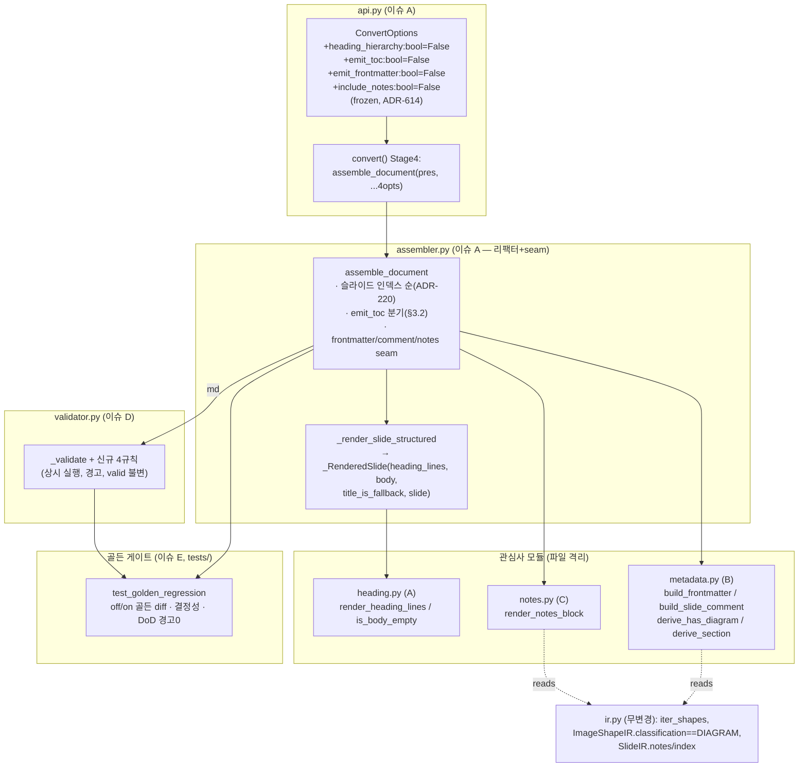
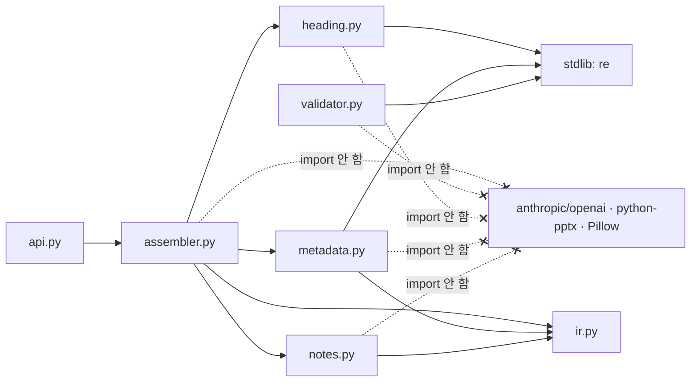

# ARCH-Wave3 — 헤딩 계층·문서 메타데이터(FR-28) & Validator 강화·골든 회귀 게이트(FR-29)

> 범위: 이슈 #75 (FR-28, M13) + #76 (FR-29, M14). 동작하는 어셈블러·validator 골격 위에 **구조화 출력**과 **품질 게이트**를 opt-in 으로 얹는다.
> 전제: `docs/00-charter/project-profile.md`(스택·규약), `docs/10-requirements/REQ-wave3.md`(요구 정본, §2 FR-28 / §3 FR-29 / §7 결정 로그 D-1~D-7 확정), `docs/20-design/ARCH-M12.md`(ADR 컨벤션·서식 정본)
> 요구 정본 원칙: REQ-wave3 §7 D-1~D-7 은 **확정**이므로 본 문서는 재론하지 않고 설계로만 옮긴다.
> 선행 ADR: 전역 최대 = ARCH-M12 의 **ADR-613** → **본 문서는 ADR-614~ADR-621 연속 부여**.
> 작성: architect / 2026-07-05
> 상태: 설계 초안 (reviewer 리뷰 / 사람 승인 전 — 아키텍처 게이트 대상)

---

## 0. 개요 — 현행 골격과 Wave 3 델타

### 0.1 현행 (설계의 출발점)

- `assembler.py` — `assemble_document(pres, *, masking, suppress_repeated_labels, table_fallback)` 가 슬라이드를 **인덱스 순 정렬**(ADR-220) 후 `_render_slide` 로 렌더, `_SLIDE_SEPARATOR = "\n\n---\n\n"` 로 병합. `_render_slide` 는 `parts: list[str]` 을 `"\n\n".join()` 한다. parts[0] = 헤딩(`## {title}` / `## {is_title shape}` / `## Slide N` fallback), 이후 = 본문. (assembler.py:249-316)
- `validator.py` — `validate_markdown(md) -> ValidationResult`. 현행 규칙: 빈 문서(valid=False), 미닫힘 펜스(valid=False), 헤딩 시작레벨/점프(경고). 코드펜스 내부 제외. 무예외(FR-14 AC7). (validator.py:62-153)
- `api.py` — `ConvertOptions`(frozen dataclass, 현재 필드 5개: describer/masking/validate/describe_max_workers/diagram_mermaid). `convert()` 5단계. (api.py:46-146)
- `ir.py` — `SlideIR.notes: str = ""`, `ImageShapeIR.classification: ImageClass | None`, `ImageClass.DIAGRAM`, `iter_shapes()`(그룹 DFS) 존재. **Wave 3 는 IR 무변경(D-3/INV-2).**

### 0.2 Wave 3 가 얹는 것 (전부 opt-in, 기본값 = 현행 바이트 동일)

| 관심사 | FR | 신규 옵션 | 델타 요지 |
|--------|----|-----------|-----------|
| 헤딩 계층 분해 | FR-28 | `heading_hierarchy` | 제목 `>` 경로를 `##/###/####…` 로 분해 |
| TOC/구분 슬라이드 | FR-28 | `emit_toc` | 본문 없는 슬라이드를 TOC 항목/`---` 로 변환 |
| frontmatter/메타 | FR-28 | `emit_frontmatter` | 최상단 YAML 1회 + 슬라이드별 HTML 주석 메타 |
| notes | FR-28 | `include_notes` | `SlideIR.notes` 를 `> notes` blockquote 로 |
| validator 신규 규칙 | FR-29 | (없음, `validate` 재사용, 상시 실행) | 깨진/전공백 표·중복 헤딩·`\v`·빈 슬라이드 경고 |
| 골든 회귀 게이트 | FR-29 | (없음, CI) | off/on 골든 2종 박제 + hard-fail 회귀 테스트 |

### 0.3 불변식 준수 (REQ-wave3 §0)

| INV | 본 설계의 준수 방법 |
|-----|---------------------|
| INV-1 결정성 | 신규 로직 전부 순수 문자열 처리. 난수·`set`/`dict` 순회 의존 0. 슬라이드 인덱스 순 병합(ADR-220) 유지. `has_diagram` 파생은 `iter_shapes()` DFS 순서만 사용 |
| INV-2 IR 하위호환 | **IR 무변경**. `section`/`has_diagram` 은 어셈블 시점 파생(D-3, §3.4) |
| INV-3 옵션 하위호환 | 신규 4필드 전부 `bool=False`, frozen dataclass default 추가(ADR-614). `ConvertOptions()`·`convert(src)` 무손상. 4옵션 off → **바이트 동일**(off 골든이 계측, FR-28 AC3) |
| INV-4 격리·무예외 | validator 신규 규칙은 기존 `try/except` 래퍼(validator.py:79-85) 안에서 실행 → 항상 `ValidationResult` 반환. 어셈블러 신규 로직도 슬라이드/도형 격리(현행 `_render_shape` try/except) 유지 |
| INV-5 의존 격리 | 신규 모듈(`heading.py`/`metadata.py`/`notes.py`)·validator 확장 모두 **stdlib(`re`)·내부(`ir`) import 만**. VLM SDK·python-pptx·Pillow import 0 |
| INV-6 프로파일 준수 | 신규 외부 라이브러리 0. frontmatter/YAML 은 **stdlib 문자열 조립**(PyYAML 미도입, D-1) |

---

## 1. 요구 → 설계 영향 추출

### 1.1 FR-28 AC

| AC | 요지 | 설계 요소 |
|----|------|-----------|
| AC1 | `>` 경로 → `##/###/####…` 분해, 각 세그먼트 trim | `heading.render_heading_lines`(§3.1) |
| AC2 | 구분자 없으면 단일 `##`(현행 동일) | fallback 분기(§3.1) |
| AC3 | `heading_hierarchy=False` → 바이트 동일 | 구조 리팩터가 parts 병합 규약 보존(§3.1, off 골든 검증) |
| AC4 | 본문 없는 슬라이드 → TOC 항목/`---`, 빈 `## Slide N` 0개 | `heading.is_body_empty` + `assemble_document` TOC 분기(§3.2) |
| AC5 | 최상단 YAML 1회 + 슬라이드별 HTML 주석(slide_index/section/has_diagram) | `metadata.build_frontmatter`/`build_slide_comment`(§3.3) |
| AC6 | DIAGRAM 이미지 존재 → `has_diagram: true` | `metadata.derive_has_diagram`(§3.4) |
| AC7 | 메타는 HTML 주석만 → `---` 구분자·FR-14 규칙 무충돌, YAML `---` 1회 한정 | §3.3 비충돌 논증 + validator 무경고 검증(§3.5) |
| AC8 | `notes != ""` → 말미 `> notes` 블록 | `notes.render_notes_block`(§3.6) |
| AC9 | `notes == ""` → 미출력 | 빈 blockquote 미생성(§3.6) |
| AC10 | 4옵션 on 골든: 헤딩 점프 0·중복 헤딩 0·결정성 | 계층 +1 단계 렌더 + validator 계측 + 골든 결정성 테스트(§3.5, §7) |

### 1.2 FR-29 AC

| AC | 요지 | 설계 요소 | `valid` 영향 |
|----|------|-----------|--------------|
| AC1 | 데이터행 0 pipe table → "깨진 표" 경고. 펜스 내부 `|` 제외 | `_check_pipe_tables`(§3.7) | 불변(경고만) |
| AC2 | 열 수 불일치 데이터행 → 경고 | `_check_pipe_tables`(§3.7) | 불변 |
| AC3 | 인접 동일 텍스트 헤딩 → 중복 경고 | `_check_duplicate_headings`(§3.7) | 불변 |
| AC4 | `\v` 잔존 → 개수 포함 경고 | `_check_control_chars`(§3.7) | 불변 |
| AC5 | 전공백 pipe table → 경고 | `_check_pipe_tables`(§3.7) | 불변 |
| AC6 | 본문 없는 슬라이드 블록(D-4) → 빈 슬라이드 경고 | `_check_empty_slides`(§3.7) | 불변 |
| AC7 | 정상 문서 → 신규 경고 0, FR-14 회귀 0, 무예외 | 규칙 전부 경고·기존 래퍼 계승(§3.7) | 기존과 동일 |
| AC8 | 골든 2종 박제(off/on) + 경로·옵션 명시 | §3.8, ADR-620 | — |
| AC9 | 골든 diff → CI 실패(hard-fail), 결정성 위반 실패 | §3.8 pytest 게이트(D-6) | — |
| AC10 | DoD 지표(중복헤딩0/`\v`0/전공백·깨진표0) 골든 2종 경고 0 검증 | §3.8, §7 | — |

### 1.3 NFR (Wave 3 적용분)

| NFR | 충족 방법 |
|-----|-----------|
| NFR-W3-1 성능 | 신규 로직 전부 순수 문자열 처리(VLM 미개입). 20슬라이드 어셈블 p95<5초 유지 — describe 경로 미변경 |
| NFR-W3-2 커버리지 | 4옵션 분기 + 신규 5규칙을 결정적 픽스처로 커버, 신규 라인 ≥75%(§7) |
| NFR-W3-3 타입 | 신규 함수 반환/필드 타입 명시, `mypy src/` exit 0(§4.4) |
| NFR-W3-4 린트 | `ruff check . && black --check .` exit 0 |
| NFR-W3-5 결정성 게이트 | 동일 IR·동일 옵션 2회 어셈블 바이트 동일(§7 결정성 테스트, AC9) |

---

## 2. 모듈 분해 & 변경 지도

### 2.1 파일별 변경 요지 (developer 가 그대로 구현 가능한 수준)

| 파일 | 변경 유형 | 요지 | 담당 이슈 |
|------|-----------|------|-----------|
| `src/pptx_md/api.py` | 확장(4필드+전달) | `ConvertOptions` 에 `heading_hierarchy`/`emit_toc`/`emit_frontmatter`/`include_notes: bool = False` 추가(frozen, ADR-614). `convert()` Stage 4 를 `assemble_document(pres, masking=..., heading_hierarchy=..., emit_toc=..., emit_frontmatter=..., include_notes=...)` 로 확장 | **A** |
| `src/pptx_md/assembler.py` | 리팩터+seam | `_render_slide` 를 구조화 내부(`_render_slide_structured -> _RenderedSlide`)로 분해(§3.1). `assemble_document` 에 keyword-only 4옵션(default False) + TOC 분기(§3.2) + frontmatter/comment/notes **seam 호출**. `assemble_slide`/off 경로 바이트 동일 보존 | **A** |
| `src/pptx_md/heading.py` | **신규** | `split_heading_path`·`render_heading_lines`·`is_body_empty` — 계층 분해 + 본문공백 판정(순수, `re`/`ir` 만) | **A** |
| `src/pptx_md/metadata.py` | **신규**(A 가 스텁 생성) | `build_frontmatter`·`build_slide_comment`·`derive_has_diagram`·`derive_section` — frontmatter/HTML 주석 stdlib 조립 + 파생 계산 | **B** (본문), A(스텁) |
| `src/pptx_md/notes.py` | **신규**(A 가 스텁 생성) | `render_notes_block(notes: str) -> str` — `> notes` 블록 | **C** (본문), A(스텁) |
| `src/pptx_md/validator.py` | 확장(4규칙) | `_check_pipe_tables`·`_check_duplicate_headings`·`_check_control_chars`·`_check_empty_slides` + 경고 상수. `_validate` 에서 상시 호출(D-5). `valid` 불변 | **D** |
| `tests/golden/wave3_off.md`, `tests/golden/wave3_on.md` | **신규** 박제 | off/on 골든 산출물(D-7) | **E** |
| `tests/test_golden_regression.py` | **신규** | 골든 diff·결정성·DoD 경고 0 테스트 + env-guard 재생성 | **E** |
| `tests/test_assembler.py` 외 | 확장 | 각 이슈가 자기 관심사 단위 테스트 추가(§7) | A/B/C/D |

> **파일 소유권 규약(과업지서 §0, 동시 편집 회피)**: `assembler.py`·`api.py` 는 **이슈 A 단독** 편집. A 가 `metadata.py`·`notes.py` 를 **최소 스텁**(off 시 부작용 0, 계약 시그니처만)으로 선생성하고 seam 을 배선한다. 이후 **B 는 `metadata.py` 만, C 는 `notes.py` 만** 채운다(assembler 미접촉). D 는 `validator.py` 단독. E 는 `tests/` 단독(ci.yml 무변경). → 어떤 두 이슈도 같은 파일을 동시에 편집하지 않는다.

### 2.2 컴포넌트/데이터 흐름



### 2.3 의존 방향 (단방향 — INV-5 격리)



---

## 3. 공개 인터페이스 & 처리 흐름

### 3.1 헤딩 계층 분해 (AC1~AC3, ADR-615)

`heading.py` (순수·결정적):

```python
_HEADING_PATH_SEP: str = ">"
_MAX_HEADING_LEVEL: int = 6   # ATX 최대. 초과 세그먼트는 h6 로 클램프

def split_heading_path(title: str) -> list[str]:
    """'>' 리터럴 분해 → 각 세그먼트 trim → 빈 세그먼트 제거. 결정적."""
    return [seg.strip() for seg in title.split(_HEADING_PATH_SEP) if seg.strip()]

def render_heading_lines(title: str, *, hierarchy: bool) -> list[str]:
    """제목을 헤딩 라인 리스트로. off/단일세그먼트 → 현행 동일 단일 '## {title}'."""
    if not hierarchy:
        return [f"## {title}"]                 # AC3: 원본 title 그대로 (바이트 동일)
    segs = split_heading_path(title)
    if len(segs) <= 1:
        return [f"## {title}"]                 # AC2: 구분자 없음 → 단일 ## (현행 동일)
    return [f"{'#' * min(2 + i, _MAX_HEADING_LEVEL)} {seg}"
            for i, seg in enumerate(segs)]     # AC1: seg0=##, seg1=###, …(h6 클램프)
```

| 항목 | 설계 |
|------|------|
| 분해 대상 | **실제 제목**(`slide.title` 또는 `is_title` 도형 텍스트)만. 위치 fallback `## Slide N` 은 분해 제외(`>` 미포함이므로 자연히 단일 `##`) |
| 레벨 매핑 | seg[0]→`##`(h2), seg[i]→`h(2+i)`, **h6 클램프**(ADR-615 근거: ATX 최대 6, validator 헤딩 점프 규칙과 +1 단계 일관) |
| 결정성 | `str.split` + 인덱스 순회만 — 난수·컬렉션 순회 의존 0 |
| AC3 바이트 동일 | off 경로는 `[f"## {title}"]` 로 **원본 title 무가공** → 현행 `_render_slide`(assembler.py:267) 와 동일. 병합 규약(§3.1 하단)도 보존 |

**병합 규약 보존(AC3 핵심)**: 현행 `_render_slide` 는 `parts = [heading] + body_parts` 를 `"\n\n".join()` 한다. 리팩터 후 `_render_slide_structured` 는:

```python
@dataclass
class _RenderedSlide:
    heading_lines: list[str]      # ["## A", "### B", ...] (계층) 또는 ["## Slide N"]
    body_parts: list[str]         # 헤딩 제외 렌더 결과 (현행 parts[1:] 와 동일 순서)
    title_is_fallback: bool       # "## Slide N" 위치 fallback 여부
    slide: SlideIR                # 메타 파생용 (index/notes/shapes) — 읽기 전용
```

`assemble_slide(slide)` = `"\n\n".join(r.heading_lines + r.body_parts)`. 단일 헤딩(off)에서는 `["## title"] + body_parts` 로 **현행과 완전 동일**. 계층에서는 헤딩 라인들이 각각 별도 part(= 별도 헤딩 라인, AC1) 가 되어 `"\n\n"` 로 구분.

### 3.2 TOC / 구분 슬라이드 판정 (AC4, ADR-616)

**D-4 판정(정본)**: "본문 렌더 결과가 헤딩 라인 외 비공백 0" = `heading.is_body_empty(r) == True`:

```python
def is_body_empty(body_parts: list[str]) -> bool:
    """헤딩 외 본문에 비공백이 없으면 True (D-4)."""
    return not "".join(body_parts).strip()
```

**판정 시점**: `assemble_document` 가 슬라이드별 `_RenderedSlide` 를 얻은 **직후**(병합 전). `emit_toc=True` 일 때만 변환:

| 조건 | 변환 결과 | 근거 |
|------|-----------|------|
| body_empty 아님 | 정상 블록(현행) | — |
| `emit_toc` & body_empty & **실제 제목** | 헤딩 라인만 블록으로 방출(= TOC 항목/섹션 표지) | 헤딩 자체가 목차 항목. "빈 `## Slide N` 블록" 아님 |
| `emit_toc` & body_empty & **fallback 제목**(`## Slide N`) | **블록 자체 방출 안 함**(드롭) → `---` 섹션 구분만 남음 | AC4 "빈 슬라이드 블록 0개" — 무의미 placeholder 제거 |
| `emit_toc=False` | 변환 안 함(현행) | 하위호환 |

방출 로직: 각 슬라이드가 `str | None`(None=드롭) 을 산출 → `None` 제거 후 `_SLIDE_SEPARATOR.join()`. 드롭으로 `---\n\n---` 중복이 생기지 않는다(join 이 남은 블록만 연결). **결정성**: 슬라이드 인덱스 순회(ADR-220) 유지.

> 상호작용: `emit_toc` 로 드롭된 fallback-빈 슬라이드는 frontmatter 주석도 미부착(블록 부재). 유지된 섹션 표지(실제 제목·body_empty)는 여전히 body_empty 이므로 validator AC6(빈 슬라이드) 경고 대상이나, **AC10 경고 0 집합에 빈-슬라이드는 미포함**(§3.8) — 정상.

### 3.3 frontmatter / 슬라이드 메타 (AC5, AC7, ADR-617)

`metadata.py` (stdlib 문자열 조립, PyYAML 미도입 — D-1/INV-6):

```python
def build_frontmatter(pres: PresentationIR) -> str:
    """문서 최상단 YAML frontmatter 1회. stdlib 조립. 결정적."""
    # PII 회피: source_path 미포함(로컬 경로 = PII 가능). 최소 결정적 키만.
    lines = ["---", "generator: pptx-md", f"slide_count: {len(pres.slides)}", "---"]
    return "\n".join(lines)

def build_slide_comment(slide_index: int, section: str, has_diagram: bool) -> str:
    """슬라이드별 HTML 주석 메타 (AC5). '---' 와 무충돌(주석)."""
    safe = section.replace("\n", " ").replace("|", "/")   # 구분자 파손 방지
    flag = "true" if has_diagram else "false"
    return f"<!-- slide_index: {slide_index} | section: {safe} | has_diagram: {flag} -->"
```

**배치 규약**: `emit_frontmatter=True` 일 때
1. 문서 최상단에 `build_frontmatter(pres)` 1회 + `"\n\n"` (YAML `---` 블록은 **문서 시작 1회로 한정** → 슬라이드 구분자 `---` 와 구별, AC7).
2. 각 슬라이드 블록의 **첫 라인**으로 `build_slide_comment(...)` 를 prepend → `<!-- … -->\n{heading_lines…}\n\n{body}`.

**최종 문서 형태(4옵션 on 예시)**:
```
---
generator: pptx-md
slide_count: 6
---

<!-- slide_index: 1 | section: 표지 | has_diagram: false -->
## 표지
…본문…

---

<!-- slide_index: 2 | section: Ⅱ. 사업의 이해 | has_diagram: true -->
## Ⅱ. 사업의 이해
### ⑦ 현황·문제점
…본문…
```

**`---` 비충돌 논증(AC7)**:
- 슬라이드별 메타는 **HTML 주석**뿐 → 헤딩 아님(FR-14 헤딩 규칙 무영향), 펜스 아님(펜스 카운트 무영향), 표 아님. FR-14 경고 0 증가.
- YAML frontmatter `---` 는 **문서 최상단 1회**만. 슬라이드 구분자 `---` 는 블록 사이에만. 파서는 frontmatter 를 문서 시작 위치로 식별.
- validator 신규 빈-슬라이드/표 규칙은 frontmatter 를 **선행 스킵**(§3.7)하여 phantom 블록 오탐 방지.

### 3.4 has_diagram / section 파생 (AC5, AC6, D-3, ADR-617)

IR 무변경 — 어셈블 시점 파생:

```python
def derive_has_diagram(slide: SlideIR) -> bool:
    """슬라이드 내(그룹 포함) DIAGRAM 분류 이미지 존재 여부 (AC6)."""
    return any(
        isinstance(s, ImageShapeIR) and s.classification is ImageClass.DIAGRAM
        for s in iter_shapes(slide)          # DFS, 결정적 (ir.py:155)
    )

def derive_section(heading_lines: list[str]) -> str:
    """현재 최상위 ## 헤딩 텍스트 (AC5). 없으면 ''."""
    for line in heading_lines:
        if line.startswith("## ") and not line.startswith("### "):
            return line[3:].strip()
    return ""
```

| 파생 키 | 계산 | 결정성 |
|---------|------|--------|
| `slide_index` | `slide.index + 1` (1-based). **원본 슬라이드 번호 유지**(emit_toc 드롭과 무관, RAG 추적성) | 정수 |
| `section` | 슬라이드의 최상위 `##`(h2) 헤딩 텍스트. 모든 슬라이드가 최소 1개 `##` 을 가지므로 항상 정의됨(`## Slide N` fallback 포함). 없을 때 `""` | 렌더 결과에서만 파생 |
| `has_diagram` | `iter_shapes(slide)` 에 `classification is ImageClass.DIAGRAM` 이미지 존재 → `true`/`false` | DFS 순회, IR 순서 의존 |

### 3.5 계층·메타 회귀 안전성 (AC7, AC10)

- **헤딩 점프 0(AC10)**: 계층 렌더는 seg 마다 정확히 +1 레벨(`##→###→####`) → FR-14 `_warn_heading_jump`(2단계 이상) 미발동. h6 클램프 후 연속 h6 은 점프 아님.
- **중복 헤딩 0(AC10)**: 계층 분해는 각 세그먼트가 서로 다른 텍스트 → 인접 동일 헤딩 미발생. 슬라이드 간 동일 제목은 사이에 `---`(+주석) 개입 → validator 중복 규칙 미발동(§3.7).
- **결정성(AC10/INV-1)**: 동일 IR·동일 옵션 2회 어셈블 → 바이트 동일(순수 함수 조합).

### 3.6 notes 블록 (AC8, AC9, ADR-618)

`notes.py`:

```python
def render_notes_block(notes: str) -> str:
    """notes → '> notes' blockquote. 빈 notes → '' (블록 미생성, AC9)."""
    if not notes.strip():                     # AC9: 빈/공백 notes → 미출력
        return ""
    normalized = notes.replace("\v", "\n")    # FR-24 정합: \v → \n
    lines = ["> notes"] + [f"> {ln}" for ln in normalized.split("\n")]
    return "\n".join(lines)
```

**배치**: `include_notes=True` & `render_notes_block(slide.notes) != ""` → 슬라이드 블록 **말미**에 `body_parts` 뒤 part 로 추가(= `"\n\n"` 로 분리). off 또는 빈 notes → part 미추가(현행 바이트 동일 보존, AC9).

### 3.7 validator 신규 규칙 (FR-29 AC1~AC7, ADR-619)

`_validate`(validator.py:93) 에 신규 규칙을 **상시 추가 호출**(D-5, 토글 없음). 전부 **경고**(`valid` 불변). 기존 무예외 래퍼(validator.py:79-85) 계승 → INV-4.

```python
# _validate 말미 (Check 3 헤딩 이후)에 추가:
warnings.extend(_check_control_chars(md))       # AC4
warnings.extend(_check_pipe_tables(md))         # AC1/AC2/AC5
warnings.extend(_check_duplicate_headings(md))  # AC3
warnings.extend(_check_empty_slides(md))        # AC6
```

신규 경고 상수(한글 문자열, 현행 규약 계승):

| 상수 | 메시지(요지) | AC |
|------|--------------|----|
| `_WARN_TABLE_NO_DATA` | "깨진 표: 데이터 행이 없습니다." | AC1 |
| `_WARN_TABLE_COL_MISMATCH` | "표 열 수 불일치: 데이터 행의 열 수가 헤더와 다릅니다." | AC2 |
| `_WARN_TABLE_ALL_BLANK` | "전공백 표: 모든 셀이 비어 있습니다." | AC5 |
| `_WARN_DUP_HEADING` | "중복 인접 헤딩: 동일 텍스트 헤딩이 연속됩니다." | AC3 |
| `_WARN_VERTICAL_TAB(n)` | f"제어문자 \\v 잔존: {n}개." | AC4 |
| `_WARN_EMPTY_SLIDE` | "빈 슬라이드: 헤딩 외 본문이 없습니다." | AC6 |

**공통 전처리(오탐 방지)**:
- **코드펜스 제외**: 현행 `in_code_block` 토글(``` 라인) 재사용 — 펜스 내부 `|` 라인은 표로 오인 안 함(AC1, FR-14 AC6 계승).
- **frontmatter 스킵**: `md.lstrip()` 이 `---\n` 로 시작하면 두 번째 단독 `---` 라인까지 스킵(§3.3 YAML 블록). 이후만 분석.

각 규칙:

| 규칙 | 알고리즘 |
|------|----------|
| `_check_control_chars` (AC4) | `n = md.count("\v")`; `n>0` → `_WARN_VERTICAL_TAB(n)` 1건 |
| `_check_pipe_tables` (AC1/2/5) | 펜스 밖에서 **연속 pipe 행**(`|` 포함, `\|`·frontmatter 아님) 런을 표 후보로 수집. 두 번째 행이 **구분행**(각 셀 `:?-{1,}:?`)이면 GFM 표로 확정. (a) 데이터행 0 → `_WARN_TABLE_NO_DATA`; (b) 데이터행 열수(파이프 분해, `\|` 이스케이프 무시) ≠ 헤더 열수 → `_WARN_TABLE_COL_MISMATCH`(표당 1건); (c) 모든 셀 공백 → `_WARN_TABLE_ALL_BLANK` |
| `_check_duplicate_headings` (AC3) | 펜스 밖 라인 순회. 직전 헤딩 텍스트(=`#` 제거·strip) 기억. **직전 헤딩 이후 비공백·비헤딩 라인(=`---`·주석·본문 포함)이 하나라도 있으면** 인접 아님. 인접 & 동일 텍스트 → `_WARN_DUP_HEADING` 1건 |
| `_check_empty_slides` (AC6) | frontmatter 스킵 후, 펜스 밖 단독 `---`(`^-{3,}$`) 로 슬라이드 블록 분할. 블록에서 헤딩 라인·HTML 주석 라인(`<!-- … -->`)·공백 라인 제거 후 잔여 비공백 0 → `_WARN_EMPTY_SLIDE` 1건(블록당) |

> AC7: 결함 없는 정상 문서 → 위 4함수 전부 경고 0. 기존 빈문서/미닫힘펜스/헤딩 규칙은 코드 미변경으로 회귀 0. 예외 발생 시 기존 래퍼가 흡수(무예외).

### 3.8 골든 회귀 게이트 (FR-29 AC8~AC10, D-6/D-7, ADR-620)

| 항목 | 설계 |
|------|------|
| 골든 소스 | `tests/test_golden_regression.py` 내 **손수 조립한 `PresentationIR`**(결정적: 계층 제목·섹션표지(빈 본문)·DIAGRAM 분류 이미지·notes 포함 슬라이드). 분류 휴리스틱·python-pptx 비결정 요소 배제 — FR-28/29 는 어셈블러·validator 관심사이므로 `assemble_document` 직접 호출로 계측(ADR-620 근거) |
| off 골든 | `tests/golden/wave3_off.md` = `assemble_document(pres)` (4옵션 전부 off, 현행 동등). **하위호환 회귀용**(FR-28 AC3) |
| on 골든 | `tests/golden/wave3_on.md` = `assemble_document(pres, heading_hierarchy=True, emit_toc=True, emit_frontmatter=True, include_notes=True)`. **구조화 품질 계측용** |
| 회귀 판정(AC9) | 테스트가 두 조합을 재산출 → 박제 `.md` 와 **바이트 비교**. 불일치 시 `assert` 실패 + diff 출력(`difflib.unified_diff`) → 기존 CI `pytest` 스텝(ci.yml:37-38) 실패 → **머지 차단**(hard-fail, D-6). **ci.yml 무변경**(신규 워크플로 불요 — 기존 pytest 스텝에 편승) |
| 결정성(AC9) | 동일 옵션 2회 산출이 상호 바이트 동일함을 별도 assert(INV-1) |
| DoD 경고 0(AC10) | 두 골든 각각에 `validate_markdown` 실행 → 경고 중 **{중복 헤딩, `\v`, 전공백 표, 깨진 표}** 카테고리(메시지 substring 매칭) == 0 검증. **빈-슬라이드 경고는 집합 제외**(AC10 명시). 이미지 커버리지 100% 는 VLM/FR-27 소관 → no-VLM 골든 기준 N/A 명시 |
| 골든 갱신 절차 | 의도된 변경은 `PPTXMD_UPDATE_GOLDEN=1` 환경변수 하에 테스트 재실행 시 골든 재기록(그 외엔 비교만). 갱신은 **별도 PR 로 사람 명시 승인**(D-6). PowerShell: `$env:PPTXMD_UPDATE_GOLDEN=1; pytest tests/test_golden_regression.py`. 모듈 docstring·본 절에 절차 명시 |

---

## 4. 횡단 관심사

### 4.1 결정성 (INV-1)
모든 신규 함수는 순수(입력→출력, 부작용 0). 컬렉션 순회는 `list` 순서·IR DFS(`iter_shapes`)만. `dict`/`set` 순회 결과를 출력에 반영하지 않음. 슬라이드 병합은 인덱스 순(ADR-220).

### 4.2 예외/격리 (INV-4)
- validator: 신규 규칙 전부 기존 `try/except`(validator.py:79) 안 → 어떤 입력에도 `ValidationResult` 반환. 규칙 내부는 방어적(빈 리스트·인덱스 가드).
- assembler: 슬라이드/도형 격리(현행 `_render_slide`/`_render_shape` try/except) 유지. 신규 seam(metadata/notes/heading) 은 순수 함수라 예외 표면 최소이나, 슬라이드 단위 격리가 상위에서 커버.

### 4.3 로깅·감사 (NFR-06 계승)
신규 로직은 원문 텍스트·PII 미출력. frontmatter/comment/notes 는 **산출물**이며 로그 아님. section 텍스트는 산출 문서에만 존재(로그 미기록).

### 4.4 mypy strict (NFR-W3-3)
신규 시그니처 전부 명시: `render_heading_lines(title: str, *, hierarchy: bool) -> list[str]`, `is_body_empty(body_parts: list[str]) -> bool`, `derive_has_diagram(slide: SlideIR) -> bool`, `derive_section(heading_lines: list[str]) -> str`, `build_frontmatter(pres: PresentationIR) -> str`, `build_slide_comment(slide_index: int, section: str, has_diagram: bool) -> str`, `render_notes_block(notes: str) -> str`. `ConvertOptions` 신규 4필드 `bool`. validator 신규 함수 `(md: str) -> list[str]`.

---

## 5. 기술 선택지 비교 (ADR 후보)

### 5.1 메타 배선 위치: assemble_document seam vs convert() 후처리 (ADR-617 관련)
| 후보 | 장점 | 단점 |
|------|------|------|
| **A. `assemble_document` 내부 seam** | 슬라이드 블록·헤딩·body_empty 를 이미 알고 있음(section/빈판정 재계산 불요), 결정성 한 곳 관리 | assembler 관심사 증가(모듈 분리로 완화) |
| B. `convert()` 에서 완성 md 사후 파싱·주석 삽입 | assembler 무변경 | 완성 md 재파싱(취약·중복), section/has_diagram 재계산 위해 IR 재접근 필요 |
**권고 A** — 파생 정보가 어셈블 시점에만 자연히 존재. 모듈 분리(§2)로 관심사 응집. → ADR-617.

### 5.2 관심사 물리 배치: 신규 모듈 3개 vs assembler 단일 파일 (ADR-621)
| 후보 | 장점 | 단점 |
|------|------|------|
| **A. `heading.py`/`metadata.py`/`notes.py` 분리 + assembler thin seam** | 이슈 A/B/C **파일 소유권 격리**(동시 편집 회피, 과업지서 §0), 관심사별 단위 테스트, INV-5 격리 유지 | 모듈 수↑, A 가 스텁 선생성 |
| B. 전부 assembler.py | 파일 1개 | 3이슈가 같은 파일 편집 → 충돌, 리뷰 난이도↑ |
**권고 A** — 과업지서가 "함수 경계 분리로 동시 편집 회피"를 명시. → ADR-621.

### 5.3 골든 소스: 손수 IR vs 실 PPTX 픽스처 (ADR-620)
| 후보 | 장점 | 단점 |
|------|------|------|
| **A. 손수 조립 `PresentationIR` + `assemble_document`** | DIAGRAM 분류·notes·계층 제목 **완전 통제**, 분류 휴리스틱·python-pptx 비결정 배제, FR-28/29 관심사 정조준, 결정적 | e2e(parse→classify) 미포함(별도 단위 테스트로 커버) |
| B. 실 PPTX + `convert()` | e2e 커버 | DIAGRAM 강제 위해 분류기 규칙 역설계 필요, 바이너리 픽스처, 잠재 비결정 |
**권고 A** — 골든은 어셈블러·validator 회귀 계측이 목적. 분류/파싱은 기존 테스트가 담당. → ADR-620.

### 5.4 CI 게이트 배치: 기존 pytest 편승 vs 신규 워크플로 (ADR-620)
`ci.yml` 은 이미 PR 트리거 `pytest` 스텝(ci.yml:37-38)을 hard-fail 로 실행. 골든 회귀 테스트는 일반 pytest 테스트 → **신규 워크플로/파일 불요**. 머지 차단은 브랜치 보호(기존 정책, 프로파일 §5) 로 달성. → ADR-620 영향에 포함(신규 CI 파일 0).

---

## 6. 아키텍처 결정 기록 (ADR-614 ~ ADR-621)

### ADR-614 ConvertOptions 신규 4필드(bool=False) + assemble_document keyword-only 확장
**배경**: FR-28 은 4개 구조화 기능을 opt-in 으로 노출해야 한다(D-2 bool 4개 확정). frozen dataclass 하위호환(INV-3/ADR-602) 필수.
**결정**: `ConvertOptions` 에 `heading_hierarchy`/`emit_toc`/`emit_frontmatter`/`include_notes: bool = False` 를 추가한다(frozen 유지). `assemble_document` 에 동명 keyword-only 4파라미터(default False)를 추가하고 `convert()` Stage 4 가 전달한다.
**근거**: (a) 전부 기본 False = 현행 출력 바이트 동일(off 골든 검증) → 완전 하위호환, (b) frozen 유지로 불변·스레드 안전, (c) bool 4개는 D-2 확정 구조.
**대안과 기각 사유**: 단일 `structured: bool`(4기능 독립 토글 불가·D-2 위반), enum/flags(과설계·D-2 위반), default 없는 추가(하위호환 파괴).
**영향**: `ConvertOptions()`·`convert(src)` 무손상. api.py·assembler.py 는 이슈 A 단독 편집.

### ADR-615 헤딩 계층 분해 = `>` 리터럴 분해 + h2→h6 매핑(클램프), 단일세그먼트 fallback
**배경**: AC1 은 `>` 경로를 `##/###/####…` 로, AC2 는 구분자 없을 때 단일 `##`, AC3 는 off 시 바이트 동일을 요구한다.
**결정**: 제목을 `>` 로 split·strip·빈 제거 → 2개 이상이면 seg[i] 를 `h(2+i)`(h6 클램프)로, 1개 이하면 단일 `## {title}`(원본 무가공)로 렌더. 위치 fallback `## Slide N` 은 분해 제외.
**근거**: (a) 결정적 순수 문자열 처리(INV-1), (b) +1 단계 매핑으로 FR-14 헤딩 점프 미발동(AC10), (c) h6 클램프로 ATX 유효성 보장, (d) off/단일 경로가 원본 title 무가공 → 현행과 바이트 동일(AC3).
**대안과 기각 사유**: 정규식 다중 구분자(요구는 `>` 단일), 레벨 무제한(h7+ 무효 ATX·검증기 혼란).
**영향**: `heading.py` 신규(이슈 A). section 파생이 헤딩 라인에서 계산(§3.4).

### ADR-616 빈/구분 슬라이드 판정 = body_empty(D-4) + emit_toc 변환(TOC 항목/드롭)
**배경**: AC4 는 "본문 없는 슬라이드"(D-4: 헤딩 외 비공백 0)를 TOC 항목/`---` 로 변환해 빈 `## Slide N` 블록 0개를 요구한다.
**결정**: `is_body_empty(body_parts)` 로 판정. `emit_toc=True` 시 — 실제 제목 & body_empty → 헤딩만 방출(TOC 항목); fallback 제목 & body_empty → 블록 드롭(`---` 구분만). off 시 무변환.
**근거**: (a) D-4 판정을 병합 전 결정적 시점에 적용, (b) fallback 빈 placeholder 제거로 AC4 "빈 슬라이드 블록 0" 달성, (c) 실제 섹션 표지는 목차 항목으로 보존(정보 손실 0).
**대안과 기각 사유**: 모든 빈 슬라이드 드롭(섹션 표지 정보 손실), 완성 md 사후 정규식 제거(취약).
**영향**: `assemble_document` 가 `str | None` 방출·None 필터. 유지된 섹션 표지는 validator 빈-슬라이드 경고 대상이나 AC10 집합 제외.

### ADR-617 메타 = 최상단 YAML 1회 + 슬라이드별 HTML 주석, IR 무변경 어셈블 파생 (D-1/D-3)
**배경**: AC5~AC7 은 최상단 YAML frontmatter 1회 + 슬라이드별 HTML 주석 메타(slide_index/section/has_diagram)를 `---` 구분자·FR-14 규칙과 무충돌로 요구한다. PyYAML 미도입(D-1), IR 무변경(D-3).
**결정**: `metadata.py` 가 stdlib 문자열로 frontmatter(문서 시작 1회)와 슬라이드 HTML 주석(블록 첫 라인)을 조립. `has_diagram` 은 `iter_shapes` DIAGRAM 스캔, `section` 은 최상위 `##` 텍스트, `slide_index` 는 원본 index+1 로 어셈블 시점 파생.
**근거**: (a) HTML 주석은 헤딩·펜스·표 아님 → FR-14 경고 0 증가·`---` 무충돌(AC7), (b) YAML 최상단 1회로 구분자와 구별, (c) IR 무변경(INV-2), (d) PyYAML 미도입·stdlib 조립(INV-6), (e) source_path 등 PII 미포함(NFR).
**대안과 기각 사유**: PyYAML(D-1 위반·외부 의존), 슬라이드별 YAML 블록(`---` 다중 충돌), IR 필드 추가(D-3 위반).
**영향**: `metadata.py` 신규(스텁 A / 본문 B). assembler seam 이 호출.

### ADR-618 notes = `> notes` blockquote, 빈 notes 미출력
**배경**: AC8 은 `notes != ""` 시 말미 `> notes` 블록(각 줄 `> ` 프리픽스), AC9 는 빈 notes 시 미출력을 요구한다.
**결정**: `notes.render_notes_block(notes)` — 공백 notes → `""`(미출력); 아니면 `\v→\n` 정규화 후 `> notes` + 각 줄 `> ` 프리픽스. `include_notes=True` 일 때만 슬라이드 말미 part 추가.
**근거**: (a) 빈 blockquote 미생성(AC9), (b) FR-24 `\v` 정합, (c) off/빈 시 part 미추가 → 바이트 동일 보존.
**대안과 기각 사유**: HTML `<details>`(과설계), 항상 블록 출력(빈 blockquote·AC9 위반).
**영향**: `notes.py` 신규(스텁 A / 본문 C).

### ADR-619 validator 신규 규칙 = 상시 실행 경고(valid 불변), 펜스·frontmatter 제외
**배경**: FR-29 AC1~AC7 은 깨진/전공백 표·중복 인접 헤딩·`\v`·빈 슬라이드를 경고로 잡되 무예외·기존 회귀 0 을 요구한다(D-5: 기존 `validate` 재사용, 토글 없음).
**결정**: `_check_pipe_tables`/`_check_duplicate_headings`/`_check_control_chars`/`_check_empty_slides` 를 `_validate` 에서 상시 호출. 전부 **경고**(`valid` 불변). 코드펜스 내부·문서 최상단 frontmatter 는 분석 제외.
**근거**: (a) 헤딩 규칙처럼 경고 취급이 FR-14 정합, (b) 펜스 제외로 표 오탐 방지(AC1, FR-14 AC6 계승), (c) frontmatter 스킵으로 phantom 블록 오탐 방지, (d) 기존 무예외 래퍼 계승(INV-4), (e) 신규 옵션 0(D-5).
**대안과 기각 사유**: 규칙별 토글 옵션(D-5 위반·API 확대), 신규 규칙이 `valid=False`(과잉 차단·기존 의미 붕괴), 외부 md 파서(프로파일 위반).
**영향**: validator.py 이슈 D 단독. 경고 메시지 substring 으로 골든 DoD 테스트(AC10)가 카테고리 계측.

### ADR-620 골든 게이트 = 손수 IR 2조합 박제 + 기존 pytest 편승 hard-fail + env-guard 재생성 (D-6/D-7)
**배경**: FR-29 AC8~AC10 은 off/on 골든 2종 박제, diff 시 CI hard-fail(머지 차단), 의도된 변경은 골든 갱신 PR, DoD 경고 0 검증을 요구한다.
**결정**: 손수 조립 `PresentationIR` 를 `assemble_document` 로 off/on 산출해 `tests/golden/wave3_off.md`·`wave3_on.md` 박제. `test_golden_regression.py` 가 재산출·바이트 비교(diff 출력)·결정성·DoD 경고 0 을 검증하며 기존 `pytest` CI 스텝에 편승(신규 워크플로 0). 갱신은 `PPTXMD_UPDATE_GOLDEN=1` 하에서만 재기록, 별도 PR 사람 승인.
**근거**: (a) 손수 IR 이 DIAGRAM/notes/계층을 완전 통제·결정적(분류 휴리스틱 배제), (b) 기존 CI 가 이미 PR pytest hard-fail → 신규 CI 불요(프로파일 정합), (c) env-guard 로 우발 갱신 방지·의도 갱신은 명시적(D-6), (d) off=하위호환·on=품질 2계측(D-7).
**대안과 기각 사유**: 실 PPTX e2e 골든(분류기 역설계·비결정), 신규 GH Actions job(불필요·유지비), 골든 자동 갱신(회귀 은폐·D-6 위반).
**영향**: 이슈 E 는 tests/ 단독(src·ci.yml 무변경).

### ADR-621 관심사 모듈 분리 = heading.py / metadata.py / notes.py (파일 소유권 격리)
**배경**: FR-28 3관심사(계층+TOC / frontmatter / notes)가 `assembler.py` 를 공유 → 동시 편집 충돌 위험(과업지서 §0: 함수 경계 분리 요구).
**결정**: 계층/TOC 판정은 `heading.py`, 메타는 `metadata.py`, notes 는 `notes.py` 로 분리. `assembler.py`·`api.py` 는 이슈 A 단독 편집(스텁 선생성 + seam 배선). B 는 `metadata.py` 만, C 는 `notes.py` 만 채운다.
**근거**: (a) 어떤 두 이슈도 같은 파일 동시 편집 없음, (b) 관심사별 단위 테스트·리뷰 집중, (c) INV-5 격리(각 모듈 stdlib+ir 만), (d) A 선행으로 계약 시그니처 고정.
**대안과 기각 사유**: 전부 assembler.py(3이슈 충돌), 관심사별 assembler 함수만 분리(같은 파일 유지 → 충돌 잔존).
**영향**: 신규 3모듈. A→(B∥C) 의존 순서. 스텁은 off 시 부작용 0.

---

## 7. 테스트 전략 (구현 X — 포인트만, tester 용)

### 7.1 결정적 픽스처
- **계층 제목 슬라이드**: title `"Ⅱ. 사업의 이해 > ⑦ 현황·문제점 > 세부"` → h2/h3/h4 3라인(AC1).
- **구분자 없는 제목**: `"단순 제목"` → 단일 `##`(AC2).
- **섹션 표지(빈 본문)**: 제목만, 본문 도형 0 → emit_toc 시 헤딩만/빈 `## Slide N` 드롭(AC4).
- **DIAGRAM 이미지 슬라이드**: `ImageShapeIR(classification=ImageClass.DIAGRAM)` → `has_diagram: true`(AC6). 비DIAGRAM → `false`.
- **notes 슬라이드**: `SlideIR(notes="줄1\n줄2")` → `> notes` 블록; `notes=""` → 미출력(AC8/AC9).
- **깨진/전공백/열불일치 표**·**인접 중복 헤딩**·**`\v` 잔존**·**펜스 내 `|`**·**정상 문서** 각 md 스니펫(FR-29 AC1~AC7).

### 7.2 결정성 검증 (INV-1/AC9/AC10)
- 동일 IR·동일 4옵션 조합 2회 `assemble_document` → 바이트 동일 assert.
- off 조합 2회 = 현행 assemble 과도 동일(회귀).

### 7.3 바이트 동일(AC3) / off 골든
- 4옵션 off `assemble_document` vs 현행 출력 diff 0.

### 7.4 golden diff 검증 (AC8/AC9)
- off/on 골든 재산출 → `difflib.unified_diff` 로 박제 대비 diff 0. 불일치 시 diff 출력 + 실패.
- `PPTXMD_UPDATE_GOLDEN` 미설정 시 비교, 설정 시 재기록(우발 갱신 방지).

### 7.5 DoD 경고 0 (AC10)
- 두 골든 각 `validate_markdown` → {중복 헤딩·`\v`·전공백 표·깨진 표} substring 경고 == 0. (빈-슬라이드 경고는 집합 제외 — 명시 주석.)

### 7.6 validator 규칙별 (FR-29 AC1~AC7)
- 각 규칙 발동/미발동 케이스, `valid` 불변 확인, 펜스 내부 미오탐, 정상 문서 경고 0, 예외 입력 무예외.

### 7.7 커버리지 (NFR-W3-2)
- 신규 모듈·규칙 라인 ≥75%. FakeIR 합성으로 분기 결정적 커버.

---

## 8. WBS — 구현 이슈 분해 (파일 소유권 표)

각 단위 반나절~하루, developer 독립 수행. **파일 소유권 격리**로 동시 편집 회피(§2.1).

| 이슈 | 관심사 | 대응 AC | 소유/편집 파일 | 핵심 함수/심볼 | 참조 절 | AC 초안 | 의존 |
|------|--------|---------|----------------|----------------|---------|---------|------|
| **A** | 헤딩 계층 + TOC + 옵션 배선 + assembler 리팩터/seam | FR-28 AC1~AC4, (AC3 바이트동일) | `heading.py`(신규), `assembler.py`, `api.py`, `metadata.py`·`notes.py`(스텁 생성) | `split_heading_path`·`render_heading_lines`·`is_body_empty`; `_RenderedSlide`·`_render_slide_structured`; `assemble_document`(4 kw + TOC 분기 + seam); `ConvertOptions` +4필드; `convert` 전달 | §3.1, §3.2, ADR-614/615/616/621 | (1) `>` 제목 h2→h3→…(trim, h6클램프); (2) 구분자 없음→단일 `##`; (3) 4옵션 off→현행 바이트 동일; (4) emit_toc 시 빈 `## Slide N` 0개; (5) `ConvertOptions()`·`convert(src)` 무손상; (6) SDK/pptx import 0; (7) mypy/ruff/black exit 0 | 없음 |
| **B** | frontmatter/메타 | FR-28 AC5~AC7 | `metadata.py`(본문) | `build_frontmatter`·`build_slide_comment`·`derive_has_diagram`·`derive_section` | §3.3, §3.4, ADR-617 | (1) 최상단 YAML 1회(stdlib 조립, PyYAML 0); (2) 슬라이드별 HTML 주석 slide_index/section/has_diagram; (3) DIAGRAM→has_diagram true, 아니면 false; (4) section=최상위 `##` 텍스트, 없으면 ""; (5) `---`·FR-14 무충돌(validator 경고 0 증가); (6) IR 무변경; (7) mypy exit 0. **assembler.py 미접촉** | A |
| **C** | notes | FR-28 AC8~AC9 | `notes.py`(본문) | `render_notes_block` | §3.6, ADR-618 | (1) `notes!=""`→`> notes`+각 줄 `> `; (2) `notes==""`→"" (빈 blockquote 0); (3) `\v→\n` 정규화; (4) 결정적·무예외; (5) mypy exit 0. **assembler.py 미접촉** | A |
| **D** | validator 신규 규칙 | FR-29 AC1~AC7 | `validator.py` | `_check_pipe_tables`·`_check_duplicate_headings`·`_check_control_chars`·`_check_empty_slides` + 경고 상수 | §3.7, ADR-619 | (1) 데이터행0 표 경고(펜스 내 `|` 미오탐); (2) 열수 불일치 경고; (3) 전공백 표 경고; (4) 인접 동일 헤딩 경고; (5) `\v` 개수 포함 경고; (6) 빈 슬라이드 블록 경고; (7) 정상 문서 신규 경고 0·FR-14 회귀 0·무예외; (8) 신규 규칙 `valid` 불변; (9) mypy exit 0 | 없음(D 독립 가능) |
| **E** | 골든 회귀 게이트 | FR-29 AC8~AC10 | `tests/golden/wave3_off.md`·`wave3_on.md`, `tests/test_golden_regression.py` | 손수 IR 빌더, off/on 골든 테스트, 결정성 테스트, DoD 경고0 테스트, env-guard 재생성 | §3.8, ADR-620 | (1) off/on 골든 2종 박제 + 경로·옵션 명시; (2) diff 시 실패(hard-fail, diff 출력); (3) 동일 옵션 2회 바이트 동일(결정성); (4) 두 골든 DoD 경고(중복헤딩/`\v`/전공백·깨진 표) 0; (5) 이미지 커버리지 100%는 N/A 명시; (6) ci.yml 무변경(pytest 편승). **src 미접촉** | A, B, C, D |

> 권고 순서: **A**(foundation·스텁·seam) → **B∥C**(모듈 격리 병행) + **D**(독립) → **E**(전체 통합 계측). PM 판단으로 A 단일 PR + B/C/D 병렬 PR + E 마지막 PR. off 골든은 A 직후에도 박제 가능(하위호환 회귀 조기 확보).

---

## 9. 요구사항 추적표

### 9.1 FR-28 AC → 설계 요소 (누락 0)

| AC | 충족 요소 |
|----|-----------|
| AC1 계층 분해 | `heading.render_heading_lines`(§3.1, ADR-615, W-A) |
| AC2 구분자 없음 fallback | 단일세그먼트 분기(§3.1, W-A) |
| AC3 off 바이트 동일 | 병합 규약 보존 + off 골든(§3.1, §3.8, W-A/E) |
| AC4 TOC/빈 슬라이드 0 | `is_body_empty` + emit_toc 변환(§3.2, ADR-616, W-A) |
| AC5 frontmatter+주석 | `metadata.build_frontmatter`/`build_slide_comment`(§3.3, ADR-617, W-B) |
| AC6 has_diagram | `metadata.derive_has_diagram`(§3.4, W-B) |
| AC7 `---`/FR-14 무충돌 | HTML 주석 전용 + YAML 1회(§3.3, §3.5, W-B) |
| AC8 notes 블록 | `notes.render_notes_block`(§3.6, ADR-618, W-C) |
| AC9 빈 notes 미출력 | 공백 가드(§3.6, W-C) |
| AC10 점프0/중복0/결정성 | +1 레벨 렌더 + validator 계측 + 골든 결정성(§3.5, §3.8, W-A/D/E) |

### 9.2 FR-29 AC → 설계 요소 (누락 0)

| AC | 충족 요소 |
|----|-----------|
| AC1 깨진 표 | `_check_pipe_tables` 데이터행0(§3.7, ADR-619, W-D) |
| AC2 열 불일치 | `_check_pipe_tables` 열수 비교(§3.7, W-D) |
| AC3 중복 인접 헤딩 | `_check_duplicate_headings`(§3.7, W-D) |
| AC4 `\v` 잔존 | `_check_control_chars`(§3.7, W-D) |
| AC5 전공백 표 | `_check_pipe_tables` 전공백(§3.7, W-D) |
| AC6 빈 슬라이드 | `_check_empty_slides`(§3.7, W-D) |
| AC7 정상 문서/무예외 | 경고 규칙 + 기존 래퍼 계승(§3.7, W-D) |
| AC8 골든 2종 박제 | off/on 골든(§3.8, ADR-620, W-E) |
| AC9 diff→CI 실패 | pytest 편승 hard-fail + diff(§3.8, D-6, W-E) |
| AC10 DoD 경고 0 | validate_markdown 카테고리 계측(§3.8, §7.5, W-E) |

### 9.3 NFR 충족 1줄 근거

| NFR | 충족 |
|-----|------|
| NFR-W3-1 성능 | 신규 로직 순수 문자열(VLM 미개입) → describe 경로 무변경, p95<5초 유지 |
| NFR-W3-2 커버리지 | 4옵션·5규칙 결정적 픽스처로 신규 라인 ≥75%(§7) |
| NFR-W3-3 타입 | 신규 시그니처·필드 타입 명시, mypy exit 0(§4.4) |
| NFR-W3-4 린트 | 신규 모듈 ruff/black 준수 |
| NFR-W3-5 결정성 게이트 | 동일 IR·옵션 2회 바이트 동일 테스트(§7.2) |

### 9.4 결정 로그 반영 (D-1~D-7, 재론 없음)

| D | 반영 위치 |
|---|-----------|
| D-1 메타 포맷(YAML1회+HTML주석, PyYAML 미도입) | §3.3, ADR-617 |
| D-2 옵션 bool 4개 | §2.1, ADR-614 |
| D-3 has_diagram/section 어셈블 파생(IR 무변경) | §3.4, ADR-617 |
| D-4 빈/구분 슬라이드 판정(헤딩 외 비공백 0) | §3.2(FR-28), §3.7 `_check_empty_slides`(FR-29) 공통 |
| D-5 validator 기존 `validate` 재사용·상시 실행 | §3.7, ADR-619 |
| D-6 CI hard-fail + 골든 갱신 PR | §3.8, ADR-620 |
| D-7 off/on 골든 2종 | §3.8, ADR-620 |

---

## 10. RISK / 기술 부채 / NEEDS_DECISION

| 구분 | 내용 | 대응 |
|------|------|------|
| 명시(오탐 아님) | emit_toc 유지된 섹션 표지(실제 제목·빈 본문)는 여전히 body_empty → validator 빈-슬라이드 경고 대상. **AC10 경고 0 집합에 빈-슬라이드 미포함**(REQ AC10 명시)이므로 골든 실패 아님 | §3.2/§3.8 에 명시, reviewer/tester 혼동 방지 |
| 부채(경미) | validator 경고가 한글 문자열 substring 매칭 → 골든 DoD 카테고리 계측이 메시지 문구에 결합 | 제안 P-W3-1(머신 리더블 코드)로 승격 시 해소. 현재는 상수 재사용으로 결합 최소화 |
| 부채 | 골든 소스가 손수 IR(어셈블러·validator 정조준) — parse→classify e2e 는 골든 미포함 | 기존 parser/classifier 테스트가 e2e 커버. e2e 골든은 별도 승인 시 확장 |
| 제약 | pipe table 감지는 GFM 구분행 기반 휴리스틱(비표준 표는 미검출 가능) | AC 범위(헤더+구분행 표)로 한정. 과설계(완전 md 파서) 회피 |
| 제약 | `---` 슬라이드 구분자와 frontmatter `---`, thematic break `-` 반복 구분 | frontmatter 최상단 1회 스킵 + `^-{3,}$` 매칭으로 분리(§3.7) |
| 스킬 | 프로파일 §8 활성 스킬 = `stack-python-packaging`(구조/빌드/린트). Wave 3 도메인 전용 스킬 없음 → **스킬 부재**, 프로파일만으로 진행(공통 입력 규약 명기) | 본 설계는 프로파일·REQ-wave3·ARCH-M12 서식만으로 완결 |

> **NEEDS_DECISION: 없음.** 모든 결정이 프로파일(stdlib·외부 의존 0)·REQ-wave3 §7(D-1~D-7 확정)·ARCH-M12 서식 내에서 닫힌다. 신규 인프라(메시징/캐시/SaaS) 0, 신규 라이브러리 0(YAML=stdlib 조립), IR 무변경, CI 신규 파일 0. 프로파일 환경 제약(PyPI 퍼블릭·src layout·ruff/black/mypy/pytest)과 모순 0.
