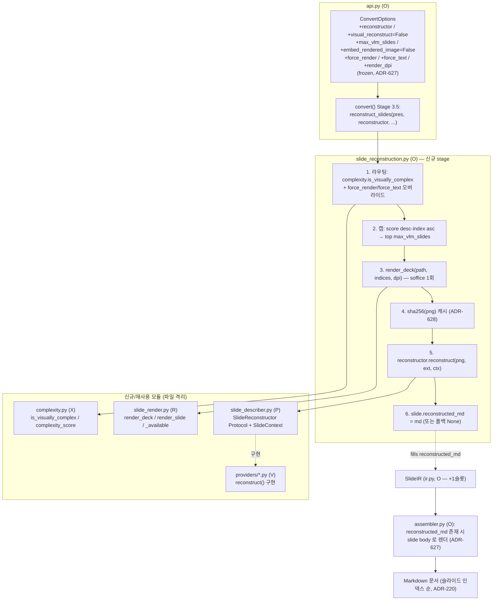
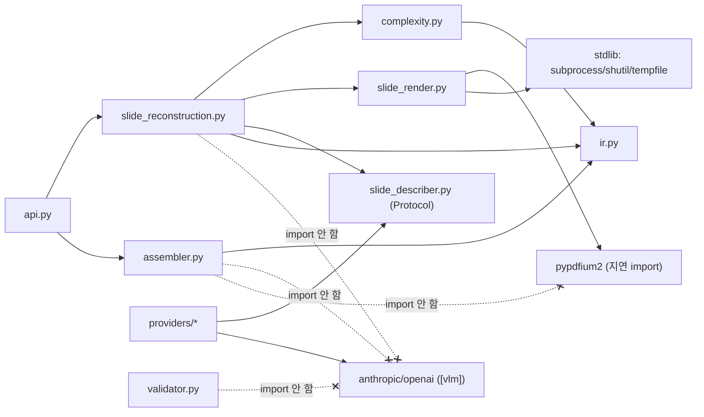

# ARCH-v020 — 시각 충실도 재설계: 하이브리드(렌더→VLM 구조화) 파이프라인

> 범위: 이슈 **#90** (FR-30~35, v0.2.0 단일 웨이브). 텍스트 슬라이드는 현행 저비용 추출을
> 유지하고, **시각 복잡 슬라이드만** 탐지(FR-31)→LibreOffice 렌더(FR-30)→VLM 통째 재구성
> (FR-32)→슬라이드 단위 결합(FR-33)한다. 임베드·비용 제어(FR-34), 회귀 게이트(FR-35).
> 전제: `docs/00-charter/project-profile.md`, `docs/10-requirements/REQ-v020.md`(요구 정본·§8
> 결정표), `docs/20-design/ARCH-M12.md`(VLM 파이프라인·sha256 캐시·ThreadPoolExecutor·
> ImageDescriber·ADR 서식 정본), `docs/20-design/ARCH-Wave3.md`(어셈블러 seam·opt-in 전례·
> 파일 소유권 격리).
> 코드 앵커: `description_pipeline.py`·`image_pipeline.py`·`vector.py`·`assembler.py`·
> `parser.py`/`ir.py`·`describer.py`·`api.py`.
> 선행 ADR: 전역 최대 = ARCH-Wave3 의 **ADR-621** → **본 문서는 ADR-622~630 연속 부여**.
> 작성: architect / 2026-07-11

---

> ## STATUS: APPROVED — 베이스라인 확정 (ms9648 승인, 2026-07-11, 이슈 #90 아키텍처 게이트)
>
> 아키텍처 게이트(CLAUDE.md 규칙 5) 통과: **DEC-7 신규 의존 `pypdfium2`([render] extras) 승인**,
> DEC-2 복잡도 임계·DEC-6 회귀 게이트·DEC-3/6 VLM 모델/콜상한 **architect 제안대로 확정**.
> ADR-622~630 및 WBS(R/X/P/V/O/G) 구현 착수 대상이다. 위임 수치(모델명·DPI·`max_vlm_slides`
> 기본값·임계 상수)는 provider/모듈 상수로 노출되며 구현 중 골든 캘리브레이션으로 튜닝한다
> (베이스라인 방향은 고정, 수치만 조정 여지).
>
> 본 문서는 REQ-v020 §8 의 **ARCH 위임 결정(DEC-2/4/6/7/8 + DEC-1/3/5 하위 수치)** 에 대한
> 설계·확정안이다. 확정된 베이스라인(DEC-1 LibreOffice / DEC-3·5 품질 우선·범위 전체)은
> 재론하지 않고 설계로만 옮긴다.

> ### ⚠️ 신규 의존 승인 필요 (프로파일 §1 게이트 · DEC-7) — 최우선 결재 항목
>
> | 항목 | 제안 | 사유 | 라이선스 | 승인 게이트 |
> |------|------|------|----------|-------------|
> | **PDF→PNG 래스터화 파이썬 라이브러리** | **`pypdfium2`** (신규, `[render]` extras 로 옵셔널) | LibreOffice `soffice`는 멀티슬라이드 PPTX 를 PDF 로만 온전히 내보낸다(DEC-1). 그 PDF 를 슬라이드별 PNG 로 래스터화할 파이썬 라이브러리가 **코어에 없음**(Pillow 는 PDF 렌더 불가). | **BSD-3-Clause / Apache-2.0**(PDFium) — 프로파일 §1 MIT 선호와 **정합**. self-contained wheel(외부 바이너리 불요), Windows+Linux CI 휠 제공 | **ms9648 승인 필요.** 미승인 시 FR-30 렌더 경로 전체가 BLOCKED(대안: 승인까지 렌더 경로 비활성·텍스트 폴백만 동작) |
>
> - **LibreOffice(`soffice`)**: 외부 실행파일 — 파이썬 의존 아님. 기존 `vector.py` 가 이미
>   사용 중(신규 승인 대상 아님, DEC-1 확정).
> - **VLM SDK(anthropic/openai)**: 이미 `[vlm]` extras 에 존재(승인 대상 아님).
> - **신규 파이썬 의존은 `pypdfium2` 단 1건**. 후보 비교·기각 사유는 §5.1 / ADR-622.

---

## 0. 개요 — 현행 골격과 v0.2.0 델타

### 0.1 현행 파이프라인 (설계의 출발점)

`api.convert()` 는 5단계: `parse → enrich_images → enrich_descriptions → assemble (→ validate?)`.
VLM 은 `ConvertOptions.describer`(ImageDescriber Protocol) 로 주입되고, `enrich_descriptions`
가 **이미지 도형 단위**로 `describe(image_bytes, ext, hint)` 를 호출해 `ImageShapeIR.description`
슬롯을 in-place 로 채운다(ARCH-M12). 어셈블러는 슬라이드를 인덱스 순 정렬(ADR-220) 후
`_render_slide_structured → _RenderedSlide` 로 렌더한다(ARCH-Wave3). `vector.py` 는 이미
`soffice`(LibreOffice)를 서브프로세스로 호출해 EMF/WMF→PNG 변환하며 graceful-skip·30s
타임아웃 규약을 갖는다.

**현행의 한계(#90 문제)**: VLM 경로는 **임베디드 래스터 이미지가 있어야만** 발동한다.
실증 파일(64슬라이드, 임베디드 이미지 **0장**)처럼 2D 배치·표·흐름이 도형으로 그려진
슬라이드는 텍스트 추출만 되어 시각 구조(S5 4열 매핑/S7 AS-IS↔TO-BE/S12 KPI·도넛)가 소실된다.

### 0.2 v0.2.0 가 얹는 것 (전부 opt-in, 기본값 = 현행 바이트 동일 — INV-3)

| 관심사 | FR | 신규 배선 | 델타 요지 |
|--------|----|-----------|-----------|
| 슬라이드→PNG 렌더 | FR-30 | `slide_render.py`(신규) | `soffice`→PDF(1회)→`pypdfium2` 페이지 래스터화. graceful-skip |
| 시각 복잡도 탐지 | FR-31 | `complexity.py`(신규) | IR 파생 신호로 렌더경로 라우팅. 결정적 bool + score |
| VLM 슬라이드 재구성 | FR-32 | `slide_describer.py`(신규 Protocol) + `slide_reconstruction.py`(신규 파이프라인) | PNG 통째 제시→구조화 MD. `SlideReconstructor` 신규 프로토콜 |
| 하이브리드 오케스트레이션 | FR-33 | `ir.py`(+슬롯), `api.py`, `assembler.py`(슬롯 소비) | `SlideIR.reconstructed_md` 슬롯 채움→어셈블러 렌더. 슬라이드 순 병합 |
| 임베드 & 비용 제어 | FR-34 | `slide_reconstruction.py`(캡·캐시·임베드) | `max_vlm_slides` 캡, sha256 렌더 캐시, base64 임베드 |
| 회귀 게이트 | FR-35 | `tests/`(합성 픽스처·골든) | 라우팅 골든 + 모의 프로바이더 골든 + 구조 불변식 |

### 0.3 재사용 vs 신규 (ARCH-M12/Wave3 자산 승계)

| ARCH-M12/Wave3 자산 | v0.2.0 활용 |
|---------------------|-------------|
| `vector.py` `soffice` 서브프로세스 배선·`VECTOR_TIMEOUT_S`·graceful-skip | `slide_render.py` 가 **동일 패턴 재사용**(deck→PDF 변환에 `--convert-to pdf`) |
| sha256 dedup 캐시(ADR-609) | 렌더 PNG 해시 캐시로 **확장**(FR-34 AC3, ADR-628) |
| ThreadPoolExecutor 동시성(ADR-608) | 재구성 콜 동시성에 **동일 모델 채택**(§3.3) |
| ImageDescriber 슬롯-충전 패턴(description in-place) | `reconstructed_md` 슬롯-충전으로 **동형 확장**(ADR-627) |
| 어셈블러 슬롯 소비(ADR-218 결정성·인덱스 순 병합) | 재구성 MD 를 슬라이드 블록에 결합(ADR-627) |
| opt-in default False 4옵션(ADR-614) | 신규 ConvertOptions 필드도 **전부 default 안전값**(ADR-627) |
| INV-5 SDK 격리(assembler/validator SDK import 0) | 렌더/재구성 모듈만 신규 의존 접촉, **격리 유지** |

---

## 1. 요구 → 설계 영향 추출

### 1.1 FR 별 아키텍처 영향

| FR | 핵심 AC | 설계 영향 | ADR |
|----|---------|-----------|-----|
| FR-30 렌더 | AC1 PNG/None, AC2 미설치→None+경고, AC3 DPI/종횡비, AC4 경계→None, AC6 타임아웃 | 신규 `slide_render.py`. `soffice` deck→PDF 1회 + `pypdfium2` 페이지 래스터. graceful-skip·타임아웃(vector.py 규약 계승) | 622, 623 |
| FR-31 복잡도 | AC1 IR만·VLM 미호출·결정적, AC2 멀티컬럼, AC3 커넥터/차트, AC4 순수텍스트→False, AC7 오버라이드 | 신규 `complexity.py`. `is_visually_complex(slide)->bool` + `complexity_score(slide)->int`. 명명 상수 임계 | 624 |
| FR-32 재구성 | AC1 유효 MD 조각, AC3 프로토콜 관계, AC4 프롬프트, AC5 실패→폴백, AC7 PII | 신규 `SlideReconstructor` Protocol(slide_describer.py) + provider 확장. 프롬프트/모델 수치 위임 | 625, 626 |
| FR-33 오케스트레이션 | AC1 라우팅+슬라이드 순 병합, AC2 하위호환 바이트동일, AC3 프로바이더 부재 안전, AC5 격리 | `SlideIR.reconstructed_md` 슬롯 + 신규 stage `reconstruct_slides` + 어셈블러 슬롯 소비 | 627 |
| FR-34 임베드·비용 | AC1 임베드 옵션, AC2 콜 상한, AC3 sha256 캐시, AC4 상한=0, AC5 콜수 계측 | `max_vlm_slides` 캡·top-N 선정·렌더 PNG sha256 캐시·base64 임베드 | 628 |
| FR-35 게이트 | AC1 텍스트 골든 불변, AC2 라우팅 골든, AC3 모의 골든, AC4 실VLM 제외, AC7 합성 픽스처 | 합성 PPTX 픽스처 + 라우팅/모의 골든 + 구조 불변식 어서션. FR-29 hard-fail 계승 | 629 |

### 1.2 불변식(INV-1~6, REQ §1) 준수 지도

| INV | 본 설계의 준수 방법 |
|-----|---------------------|
| INV-1 결정성 | **라우팅(FR-31)·병합 순서(FR-33)는 순수·결정적**(IR 파생, 인덱스 순). VLM 응답 본문만 비결정 → FR-35 로 흡수. 캡 선정(top-N)도 (score desc, index asc) 결정적 정렬 |
| INV-2 IR 하위호환 | `SlideIR.reconstructed_md: str \| None = None` **1개 슬롯만 추가**(default None). 기존 호출·테스트 무손상 |
| INV-3 옵션 하위호환 | 신규 `ConvertOptions` 필드 전부 안전 default(`reconstructor=None`/`visual_reconstruct=False` 등). `ConvertOptions()`·`convert(src)` 바이트 동일 |
| INV-4 격리 | 렌더 실패·VLM 실패 슬라이드는 **텍스트 경로 폴백**(reconstructed_md=None 유지). 예외 미전파. 슬라이드 1장 실패 반경 격리 |
| INV-5 의존 격리 | `assembler.py`·`validator.py` 최상단 VLM SDK·`pypdfium2`·python-pptx·Pillow import 0. 렌더=`slide_render.py`, 재구성=`slide_reconstruction.py`/provider 에 **격리**. core-only 에서 import·convert 성공 |
| INV-6 프로파일 준수 | 신규 파이썬 의존 = `pypdfium2` **단 1건**을 DEC-7(ADR-622)로 **승인 게이트에 승격**. `[render]` extras 로 옵셔널. 그 외 stdlib+기존 의존만 |

---

## 2. 모듈 분해 & 변경 지도 (파일 소유권 격리 — Wave3 A~E 전례)

### 2.1 파일별 변경 요지

| 파일 | 유형 | 요지 | 신규 의존 접촉 | 담당(WBS) |
|------|------|------|----------------|-----------|
| `src/pptx_md/slide_render.py` | **신규** | `render_deck(pptx_path, indices, *, dpi)->dict[int,bytes\|None]`(soffice→PDF 1회 + pypdfium2 페이지 래스터), `render_slide(path, n, *, dpi)->bytes\|None`(AC1 편의), `slide_render_available()->bool`. graceful-skip·타임아웃(vector.py 규약 계승) | **pypdfium2**(지연 import), soffice(subprocess) | **R** |
| `src/pptx_md/complexity.py` | **신규** | `is_visually_complex(slide)->bool`, `complexity_score(slide)->int`, 명명 임계 상수. 순수·결정적. IR·stdlib 만 | 없음 | **X** |
| `src/pptx_md/slide_describer.py` | **신규** | `SlideReconstructor` Protocol(`reconstruct(image_bytes, image_ext, context)->str`) + `SlideContext` frozen dataclass. **SDK import 0**(describer.py 전례) | 없음 | **P** |
| `src/pptx_md/slide_reconstruction.py` | **신규** | `reconstruct_slides(pres, reconstructor, *, renderer, complexity_fn, max_slides, force_render, force_text, embed, render_dpi)->None`. 라우팅→렌더→재구성→캐시→캡→임베드→슬롯 충전. 격리. **SDK import 0** | 없음(slide_render 경유) | **O** |
| `src/pptx_md/providers/anthropic.py`·`openai.py` | 확장 | `reconstruct(...)` 메서드 추가(SlideReconstructor 구현). 재구성 프롬프트·모델·토큰 상한(⟨DEC-3/6⟩). 기존 `describe` 무변경 | VLM SDK(기존) | **V** |
| `src/pptx_md/ir.py` | 확장(1슬롯) | `SlideIR.reconstructed_md: str \| None = None`(INV-2 default). 기존 필드 무변경 | 없음 | **O** |
| `src/pptx_md/api.py` | 확장(필드+전달) | `ConvertOptions` 신규 필드(§3.5) + `convert()` 신규 stage 배선. **SDK import 0 유지** | 없음 | **O** |
| `src/pptx_md/assembler.py` | 확장(슬롯 소비) | `_render_slide_structured` 가 `slide.reconstructed_md` 존재 시 이를 body 로 렌더(§3.4). off 시 슬롯=None→현행 바이트 동일 | 없음 | **O** |
| `pyproject.toml` | 확장 | `[project.optional-dependencies]` 에 `render = ["pypdfium2>=4"]` 추가(**DEC-7 승인 후**) | — | **R** |
| `tests/**` | 신규 | 합성 픽스처·라우팅 골든·모의 재구성 골든·구조 불변식(§7) | 없음 | **G** |

> **파일 소유권 규약(동시 편집 회피)**: `slide_render.py`=R 단독, `complexity.py`=X 단독,
> `slide_describer.py`=P 단독, provider 확장=V 단독, `tests/`=G 단독. **O**(오케스트레이션)가
> `ir.py`·`api.py`·`assembler.py`·`slide_reconstruction.py` 를 소유하며 seam 을 배선한다(P/X/R 의
> 계약 시그니처에 의존). 어떤 두 이슈도 같은 파일을 동시 편집하지 않는다.

### 2.2 컴포넌트 / 데이터 흐름



### 2.3 의존 방향 (단방향 — INV-5 격리 유지)



**핵심 규칙**: `assembler.py`·`validator.py` 는 SDK·pypdfium2 import 0(INV-5). 재구성 provider 는
여전히 **주입**(DIP, ImageDescriber 전례). `slide_reconstruction.py` 는 SDK 를 직접 import 하지
않고 주입된 `SlideReconstructor` 만 호출한다. `pypdfium2` 접촉은 `slide_render.py` 단일 파일에
격리(지연 import — core-only 에서 `import pptx_md` 성공).

---

## 3. 공개 인터페이스 & 처리 흐름

### 3.1 슬라이드 렌더 (FR-30, ADR-622/623)

`slide_render.py` — `vector.py` 의 `soffice` 배선·graceful-skip·타임아웃 규약을 계승한다.

```python
RENDER_TIMEOUT_S: int = 90        # ⟨ARCH 제안⟩ deck→PDF soffice 상한 (64슬라이드 여유; vector.py 30s 계승·상향)
RENDER_DPI_DEFAULT: int = 150     # ⟨ARCH 제안⟩ 16:9 슬라이드 기준 ~2000x1125px

def slide_render_available() -> bool:
    """soffice(PATH) AND pypdfium2(import 가능) 둘 다 참일 때만 True."""

def render_deck(
    pptx_path: str | os.PathLike[str],
    indices: Sequence[int],
    *,
    dpi: int = RENDER_DPI_DEFAULT,
) -> dict[int, bytes | None]:
    """PPTX 를 PDF 로 1회 변환(soffice) 후, 요청된 슬라이드 인덱스만 PNG 로 래스터.
    각 인덱스 값은 PNG 바이트(b"\\x89PNG"...) 또는 None(렌더 미가용/실패/범위초과).
    예외 미전파(INV-4). soffice·pypdfium2 미가용 → 전 인덱스 None."""

def render_slide(pptx_path, n, *, dpi=RENDER_DPI_DEFAULT) -> bytes | None:
    """AC1 편의 시그니처 = render_deck(path, [n], dpi)[n]."""
```

| 설계 항목 | 결정 | 근거(AC) |
|-----------|------|----------|
| **deck→PDF 1회** | 문서당 `soffice --convert-to pdf` **정확히 1회** 호출 후 pypdfium2 로 필요한 페이지만 래스터 | soffice 프로세스 기동 비용이 크므로 슬라이드당 호출은 비용 폭증. NFR-V020-1/2 |
| PDF→PNG | `pypdfium2` `PdfDocument`→`page.render(scale=dpi/72)`→Pillow PIL→PNG bytes | Pillow 이미 코어 의존. pypdfium2 self-contained(§5.1) |
| graceful-skip(AC1/AC2/AC4) | soffice/pypdfium2 부재·손상 PPTX·범위초과 인덱스·변환 실패 → 해당 값 `None` + 경고 로그 1건. 예외 미전파 | vector.py `convert_vector_to_png` 규약 계승 |
| 타임아웃(AC6) | `RENDER_TIMEOUT_S`(⟨ARCH⟩ 기본 90s) 초과 → 전 인덱스 `None`. `subprocess.run(timeout=...)` | vector.py `VECTOR_TIMEOUT_S` 계승 |
| 종횡비(AC3) | pypdfium2 는 PDF 페이지 크기를 그대로 스케일 → PDF 페이지 = 슬라이드 종횡비 → PNG 종횡비 = `slide_width_emu/height_emu` ±1% | AC3 |
| 결정성(AC5) | pypdfium2 래스터화는 결정적이나 soffice PDF 는 폰트/버전 의존 → **바이트 동일 비강제**. 회귀는 FR-35 라우팅/모의 골든이 흡수(렌더 자체는 골든 미대상) | AC5, INV-1 |
| PII(NFR-06) | PNG 바이트·경로 원문 미로그. 로그는 인덱스·성공/실패·바이트 길이만 | NFR-06 |

### 3.2 시각 복잡도 탐지 (FR-31, ADR-624)

`complexity.py` — 순수·결정적. **VLM·렌더 호출 없이** IR 파생 신호만 사용(AC1).

```python
# ⟨DEC-2 승인 대상⟩ — 명명 상수. 품질 우선(DEC-3/5)상 재현율 편향(경계 시 복잡=True)
COMPLEXITY_THRESHOLD: int = 4          # score >= 이 값 → 복잡
W_SHAPE_COUNT_OVER: int = ...          # 도형 수 임계 초과 가중
W_MULTI_COLUMN: int = ...              # 멀티컬럼(동일 top 밴드 3+ 텍스트) 가중
W_CONNECTOR: int = ...                 # 커넥터/화살표(OtherShapeIR 흐름) 가중
W_TABLE: int = ...                     # TableShapeIR 존재
W_CHART_SMARTART: int = ...            # 차트/SmartArt GraphicFrame(OtherShapeIR) 존재
W_GROUP: int = ...                     # GroupShapeIR 존재

def complexity_score(slide: SlideIR) -> int:
    """IR 파생 신호의 가중합. 결정적(동일 IR→동일 int). iter_shapes DFS 순회."""

def is_visually_complex(slide: SlideIR) -> bool:
    """complexity_score(slide) >= COMPLEXITY_THRESHOLD (AC1)."""
```

| 신호 | IR 파생 방법 | 목표 판정 |
|------|-------------|-----------|
| 도형 수 | `len(list(iter_shapes(slide)))` 임계 초과 | 다도형 슬라이드 |
| 멀티컬럼(AC2) | 텍스트 도형 `top`(EMU)을 `_ROW_TOLERANCE_EMU` 버킷팅 → 한 밴드에 3+ 도형이 서로 다른 `left` → 다열 구조(S5 "4열 매핑") | S5 → True |
| 커넥터/흐름(AC3) | `OtherShapeIR.mso_shape_type` 이 커넥터/화살표류 ≥ ⟨DEC-2 N⟩(S7 흐름) | S7 → True |
| 차트/SmartArt(AC3) | 차트/SmartArt GraphicFrame(FR-26 파생, `OtherShapeIR`) 존재(S12 도넛·KPI) | S12 → True |
| 표/그룹 | `TableShapeIR`/`GroupShapeIR` 존재 | 구조 신호 |
| 순수 텍스트(AC4) | 제목 + 단일 텍스트프레임 선형 불릿 → score < 임계 | False(텍스트 경로) |
| 빈 슬라이드(AC5) | 도형 0 → score 0 → False | False |

- **AC7 오버라이드**: 라우팅 최종 판정은 `slide_reconstruction`(§3.3)에서 `force_render`/
  `force_text` 인덱스 목록이 휴리스틱을 override. `complexity.py` 는 순수 신호만 계산.
- **캘리브레이션(AC6)**: 임계·가중치는 `⟨DEC-2⟩` 승인 대상. 목표 = S5/S7/S12 → True, 순수
  텍스트 → False. 품질 우선상 경계는 렌더 쪽(과탐 허용). **오탐 시 비용 폭증** 트레이드오프는
  `max_vlm_slides` 캡(FR-34)이 상한을 걸어 완화 — 과탐이 있어도 문서당 콜은 캡 이하.

### 3.3 VLM 슬라이드 재구성 (FR-32, ADR-625/626)

**프로토콜 결정(DEC-8) = 신규 `SlideReconstructor`** (ImageDescriber 재사용 아님). `slide_describer.py`:

```python
@dataclass(frozen=True)
class SlideContext:
    slide_index: int          # 0-based (추적성)
    title: str                # "" 허용
    text_outline: str         # 텍스트 경로 렌더 본문(결정적, OCR 미의존 정합용). "" 허용

@runtime_checkable
class SlideReconstructor(Protocol):
    def reconstruct(
        self, image_bytes: bytes, image_ext: str, context: SlideContext
    ) -> str: ...
```

| 항목 | 설계 | 근거 |
|------|------|------|
| **왜 신규 프로토콜(DEC-8)** | `describe(image_bytes, ext, hint)->str` 는 (a) 입력이 이미지+힌트 문자열, (b) 출력이 자연어 설명. 재구성은 (a) 입력이 **슬라이드 PNG + 슬라이드 컨텍스트(제목·텍스트 IR)**, (b) 출력이 **구조화 Markdown 조각**. 입력·출력 단위·의미가 다르므로 별도 계약이 타입 안전·프롬프트 분리에 유리 | AC3, DEC-8 |
| 프로토콜 병행 가능 | 하나의 provider 클래스가 `describe`(이미지)와 `reconstruct`(슬라이드)를 **둘 다 구현** 가능(HTTP 클라이언트 공유). 인터페이스만 분리 | AC3 |
| SDK 격리 | `slide_describer.py` 는 describer.py 처럼 **SDK import 0**. provider 만 SDK 접촉(주입) | INV-5 |
| 출력 계약(AC1/AC2) | 순수 Markdown 조각(코드펜스 금지·표는 정합 pipe table 헤더+구분행+1데이터행+·중첩리스트 들여쓰기·흐름 순서). FR-14/FR-29 validator 경고 0 목표 | AC1/AC2 |
| 프롬프트 전략(AC4) | "표/중첩리스트/흐름/차트 데이터 **우선 구조화**, 불확실하면 원문 텍스트 보존. 순수 Markdown 만 출력(설명 산문·코드펜스 금지)." 프롬프트 문구는 **provider 모듈 상수**로 추적성 확보(DIAGRAM_HINT_SUFFIX 전례) | AC4, ⟨DEC-3⟩ |
| 폴백(AC5/AC6) | reconstruct 실패/타임아웃/빈 응답 → 예외 미전파, 해당 슬라이드 `reconstructed_md=None` → **텍스트 경로 폴백**. 구조화 실패 산문은 원문 그대로 담아 손실 0 | AC5/AC6, INV-4 |
| PII(AC7/NFR-06) | PNG·프롬프트·응답 로깅 시 원문/PII 미출력. 마스킹(FR-15) 활성 시 재구성 산출에도 mask 적용 여부는 ⟨DEC-3 하위⟩ — 본 설계는 **어셈블러 슬롯 소비 시 mask_text 적용**(§3.4)으로 정합 | AC7 |

**모델·비용 수치 제안(⟨DEC-3/DEC-6⟩ 승인 대상, ADR-626)** — 품질 우선:

| 파라미터 | 제안값(승인 대상) | 근거 |
|----------|-------------------|------|
| 기본 모델(anthropic) | 고성능 Claude 계열(예: `claude-opus`/`claude-sonnet` 상위) | 품질 우선(DEC-3). 현행 describe 는 haiku(저비용) — 재구성은 별도 상위 모델 지정 |
| 기본 모델(openai) | 고성능 GPT 비전 계열 | 동일 |
| max_tokens | 재구성용 상향(예: 4096) — 표·리스트 다량 산출 대비 | describe 는 1024. 재구성은 문서량 큼 |
| 이미지 해상도 | RENDER_DPI 150(§3.1) → provider 가 원본 PNG 그대로 전송 | 품질·비용 균형 |

> 모델명·토큰·DPI 실값은 **사람 승인 전 미고정**. provider 상수·`reconstruct` 파라미터로 노출.

### 3.4 하이브리드 오케스트레이션 (FR-33, ADR-627)

**신규 stage `reconstruct_slides`** — `enrich_descriptions` 후, `assemble` 전(Stage 3.5).

```python
def reconstruct_slides(
    presentation: PresentationIR,
    reconstructor: SlideReconstructor | None,
    *,
    renderer: DeckRenderer = slide_render.render_deck,   # 주입 가능(테스트)
    complexity_fn: Callable[[SlideIR], bool] = complexity.is_visually_complex,
    max_slides: int | None = None,          # ⟨DEC-5⟩ 기본 상한
    force_render: frozenset[int] = frozenset(),
    force_text: frozenset[int] = frozenset(),
    embed: bool = False,
    render_dpi: int = slide_render.RENDER_DPI_DEFAULT,
    max_workers: int = 4,
) -> None:
    """SlideIR.reconstructed_md 를 in-place 충전. describer 패턴 계승."""
```

처리 순서(전부 결정적 라우팅·병합, VLM 본문만 비결정 — INV-1):

1. **조기 return**(AC3): `reconstructor is None` **또는** `not slide_render_available()` → 즉시 반환. 전 슬라이드 텍스트 경로(reconstructed_md=None). core-only 안전(INV-5).
2. **라우팅**(AC1): 후보 = `{i : complexity_fn(slide_i) or i∈force_render} − force_text`. `force_*` 오버라이드(AC7).
3. **캡**(FR-34 AC2/AC4): `max_slides` 지정 시 후보를 `(complexity_score desc, index asc)` 정렬 → **top-N** 만 유지. 초과분은 텍스트 폴백 + 경고 로그. `max_slides=0` → 렌더 0건·콜 0.
4. **렌더**(FR-30): `renderer(pres.source_path, selected_indices, dpi=render_dpi)` **1회** → `{index: png|None}`.
5. **캐시**(FR-34 AC3): `sha256(png)` 그룹핑(ADR-609 확장) → 동일 렌더는 재구성 1회. `png is None` 슬라이드는 텍스트 폴백.
6. **재구성**(FR-32): 고유 해시당 `reconstructor.reconstruct(png, "png", SlideContext(...))`. `text_outline` = 텍스트 경로 body 추출(결정적). `ThreadPoolExecutor(max_workers)` 동시성(ADR-608 계승) — hash→text 사후 매핑, 개별 슬롯 in-place(ADR-610 계승, 락 불요).
7. **임베드**(FR-34 AC1): `embed=True` → 재구성 MD 앞에 `` prepend(§3.6). 기본 False.
8. **충전/격리**(AC5): 성공 → `slide.reconstructed_md = md`. 실패/폴백 → None 유지. 슬라이드 1장 실패가 타 슬라이드·전체 문서를 깨지 않음(INV-4).
9. **관측**(AC6): 렌더 경로 슬라이드 수·VLM 콜 수·폴백 수를 로그 메타(원문 미출력, NFR-06).

**어셈블러 슬롯 소비**(`assembler.py` `_render_slide_structured`):

```python
# 헤딩 계산 후:
if slide.reconstructed_md is not None:
    text = slide.reconstructed_md
    if masking is not None:
        text = mask_text(text, masking)         # AC7 정합
    body_parts = [text]                          # 텍스트 경로 body 대체
else:
    body_parts = [...현행 shape 렌더...]         # off/폴백 시 현행 바이트 동일 (AC2)
```

- **결합 규약(AC4)**: 재구성 슬라이드도 동일 `## {title}`/`_SLIDE_SEPARATOR`("\n\n---\n\n")
  블록 규약을 따른다. FR-28 구조화 옵션(heading_hierarchy 등)과 상호 파손 없음(헤딩은 별도 계산,
  body 만 대체). `---` 충돌 0.
- **하위호환(AC2)**: `visual_reconstruct=False`(기본) → Stage 3.5 미실행 → reconstructed_md=None →
  어셈블러 else 분기 → **현행 바이트 동일**. FR-29 off/on 골든 회귀 0(FR-35 AC1).

### 3.5 ConvertOptions 신규 필드 (ADR-627)

| 필드 | 타입 | 기본값 | 의미 | 하위호환 |
|------|------|--------|------|----------|
| `reconstructor` | `SlideReconstructor \| None` | `None` | 슬라이드 재구성 프로바이더(주입). None=재구성 생략 | None 이면 Stage 3.5 조기 return |
| `visual_reconstruct` | `bool` | `False` | 하이브리드 렌더 경로 opt-in 마스터 스위치 | False=현행 경로만 |
| `max_vlm_slides` | `int \| None` | `None`(⟨DEC-5⟩) | 문서당 렌더+VLM 슬라이드 상한. `0`=렌더 0 | None=⟨DEC-5⟩ 기본 정책 |
| `embed_rendered_image` | `bool` | `False`(⟨DEC-4⟩) | 렌더 PNG 를 base64 로 병행 삽입 | False=재구성 텍스트만 |
| `force_render` | `frozenset[int]` | `frozenset()` | 강제 렌더 슬라이드 인덱스(휴리스틱 override, AC7) | 빈 집합 무영향 |
| `force_text` | `frozenset[int]` | `frozenset()` | 강제 텍스트 슬라이드 인덱스(AC7) | 빈 집합 무영향 |
| `render_dpi` | `int` | `150`(⟨ARCH⟩) | 렌더 목표 DPI | 렌더 경로에서만 발동 |
| `reconstruct_max_workers` | `int` | `4` | 재구성 콜 동시성(ADR-608 계승) | describer=None 유사 무발동 |

`convert()` 신규 Stage 3.5:
```python
if opts.visual_reconstruct:
    reconstruct_slides(
        pres, opts.reconstructor,
        max_slides=opts.max_vlm_slides,
        force_render=opts.force_render, force_text=opts.force_text,
        embed=opts.embed_rendered_image, render_dpi=opts.render_dpi,
        max_workers=opts.reconstruct_max_workers,
    )
```

### 3.6 임베드 & 비용 제어 상세 (FR-34, ADR-628)

| 항목 | 결정(⟨DEC-4/5⟩ 승인 대상) | 근거 |
|------|---------------------------|------|
| 임베드 기본값 | `embed_rendered_image=False`(권장) | Wave3 opt-in 전례. base64 슬라이드 PNG 는 문서 크기 급증 |
| 임베드 방식 | **base64 data URI 인라인**(``) | 산출물 = **Markdown 문자열까지**(Non-goal §10 "파일 저장 없음") 원칙 정합. 파일경로 참조는 파일 쓰기 유발 → 기각 |
| 콜 상한 기본(⟨DEC-5⟩) | `max_vlm_slides` 기본값·선정 규칙(상위 N by complexity_score) — 품질 우선상 넓게. 실값 승인 대상 | NFR-V020-2 |
| 캐시(AC3) | `sha256(png)` 키 인메모리 dedup(ADR-609 확장). 수명 = `reconstruct_slides` 호출 범위. 디스크/세션 캐시는 Non-goal(P-01) | AC3 |
| 콜수 계측(AC5) | 실제 reconstruct 콜 수 = 고유 렌더 PNG 수(캐시 히트 제외) ≤ min(고유 복잡 슬라이드 수, max_vlm_slides). 계측 테스트(FakeReconstructor 카운터) | NFR-V020-2 |

### 3.7 회귀 검증 (FR-35, ADR-629)

| 계층 | 전략 | 결정성 |
|------|------|--------|
| 텍스트 경로 골든(AC1) | 신규 옵션 전부 off → 기존 FR-29 off/on 골든(2종) diff 0 | 결정적 |
| 라우팅 골든(AC2) | **합성 픽스처**(S5/S7/S12 재현 + 순수 텍스트) → `is_visually_complex` 렌더 경로 인덱스 **집합**을 결정적 골든과 비교(VLM 미호출, 순수 IR) | 결정적 |
| 모의 프로바이더 골든(AC3) | 고정 응답 **FakeReconstructor** 주입 → `visual_reconstruct=True` 변환 → 결합·구분자·헤딩 규약 바이트 골든 | 결정적(비결정성 프로바이더 경계 밖 격리) |
| 실 VLM(AC4) | 바이트 골든 **제외**. **구조 불변식 어서션**: 유효 Markdown, validator 경고 0, 표 정합, 슬라이드 수 보존. CI hard-fail 여부는 ⟨DEC-6⟩ | N/A(비결정) |
| CI 정책(AC5) | 라우팅/모의 골든 diff → 실패(머지 차단, FR-29 D-6 hard-fail 전례, 기존 pytest 편승) | — |
| 환경 격리(AC6) | 렌더/VLM 의존 테스트는 `slide_render_available()`/`reconstructor` 부재 시 skip. 라우팅·모의·텍스트 골든은 **항상 실행** | — |
| 픽스처 자산(AC7) | 전부 **합성 PPTX**(사내 `.upload/*.pptx` 미포함). 리포지토리/PyPI 산출 유입 0 | — |

**⟨DEC-6⟩ 회귀 게이트 권고 = (a) 모의 프로바이더 골든 + 구조 불변식** (실 VLM 스냅샷+허용오차
기각). 근거: 실 VLM 은 비용·불안정(429·모델 갱신)으로 CI hard-fail 부적합. 모의 골든이
오케스트레이션/결합 회귀를 결정적으로 잡고, 실 VLM 은 수동/nightly 구조 불변식으로만 검증.

---

## 4. 횡단 관심사

### 4.1 인증·인가 / 트랜잭션 경계
- 인증: VLM API key 는 provider 내부(SDK 가 환경변수 로드, NFR-05). 재구성 stage·assembler 는 key 미취급.
- 트랜잭션: DB·외부 상태 없음. 공유 자료구조 = `results: dict[str,str]`(hash→md) — 메인 스레드 단독 기입, 워커는 값만 반환, 슬롯 기입도 메인 스레드 → **락 불요**(ADR-610 계승).

### 4.2 예외 처리 / 격리 (INV-4)
| 레벨 | 정책 |
|------|------|
| `render_deck` | soffice/pypdfium2 실패·타임아웃·범위초과 → 해당 값 None(무예외). vector.py 규약 |
| provider `reconstruct` | 실패 시 `DescribeError` 전파(describe 전례) |
| `reconstruct_slides`(job) | reconstruct/렌더 실패를 try/except 흡수 → 해당 슬롯 None(폴백). 슬라이드 1장 실패 반경 |
| `assemble` | reconstructed_md=None → 현행 shape 렌더 폴백. 부분 실패 문서도 유효 Markdown |

### 4.3 로깅·감사 (NFR-06)
- 미출력: PNG 바이트, 재구성 MD 본문, 프롬프트/응답 본문, sha256 원본 바이트, 슬라이드 텍스트.
- 출력(메타): 렌더 슬라이드 수, VLM 콜 수, 캐시 히트 수, 폴백 수, 예외 타입, 슬라이드 인덱스, digest 앞 12자.

### 4.4 mypy strict (NFR-V020-7)
- `render_deck(...)->dict[int, bytes|None]`, `is_visually_complex(SlideIR)->bool`, `reconstruct(...)->str`, `SlideContext` frozen, `reconstructed_md: str|None` 명시. SDK Any 는 provider 내부 격리(현행).
- `pypdfium2` 는 `ignore_missing_imports=true`(pyproject 설정) 하에서 mypy 통과. 지연 import 로 `Any` 최소화.

---

## 5. 기술 선택지 비교 (ADR 후보)

### 5.1 PDF→PNG 래스터화 라이브러리 (DEC-7, ADR-622 확정 대상)

| 후보 | 라이선스 | 외부 바이너리 | 이식성(Win+Linux CI) | 설치 편의 | 성능 | 평가 |
|------|----------|---------------|----------------------|-----------|------|------|
| **A. `pypdfium2`** | **BSD-3/Apache-2.0**(PDFium) — 프로파일 MIT 선호 정합 | **불요**(휠에 pdfium 번들) | 양쪽 프리빌트 휠 | `pip install` 단독 | C 기반, 빠름 | **권고** |
| B. `PyMuPDF`(fitz) | **AGPL-3.0**/상용 — MIT 프로젝트에 **copyleft 오염** | 불요 | 휠 제공 | pip | 매우 빠름 | **기각(라이선스)** |
| C. `pdf2image`+poppler | MIT(래퍼) | **poppler 별도 설치 필수**(2번째 외부 바이너리) | Windows poppler 설치 난이도↑ | pip+수동 바이너리 | 보통 | 기각(외부 바이너리·설치 마찰) |

**권고: A(pypdfium2)** — (a) BSD/Apache 로 MIT 정합, (b) self-contained 휠로 **외부 바이너리 0**
(LibreOffice 외 추가 시스템 의존 없음), (c) Windows+Linux 프리빌트 휠로 CI 이식성, (d) Pillow
(코어 의존)와 조합해 PNG 인코딩. **PyMuPDF 는 AGPL 로 배포 정책 충돌 → 기각**. pdf2image 는
poppler 라는 2번째 외부 바이너리를 강제해 폐쇄망 아닌 환경에서도 설치 마찰 → 기각. → **ADR-622**.
**신규 파이썬 의존이므로 프로파일 §1 승인 게이트(상단 박스) 유지 — ms9648 승인 필요.**

### 5.2 렌더 호출 단위: deck→PDF 1회 vs 슬라이드당 soffice (ADR-623)
| 후보 | 장점 | 단점 |
|------|------|------|
| **A. deck→PDF 1회 + pypdfium2 페이지 래스터** | soffice 프로세스 1회(기동 비용 상각), 페이지 래스터는 저비용 | PDF 중간 산출(임시파일) |
| B. 슬라이드당 soffice 호출 | 단순 | soffice 기동 N회 = 비용·지연 폭증(64슬라이드) |
**권고: A** — soffice 기동이 지배 비용. 1회 변환 후 필요한 페이지만 래스터가 NFR-V020-1 정합. → ADR-623.

### 5.3 재구성 프로토콜: 신규 SlideReconstructor vs ImageDescriber 재사용 (DEC-8, ADR-625)
| 후보 | 장점 | 단점 |
|------|------|------|
| **A. 신규 `SlideReconstructor`(reconstruct+SlideContext)** | 입력(PNG+컨텍스트)·출력(구조화 MD) 의미 정확, 프롬프트/모델 분리, 타입 안전 | 프로토콜 1개 추가 |
| B. ImageDescriber 재사용(describe 에 슬라이드 PNG+힌트) | 인터페이스 0 추가 | 힌트 문자열로 슬라이드 컨텍스트 전달 부자연, 출력 계약 혼재(설명 vs 구조화 MD) |
**권고: A** — 재구성은 describe 와 입력·출력 단위가 근본적으로 다르다(AC3). provider 는 두 프로토콜을 병행 구현해 클라이언트 공유. → ADR-625.

### 5.4 재구성 결과 소비: IR 슬롯 vs 사이드맵 (ADR-627)
| 후보 | 장점 | 단점 |
|------|------|------|
| **A. `SlideIR.reconstructed_md` 슬롯(description 슬롯 전례)** | ARCH-M12 슬롯-충전 패턴 동형, 어셈블러 자연 소비, 인덱스 순 병합 결정성, INV-2 default None | IR 필드 1개 추가 |
| B. convert() 지역 dict[index→md] 를 assembler 에 전달 | IR 무변경 | assembler 시그니처 확대, 슬라이드-맵 정합 부담, description 슬롯 전례와 불일치 |
**권고: A** — description 슬롯 선례(ADR-210) 동형이 유지보수·결정성에 유리. INV-2 default None 으로 하위호환. → ADR-627.

### 5.5 임베드 방식: base64 인라인 vs 파일 참조 (DEC-4, ADR-628)
| 후보 | 장점 | 단점 |
|------|------|------|
| **A. base64 data URI 인라인** | 산출물 = 단일 Markdown 문자열(Non-goal 정합), 파일 쓰기 0 | 문서 크기 급증 → 기본 False |
| B. 파일 경로 참조(PNG 별도 저장) | 문서 경량 | **파일 쓰기 유발**(Non-goal "Markdown 문자열까지" 위반), 경로 관리·PII |
**권고: A(기본 False)** — Markdown-only 산출 원칙. 임베드는 opt-in, base64. → ADR-628.

### 5.6 회귀 게이트: 모의 골든+불변식 vs 실 VLM 스냅샷 (DEC-6, ADR-629)
| 후보 | 장점 | 단점 |
|------|------|------|
| **A. 모의 프로바이더 골든 + 구조 불변식** | 결정적 hard-fail, 비용 0, 오케스트레이션 회귀 정조준, FR-29 편승 | 실 VLM 품질은 별도 수동/nightly |
| B. 실 VLM 스냅샷 + 허용오차 | e2e 실측 | 비결정·비용·429·모델 갱신 → CI 불안정, 허용오차 튜닝 부담 |
**권고: A** — 비결정성을 프로바이더 경계 밖으로 격리해 결정적 게이트 확보. 실 VLM CI hard-fail 여부는 ⟨DEC-6⟩ 사람 승인. → ADR-629.

---

## 6. 아키텍처 결정 기록 (ADR-622 ~ ADR-630)

### ADR-622 PDF→PNG 래스터화 = `pypdfium2` (신규 파이썬 의존, `[render]` extras, 승인 대상)
**배경**: DEC-1 로 렌더 엔진 = LibreOffice 확정. `soffice` 는 멀티슬라이드 PPTX 를 PDF 로만 온전히
내보내며(단일 PNG 제약), PDF 를 슬라이드별 PNG 로 래스터화할 파이썬 라이브러리가 코어에 없다
(Pillow 는 PDF 렌더 불가). 프로파일 §1 은 신규 파이썬 의존을 승인 게이트로 규정(DEC-7).
**결정**: `pypdfium2` 를 `[render]` extras 로 신설(옵셔널). `slide_render.py` 단일 파일에 지연
import 로 격리. 미설치 시 `slide_render_available()==False` → 렌더 경로 비활성·텍스트 폴백.
**근거**: (a) BSD-3/Apache-2.0 라이선스 → 프로파일 MIT 선호 정합(PyMuPDF AGPL 대비), (b)
self-contained 휠 → 외부 바이너리 0(pdf2image+poppler 대비), (c) Windows+Linux 프리빌트 휠 →
CI 이식성, (d) Pillow(코어)와 조합해 PNG 인코딩.
**대안과 기각 사유**: PyMuPDF(AGPL copyleft → MIT 배포 정책 충돌), pdf2image+poppler(2번째
외부 바이너리·Windows 설치 마찰), Pillow 단독(PDF 렌더 미지원).
**영향**: **ms9648 승인 필요**(프로파일 §1). 승인 시 `pyproject.toml` `[render]` extras 추가.
미승인 시 FR-30 렌더 경로 BLOCKED(그 외 FR 는 진행 가능하나 렌더 없이는 재구성 무의미).

### ADR-623 렌더 파이프라인 = deck→PDF 1회(soffice) + pypdfium2 페이지 래스터, graceful-skip·타임아웃
**배경**: FR-30 은 슬라이드 1장을 원본 레이아웃 PNG 로 렌더하되, 미설치/손상/범위초과 시 None
(예외 미전파, INV-4)·타임아웃 상한을 요구한다. 64슬라이드 규모에서 비용 통제 필요.
**결정**: 문서당 `soffice --convert-to pdf` **1회** → `pypdfium2` 로 요청 페이지만 래스터
(`render_deck(path, indices, dpi)`). graceful-skip·`RENDER_TIMEOUT_S`(⟨ARCH⟩ 90s)·
`RENDER_DPI_DEFAULT`(⟨ARCH⟩ 150)는 `vector.py` 규약 계승. 종횡비는 PDF 페이지=슬라이드 비율 보존.
**근거**: (a) soffice 기동이 지배 비용 → 1회 변환이 NFR-V020-1/2 정합, (b) vector.py 배선 재사용,
(c) 미가용·실패·타임아웃 모두 None 반환으로 격리(INV-4), (d) pypdfium2 결정적 래스터.
**대안과 기각 사유**: 슬라이드당 soffice 호출(기동 N회 비용 폭증), soffice PDF→PNG 직접
(멀티페이지 1장 제약 동일), COM(DEC-1 기각).
**영향**: `slide_render.py` 신규(R). soffice PDF 비결정성은 렌더를 바이트 골든 미대상으로(AC5,
FR-35 흡수). DPI/타임아웃 실값 ⟨ARCH⟩ 승인 대상.

### ADR-624 시각 복잡도 = IR 파생 신호 가중합(결정적), 명명 임계 상수, 재현율 편향
**배경**: FR-31 은 IR 만으로(VLM·렌더 미호출) 렌더 경로를 결정적으로 라우팅하되, S5/S7/S12 →
True·순수 텍스트 → False 를 목표로 한다. 품질 우선(DEC-3/5)상 놓치지 않음(재현율)이 우선.
**결정**: `complexity_score(slide)->int`(도형 수·멀티컬럼·커넥터·차트/SmartArt·표·그룹 신호의
가중합, `iter_shapes` DFS·`_ROW_TOLERANCE_EMU` 버킷) + `is_visually_complex = score >= THRESHOLD`.
임계·가중치는 명명 상수(classifier 전례). 경계 시 복잡(과탐 허용).
**근거**: (a) IR 파생 순수 함수 → 결정적(INV-1, 동일 IR→동일 bool/int), (b) 멀티컬럼은 EMU
좌표(FR-23) top 밴드 정렬로 S5 포착, (c) 커넥터/차트는 OtherShapeIR/GraphicFrame(FR-26)로 S7/S12
포착, (d) 재현율 편향 + max_vlm_slides 캡으로 과탐 비용 상한.
**대안과 기각 사유**: VLM 사전판정(비용·비결정·AC1 위반), ML 분류기(학습 데이터·비결정·과설계),
단일 신호 임계(S5 멀티컬럼/S12 차트 동시 포착 불가).
**영향**: `complexity.py` 신규(X). 임계·가중치 실값 ⟨DEC-2⟩ 승인 대상(캘리브레이션은 합성
S5/S7/S12 픽스처 + 실증 파일 로컬 검증). `complexity_score` 는 FR-34 top-N 캡의 랭킹 입력.

### ADR-625 재구성 프로토콜 = 신규 `SlideReconstructor`(reconstruct + SlideContext), ImageDescriber 병행
**배경**: FR-32 는 슬라이드 PNG+컨텍스트를 구조화 MD 로 재구성한다. ImageDescriber
`describe(image_bytes, ext, hint)->str` 는 입력(이미지+힌트)·출력(자연어 설명) 단위가 다르다(DEC-8).
**결정**: `slide_describer.py` 에 `SlideReconstructor` Protocol(`reconstruct(image_bytes, image_ext,
context: SlideContext)->str`) + `SlideContext(slide_index, title, text_outline)` frozen dataclass
신설. SDK import 0(describer.py 전례). provider 는 describe 와 reconstruct 를 병행 구현.
**근거**: (a) 입력·출력 단위·의미가 describe 와 근본적으로 다름(AC3), (b) 프롬프트·모델·토큰을
재구성 전용으로 분리, (c) 슬라이드 컨텍스트(제목·텍스트 IR)를 구조화 전달, (d) SDK 격리 유지(INV-5).
**대안과 기각 사유**: ImageDescriber 재사용(힌트로 컨텍스트 전달 부자연·출력 계약 혼재),
describe 시그니처 확장(기존 provider·plug-in 파괴).
**영향**: `slide_describer.py` 신규(P), provider 확장(V). 폴백(실패→텍스트 경로, INV-4). 프롬프트
전략 상수는 provider 모듈에 추적성 확보.

### ADR-626 재구성 VLM 정책 = 품질 우선 고성능 모델·토큰 상향(수치 승인 대상)
**배경**: DEC-3/5 로 VLM 정책 = 품질 우선 확정. 구체 모델명·해상도·토큰·콜 상한은 ARCH 제안 +
사람 승인.
**결정**: 재구성 provider 는 현행 describe(저비용 haiku) 와 **별도**의 고성능 모델(예:
Claude/GPT 상위 비전 계열)을 기본으로, max_tokens 상향(예 4096), 이미지 = RENDER_DPI 150 PNG.
실값은 provider 상수·`reconstruct` 파라미터로 노출하며 **사람 승인 전 미고정**.
**근거**: (a) 품질 우선상 시각 구조 정확도가 비용보다 우선(DEC-3/5), (b) 표·리스트 다량 산출에
토큰 여유, (c) `[vlm]` extras 범위 유지(신규 SDK 0).
**대안과 기각 사유**: 저비용 모델 재사용(품질 우선 정책 위배), 로컬 VLM 번들(Non-goal §10).
**영향**: 콜 비용은 max_vlm_slides 캡(FR-34)이 상한. 모델명·토큰 실값 ⟨DEC-3/6⟩ 승인 대상.

### ADR-627 하이브리드 오케스트레이션 = SlideIR 슬롯 충전 stage + 어셈블러 소비, opt-in
**배경**: FR-33 은 1회 convert() 로 텍스트/렌더 슬라이드를 슬라이드 단위 라우팅·결합하되 기존
API 무파손(INV-3)·격리(INV-4)를 요구한다.
**결정**: `SlideIR.reconstructed_md: str|None=None` 슬롯 추가(INV-2). 신규 stage
`reconstruct_slides`(Stage 3.5)가 라우팅→캡→렌더→캐시→재구성→슬롯 충전. `assemble` 는 슬롯
존재 시 이를 body 로 렌더(off/폴백 시 None→현행 shape 렌더). `ConvertOptions` 에
`visual_reconstruct` 등 신규 필드(전부 안전 default). 슬라이드 인덱스 순 병합(ADR-220 계승).
**근거**: (a) description 슬롯-충전 패턴 동형(ARCH-M12), (b) opt-in default 로 바이트 동일(AC2,
FR-35 AC1), (c) 프로바이더/렌더 부재 시 조기 return→core-only 안전(AC3, INV-5), (d) 슬라이드 1장
실패 폴백 격리(AC5, INV-4), (e) 결합 규약 공유로 `---` 충돌 0(AC4).
**대안과 기각 사유**: convert() 지역 맵 전달(assembler 시그니처 확대·description 전례 불일치),
assembler 내부 렌더 호출(INV-5 SDK 격리 위반), 별도 진입 API(INV-3 위반).
**영향**: `ir.py`·`api.py`·`assembler.py`·`slide_reconstruction.py` = O 단독 편집. Stage 3.5 는
`visual_reconstruct=True` 에서만 발동.

### ADR-628 비용 제어 = max_vlm_slides top-N 캡 + sha256 렌더 캐시 + base64 임베드(opt-in)
**배경**: FR-34 는 임베드 옵션·문서당 콜 상한·동일 렌더 캐시를 요구한다(Should). 품질 우선상
캡 기본은 넓게(DEC-5).
**결정**: `max_vlm_slides` 캡 — 후보를 `(complexity_score desc, index asc)` 정렬 top-N(초과분 텍스트
폴백+경고). `max_vlm_slides=0`→렌더 0. `sha256(png)` 인메모리 dedup(ADR-609 확장, 수명=호출 범위).
`embed_rendered_image=True`→base64 data URI 인라인(기본 False). 실값(캡 기본·임베드 default)은
⟨DEC-4/5⟩ 승인 대상.
**근거**: (a) 캡이 과탐 비용 상한(FR-31 재현율 편향 보완), (b) sha256 캐시로 동일 렌더 콜 1회
(AC3), (c) base64 인라인이 Markdown-only 산출 정합(Non-goal §10), (d) 계측 가능(NFR-V020-2).
**대안과 기각 사유**: 파일 경로 임베드(파일 쓰기·Non-goal 위반), 디스크 캐시(P-01 별도 승인),
캡 없음(품질 우선이라도 비용 폭주 위험).
**영향**: `slide_reconstruction.py`(O). complexity_score 가 top-N 랭킹 제공. 캡 기본·임베드 default
⟨DEC-4/5⟩ 승인 대상.

### ADR-629 회귀 게이트 = 합성 픽스처 라우팅 골든 + 모의 프로바이더 골든 + 구조 불변식, 실 VLM 제외
**배경**: FR-35 는 비결정 VLM 본문에도 라우팅/결합/텍스트 경로 회귀를 잡고 FR-29 골든을 깨지
않기를 요구한다. 사내 실증 파일은 공개 픽스처 부적합(§10).
**결정**: (a) 텍스트 경로 = 기존 FR-29 off/on 골든 diff 0(AC1), (b) 라우팅 = 합성 S5/S7/S12+텍스트
픽스처의 `is_visually_complex` 인덱스 집합 골든(VLM 미호출, AC2), (c) 결합 = FakeReconstructor
고정 응답 바이트 골든(AC3), (d) 실 VLM = 바이트 골든 제외·구조 불변식 어서션(유효 MD·validator
경고 0·표 정합·슬라이드 수, AC4). 골든 diff→기존 pytest hard-fail(D-6 계승). 렌더/VLM 의존
테스트는 환경 게이트 skip(AC6). 픽스처 전부 합성 PPTX(AC7). 실 VLM CI hard-fail 여부 ⟨DEC-6⟩.
**근거**: (a) 비결정성을 프로바이더 경계 밖으로 격리해 결정적 hard-fail, (b) 라우팅·결합 회귀
정조준, (c) 기존 CI pytest 편승(신규 워크플로 0, ARCH-Wave3 ADR-620 전례), (d) 합성 픽스처로 사내
자료 배포 유입 0.
**대안과 기각 사유**: 실 VLM 스냅샷+허용오차(비용·429·모델 갱신→CI 불안정), 사내 파일 골든
(배포 정책 위반).
**영향**: `tests/`(G) 단독. FR-29 골든 재사용. 실 VLM 게이트 정책 ⟨DEC-6⟩ 승인 대상.

### ADR-630 모듈 분해 = slide_render/complexity/slide_describer/slide_reconstruction 분리(파일 소유권 격리)
**배경**: FR-30~35 는 렌더·복잡도·프로토콜·오케스트레이션·게이트 관심사가 얽혀 있어 동시 편집
충돌 위험. Wave3 A~E 파일 소유권 격리 전례.
**결정**: `slide_render.py`(R)·`complexity.py`(X)·`slide_describer.py`(P)·provider 확장(V)·
`tests/`(G) 를 단독 소유로 분리. `slide_reconstruction.py`·`ir.py`·`api.py`·`assembler.py` 는
O(오케스트레이션)가 단독 소유하며 P/X/R 계약에 의존해 seam 배선.
**근거**: (a) 어떤 두 이슈도 같은 파일 동시 편집 없음, (b) 관심사별 단위 테스트·리뷰 집중,
(c) INV-5 격리(pypdfium2=slide_render, SDK=provider), (d) O 가 계약 시그니처에 의존(P/X/R 선행).
**대안과 기각 사유**: 전부 단일 모듈(다이슈 충돌·SDK/pypdfium2 격리 붕괴), assembler 내 렌더
(INV-5 위반).
**영향**: 신규 4모듈 + provider/ir/api/assembler 확장. WBS 파일 소유권표(§8)로 병렬화.

---

## 7. 테스트 전략 (NFR-V020-7 ≥75%)

| 영역 | 테스트 | 도구/방식 |
|------|--------|-----------|
| 렌더 graceful-skip(FR-30 AC2/AC4) | soffice/pypdfium2 미가용 monkeypatch→None, 범위초과 인덱스→None, 손상 PPTX→None, 무예외 | monkeypatch `shutil.which`/import |
| 렌더 종횡비(AC3) | (환경 게이트) 실 렌더 PNG 폭/높이 = slide 비율 ±1% | `slide_render_available()` skip guard |
| 복잡도 판정(FR-31 AC2~AC5) | 합성 SlideIR: 멀티컬럼→True, 커넥터→True, 차트→True, 순수텍스트→False, 빈→False, 동일 IR 2회 동일 bool(결정성) | FakeIR 합성 |
| 복잡도 캘리브레이션(AC6) | 합성 S5/S7/S12 → True, 텍스트 슬라이드 → False | 라벨 픽스처(P-V020-3 연계) |
| 재구성 프로토콜(FR-32 AC1/AC5/AC6) | FakeReconstructor(정합 표 MD)→슬롯 충전, 예외 주입→폴백 None, 산문→원문 보존 | 예외 주입 Fake |
| SlideReconstructor 구조(AC3) | Fake 가 Protocol 구조 만족(isinstance), SDK import 0 grep | runtime_checkable |
| 오케스트레이션(FR-33 AC1/AC2/AC3/AC5) | 복잡 슬라이드만 렌더 경로·나머지 텍스트·인덱스 순 병합; 옵션 off→바이트 동일; reconstructor=None→전 텍스트; 1장 실패 폴백 | FakeReconstructor+FakeRenderer |
| 캡·캐시·콜수(FR-34 AC2~AC5) | max_vlm_slides=0→콜 0; top-N 선정; sha256 동일 렌더→콜 1회; 콜 수 계측 | 카운터 Fake |
| 라우팅 골든(FR-35 AC2) | 합성 픽스처 렌더 인덱스 집합 = 골든 | 결정적 |
| 모의 골든(FR-35 AC3) | FakeReconstructor 고정 응답→결합 바이트 골든 | difflib |
| 구조 불변식(FR-35 AC4) | (환경 게이트) 실 VLM 산출 유효 MD·validator 경고 0·슬라이드 수 | skip guard |
| 하위호환(NFR-V020-4) | `ConvertOptions()`·`convert(src)` 무손상, 신규 필드 default | test_api |
| PII(NFR-06) | 로그 캡처에 PNG·MD 본문·해시원본 0 | caplog |
| 격리(INV-5) | core-only(pypdfium2·SDK 미설치)에서 `import pptx_md`·`convert()` 성공 | 항상 실행 |

> 실 VLM/실 soffice 호출은 환경 게이트 skip. 결정성 테스트는 FakeReconstructor(hash→고정) + FakeRenderer(index→고정 PNG)로 완료 순서 무관성 검증.

---

## 8. WBS — 구현 이슈 분해 (파일 소유권표)

각 단위 반나절~하루, developer 독립 수행. 파일 소유권 격리로 동시 편집 회피.

| 이슈 | 관심사 | 대응 FR/AC | 소유/편집 파일 | 참조 절 | AC 초안 | 의존 |
|------|--------|-----------|----------------|---------|---------|------|
| **R** | 슬라이드 렌더 | FR-30 AC1~AC6 | `slide_render.py`(신규), `pyproject.toml`([render] extras, **DEC-7 승인 후**) | §3.1, ADR-622/623 | (1) render_deck soffice 1회+pypdfium2 페이지 래스터; (2) 미가용/손상/범위초과→None 무예외; (3) 종횡비 ±1%; (4) 타임아웃→None; (5) slide_render_available() 게이트; (6) PII 미로그; (7) core-only import 성공(지연 import); (8) mypy/ruff/black exit 0 | DEC-7 승인 |
| **X** | 시각 복잡도 | FR-31 AC1~AC6 | `complexity.py`(신규) | §3.2, ADR-624 | (1) is_visually_complex/complexity_score 순수·결정적(VLM/렌더 미호출); (2) 멀티컬럼/커넥터/차트→True; (3) 순수텍스트/빈→False; (4) 명명 임계 상수; (5) 동일 IR 2회 동일; (6) SDK import 0; (7) mypy exit 0 | 없음 |
| **P** | 재구성 프로토콜 | FR-32 AC3 | `slide_describer.py`(신규) | §3.3, ADR-625 | (1) SlideReconstructor Protocol+SlideContext; (2) reconstruct(image_bytes,ext,context)->str; (3) runtime_checkable; (4) **SDK import 0**; (5) mypy exit 0 | 없음 |
| **V** | provider 재구성 구현 | FR-32 AC1/AC4/AC5/AC7 | `providers/anthropic.py`·`openai.py` | §3.3, ADR-625/626 | (1) reconstruct() 구현(프롬프트 전략 상수·⟨DEC-3/6⟩ 모델); (2) 실패→DescribeError; (3) PII/key 미로그; (4) 기존 describe 무변경; (5) mypy exit 0 | P |
| **O** | 오케스트레이션+IR+API+어셈블러 | FR-33 전체, FR-34 | `slide_reconstruction.py`(신규), `ir.py`, `api.py`, `assembler.py` | §3.4~3.6, ADR-627/628 | (1) reconstruct_slides 라우팅→캡→렌더→캐시→재구성→슬롯 충전; (2) SlideIR.reconstructed_md 슬롯(default None, INV-2); (3) ConvertOptions 신규 필드(전부 default 안전); (4) convert(src)/ConvertOptions() 바이트 동일; (5) reconstructor=None/렌더 미가용→조기 return; (6) 1장 실패 폴백 격리; (7) max_vlm_slides 캡·sha256 캐시·base64 임베드; (8) 어셈블러 슬롯 소비(off→현행 바이트 동일); (9) assembler/validator SDK·pypdfium2 import 0; (10) mypy exit 0 | X, P, R |
| **G** | 회귀 게이트 | FR-35 AC1~AC7 | `tests/`(합성 픽스처·라우팅/모의 골든·불변식) | §3.7, ADR-629 | (1) 텍스트 골든 diff 0(FR-29 off/on 불변); (2) 라우팅 인덱스 골든; (3) 모의 프로바이더 결합 골든; (4) 실 VLM 구조 불변식(환경 게이트); (5) diff→hard-fail; (6) 렌더/VLM 미가용 skip; (7) 합성 PPTX만(사내 파일 0); (8) src 미접촉 | X, P, O |

> 권고 순서: **X∥P∥R**(독립 병행) → **V**(P 의존) → **O**(X/P/R seam 배선) → **G**(전체 통합).
> PM 판단으로 R+X+P 병렬 PR + V + O + G 순차. R 은 DEC-7 승인 게이트에 블록.

---

## 9. 요구사항 추적표

### 9.1 FR → 설계 요소 (누락 0)

| FR | 충족 설계 요소 |
|----|---------------|
| FR-30 렌더 | `slide_render.render_deck/render_slide`(§3.1, ADR-622/623, W-R) |
| FR-31 복잡도 | `complexity.is_visually_complex/complexity_score`(§3.2, ADR-624, W-X) |
| FR-32 재구성 | `SlideReconstructor`+`SlideContext`(§3.3, ADR-625, W-P) + provider reconstruct(ADR-626, W-V) |
| FR-33 오케스트레이션 | `reconstruct_slides` stage + `SlideIR.reconstructed_md` 슬롯 + 어셈블러 소비(§3.4, ADR-627, W-O) |
| FR-34 임베드·비용 | max_vlm_slides 캡·sha256 캐시·base64 임베드(§3.6, ADR-628, W-O) |
| FR-35 게이트 | 합성 픽스처+라우팅/모의 골든+구조 불변식(§3.7, ADR-629, W-G) |

### 9.2 NFR 충족 1줄 근거

| NFR | 충족 방법 |
|-----|-----------|
| NFR-V020-1 성능(렌더) | deck→PDF 1회(soffice 기동 상각)+페이지 래스터, 타임아웃 상한. 텍스트 경로 슬라이드 추가 지연 0(Stage 3.5 opt-in) |
| NFR-V020-2 비용(콜 수) | reconstruct 콜 = 고유 렌더 PNG 수(sha256 캐시) ≤ min(고유 복잡 슬라이드, max_vlm_slides). 계측 테스트 |
| NFR-V020-3 결정성 | 라우팅(complexity 순수)·병합(인덱스 순)·캡(score/index 정렬) 결정적. VLM 본문만 비결정→FR-35 흡수 |
| NFR-V020-4 하위호환 | 신규 필드 default 안전값, visual_reconstruct=False→Stage 3.5 미실행→현행 바이트 동일 |
| NFR-V020-5 격리/폴백 | 렌더/VLM 실패 반경 = 슬라이드 1장 텍스트 폴백(reconstructed_md=None). 예외 미전파(INV-4) |
| NFR-V020-6 의존 격리 | assembler/validator SDK·pypdfium2 import 0. pypdfium2=slide_render, SDK=provider 격리. core-only import 성공 |
| NFR-V020-7 품질 게이트 | FakeReconstructor/FakeRenderer 결정적 커버 ≥75%, mypy strict, ruff/black exit 0, PII 미로그 |

### 9.3 §8 결정표 반영 (확정/위임 구분)

| DEC | 상태 | 본 문서 반영 |
|-----|------|-------------|
| DEC-1 렌더 엔진=LibreOffice | ✅확정 | §3.1 soffice→PDF 재사용(재론 없음) |
| DEC-2 복잡도 임계 | →ARCH 위임 | §3.2/ADR-624 신호·상수 설계 + 실값 승인 대상 |
| DEC-3 VLM 모델·프롬프트 | ✅품질 우선 확정 / 수치 위임 | §3.3/ADR-626 고성능 모델·토큰 제안(수치 승인 대상) |
| DEC-4 임베드 기본값·방식 | →ARCH 위임 | §3.6/ADR-628 base64·default False 권고(승인 대상) |
| DEC-5 비용 상한·범위 | ✅품질 우선·전체 확정 / 캡 수치 위임 | §3.6/ADR-628 top-N 캡 규칙 + 기본값 승인 대상 |
| DEC-6 회귀 게이트 방식 | →ARCH 위임 | §3.7/ADR-629 모의 골든+불변식 권고(실 VLM hard-fail 승인 대상) |
| DEC-7 신규 PDF→PNG 의존 | →ARCH ADR+승인 | ⚠️박스/§5.1/ADR-622 pypdfium2 + [render] extras(승인 필요) |
| DEC-8 재구성 프로토콜 | →ARCH 위임 | §3.3/ADR-625 신규 SlideReconstructor 권고 |

---

## 10. RISK / 기술 부채 / NEEDS_DECISION

| 구분 | 내용 | 대응 |
|------|------|------|
| **NEEDS_DECISION(의존)** | `pypdfium2` 신규 파이썬 의존(프로파일 §1 게이트, DEC-7) | 상단 박스/ADR-622. **ms9648 승인 필요**. 미승인 시 렌더 경로 BLOCKED |
| NEEDS_DECISION(수치) | DEC-2 복잡도 임계·DEC-3 모델명/토큰·DEC-4 임베드 default·DEC-5 max_vlm_slides 기본·DEC-6 실 VLM hard-fail·DPI/타임아웃 | 본 문서 제안값(⟨ARCH⟩/⟨DEC-n⟩) → 사람 승인으로 고정 |
| 리스크 | 복잡도 오탐 → 비용 폭증 | max_vlm_slides 캡이 상한. 재현율 편향은 품질 우선 정책 정합 |
| 리스크 | soffice PDF 비결정(폰트/버전) → 렌더 바이트 불일치 | 렌더는 골든 미대상(AC5). 라우팅/모의 골든만 결정적 계측 |
| 리스크 | base64 임베드 문서 크기 급증 | 기본 False, opt-in. Markdown-only 산출 정합 |
| 부채 | 렌더/재구성 캐시가 호출 범위 인메모리(호출 간 재사용 없음) | P-01 디스크 캐시 승인 시 확장(하위호환) |
| 제약 | 재구성 품질은 VLM 의존(100% 전사·픽셀 재현 비보장) | Non-goal §10 명시. 구조 보존이 목표. 폴백 손실 0 |
| 스킬 | 프로파일 §8 활성 스킬 = `stack-python-packaging`(구조/빌드/린트). v0.2.0 도메인 전용 스킬 없음 → **스킬 부재**, 프로파일+REQ-v020+ARCH-M12/Wave3 서식으로 진행 | 공통 입력 규약 명기 |

> **결론**: 본 설계는 프로파일(src layout·hatch·mypy strict·[extras] 옵셔널)·REQ-v020 베이스라인·
> ARCH-M12/Wave3 서식 내에서 닫힌다. 단 **1개의 신규 파이썬 의존(pypdfium2)** 과 위임 수치는
> 프로파일 §1·CLAUDE.md 규칙 5 에 따라 **사람 승인(RESULT: NEEDS_DECISION)** 대상이다. 신규
> 인프라(메시징/캐시/SaaS) 0. IR 슬롯 1개 추가(default None, INV-2). 어셈블러/validator SDK·
> pypdfium2 격리 유지(INV-5).
